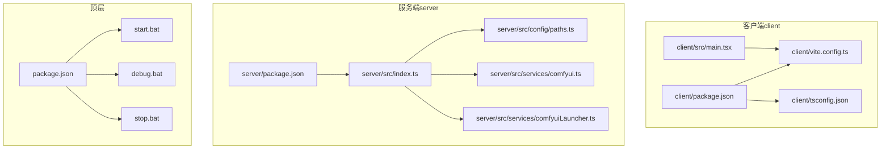
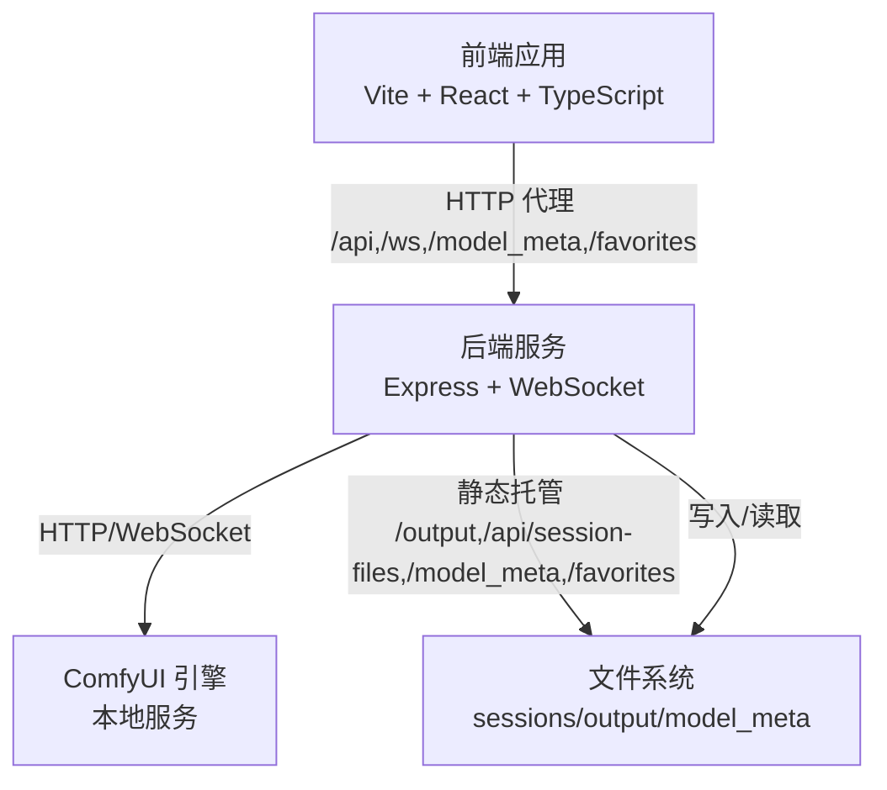
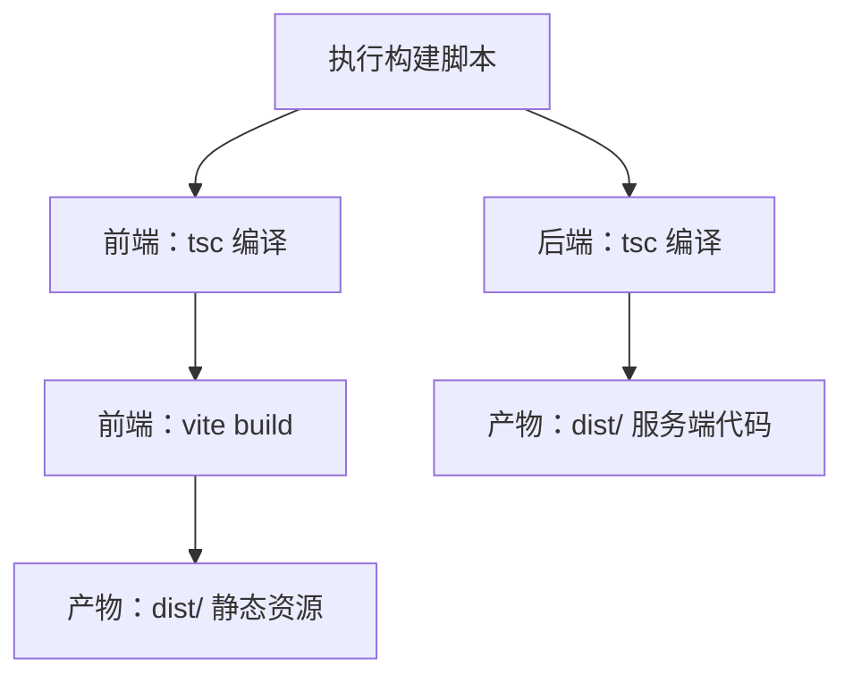
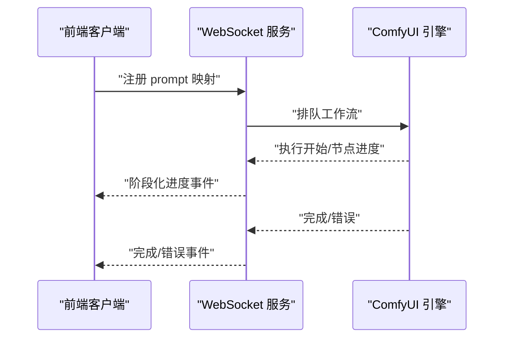
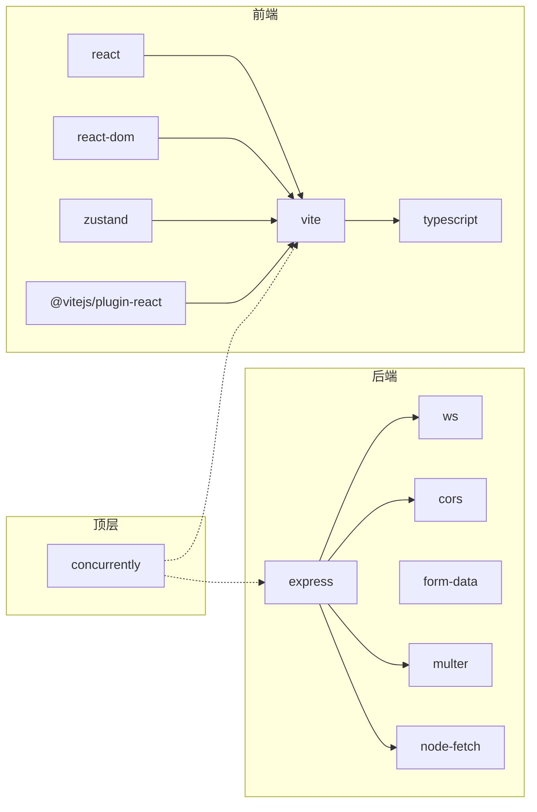
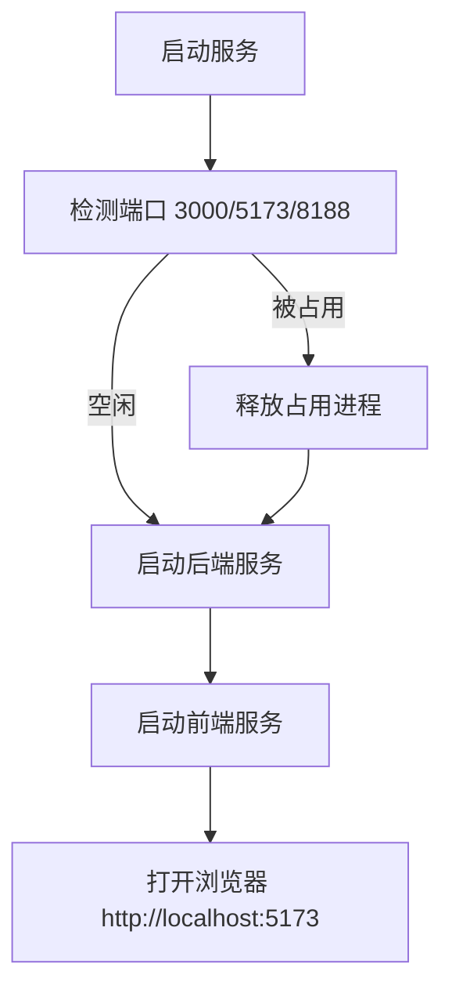

# 配置与部署

<cite>
**本文引用的文件**
- [client/vite.config.ts](file://client/vite.config.ts)
- [client/package.json](file://client/package.json)
- [client/tsconfig.json](file://client/tsconfig.json)
- [server/package.json](file://server/package.json)
- [package.json](file://package.json)
- [server/src/index.ts](file://server/src/index.ts)
- [server/src/config/paths.ts](file://server/src/config/paths.ts)
- [server/src/services/comfyui.ts](file://server/src/services/comfyui.ts)
- [server/src/services/comfyuiLauncher.ts](file://server/src/services/comfyuiLauncher.ts)
- [start.bat](file://start.bat)
- [debug.bat](file://debug.bat)
- [stop.bat](file://stop.bat)
- [client/src/main.tsx](file://client/src/main.tsx)
</cite>

## 目录
1. [简介](#简介)
2. [项目结构](#项目结构)
3. [核心组件](#核心组件)
4. [架构总览](#架构总览)
5. [详细组件分析](#详细组件分析)
6. [依赖关系分析](#依赖关系分析)
7. [性能考虑](#性能考虑)
8. [故障排除指南](#故障排除指南)
9. [结论](#结论)
10. [附录](#附录)

## 简介
本文件面向配置与部署工程师与运维人员，系统性说明本项目的环境配置管理、构建与打包流程、部署最佳实践、性能监控方案、安全配置指南以及故障排除与维护建议。项目采用前后端分离架构：前端基于 Vite + React + TypeScript，后端基于 Node.js + Express + WebSocket；同时集成 ComfyUI 工作流引擎，通过本地 WebSocket 与 HTTP 接口进行通信。

## 项目结构
项目采用多包结构，包含客户端、服务端与顶层脚本：
- 客户端（client）：React 应用，使用 Vite 进行开发与构建，TypeScript 类型检查与编译。
- 服务端（server）：Express + WebSocket 服务，负责路由、静态资源托管、与 ComfyUI 的桥接。
- 顶层（根目录）：聚合脚本，统一启动开发环境与构建流程。
- ComfyUI：本地运行的工作流引擎，服务端通过 HTTP/WebSocket 与其交互。

图表来源
- [client/package.json:1-26](file://client/package.json#L1-L26)
- [client/vite.config.ts:1-28](file://client/vite.config.ts#L1-L28)
- [client/tsconfig.json:1-22](file://client/tsconfig.json#L1-L22)
- [client/src/main.tsx:1-11](file://client/src/main.tsx#L1-L11)
- [server/package.json:1-28](file://server/package.json#L1-L28)
- [server/src/index.ts:1-516](file://server/src/index.ts#L1-L516)
- [server/src/config/paths.ts:1-156](file://server/src/config/paths.ts#L1-L156)
- [server/src/services/comfyui.ts:1-200](file://server/src/services/comfyui.ts#L1-L200)
- [server/src/services/comfyuiLauncher.ts:1-131](file://server/src/services/comfyuiLauncher.ts#L1-L131)
- [package.json:1-15](file://package.json#L1-L15)
- [start.bat:1-57](file://start.bat#L1-L57)
- [debug.bat:1-57](file://debug.bat#L1-L57)
- [stop.bat:1-46](file://stop.bat#L1-L46)

章节来源
- [client/package.json:1-26](file://client/package.json#L1-L26)
- [server/package.json:1-28](file://server/package.json#L1-L28)
- [package.json:1-15](file://package.json#L1-L15)

## 核心组件
- Vite 开发服务器与代理：前端开发端口与后端 API/WebSocket 代理配置，确保跨域与本地联调顺畅。
- TypeScript 编译：严格类型检查与模块解析策略，适配现代浏览器与打包工具。
- Express + WebSocket：提供 REST API 与 WebSocket 流式进度事件，静态资源托管输出目录与会话文件。
- 路径与配置管理：集中化路径管理与可热切换的会话根目录，支持 Electron 场景的数据根覆盖。
- ComfyUI 桥接：上传媒体、排队工作流、历史查询、阶段化进度与完成回调。
- 启动与停止脚本：Windows 批处理脚本，自动释放端口、启动服务与打开浏览器。

章节来源
- [client/vite.config.ts:1-28](file://client/vite.config.ts#L1-L28)
- [client/tsconfig.json:1-22](file://client/tsconfig.json#L1-L22)
- [server/src/index.ts:118-146](file://server/src/index.ts#L118-L146)
- [server/src/config/paths.ts:1-156](file://server/src/config/paths.ts#L1-L156)
- [server/src/services/comfyui.ts:1-200](file://server/src/services/comfyui.ts#L1-L200)
- [server/src/services/comfyuiLauncher.ts:1-131](file://server/src/services/comfyuiLauncher.ts#L1-L131)
- [start.bat:1-57](file://start.bat#L1-L57)
- [debug.bat:1-57](file://debug.bat#L1-L57)
- [stop.bat:1-46](file://stop.bat#L1-L46)

## 架构总览
系统由三层组成：前端应用层、后端服务层、外部引擎层（ComfyUI）。前端通过代理访问后端 API 与 WebSocket；后端通过 HTTP/WebSocket 与 ComfyUI 交互，并持久化会话与输出文件。

图表来源
- [client/vite.config.ts:6-26](file://client/vite.config.ts#L6-L26)
- [server/src/index.ts:118-146](file://server/src/index.ts#L118-L146)
- [server/src/services/comfyui.ts:1-200](file://server/src/services/comfyui.ts#L1-L200)
- [server/src/config/paths.ts:70-100](file://server/src/config/paths.ts#L70-L100)

## 详细组件分析

### 环境配置管理
- 开发环境
  - 前端：Vite 默认端口，代理后端 API 与 WebSocket 到本地服务端口。
  - 后端：监听本地端口，启用 CORS 白名单，JSON 体限制较大以支持图像上传。
  - ComfyUI：本地默认端口，服务可用性检测与自动启动。
- 测试环境
  - 建议：使用独立的会话根目录与输出目录，隔离测试数据；通过环境变量覆盖数据根路径。
  - 路径覆盖：服务端提供会话根目录覆盖能力，便于在不同环境切换。
- 生产环境
  - 建议：通过环境变量设置数据根目录，避免相对路径带来的不确定性；限制静态资源访问范围；启用 HTTPS 与安全头（见安全章节）。

章节来源
- [client/vite.config.ts:6-26](file://client/vite.config.ts#L6-L26)
- [server/src/index.ts:121-125](file://server/src/index.ts#L121-L125)
- [server/src/index.ts:127-127](file://server/src/index.ts#L127-L127)
- [server/src/config/paths.ts:15-20](file://server/src/config/paths.ts#L15-L20)
- [server/src/config/paths.ts:84-100](file://server/src/config/paths.ts#L84-L100)

### 构建与打包流程
- 前端构建
  - TypeScript 编译与 Vite 打包：先执行 tsc 编译，再执行 vite build 产出静态资源。
  - TypeScript 配置：严格模式、模块解析策略、JSX 转换、目标与库等。
- 后端构建
  - TypeScript 编译：生成 dist 目录，供 Node.js 运行。
- 顶层脚本
  - 统一开发：并行启动前端与后端。
  - 统一构建：顺序构建前端与后端。

图表来源
- [client/package.json:6-10](file://client/package.json#L6-L10)
- [client/tsconfig.json:1-22](file://client/tsconfig.json#L1-L22)
- [server/package.json:6-10](file://server/package.json#L6-L10)
- [package.json:8-8](file://package.json#L8-L8)

章节来源
- [client/package.json:6-10](file://client/package.json#L6-L10)
- [client/tsconfig.json:1-22](file://client/tsconfig.json#L1-L22)
- [server/package.json:6-10](file://server/package.json#L6-L10)
- [package.json:5-10](file://package.json#L5-L10)

### 部署最佳实践
- Windows 平台部署
  - 服务端：将后端 dist 目录与 ComfyUI 一起部署，确保 ComfyUI 可用；通过环境变量设置数据根目录。
  - 前端：将前端构建产物部署至任意静态服务器或反向代理，确保代理规则与 WebSocket 升级正确。
  - 启动方式：使用批处理脚本或系统服务管理器启动服务端与前端；确保端口开放。
- Electron 应用打包
  - 数据根覆盖：通过环境变量覆盖数据根目录，指向应用的 userData 路径，确保会话与输出目录可控。
  - 资源打包：将前端静态资源与后端可执行文件打包进应用；注意路径解析与权限。
- 自动更新机制
  - 建议：结合版本号与清单文件，实现后端与前端的增量更新；保持 ComfyUI 版本稳定或提供升级指引。
  - 注意：更新后需验证 ComfyUI 服务可用性与路径配置。

章节来源
- [server/src/config/paths.ts:15-20](file://server/src/config/paths.ts#L15-L20)
- [server/src/config/paths.ts:84-100](file://server/src/config/paths.ts#L84-L100)
- [server/src/services/comfyuiLauncher.ts:16-18](file://server/src/services/comfyuiLauncher.ts#L16-L18)
- [server/src/index.ts:496-516](file://server/src/index.ts#L496-L516)

### 性能监控方案
- 日志记录
  - 服务端：WebSocket 连接、进度事件、完成与错误事件均输出日志，便于定位问题。
  - 建议：接入结构化日志（如 JSON），区分级别与上下文字段。
- 错误报告
  - WebSocket 完成回调中对异常进行捕获并回传错误消息；历史查询失败时进行重试与告警。
- 性能指标收集
  - 阶段化进度：基于节点权重与步骤计数计算全局百分比，减少 UI 回弹。
  - 建议：采集节点耗时、缓存命中率、队列长度、吞吐量等指标，结合 APM 工具。

图表来源
- [server/src/index.ts:168-494](file://server/src/index.ts#L168-L494)
- [server/src/services/comfyui.ts:168-196](file://server/src/services/comfyui.ts#L168-L196)

章节来源
- [server/src/index.ts:168-494](file://server/src/index.ts#L168-L494)
- [server/src/services/comfyui.ts:198-200](file://server/src/services/comfyui.ts#L198-L200)

### 安全配置指南
- 网络安全
  - CORS 白名单：仅允许前端开发地址访问，避免跨域风险。
  - 代理与反向代理：生产环境建议使用 HTTPS 与安全头，限制来源与方法。
- 数据保护
  - 路径隔离：通过会话根目录覆盖与校验，防止目录遍历与越权访问。
  - 静态资源：仅暴露必要目录，避免敏感文件外泄。
- 访问控制
  - 建议：在反向代理层增加鉴权与速率限制；对上传接口进行大小与类型校验。
  - WebSocket：客户端连接后分配唯一标识，配合服务端鉴权逻辑。

章节来源
- [server/src/index.ts:121-125](file://server/src/index.ts#L121-L125)
- [server/src/config/paths.ts:106-137](file://server/src/config/paths.ts#L106-L137)

## 依赖关系分析
- 前端依赖
  - React、Zustand、Lucide React 等运行时依赖；Vite 与 React 插件用于开发与构建。
- 后端依赖
  - Express、WS、Multer、node-fetch、Cors 等；提供 HTTP、WebSocket、文件上传与跨域支持。
- 顶层依赖
  - concurrently 并行启动前后端。

图表来源
- [client/package.json:11-24](file://client/package.json#L11-L24)
- [server/package.json:11-26](file://server/package.json#L11-L26)
- [package.json:11-12](file://package.json#L11-L12)

章节来源
- [client/package.json:11-24](file://client/package.json#L11-L24)
- [server/package.json:11-26](file://server/package.json#L11-L26)
- [package.json:11-12](file://package.json#L11-L12)

## 性能考虑
- 构建性能
  - 使用 Vite 的快速冷启动与热更新；TypeScript 严格模式有助于早期发现性能隐患。
- 运行性能
  - WebSocket 事件缓冲与重放，避免客户端注册延迟导致的进度丢失。
  - 阶段化进度与权重化百分比，提升用户体验与进度预测准确性。
- 资源与存储
  - 输出目录与会话目录分离，便于清理与迁移；提供校验与写权限探测。

章节来源
- [server/src/index.ts:175-185](file://server/src/index.ts#L175-L185)
- [server/src/index.ts:240-271](file://server/src/index.ts#L240-L271)
- [server/src/config/paths.ts:106-137](file://server/src/config/paths.ts#L106-L137)

## 故障排除指南
- 端口占用
  - 启动前自动检测并释放端口 3000、5173、8188；若被占用，先结束对应进程。
- ComfyUI 未启动
  - 服务端会尝试自动启动，若失败请手动启动并确认端口可用。
- WebSocket 连接失败
  - 检查代理与反向代理的 WebSocket 升级配置；确认后端端口与路径正确。
- 静态资源 404
  - 确认静态托管目录与会话根目录配置正确；检查路径覆盖与权限。
- 构建失败
  - 确认 Node.js 与 npm 版本满足依赖要求；先执行安装再构建。

图表来源
- [start.bat:10-57](file://start.bat#L10-L57)
- [debug.bat:10-57](file://debug.bat#L10-L57)
- [stop.bat:12-36](file://stop.bat#L12-L36)

章节来源
- [start.bat:10-57](file://start.bat#L10-L57)
- [debug.bat:10-57](file://debug.bat#L10-L57)
- [stop.bat:12-36](file://stop.bat#L12-L36)

## 结论
本项目提供了清晰的开发与部署边界：前端通过 Vite 快速迭代，后端通过 Express 与 WebSocket 提供稳定的 API 与进度反馈，ComfyUI 作为高性能工作流引擎。通过集中化路径管理与环境变量覆盖，可在不同环境中灵活切换数据根目录；借助阶段化进度与事件缓冲，保障了良好的用户体验。建议在生产环境中强化安全与监控，并结合自动化脚本与 CI/CD 实现持续交付。

## 附录
- 关键文件与职责
  - 客户端配置：Vite 代理、TypeScript 编译、入口渲染。
  - 服务端配置：CORS、静态托管、路由、WebSocket、路径管理。
  - ComfyUI 集成：上传、排队、历史查询、进度与完成回调。
  - 启停脚本：端口检测、服务启动、浏览器打开。

章节来源
- [client/vite.config.ts:1-28](file://client/vite.config.ts#L1-L28)
- [client/tsconfig.json:1-22](file://client/tsconfig.json#L1-L22)
- [client/src/main.tsx:1-11](file://client/src/main.tsx#L1-L11)
- [server/src/index.ts:118-146](file://server/src/index.ts#L118-L146)
- [server/src/services/comfyui.ts:1-200](file://server/src/services/comfyui.ts#L1-L200)
- [server/src/services/comfyuiLauncher.ts:1-131](file://server/src/services/comfyuiLauncher.ts#L1-L131)
- [start.bat:1-57](file://start.bat#L1-L57)
- [debug.bat:1-57](file://debug.bat#L1-L57)
- [stop.bat:1-46](file://stop.bat#L1-L46)