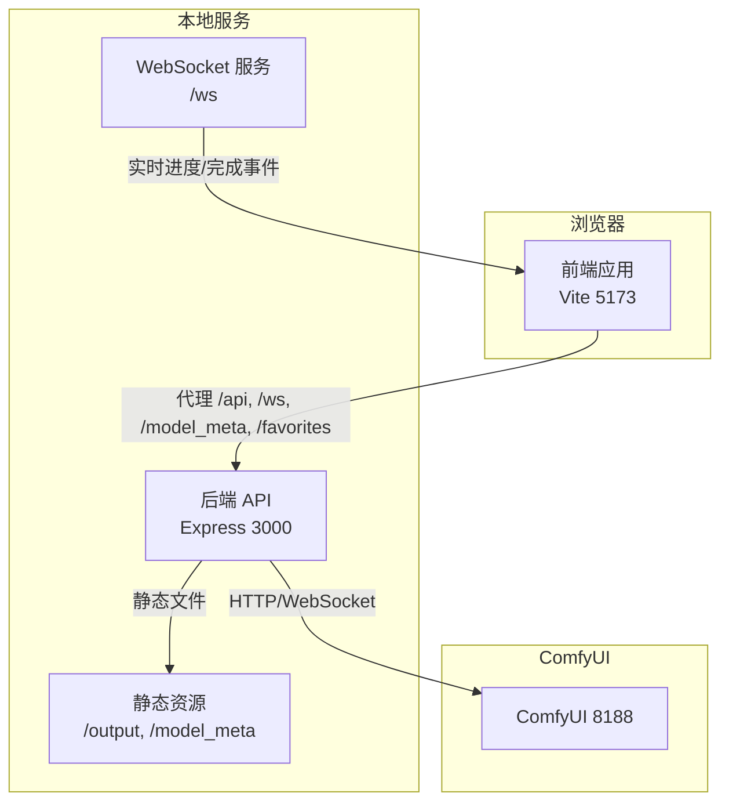
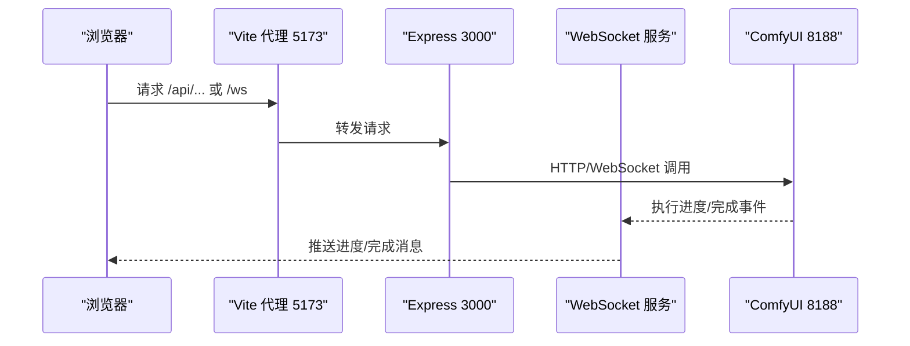
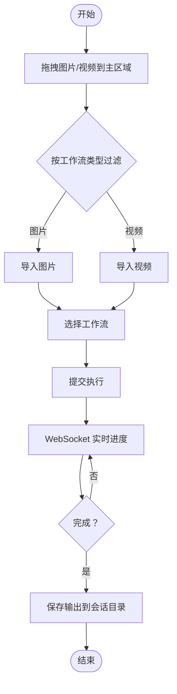
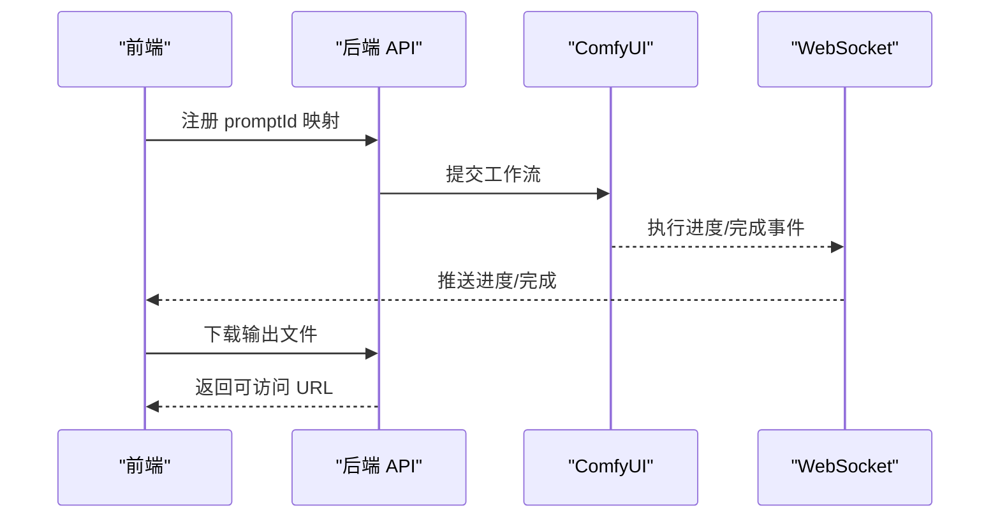
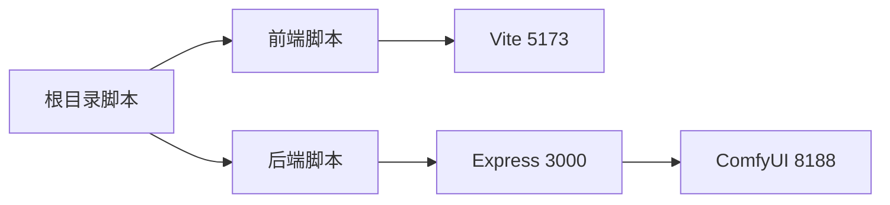
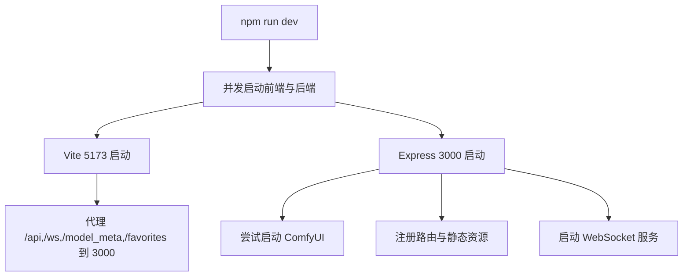

# 快速开始

<cite>
**本文引用的文件**
- [README.md](file://README.md)
- [package.json](file://package.json)
- [client/vite.config.ts](file://client/vite.config.ts)
- [client/package.json](file://client/package.json)
- [server/package.json](file://server/package.json)
- [server/src/index.ts](file://server/src/index.ts)
- [server/src/services/comfyui.ts](file://server/src/services/comfyui.ts)
- [client/src/main.tsx](file://client/src/main.tsx)
- [client/src/components/App.tsx](file://client/src/components/App.tsx)
- [client/src/hooks/useWebSocket.ts](file://client/src/hooks/useWebSocket.ts)
- [client/src/services/api.ts](file://client/src/services/api.ts)
- [start.bat](file://start.bat)
- [debug.bat](file://debug.bat)
- [stop.bat](file://stop.bat)
</cite>

## 目录
1. [简介](#简介)
2. [项目结构](#项目结构)
3. [核心组件](#核心组件)
4. [架构总览](#架构总览)
5. [详细组件分析](#详细组件分析)
6. [依赖分析](#依赖分析)
7. [性能考虑](#性能考虑)
8. [故障排除指南](#故障排除指南)
9. [结论](#结论)
10. [附录](#附录)

## 简介
本指南面向首次使用者，帮助你在最短时间内完成 CorineKit Pix2Real 的安装与运行。你将学会：
- 安装依赖（一次性命令）
- 启动开发环境（前后端并行）
- 配置与理解前端 Vite 代理到后端 Express 的机制
- 使用界面进行文件拖拽、工作流选择、执行处理与查看结果
- 常见启动问题的排查与解决

## 项目结构
项目采用前后端分离架构：
- 前端：Vite + React + TypeScript，运行于本地 5173 端口
- 后端：Express + TypeScript，运行于本地 3000 端口
- 代理规则：前端 Vite 将 /api、/ws、/model_meta、/favorites 等请求转发至后端
- ComfyUI：作为图像/视频处理引擎，需在本地 8188 端口运行

图表来源
- [client/vite.config.ts:1-28](file://client/vite.config.ts#L1-L28)
- [server/src/index.ts:118-146](file://server/src/index.ts#L118-L146)
- [server/src/services/comfyui.ts:6-7](file://server/src/services/comfyui.ts#L6-L7)

章节来源
- [README.md:41-62](file://README.md#L41-L62)
- [client/vite.config.ts:1-28](file://client/vite.config.ts#L1-L28)
- [server/src/index.ts:118-146](file://server/src/index.ts#L118-L146)

## 核心组件
- 前端入口与路由
  - 入口文件负责渲染根组件
  - 根组件负责组织侧边栏、拖拽区、作品墙、状态栏等 UI，并挂载 WebSocket 连接
- 后端服务
  - Express 提供 REST API 与静态资源服务
  - WebSocket 服务桥接前端与 ComfyUI，实现实时进度与完成事件
  - 自动检测并尝试启动 ComfyUI（若未运行）

章节来源
- [client/src/main.tsx:1-11](file://client/src/main.tsx#L1-L11)
- [client/src/components/App.tsx:1-422](file://client/src/components/App.tsx#L1-L422)
- [server/src/index.ts:118-146](file://server/src/index.ts#L118-L146)
- [server/src/index.ts:496-516](file://server/src/index.ts#L496-L516)

## 架构总览
下图展示了从浏览器到 ComfyUI 的完整调用链路，以及 WebSocket 实时进度的传递。

图表来源
- [client/vite.config.ts:8-25](file://client/vite.config.ts#L8-L25)
- [server/src/index.ts:157-494](file://server/src/index.ts#L157-L494)
- [server/src/services/comfyui.ts:265-375](file://server/src/services/comfyui.ts#L265-L375)

## 详细组件分析

### 前端：拖拽与工作流交互
- 文件拖拽
  - 支持图片与视频文件拖入主区域；目录拖入会被递归读取
  - 不同工作流标签页限制输入类型（例如“图生视频”仅接受图片，“视频补帧”仅接受视频）
- 工作流选择与执行
  - 通过侧边栏切换不同工作流（如“二次元转真人”、“真人精修”、“精修放大”、“快速生成视频”、“视频放大”）
  - 执行时前端通过 WebSocket 获取实时进度，完成后自动下载输出到会话目录
- 实时通知
  - 可选桌面通知：任务完成或错误时弹出

图表来源
- [client/src/components/App.tsx:138-197](file://client/src/components/App.tsx#L138-L197)
- [client/src/hooks/useWebSocket.ts:50-159](file://client/src/hooks/useWebSocket.ts#L50-L159)

章节来源
- [client/src/components/App.tsx:138-197](file://client/src/components/App.tsx#L138-L197)
- [client/src/hooks/useWebSocket.ts:50-159](file://client/src/hooks/useWebSocket.ts#L50-L159)

### 后端：Express 与 WebSocket
- 路由与静态资源
  - /api/workflow、/api/output、/api/session 等 REST 接口
  - /output、/api/session-files、/model_meta 等静态资源服务
- WebSocket 进度桥接
  - 为每个浏览器客户端创建唯一 WebSocket 连接
  - 将 ComfyUI 的进度事件转换为统一格式并推送至前端
  - 完成后自动下载输出文件并写入会话目录
- ComfyUI 状态与自动启动
  - 提供 /api/comfyui/status 查询 ComfyUI 是否运行
  - 启动时尝试自动启动 ComfyUI（若未运行）

图表来源
- [server/src/index.ts:168-494](file://server/src/index.ts#L168-L494)
- [server/src/services/comfyui.ts:168-196](file://server/src/services/comfyui.ts#L168-L196)

章节来源
- [server/src/index.ts:118-146](file://server/src/index.ts#L118-L146)
- [server/src/index.ts:157-494](file://server/src/index.ts#L157-L494)
- [server/src/services/comfyui.ts:168-196](file://server/src/services/comfyui.ts#L168-L196)

### Vite 代理到后端 Express 的配置
- 代理目标
  - /api → http://localhost:3000
  - /ws → ws://localhost:3000（WebSocket）
  - /model_meta → http://localhost:3000
  - /favorites → http://localhost:3000
- 作用
  - 避免跨域问题，简化开发环境下的请求路径
  - 统一前端与后端的本地开发体验

章节来源
- [client/vite.config.ts:8-25](file://client/vite.config.ts#L8-L25)

## 依赖分析
- 项目级脚本
  - npm run dev：同时启动前端与后端
  - npm run build：分别构建前端与后端
  - npm run install:all：安装前后端依赖
- 前端依赖
  - React、Vite、TypeScript、Zustand 等
- 后端依赖
  - Express、ws、node-fetch、multer、cors 等

图表来源
- [package.json:4-9](file://package.json#L4-L9)
- [client/package.json:6-10](file://client/package.json#L6-L10)
- [server/package.json:6-10](file://server/package.json#L6-L10)

章节来源
- [package.json:4-9](file://package.json#L4-L9)
- [client/package.json:6-10](file://client/package.json#L6-L10)
- [server/package.json:6-10](file://server/package.json#L6-L10)

## 性能考虑
- WebSocket 连接复用
  - 前端使用单例连接，减少重复握手与资源消耗
- 进度计算
  - 基于节点权重与步骤的加权进度，避免 UI 回退
- 输出下载
  - 完成后再下载输出，避免“完成但空”的误判

章节来源
- [client/src/hooks/useWebSocket.ts:9-12](file://client/src/hooks/useWebSocket.ts#L9-L12)
- [server/src/index.ts:240-271](file://server/src/index.ts#L240-L271)
- [server/src/index.ts:350-420](file://server/src/index.ts#L350-L420)

## 故障排除指南
- ComfyUI 未运行
  - 现象：后端启动时报错或无法连接
  - 处理：确保 ComfyUI 在本地 8188 端口运行；后端会尝试自动启动，若失败请手动启动
  - 参考
    - [server/src/index.ts:500-506](file://server/src/index.ts#L500-L506)
    - [server/src/services/comfyui.ts:6-7](file://server/src/services/comfyui.ts#L6-L7)
- 端口占用
  - 现象：端口 3000、5173、8188 被占用导致启动失败
  - 处理：使用提供的批处理脚本释放端口或手动结束对应进程
  - 参考
    - [start.bat:10-32](file://start.bat#L10-L32)
    - [debug.bat:10-32](file://debug.bat#L10-L32)
    - [stop.bat:12-36](file://stop.bat#L12-L36)
- 代理无效或跨域报错
  - 现象：前端请求 3000 端口被拦截
  - 处理：确认 Vite 代理配置正确，端口与路径匹配
  - 参考
    - [client/vite.config.ts:8-25](file://client/vite.config.ts#L8-L25)
- WebSocket 断连
  - 现象：进度停止或任务无响应
  - 处理：检查网络与防火墙；前端会自动重连
  - 参考
    - [client/src/hooks/useWebSocket.ts:232-244](file://client/src/hooks/useWebSocket.ts#L232-L244)
- 输出为空
  - 现象：任务完成但输出为空
  - 处理：等待历史记录落盘后重试；后端已内置重试逻辑
  - 参考
    - [server/src/index.ts:355-371](file://server/src/index.ts#L355-L371)

## 结论
通过本指南，你可以完成从零到一的安装与运行。建议在首次使用时：
- 先确认 ComfyUI 在 8188 端口运行
- 使用 npm run install:all 安装依赖
- 使用 npm run dev 启动开发环境
- 在浏览器中打开 http://localhost:5173，进行文件拖拽与工作流执行

## 附录

### 快速开始步骤
- 安装依赖
  - 在项目根目录执行一次性安装命令
  - 参考
    - [README.md:23-25](file://README.md#L23-L25)
    - [package.json:9](file://package.json#L9)
- 启动开发环境
  - 启动前后端：npm run dev
  - 浏览器访问：http://localhost:5173
  - 参考
    - [README.md:29-33](file://README.md#L29-L33)
    - [package.json:5](file://package.json#L5)
- 首次使用操作示例
  - 步骤 1：将图片或视频拖入主区域
  - 步骤 2：在侧边栏选择工作流（如“二次元转真人”）
  - 步骤 3：点击执行，观察实时进度
  - 步骤 4：完成后在输出目录查看结果
  - 参考
    - [client/src/components/App.tsx:138-197](file://client/src/components/App.tsx#L138-L197)
    - [client/src/hooks/useWebSocket.ts:50-159](file://client/src/hooks/useWebSocket.ts#L50-L159)

### ComfyUI 配置要点
- 端口要求：ComfyUI 需在 http://localhost:8188 运行
- 自动启动：后端启动时尝试自动启动 ComfyUI（若失败请手动启动）
- 参考
  - [server/src/services/comfyui.ts:6-7](file://server/src/services/comfyui.ts#L6-L7)
  - [server/src/index.ts:500-506](file://server/src/index.ts#L500-L506)

### 开发服务器启动流程（代码级）

图表来源
- [package.json:5](file://package.json#L5)
- [client/vite.config.ts:8-25](file://client/vite.config.ts#L8-L25)
- [server/src/index.ts:496-516](file://server/src/index.ts#L496-L516)