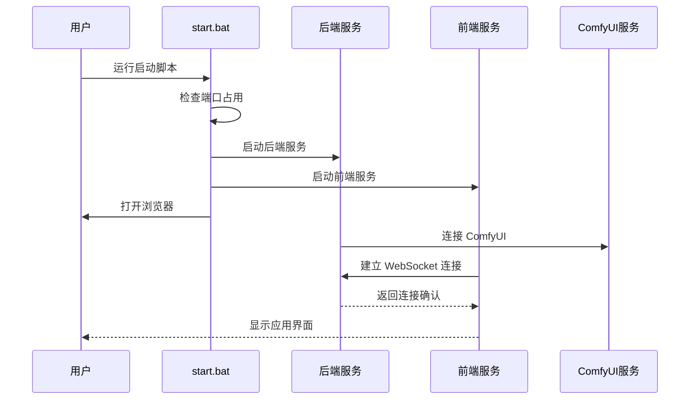
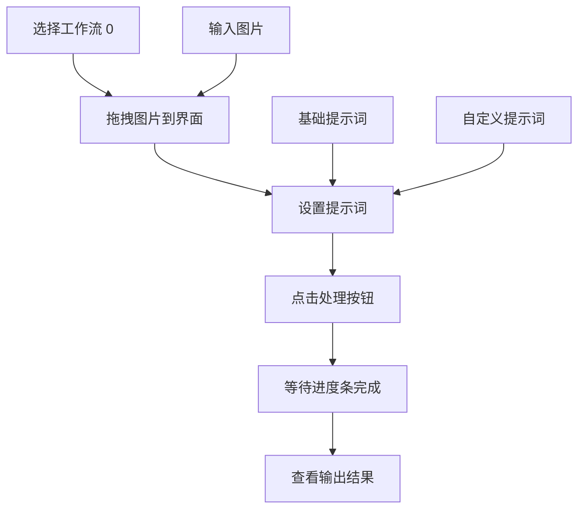
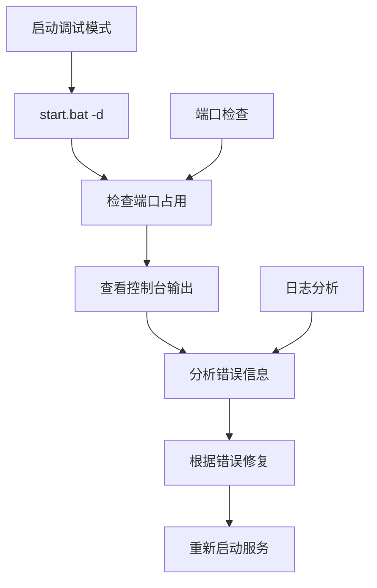

# 快速开始指南

<cite>
**本文档引用的文件**
- [README.md](file://README.md)
- [package.json](file://package.json)
- [start.bat](file://start.bat)
- [debug.bat](file://debug.bat)
- [stop.bat](file://stop.bat)
- [server/src/index.ts](file://server/src/index.ts)
- [server/src/services/comfyui.ts](file://server/src/services/comfyui.ts)
- [client/vite.config.ts](file://client/vite.config.ts)
- [client/src/main.tsx](file://client/src/main.tsx)
- [client/src/components/App.tsx](file://client/src/components/App.tsx)
- [client/src/hooks/useWorkflowStore.ts](file://client/src/hooks/useWorkflowStore.ts)
- [server/src/adapters/Workflow0Adapter.ts](file://server/src/adapters/Workflow0Adapter.ts)
- [ComfyUI_API/Pix2Real-二次元生成.json](file://ComfyUI_API/Pix2Real-二次元生成.json)
</cite>

## 目录
1. [简介](#简介)
2. [系统要求](#系统要求)
3. [安装准备](#安装准备)
4. [安装步骤](#安装步骤)
5. [首次运行](#首次运行)
6. [使用示例](#使用示例)
7. [常见问题与解决方案](#常见问题与解决方案)
8. [故障排除指南](#故障排除指南)
9. [总结](#总结)

## 简介

CorineKit Pix2Real 是一个基于 Web 的本地图像/视频批量处理工具，通过 ComfyUI 实现动漫风格到真实照片的转换、人物精修、图像放大、视频生成等功能。项目采用前后端分离架构，前端使用 React + TypeScript，后端使用 Express + TypeScript，通过 WebSocket 实现实时进度更新。

## 系统要求

### 硬件要求
- **CPU**: 至少 8 核心处理器
- **内存**: 至少 16GB RAM（推荐 32GB+）
- **显存**: 至少 8GB VRAM（推荐 12GB+）
- **存储**: 至少 50GB 可用空间

### 软件要求
- **操作系统**: Windows 10/11 或 Linux
- **Node.js**: 18.x 或更高版本
- **Python**: 3.8 或更高版本
- **ComfyUI**: 需要独立运行的服务

## 安装准备

### 环境检查
1. **检查 Node.js 版本**
   ```bash
   node --version
   ```

2. **检查 Python 环境**
   ```bash
   python --version
   ```

3. **验证端口可用性**
   - 端口 3000: 后端服务器
   - 端口 5173: 前端开发服务器
   - 端口 8188: ComfyUI 服务

### ComfyUI 安装配置

1. **下载 ComfyUI**
   - 访问官方 GitHub 仓库
   - 下载最新稳定版本

2. **安装依赖**
   ```bash
   pip install torch torchvision torchaudio
   pip install -r requirements.txt
   ```

3. **启动 ComfyUI**
   ```bash
   python main.py --listen 127.0.0.1 --port 8188
   ```

4. **验证安装**
   - 打开浏览器访问 `http://localhost:8188`
   - 确认界面正常显示

## 安装步骤

### 1. 克隆项目
```bash
git clone https://github.com/your-repo/CorineKit_Pix2Real.git
cd CorineKit_Pix2Real
```

### 2. 安装依赖
使用提供的安装脚本：

```bash
# 方法一：使用 npm 脚本
npm run install:all

# 方法二：使用批处理文件
start.bat
```

### 3. 配置环境变量
创建 `.env` 文件：
```env
NODE_ENV=development
PORT=3000
COMFYUI_URL=http://localhost:8188
```

### 4. 验证安装
```bash
npm run dev
```

## 首次运行

### 启动服务流程



**图表来源**
- [start.bat:1-57](file://start.bat#L1-L57)
- [server/src/index.ts:221-228](file://server/src/index.ts#L221-L228)

### 完整启动步骤

1. **启动 ComfyUI**
   ```bash
   cd ComfyUI
   python main.py --listen 127.0.0.1 --port 8188
   ```

2. **启动 Pix2Real**
   ```bash
   # 方法一：使用 npm 脚本
   npm run dev
   
   # 方法二：使用启动脚本
   start.bat
   ```

3. **访问应用**
   - 打开浏览器访问 `http://localhost:5173`
   - 预期显示欢迎页面

**章节来源**
- [start.bat:1-57](file://start.bat#L1-L57)
- [server/src/index.ts:221-228](file://server/src/index.ts#L221-L228)

## 使用示例

### 示例 1：动漫转真实照片



**图表来源**
- [client/src/components/App.tsx:136-279](file://client/src/components/App.tsx#L136-L279)
- [server/src/adapters/Workflow0Adapter.ts:16-34](file://server/src/adapters/Workflow0Adapter.ts#L16-L34)

### 示例 2：批量处理流程

1. **准备素材**
   - 准备多张动漫风格图片
   - 放置在同一文件夹中

2. **执行处理**
   - 在工作流 0 中选择"二次元转真人"
   - 拖拽图片到界面
   - 设置合适的提示词
   - 点击开始处理

3. **查看结果**
   - 结果保存在 `output/0-二次元转真人/` 目录
   - 支持实时进度查看

**章节来源**
- [client/src/components/App.tsx:136-279](file://client/src/components/App.tsx#L136-L279)
- [server/src/adapters/Workflow0Adapter.ts:16-34](file://server/src/adapters/Workflow0Adapter.ts#L16-L34)

## 常见问题与解决方案

### 端口冲突问题

**问题描述**: 端口 3000 或 5173 被占用

**解决方案**:
```bash
# 使用停止脚本释放端口
stop.bat

# 或手动释放端口
taskkill /F /PID (netstat -ano | findstr ":3000" | findstr "LISTENING" | awk "{print $5}")
taskkill /F /PID (netstat -ano | findstr ":5173" | findstr "LISTENING" | awk "{print $5}")
```

**章节来源**
- [stop.bat:1-37](file://stop.bat#L1-L37)

### ComfyUI 连接失败

**问题描述**: 前端无法连接到 ComfyUI

**诊断步骤**:
1. 验证 ComfyUI 是否在运行
2. 检查网络连接
3. 确认端口配置正确

**解决方案**:
```bash
# 检查 ComfyUI 状态
curl http://localhost:8188

# 重启 ComfyUI
python main.py --listen 127.0.0.1 --port 8188
```

**章节来源**
- [server/src/services/comfyui.ts:6-8](file://server/src/services/comfyui.ts#L6-L8)

### 权限问题

**问题描述**: 文件写入权限不足

**解决方案**:
1. 以管理员身份运行命令提示符
2. 检查输出目录权限
3. 确保有足够的磁盘空间

**章节来源**
- [server/src/index.ts:17-40](file://server/src/index.ts#L17-L40)

### 内存不足问题

**问题描述**: 处理大图片时内存不足

**解决方案**:
1. 关闭其他应用程序释放内存
2. 调整图片尺寸
3. 增加虚拟内存

## 故障排除指南

### 开发模式调试



**图表来源**
- [debug.bat:1-57](file://debug.bat#L1-L57)

### 性能优化建议

1. **硬件优化**
   - 确保足够的 VRAM 和系统内存
   - 使用 SSD 存储提升读写速度

2. **软件配置**
   - 调整 ComfyUI 的模型加载策略
   - 优化图片预处理参数

3. **批处理策略**
   - 控制同时处理的图片数量
   - 合理设置提示词长度

### 常用命令参考

```bash
# 开发模式启动
npm run dev

# 生产构建
npm run build

# 安装所有依赖
npm run install:all

# 停止服务
stop.bat

# 调试模式
debug.bat
```

**章节来源**
- [package.json:4-10](file://package.json#L4-L10)
- [debug.bat:1-57](file://debug.bat#L1-L57)

## 总结

CorineKit Pix2Real 提供了一个完整的本地图像处理解决方案，支持多种工作流和批量处理功能。通过遵循本指南的安装和配置步骤，您应该能够成功运行项目并开始使用其核心功能。

**关键要点**:
- 确保 ComfyUI 正常运行且监听 8188 端口
- 使用提供的启动脚本简化服务管理
- 遵循端口管理和权限要求
- 从简单的工作流开始，逐步探索高级功能

如遇到问题，请参考故障排除部分或检查相关配置文件。祝您使用愉快！