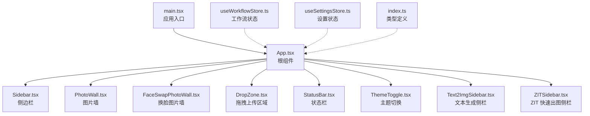
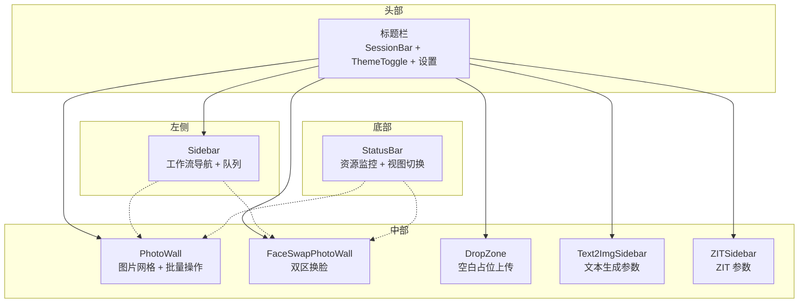
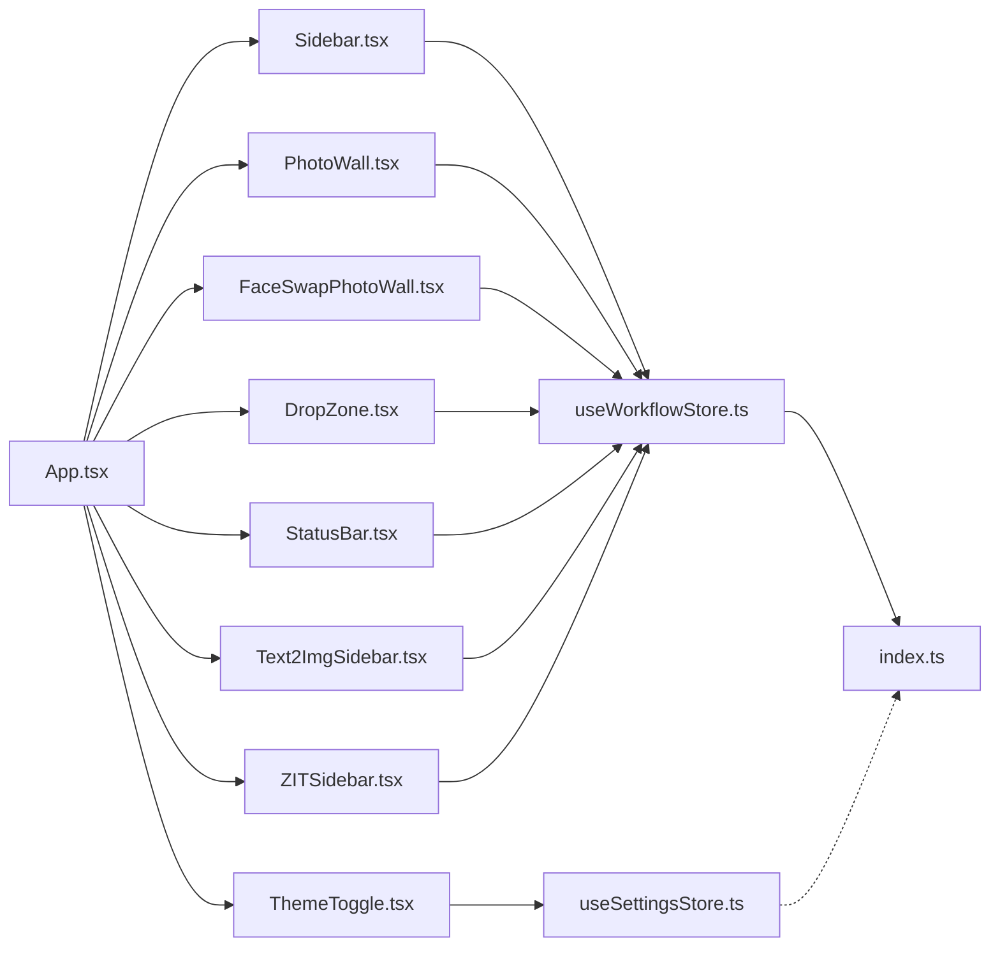

# React 组件体系

<cite>
**本文档引用的文件**
- [App.tsx](file://client/src/components/App.tsx)
- [main.tsx](file://client/src/main.tsx)
- [Sidebar.tsx](file://client/src/components/Sidebar.tsx)
- [PhotoWall.tsx](file://client/src/components/PhotoWall.tsx)
- [DropZone.tsx](file://client/src/components/DropZone.tsx)
- [StatusBar.tsx](file://client/src/components/StatusBar.tsx)
- [ThemeToggle.tsx](file://client/src/components/ThemeToggle.tsx)
- [ImageCard.tsx](file://client/src/components/ImageCard.tsx)
- [FaceSwapPhotoWall.tsx](file://client/src/components/FaceSwapPhotoWall.tsx)
- [Text2ImgSidebar.tsx](file://client/src/components/Text2ImgSidebar.tsx)
- [ZITSidebar.tsx](file://client/src/components/ZITSidebar.tsx)
- [useWorkflowStore.ts](file://client/src/hooks/useWorkflowStore.ts)
- [useSettingsStore.ts](file://client/src/hooks/useSettingsStore.ts)
- [index.ts](file://client/src/types/index.ts)
</cite>

## 目录
1. [简介](#简介)
2. [项目结构](#项目结构)
3. [核心组件](#核心组件)
4. [架构总览](#架构总览)
5. [详细组件分析](#详细组件分析)
6. [依赖关系分析](#依赖关系分析)
7. [性能考量](#性能考量)
8. [故障排查指南](#故障排查指南)
9. [结论](#结论)
10. [附录](#附录)

## 简介
本文件系统化梳理 CorineKit Pix2Real 项目的 React 组件体系，重点围绕根组件 App.tsx 的职责与组织方式，解释侧边栏、图片墙、拖拽上传区域、状态栏、主题切换等核心组件的功能定位与交互机制；阐述组件间通信、Props 传递模式、事件处理方式；总结状态提升策略与组件组合最佳实践，并提供具体使用示例与代码片段路径，帮助开发者快速理解并扩展组件架构。

## 项目结构
客户端采用基于功能域的模块化组织，核心入口为 main.tsx 中的 ReactDOM 渲染 App.tsx 根组件。组件主要位于 client/src/components，状态管理通过 Zustand hooks（如 useWorkflowStore、useSettingsStore）集中管理，类型定义位于 client/src/types。

图表来源
- [main.tsx:1-11](file://client/src/main.tsx#L1-L11)
- [App.tsx:54-334](file://client/src/components/App.tsx#L54-L334)
- [Sidebar.tsx:30-424](file://client/src/components/Sidebar.tsx#L30-L424)
- [PhotoWall.tsx:103-577](file://client/src/components/PhotoWall.tsx#L103-L577)
- [FaceSwapPhotoWall.tsx:213-800](file://client/src/components/FaceSwapPhotoWall.tsx#L213-L800)
- [DropZone.tsx:39-170](file://client/src/components/DropZone.tsx#L39-L170)
- [StatusBar.tsx:44-242](file://client/src/components/StatusBar.tsx#L44-L242)
- [ThemeToggle.tsx:4-38](file://client/src/components/ThemeToggle.tsx#L4-L38)
- [Text2ImgSidebar.tsx:36-535](file://client/src/components/Text2ImgSidebar.tsx#L36-L535)
- [ZITSidebar.tsx:36-634](file://client/src/components/ZITSidebar.tsx#L36-L634)
- [useWorkflowStore.ts:96-644](file://client/src/hooks/useWorkflowStore.ts#L96-L644)
- [useSettingsStore.ts:16-30](file://client/src/hooks/useSettingsStore.ts#L16-L30)
- [index.ts:1-58](file://client/src/types/index.ts#L1-L58)

章节来源
- [main.tsx:1-11](file://client/src/main.tsx#L1-L11)
- [App.tsx:54-334](file://client/src/components/App.tsx#L54-L334)

## 核心组件
- 根组件 App.tsx：负责页面布局、主题初始化、全局拖拽事件处理、欢迎页与主内容区切换、状态栏渲染、对话框与全局模态层挂载。
- 侧边栏 Sidebar.tsx：管理工作流分组与标签页导航、拖拽卡片到不同标签页、任务队列面板弹出与计数。
- 图片墙 PhotoWall.tsx：展示与管理图片卡片、多选与批量操作、删除区域拖拽、蒙版与输出缩略图、进度与错误状态叠加。
- 换脸图片墙 FaceSwapPhotoWall.tsx：双区布局（人脸参考/目标图），支持跨区拖拽换脸、批量换脸、长按多选。
- 拖拽上传 DropZone.tsx：通用拖拽上传区域，支持文件夹递归读取、本地文件选择。
- 状态栏 StatusBar.tsx：显示自动保存时间、打开输出目录、视图大小切换、释放显存/内存、系统资源占用。
- 主题切换 ThemeToggle.tsx：切换明暗主题并持久化。
- 文本生成侧栏 Text2ImgSidebar.tsx：文本生成参数配置与一键生成。
- ZIT 侧栏 ZITSidebar.tsx：ZIT 快速出图参数配置与一键生成。
- 状态钩子：useWorkflowStore.ts（工作流与任务状态）、useSettingsStore.ts（应用设置）。

章节来源
- [App.tsx:54-334](file://client/src/components/App.tsx#L54-L334)
- [Sidebar.tsx:30-424](file://client/src/components/Sidebar.tsx#L30-L424)
- [PhotoWall.tsx:103-577](file://client/src/components/PhotoWall.tsx#L103-L577)
- [FaceSwapPhotoWall.tsx:213-800](file://client/src/components/FaceSwapPhotoWall.tsx#L213-L800)
- [DropZone.tsx:39-170](file://client/src/components/DropZone.tsx#L39-L170)
- [StatusBar.tsx:44-242](file://client/src/components/StatusBar.tsx#L44-L242)
- [ThemeToggle.tsx:4-38](file://client/src/components/ThemeToggle.tsx#L4-L38)
- [Text2ImgSidebar.tsx:36-535](file://client/src/components/Text2ImgSidebar.tsx#L36-L535)
- [ZITSidebar.tsx:36-634](file://client/src/components/ZITSidebar.tsx#L36-L634)
- [useWorkflowStore.ts:96-644](file://client/src/hooks/useWorkflowStore.ts#L96-L644)
- [useSettingsStore.ts:16-30](file://client/src/hooks/useSettingsStore.ts#L16-L30)

## 架构总览
Pix2Real 客户端采用“根组件 + 多功能面板”的布局：顶部为标题栏与会话控制，左侧为工作流导航与任务队列，中间为主内容区（根据标签页动态渲染图片墙或换脸界面），底部为状态栏。组件间通过 Zustand 状态钩子进行解耦的状态共享，事件通过 props 与回调向下传递，拖拽通过原生 drag 事件与自定义数据类型实现跨组件数据交换。

图表来源
- [App.tsx:136-279](file://client/src/components/App.tsx#L136-L279)
- [Sidebar.tsx:211-421](file://client/src/components/Sidebar.tsx#L211-L421)
- [PhotoWall.tsx:298-509](file://client/src/components/PhotoWall.tsx#L298-L509)
- [FaceSwapPhotoWall.tsx:475-535](file://client/src/components/FaceSwapPhotoWall.tsx#L475-L535)
- [StatusBar.tsx:149-241](file://client/src/components/StatusBar.tsx#L149-L241)

## 详细组件分析

### App.tsx：根组件与组织方式
- 布局与样式：采用 Flex 布局，头部固定高度，主体自适应，底部状态栏固定高度。
- 全局拖拽处理：在主内容区监听 dragover/dragleave/drop，过滤来自图片卡片与缩略图输出的拖拽，避免重复处理。
- 欢迎页集成：首次进入时显示欢迎页，支持新建会话或直接进入应用。
- 动态内容区：根据 activeTab 渲染 PhotoWall 或 FaceSwapPhotoWall，并在特定标签页显示对应侧栏。
- 全局模态：Toast、MaskEditor、SettingsModal、PromptAssistantPanel 始终挂载，通过状态控制显隐。
- 主题与视图：从 localStorage 读取主题与视图大小，支持循环切换视图。

章节来源
- [App.tsx:54-334](file://client/src/components/App.tsx#L54-L334)

### Sidebar.tsx：工作流导航与任务队列
- 分组与图标：按“图像处理/图像生成”分组，使用 Lucide 图标标识工作流。
- 活动指示器：通过计算按钮位置与高度，渲染浮动高亮指示器，动画过渡更平滑。
- 拖拽支持：监听原生 dragover 事件，允许卡片与输出缩略图在标签页间移动；处理跨标签页复制图片。
- 任务队列：定时轮询队列长度，点击按钮弹出队列面板，点击外部区域关闭。

章节来源
- [Sidebar.tsx:30-424](file://client/src/components/Sidebar.tsx#L30-L424)

### PhotoWall.tsx：图片墙与批量操作
- 视图尺寸：支持 small/medium/large 三种尺寸，每种尺寸配置列宽与卡片估算高度，结合 IntersectionObserver 实现懒加载。
- 多选与批量：支持长按进入多选模式，批量替换提示词、清空蒙版、批量执行任务。
- 删除区域：拖拽卡片或输出到底部删除区域，确认后批量删除。
- 蒙版与输出：根据工作流类型决定是否显示蒙版编辑入口与输出缩略图条。
- 执行逻辑：针对不同工作流（含解除装备）构造表单并发起请求，注册 WebSocket 任务。

章节来源
- [PhotoWall.tsx:103-577](file://client/src/components/PhotoWall.tsx#L103-L577)

### FaceSwapPhotoWall.tsx：换脸双区布局
- 双区设计：左侧“人脸参考”，右侧“目标图”，支持拖拽互换与跨区拖拽换脸。
- 多选与批量：长按进入多选模式，支持将一个脸对多个目标批量换脸。
- 区域拖拽：支持外部文件拖入区，或卡片跨区交叉导入。
- 执行流程：检测目标图状态，避免并发执行；成功后注册 WebSocket 任务。

章节来源
- [FaceSwapPhotoWall.tsx:213-800](file://client/src/components/FaceSwapPhotoWall.tsx#L213-L800)

### DropZone.tsx：通用拖拽上传
- 文件与文件夹：递归读取文件夹，仅保留图片/视频类型。
- 两种形态：全屏占位与工具栏占位，均支持点击触发文件选择。
- 事件处理：阻止冒泡至 App.tsx 的主级 drop，确保只在当前区域处理。

章节来源
- [DropZone.tsx:39-170](file://client/src/components/DropZone.tsx#L39-L170)

### StatusBar.tsx：系统状态与资源监控
- 自动保存：显示最近一次保存时间。
- 输出目录：一键打开当前标签页输出目录。
- 视图切换：循环切换图片墙视图大小。
- 释放缓存：在无任务执行时调用释放显存/内存接口。
- 资源监控：定时轮询显存/内存占用，使用 requestAnimationFrame 平滑过渡显示。

章节来源
- [StatusBar.tsx:44-242](file://client/src/components/StatusBar.tsx#L44-L242)

### ThemeToggle.tsx：主题切换
- 本地存储：读取/写入 localStorage 决定主题。
- DOM 属性：通过设置 data-theme 切换根节点主题。

章节来源
- [ThemeToggle.tsx:4-38](file://client/src/components/ThemeToggle.tsx#L4-L38)

### Text2ImgSidebar.tsx 与 ZITSidebar.tsx：参数配置与生成
- 参数持久化：使用 localStorage draft 缓存配置，避免标签页切换丢失。
- 模型列表：异步加载可用模型，支持默认模型回退。
- 一键生成：构建配置对象，批量创建卡片并发起请求，注册 WebSocket 任务。
- 提示词助理：集成提示词快速转换与面板入口。

章节来源
- [Text2ImgSidebar.tsx:36-535](file://client/src/components/Text2ImgSidebar.tsx#L36-L535)
- [ZITSidebar.tsx:36-634](file://client/src/components/ZITSidebar.tsx#L36-L634)

### ImageCard.tsx：单张图片卡片
- 状态与进度：根据任务状态显示进度覆盖层、错误徽章、播放/排队取消。
- 蒙版与输出：根据工作流类型显示蒙版菜单、输出缩略图条；支持输出拖拽。
- 交互细节：长按进入多选、右键中键行为、视频预览自动播放/暂停。
- 执行与反推：支持执行工作流与反推提示词，支持提示词助理快速转换。

章节来源
- [ImageCard.tsx:42-800](file://client/src/components/ImageCard.tsx#L42-L800)

## 依赖关系分析
- 组件依赖：App.tsx 作为协调者，依赖 Sidebar、PhotoWall、FaceSwapPhotoWall、DropZone、StatusBar、ThemeToggle、Text2ImgSidebar、ZITSidebar；各子组件通过 props 接收状态与回调。
- 状态依赖：useWorkflowStore 提供工作流、任务、图片、提示词、输出索引等状态；useSettingsStore 提供应用设置。
- 类型依赖：index.ts 定义 ImageItem、TaskInfo、WSMessage 等类型，贯穿组件与服务层。

图表来源
- [App.tsx:6-23](file://client/src/components/App.tsx#L6-L23)
- [Sidebar.tsx:3-6](file://client/src/components/Sidebar.tsx#L3-L6)
- [PhotoWall.tsx:2-8](file://client/src/components/PhotoWall.tsx#L2-L8)
- [FaceSwapPhotoWall.tsx:3-8](file://client/src/components/FaceSwapPhotoWall.tsx#L3-L8)
- [DropZone.tsx:1-8](file://client/src/components/DropZone.tsx#L1-L8)
- [StatusBar.tsx](file://client/src/components/StatusBar.tsx#L3)
- [ThemeToggle.tsx:1-2](file://client/src/components/ThemeToggle.tsx#L1-L2)
- [Text2ImgSidebar.tsx:2-6](file://client/src/components/Text2ImgSidebar.tsx#L2-L6)
- [ZITSidebar.tsx:2-6](file://client/src/components/ZITSidebar.tsx#L2-L6)
- [useWorkflowStore.ts:1-4](file://client/src/hooks/useWorkflowStore.ts#L1-L4)
- [useSettingsStore.ts:1-3](file://client/src/hooks/useSettingsStore.ts#L1-L3)
- [index.ts:1-58](file://client/src/types/index.ts#L1-L58)

章节来源
- [useWorkflowStore.ts:96-644](file://client/src/hooks/useWorkflowStore.ts#L96-L644)
- [useSettingsStore.ts:16-30](file://client/src/hooks/useSettingsStore.ts#L16-L30)
- [index.ts:1-58](file://client/src/types/index.ts#L1-L58)

## 性能考量
- 懒加载与滚动补偿：PhotoWall 使用 IntersectionObserver 与手动滚动补偿，减少首屏渲染压力与滚动抖动。
- 状态订阅优化：ImageCard 使用 shallow 订阅，避免无关属性变化导致重渲染。
- 资源轮询节流：StatusBar 对系统资源使用 requestAnimationFrame 平滑过渡，降低频繁 setState 导致的抖动。
- 本地存储：主题与视图大小、文本生成/ZIT 参数草稿均持久化到 localStorage，减少网络请求与初始化成本。

## 故障排查指南
- 任务状态异常：检查 WebSocket 注册与消息处理，确认 promptId 映射正确；查看 useWorkflowStore 中 startTask/markTaskStarted/updateProgress/completeTask/failTask 的调用链。
- 拖拽失效：确认 dragover 事件是否被原生阻止默认行为；检查 dataTransfer 数据类型（application/x-workflow-image、application/x-thumb-output、application/x-face-swap-*）是否一致。
- 蒙版编辑：确认当前工作流是否启用蒙版模式，输出索引是否正确；检查 maskKey 生成规则与 useMaskStore 的订阅。
- 释放缓存：确保无任务执行中（processing/queued），否则按钮禁用。

章节来源
- [StatusBar.tsx:110-121](file://client/src/components/StatusBar.tsx#L110-L121)
- [PhotoWall.tsx:181-240](file://client/src/components/PhotoWall.tsx#L181-L240)
- [ImageCard.tsx:264-334](file://client/src/components/ImageCard.tsx#L264-L334)
- [FaceSwapPhotoWall.tsx:256-282](file://client/src/components/FaceSwapPhotoWall.tsx#L256-L282)

## 结论
Pix2Real 的组件体系以 App.tsx 为核心协调者，通过 Sidebar、PhotoWall、FaceSwapPhotoWall 等组件实现工作流导航、图片管理与交互、换脸双区布局；配合 DropZone、StatusBar、ThemeToggle 等通用组件完善用户体验。状态管理采用 Zustand，通过 useWorkflowStore 与 useSettingsStore 将业务状态与应用设置解耦，组件间通过 props 与回调进行通信，整体架构清晰、可扩展性强，适合进一步引入更多工作流与功能面板。

## 附录

### 组件通信与 Props 传递模式
- App.tsx 作为协调者，向子组件传递状态（如 activeTab、images、viewSize）与回调（如 importFiles、startTask、setActiveTab）。
- PhotoWall 与 FaceSwapPhotoWall 通过 useWorkflowStore 订阅当前标签页数据，内部通过 props 与回调与 ImageCard 交互。
- Sidebar 通过拖拽事件与 useWorkflowStore 的 addImagesToTab 实现跨标签页复制图片。
- Text2ImgSidebar 与 ZITSidebar 通过本地草稿持久化参数，避免标签页切换丢失。

章节来源
- [App.tsx:54-334](file://client/src/components/App.tsx#L54-L334)
- [PhotoWall.tsx:103-577](file://client/src/components/PhotoWall.tsx#L103-L577)
- [FaceSwapPhotoWall.tsx:213-800](file://client/src/components/FaceSwapPhotoWall.tsx#L213-L800)
- [Sidebar.tsx:123-209](file://client/src/components/Sidebar.tsx#L123-L209)
- [Text2ImgSidebar.tsx:36-535](file://client/src/components/Text2ImgSidebar.tsx#L36-L535)
- [ZITSidebar.tsx:36-634](file://client/src/components/ZITSidebar.tsx#L36-L634)

### 事件处理与拖拽协议
- 原生 drag 事件：Sidebar 在 DOM 层绑定 dragover，阻止默认行为并设置 dropEffect，确保卡片与输出缩略图拖拽生效。
- 自定义数据类型：使用 application/x-workflow-image、application/x-thumb-output、application/x-face-swap-face、application/x-face-swap-target 等标识数据来源与类型。
- 事件冒泡控制：DropZone 在处理后阻止事件冒泡，避免与 App.tsx 主级 drop 重复处理。

章节来源
- [Sidebar.tsx:50-65](file://client/src/components/Sidebar.tsx#L50-L65)
- [PhotoWall.tsx:270-296](file://client/src/components/PhotoWall.tsx#L270-L296)
- [FaceSwapPhotoWall.tsx:303-380](file://client/src/components/FaceSwapPhotoWall.tsx#L303-L380)
- [DropZone.tsx:42-73](file://client/src/components/DropZone.tsx#L42-L73)

### 状态提升与组合最佳实践
- 状态提升：将全局状态（如 activeTab、clientId、sessionId、selectedImageIds）置于 useWorkflowStore，避免在子组件内分散状态。
- 组合模式：通过 App.tsx 的条件渲染组合 PhotoWall/FaceSwapPhotoWall 与对应侧栏，保持单一职责与可测试性。
- 回调下沉：将复杂交互（如执行任务、删除图片、切换视图）封装为回调，由子组件触发，根组件统一处理。

章节来源
- [useWorkflowStore.ts:96-644](file://client/src/hooks/useWorkflowStore.ts#L96-L644)
- [App.tsx:54-334](file://client/src/components/App.tsx#L54-L334)