# WebSocket 通信架构

<cite>
**本文档引用的文件**
- [useWebSocket.ts](file://client/src/hooks/useWebSocket.ts)
- [index.ts](file://server/src/index.ts)
- [comfyui.ts](file://server/src/services/comfyui.ts)
- [index.ts](file://client/src/types/index.ts)
- [useWorkflowStore.ts](file://client/src/hooks/useWorkflowStore.ts)
- [workflow.ts](file://server/src/routes/workflow.ts)
- [sessionManager.ts](file://server/src/services/sessionManager.ts)
- [README.md](file://README.md)
- [CLAUDE.md](file://CLAUDE.md)
</cite>

## 目录
1. [简介](#简介)
2. [项目结构](#项目结构)
3. [核心组件](#核心组件)
4. [架构概览](#架构概览)
5. [详细组件分析](#详细组件分析)
6. [依赖关系分析](#依赖关系分析)
7. [性能考量](#性能考量)
8. [故障排除指南](#故障排除指南)
9. [结论](#结论)

## 简介

CorineKit Pix2Real 项目采用基于 WebSocket 的实时通信架构，实现了从用户界面到 ComfyUI 工作流引擎的完整实时反馈系统。该架构通过单例模式管理 WebSocket 连接，提供进度监控、队列管理、错误处理等实时功能。

该项目的核心创新在于其三层 WebSocket 架构：客户端单例连接、服务器中继连接、ComfyUI 工作流连接，形成了高效的实时通信链路。

## 项目结构

项目采用前后端分离的架构设计，主要包含以下关键模块：

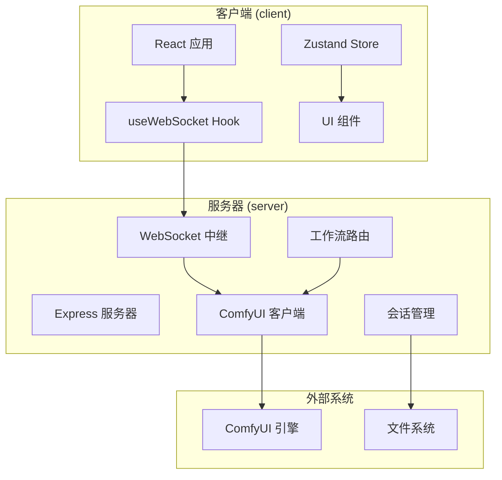

**图表来源**
- [README.md:41-79](file://README.md#L41-L79)
- [CLAUDE.md:3-24](file://CLAUDE.md#L3-L24)

**章节来源**
- [README.md:41-79](file://README.md#L41-L79)
- [CLAUDE.md:3-24](file://CLAUDE.md#L3-L24)

## 核心组件

### WebSocket 连接管理

项目实现了单例模式的 WebSocket 连接管理，确保在整个应用生命周期内只维持一个活跃的 WebSocket 连接：

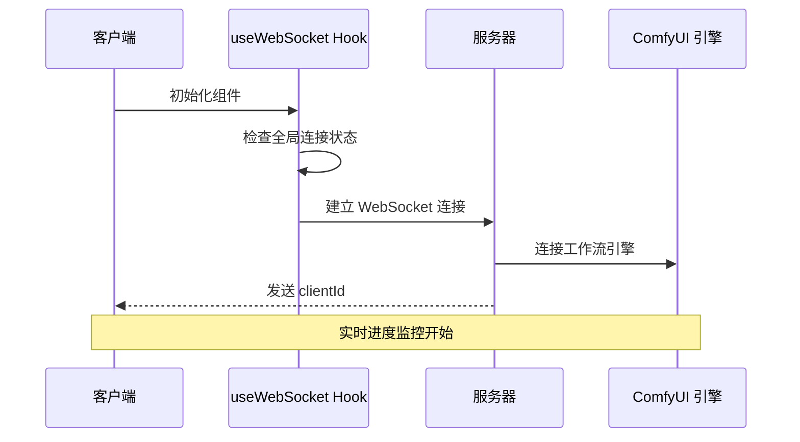

**图表来源**
- [useWebSocket.ts:10-73](file://client/src/hooks/useWebSocket.ts#L10-L73)
- [index.ts:73-89](file://server/src/index.ts#L73-L89)

### 消息格式设计

系统定义了标准化的消息格式，支持多种事件类型的实时通信：

| 消息类型 | 字段说明 | 用途 |
|---------|----------|------|
| `connected` | `clientId` | 连接建立确认 |
| `execution_start` | `promptId` | 开始执行任务 |
| `progress` | `promptId`, `percentage` | 进度更新 |
| `complete` | `promptId`, `outputs` | 任务完成 |
| `error` | `promptId`, `message` | 错误通知 |

**章节来源**
- [index.ts:27-57](file://client/src/types/index.ts#L27-L57)
- [useWebSocket.ts:31-47](file://client/src/hooks/useWebSocket.ts#L31-L47)

## 架构概览

### 三层通信架构

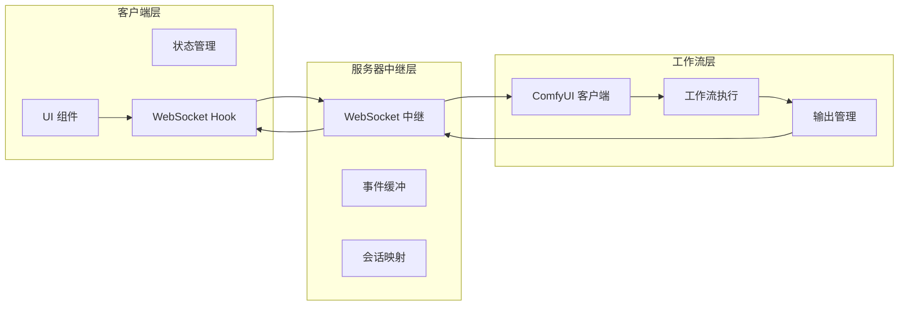

**图表来源**
- [index.ts:63-219](file://server/src/index.ts#L63-L219)
- [comfyui.ts:127-188](file://server/src/services/comfyui.ts#L127-L188)

### 连接建立流程

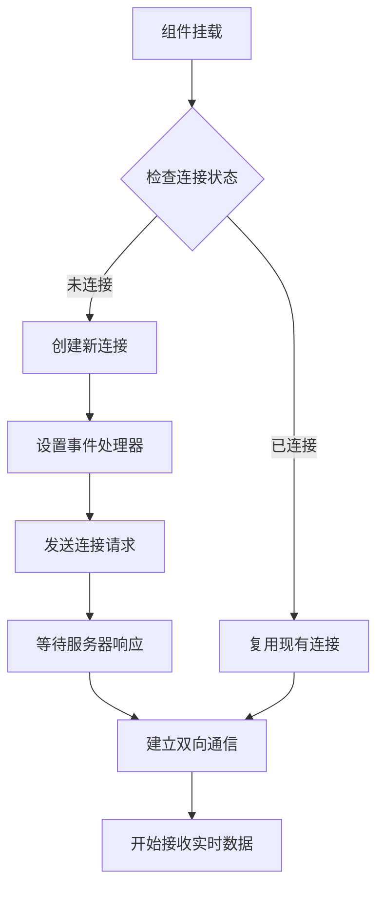

**图表来源**
- [useWebSocket.ts:10-73](file://client/src/hooks/useWebSocket.ts#L10-L73)

**章节来源**
- [index.ts:73-219](file://server/src/index.ts#L73-L219)
- [useWebSocket.ts:10-98](file://client/src/hooks/useWebSocket.ts#L10-L98)

## 详细组件分析

### 客户端 WebSocket Hook

客户端的 `useWebSocket` Hook 实现了完整的连接管理和消息处理逻辑：

#### 单例连接管理

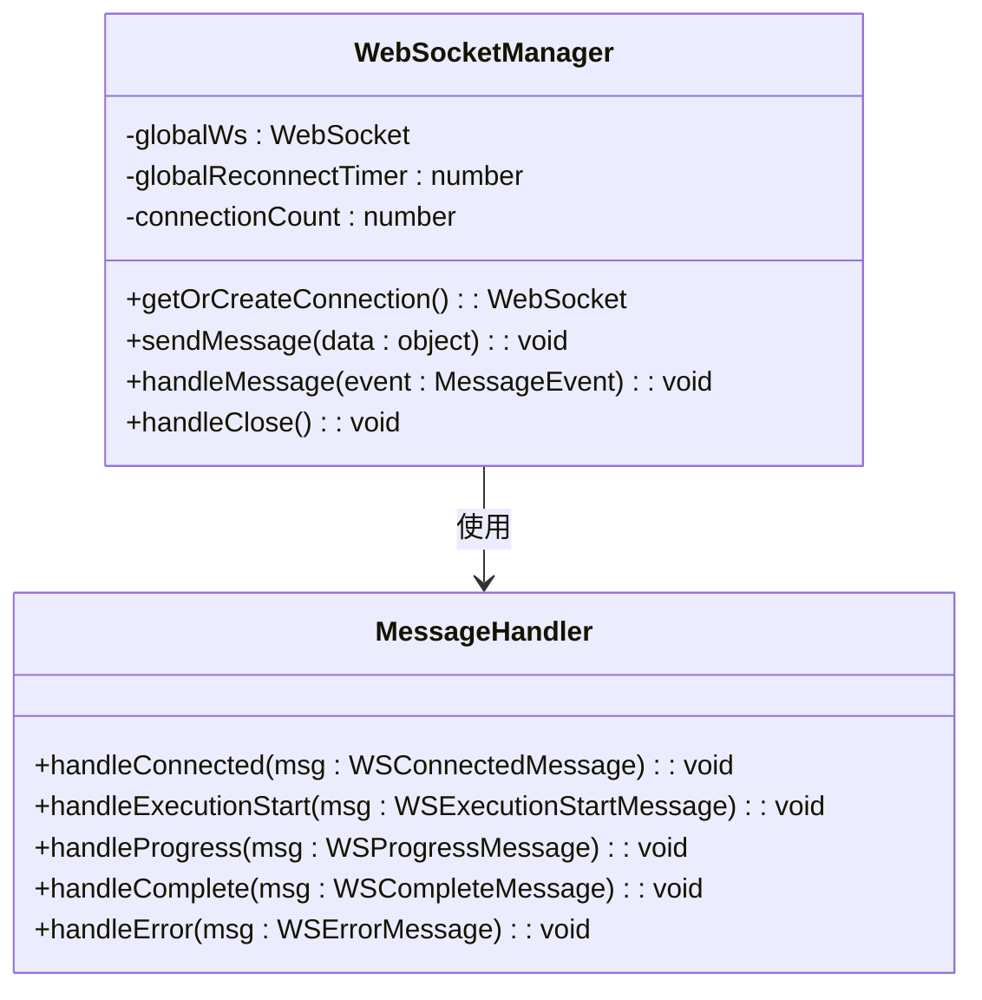

**图表来源**
- [useWebSocket.ts:5-98](file://client/src/hooks/useWebSocket.ts#L5-L98)

#### 断线重连机制

系统实现了智能的断线重连策略，基于连接计数器确保连接的稳定性：

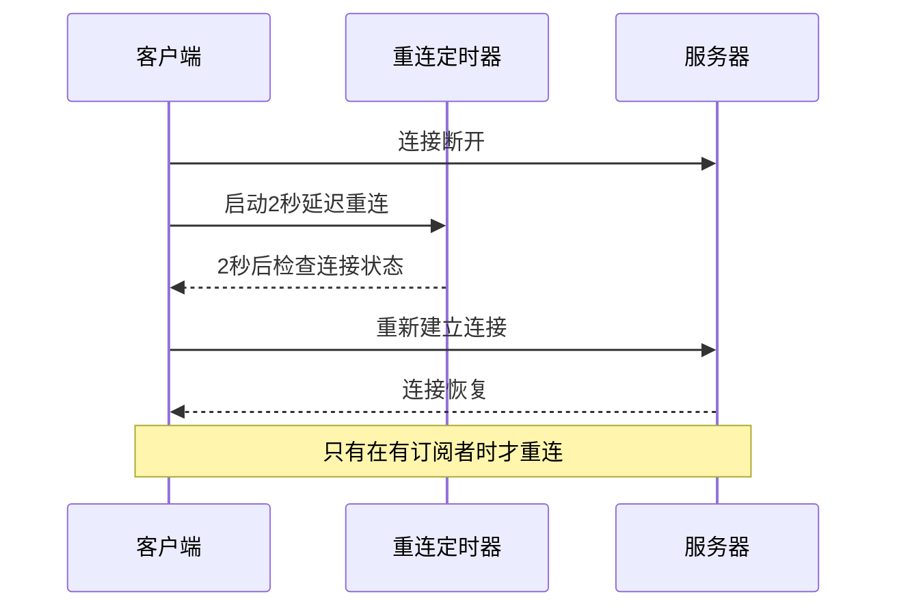

**图表来源**
- [useWebSocket.ts:53-65](file://client/src/hooks/useWebSocket.ts#L53-L65)

**章节来源**
- [useWebSocket.ts:5-98](file://client/src/hooks/useWebSocket.ts#L5-L98)

### 服务器 WebSocket 中继

服务器端实现了完整的 WebSocket 中继功能，负责与 ComfyUI 引擎的通信：

#### 事件缓冲机制

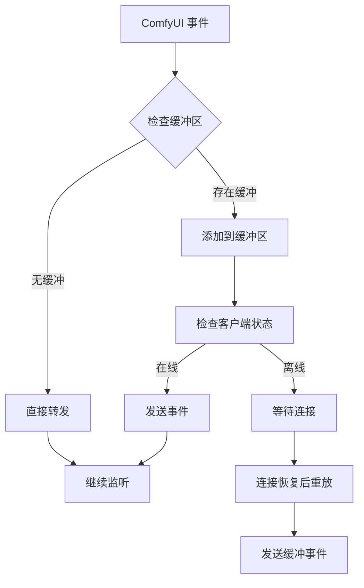

**图表来源**
- [index.ts:80-90](file://server/src/index.ts#L80-L90)

#### 会话映射管理

服务器维护了 promptId 到工作流/会话的映射关系，确保输出文件正确保存：

**章节来源**
- [index.ts:70-71](file://server/src/index.ts#L70-L71)
- [index.ts:195-209](file://server/src/index.ts#L195-L209)

### ComfyUI 通信适配器

服务器端的 ComfyUI 适配器提供了统一的 WebSocket 连接接口：

#### 进度事件处理

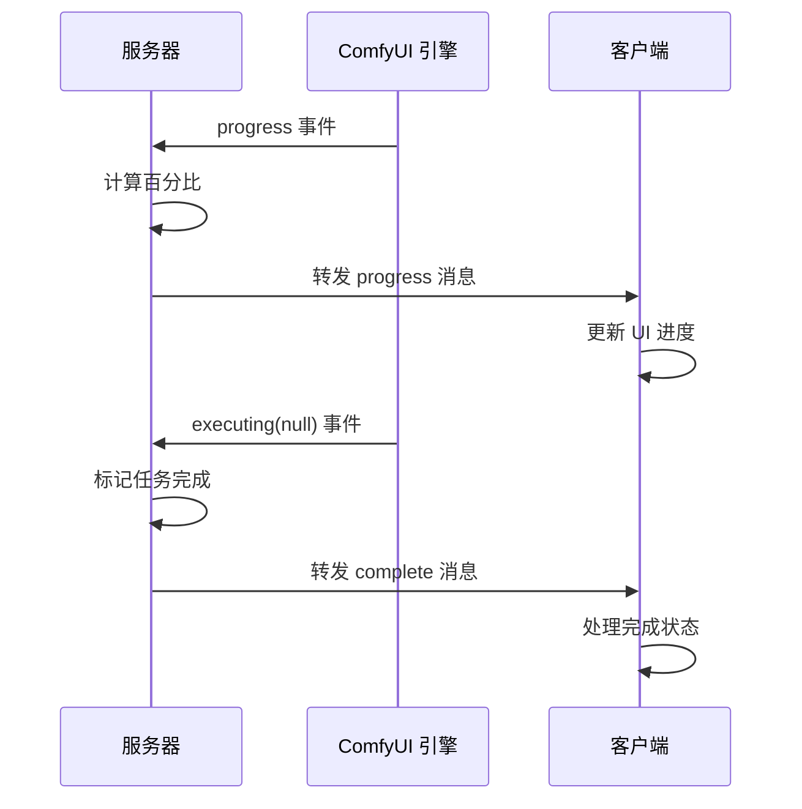

**图表来源**
- [comfyui.ts:143-181](file://server/src/services/comfyui.ts#L143-L181)

**章节来源**
- [comfyui.ts:127-188](file://server/src/services/comfyui.ts#L127-L188)

### 状态管理集成

客户端使用 Zustand 状态管理库来协调 WebSocket 事件和 UI 更新：

#### 任务状态流转

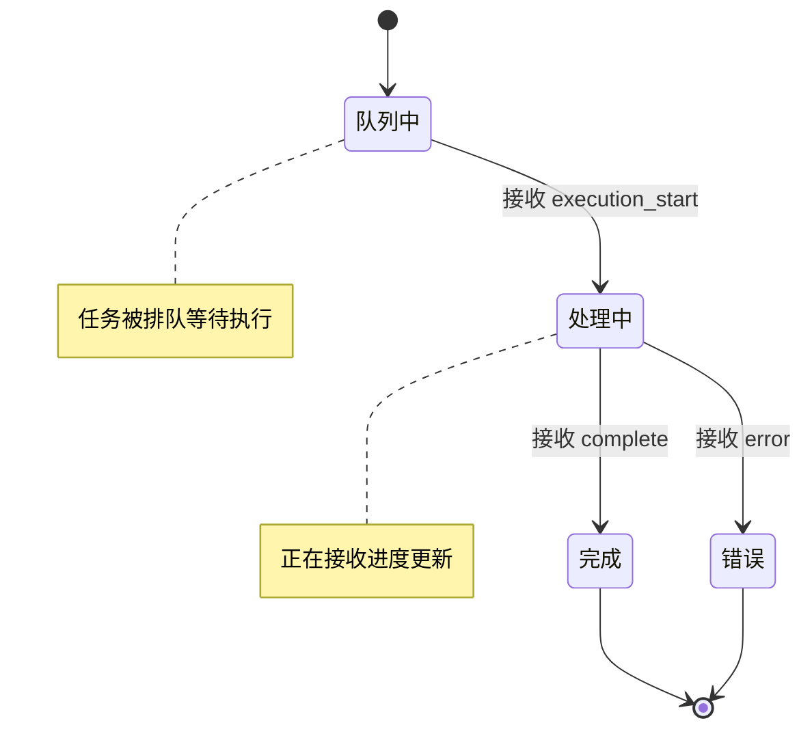

**图表来源**
- [useWorkflowStore.ts:377-499](file://client/src/hooks/useWorkflowStore.ts#L377-L499)

**章节来源**
- [useWorkflowStore.ts:357-499](file://client/src/hooks/useWorkflowStore.ts#L357-L499)

## 依赖关系分析

### 组件耦合度分析

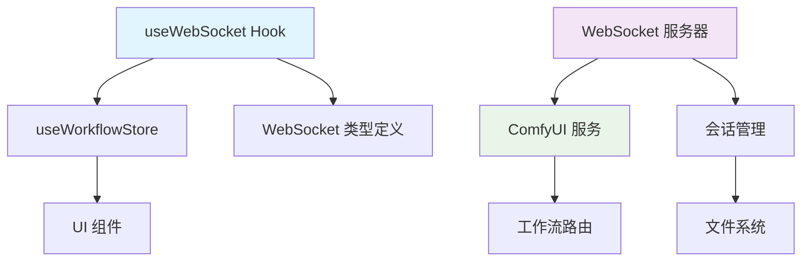

**图表来源**
- [useWebSocket.ts:1-3](file://client/src/hooks/useWebSocket.ts#L1-L3)
- [index.ts:8-12](file://server/src/index.ts#L8-L12)

### 数据流依赖

系统的数据流遵循单向数据流原则，确保状态的一致性和可预测性：

**章节来源**
- [index.ts:1-12](file://server/src/index.ts#L1-L12)
- [useWebSocket.ts:1-3](file://client/src/hooks/useWebSocket.ts#L1-L3)

## 性能考量

### 连接池管理

系统通过单例模式实现了高效的连接池管理，避免了重复连接造成的资源浪费：

- **连接复用**：同一进程内只维持一个 WebSocket 连接
- **智能断开**：当所有组件卸载时自动关闭连接
- **重连策略**：指数退避算法避免频繁重连

### 消息队列优化

服务器端实现了事件缓冲机制，有效处理消息丢失问题：

- **缓冲存储**：按 promptId 分组缓存最近的事件
- **重放机制**：客户端重新连接时自动重放缓冲事件
- **内存管理**：及时清理已完成任务的缓冲数据

### 并发控制

系统通过以下机制控制并发访问：

- **连接计数器**：跟踪活跃的订阅者数量
- **状态同步**：使用原子操作更新连接状态
- **资源清理**：确保连接关闭时释放所有资源

## 故障排除指南

### 常见连接问题

#### 连接失败排查

1. **检查服务器状态**
   - 确认 ComfyUI 引擎正常运行
   - 验证 WebSocket 端口可用性
   - 检查防火墙配置

2. **客户端连接检查**
   - 确认网络连接稳定
   - 检查浏览器 WebSocket 支持
   - 验证 CORS 配置

#### 断线重连问题

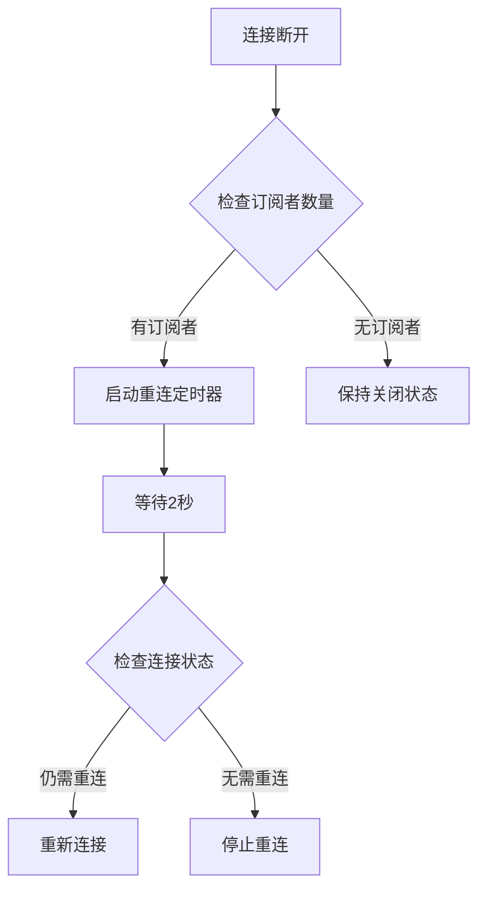

**图表来源**
- [useWebSocket.ts:53-65](file://client/src/hooks/useWebSocket.ts#L53-L65)

### 消息处理异常

#### 消息解析错误

系统对消息解析异常进行了优雅处理：

1. **JSON 解析失败**：忽略无效消息，继续处理其他消息
2. **类型不匹配**：验证消息字段完整性
3. **回调函数异常**：捕获并记录错误，不影响其他消息处理

#### 事件丢失处理

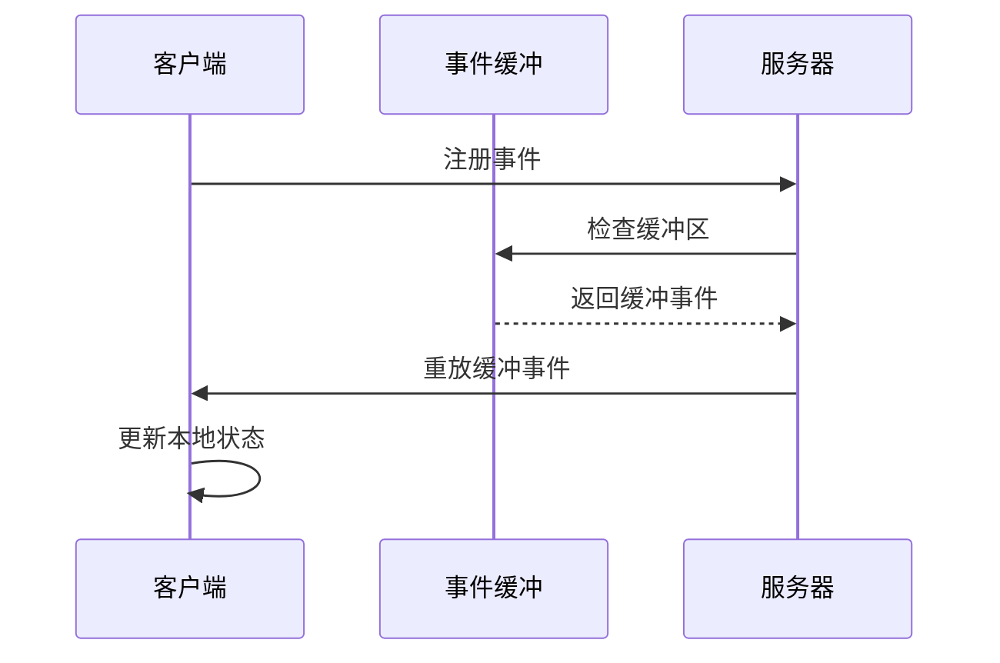

**图表来源**
- [index.ts:195-209](file://server/src/index.ts#L195-L209)

**章节来源**
- [useWebSocket.ts:48-50](file://client/src/hooks/useWebSocket.ts#L48-L50)
- [index.ts:201-208](file://server/src/index.ts#L201-L208)

## 结论

CorineKit Pix2Real 项目的 WebSocket 通信架构展现了现代实时应用的最佳实践。通过三层架构设计、单例连接管理、智能事件缓冲和完善的错误处理机制，系统实现了高效、稳定的实时通信能力。

### 主要优势

1. **架构清晰**：三层架构分离关注点，便于维护和扩展
2. **性能优异**：单例连接和事件缓冲机制优化了资源使用
3. **可靠性强**：完整的断线重连和错误处理机制
4. **用户体验好**：实时进度反馈和状态同步

### 技术亮点

- **智能连接管理**：避免连接洪水，优化资源使用
- **事件重放机制**：确保消息传递的可靠性
- **状态同步**：通过 Zustand 实现高效的状态管理
- **类型安全**：完整的 TypeScript 类型定义

该架构为类似的人工智能图像处理应用提供了优秀的参考模板，展示了如何构建高性能、可扩展的实时通信系统。