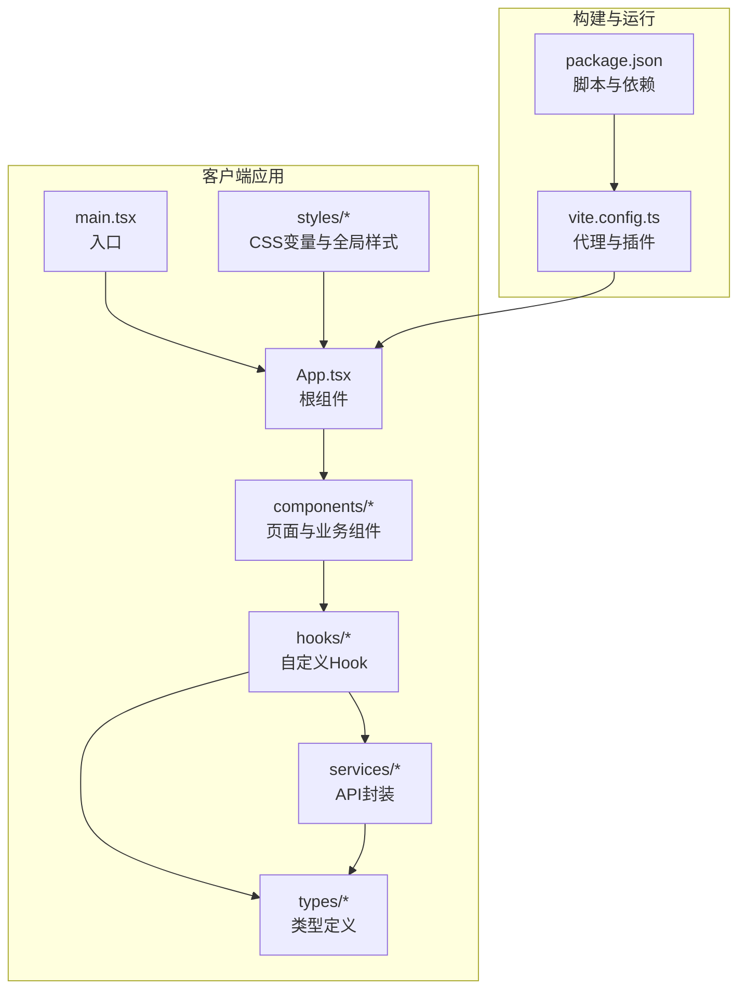
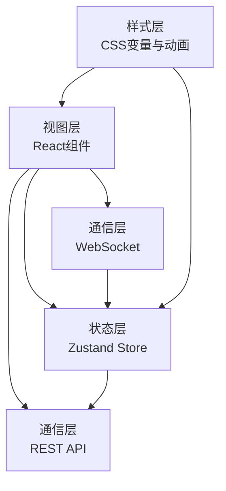
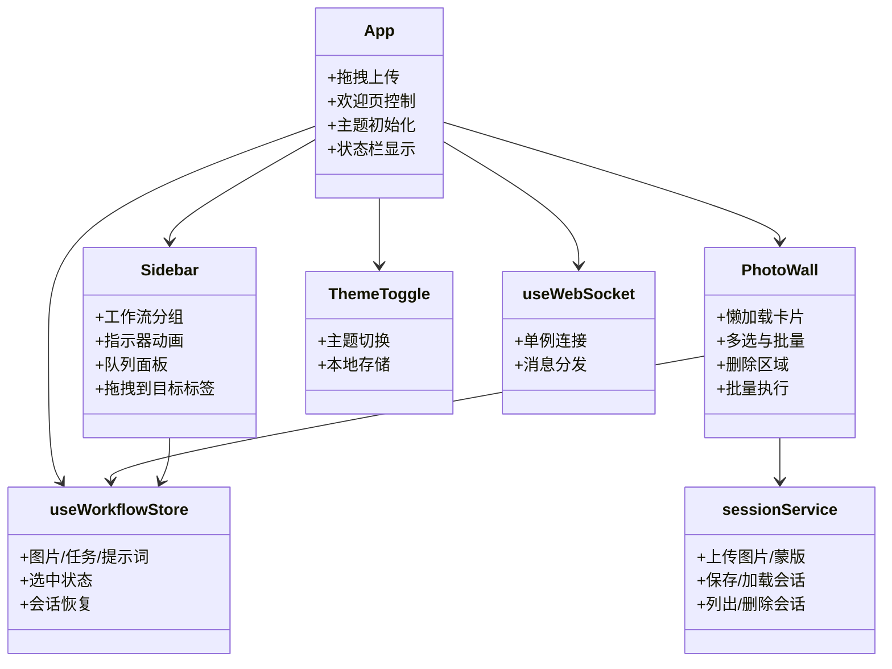
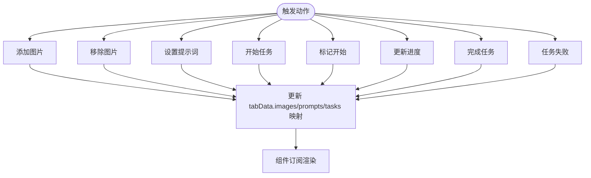
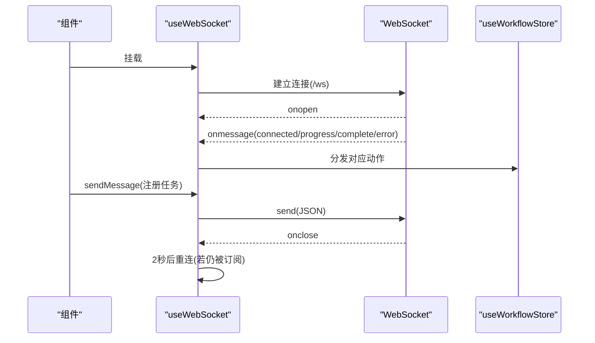
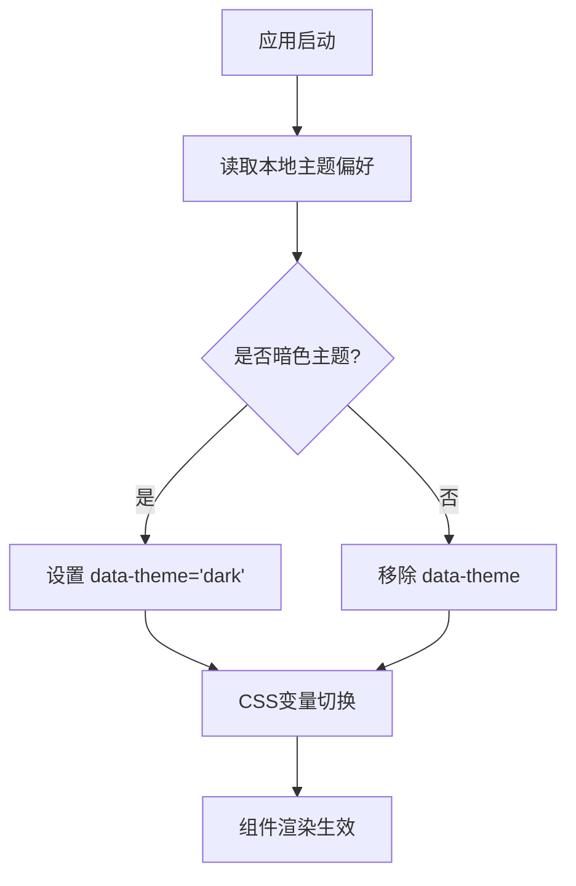
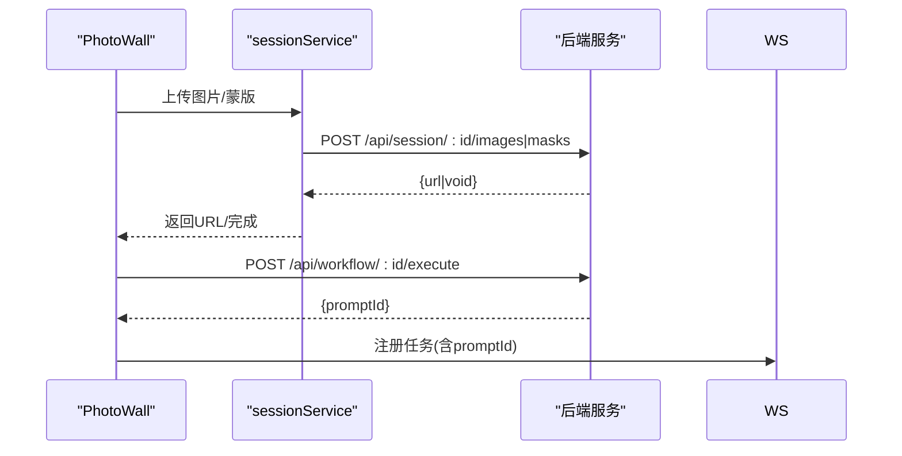
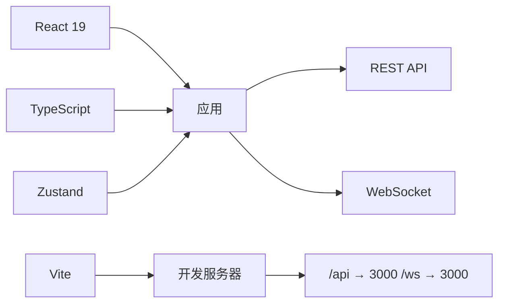

# 前端架构设计

<cite>
**本文档引用的文件**
- [package.json](file://client/package.json)
- [vite.config.ts](file://client/vite.config.ts)
- [main.tsx](file://client/src/main.tsx)
- [App.tsx](file://client/src/components/App.tsx)
- [index.ts](file://client/src/types/index.ts)
- [useWorkflowStore.ts](file://client/src/hooks/useWorkflowStore.ts)
- [useWebSocket.ts](file://client/src/hooks/useWebSocket.ts)
- [useSettingsStore.ts](file://client/src/hooks/useSettingsStore.ts)
- [global.css](file://client/src/styles/global.css)
- [variables.css](file://client/src/styles/variables.css)
- [Sidebar.tsx](file://client/src/components/Sidebar.tsx)
- [PhotoWall.tsx](file://client/src/components/PhotoWall.tsx)
- [ThemeToggle.tsx](file://client/src/components/ThemeToggle.tsx)
- [sessionService.ts](file://client/src/services/sessionService.ts)
- [useImageImporter.ts](file://client/src/hooks/useImageImporter.ts)
</cite>

## 目录
1. [引言](#引言)
2. [项目结构](#项目结构)
3. [核心组件](#核心组件)
4. [架构总览](#架构总览)
5. [详细组件分析](#详细组件分析)
6. [依赖关系分析](#依赖关系分析)
7. [性能考虑](#性能考虑)
8. [故障排除指南](#故障排除指南)
9. [结论](#结论)

## 引言
本文件面向 CorineKit Pix2Real 项目的前端团队与维护者，系统性阐述基于 React + TypeScript + Vite 的前端架构设计。重点覆盖组件层次结构、状态管理模式（Zustand）、WebSocket 通信封装、前端路由与组件通信机制、样式系统与主题切换、与后端 API 的交互模式、错误处理策略以及性能优化方案。文档提供分层讲解与可视化图示，帮助不同背景的读者快速理解并高效参与开发。

## 项目结构
前端采用按功能域组织的目录结构，核心位于 client/src 下：
- components：页面级与业务组件（如 App、Sidebar、PhotoWall）
- hooks：自定义 Hook（状态管理、WebSocket、拖拽、会话等）
- services：与后端交互的服务封装（会话持久化）
- styles：全局样式与 CSS 变量
- types：共享类型定义
- public：静态资源（如 logo）

构建工具使用 Vite，默认代理配置将 /api 和 /ws 请求转发至后端服务，便于本地联调。

图表来源
- [main.tsx:1-11](file://client/src/main.tsx#L1-L11)
- [App.tsx:1-335](file://client/src/components/App.tsx#L1-L335)
- [vite.config.ts:1-20](file://client/vite.config.ts#L1-L20)
- [package.json:1-25](file://client/package.json#L1-L25)

章节来源
- [main.tsx:1-11](file://client/src/main.tsx#L1-L11)
- [vite.config.ts:1-20](file://client/vite.config.ts#L1-L20)
- [package.json:1-25](file://client/package.json#L1-L25)

## 核心组件
- 应用根组件 App：负责全局拖拽上传、欢迎页、侧边栏、主内容区、状态栏、模态框与提示等。
- 状态管理：通过 Zustand 的 useWorkflowStore 统一管理工作流、图片、任务、提示词、选中状态等；useSettingsStore 管理设置项。
- WebSocket 封装：useWebSocket 单例连接，集中处理进度、完成、错误等消息，并向 Store 推送状态变更。
- 样式系统：CSS 变量驱动的主题切换，配合全局动画与滚动条样式。
- 组件通信：通过 Hook 暴露的状态与动作函数进行跨组件通信；部分场景使用原生 dragover 事件绕过 React 合成事件限制。

章节来源
- [App.tsx:54-335](file://client/src/components/App.tsx#L54-L335)
- [useWorkflowStore.ts:96-645](file://client/src/hooks/useWorkflowStore.ts#L96-L645)
- [useWebSocket.ts:75-99](file://client/src/hooks/useWebSocket.ts#L75-L99)
- [useSettingsStore.ts:16-31](file://client/src/hooks/useSettingsStore.ts#L16-L31)
- [global.css:1-224](file://client/src/styles/global.css#L1-L224)
- [variables.css:1-31](file://client/src/styles/variables.css#L1-L31)

## 架构总览
前端采用“组件 + Hook + 服务”的分层架构：
- 视图层：React 组件树，负责渲染与用户交互
- 状态层：Zustand Store，集中管理应用状态与派发动作
- 通信层：WebSocket 实时通信 + Fetch REST API
- 样式层：CSS 变量 + 动画，支持明暗主题

图表来源
- [App.tsx:54-335](file://client/src/components/App.tsx#L54-L335)
- [useWorkflowStore.ts:96-645](file://client/src/hooks/useWorkflowStore.ts#L96-L645)
- [useWebSocket.ts:75-99](file://client/src/hooks/useWebSocket.ts#L75-L99)
- [sessionService.ts:69-134](file://client/src/services/sessionService.ts#L69-L134)
- [global.css:1-224](file://client/src/styles/global.css#L1-L224)

## 详细组件分析

### 组件层次与职责
- App：顶层容器，协调欢迎页、侧边栏、主内容区、状态栏、模态框与提示；处理全局拖拽与主题初始化。
- Sidebar：工作流导航、分组、指示器动画、队列面板弹出与计数轮询；支持卡片与输出缩略图拖拽到目标标签页。
- PhotoWall：图片墙展示、懒加载、多选、批量操作（替换提示词、删除蒙版、批量执行）、删除区域拖拽回收站。
- ThemeToggle：主题切换与本地存储同步。
- 会话相关：useImageImporter 处理重复文件名冲突对话框；sessionService 封装会话保存/加载/列表/删除。

图表来源
- [App.tsx:54-335](file://client/src/components/App.tsx#L54-L335)
- [Sidebar.tsx:30-425](file://client/src/components/Sidebar.tsx#L30-L425)
- [PhotoWall.tsx:103-578](file://client/src/components/PhotoWall.tsx#L103-L578)
- [ThemeToggle.tsx:4-39](file://client/src/components/ThemeToggle.tsx#L4-L39)
- [useWorkflowStore.ts:96-645](file://client/src/hooks/useWorkflowStore.ts#L96-L645)
- [useWebSocket.ts:75-99](file://client/src/hooks/useWebSocket.ts#L75-L99)
- [sessionService.ts:69-134](file://client/src/services/sessionService.ts#L69-L134)

章节来源
- [App.tsx:54-335](file://client/src/components/App.tsx#L54-L335)
- [Sidebar.tsx:30-425](file://client/src/components/Sidebar.tsx#L30-L425)
- [PhotoWall.tsx:103-578](file://client/src/components/PhotoWall.tsx#L103-L578)
- [ThemeToggle.tsx:4-39](file://client/src/components/ThemeToggle.tsx#L4-L39)
- [useWorkflowStore.ts:96-645](file://client/src/hooks/useWorkflowStore.ts#L96-L645)
- [useWebSocket.ts:75-99](file://client/src/hooks/useWebSocket.ts#L75-L99)
- [sessionService.ts:69-134](file://client/src/services/sessionService.ts#L69-L134)

### 状态管理模式（Zustand）
- 工作流状态：包含 activeTab、workflows、tabData（每标签页的图片、提示词、任务、映射、选中索引、文本/模型配置等），clientId、sessionId 等。
- 动作函数：添加/移除图片、批量更新提示词、任务生命周期管理（start/mark/update/complete/fail/reset/removeOutput）、会话恢复、多选与闪烁高亮等。
- 计算属性：needsPrompt/isProcessing 等辅助判断。
- 设计要点：每个标签页独立数据空间，避免跨标签污染；任务状态跨标签广播更新，确保进度与完成回调正确传播。

图表来源
- [useWorkflowStore.ts:96-645](file://client/src/hooks/useWorkflowStore.ts#L96-L645)

章节来源
- [useWorkflowStore.ts:96-645](file://client/src/hooks/useWorkflowStore.ts#L96-L645)

### WebSocket 通信封装
- 单例连接：全局 WebSocket 对象与连接计数，避免重复连接；断线自动重连（延迟 2 秒）。
- 消息分发：根据消息类型分发到 Store 的对应动作（connected/markTaskStarted/updateProgress/complete/fail）。
- 发送消息：通过 sendMessage 将注册信息发送给后端，建立任务与客户端的关联。
- 生命周期：组件挂载时增加连接计数，卸载时减少；当计数归零时关闭连接并清理定时器。

图表来源
- [useWebSocket.ts:75-99](file://client/src/hooks/useWebSocket.ts#L75-L99)
- [index.ts:27-57](file://client/src/types/index.ts#L27-L57)
- [useWorkflowStore.ts:377-500](file://client/src/hooks/useWorkflowStore.ts#L377-L500)

章节来源
- [useWebSocket.ts:75-99](file://client/src/hooks/useWebSocket.ts#L75-L99)
- [index.ts:27-57](file://client/src/types/index.ts#L27-L57)
- [useWorkflowStore.ts:377-500](file://client/src/hooks/useWorkflowStore.ts#L377-L500)

### 样式系统与主题切换
- CSS 变量：在 :root 与 [data-theme="dark"] 中定义颜色与间距变量，统一主题切换。
- 全局样式：重置、滚动条、动画（脉冲、旋转、波浪、卡片高亮、面板进出等）。
- 主题切换：ThemeToggle 读取本地存储，设置 documentElement 的 data-theme 属性，实时生效。
- 图片墙背景：根据主题切换 photowall 背景色，保证视觉一致性。

图表来源
- [ThemeToggle.tsx:4-39](file://client/src/components/ThemeToggle.tsx#L4-L39)
- [variables.css:1-31](file://client/src/styles/variables.css#L1-L31)
- [global.css:153-158](file://client/src/styles/global.css#L153-L158)

章节来源
- [ThemeToggle.tsx:4-39](file://client/src/components/ThemeToggle.tsx#L4-L39)
- [variables.css:1-31](file://client/src/styles/variables.css#L1-31)
- [global.css:153-158](file://client/src/styles/global.css#L153-L158)

### 组件通信机制
- 单向数据流：组件通过订阅 Store 状态进行渲染；动作通过 Store 派发，影响全局状态。
- 跨组件协作：Sidebar 与 PhotoWall 共享 useWorkflowStore；PhotoWall 通过 useWebSocket 发送注册消息；ThemeToggle 与全局 CSS 变量联动。
- 原生事件桥接：Sidebar 在 DOM 上直接绑定 dragover 事件，确保拖拽行为可靠传递到 React 事件系统之外。

章节来源
- [Sidebar.tsx:50-65](file://client/src/components/Sidebar.tsx#L50-L65)
- [PhotoWall.tsx:125](file://client/src/components/PhotoWall.tsx#L125)
- [useWorkflowStore.ts:96-645](file://client/src/hooks/useWorkflowStore.ts#L96-L645)

### 与后端 API 的交互模式
- REST API：通过 sessionService 封装会话上传图片/蒙版、保存/加载/列表/删除会话等；PhotoWall 在批量执行时构造 FormData 并调用 /api/workflow/{id}/execute。
- 代理配置：Vite 将 /api 与 /ws 代理到 http://localhost:3000，便于前后端联调。
- 错误处理：对 fetch 请求进行 try/catch 包裹，记录错误日志；对 WebSocket 连接异常进行断线重连。

图表来源
- [sessionService.ts:69-134](file://client/src/services/sessionService.ts#L69-L134)
- [PhotoWall.tsx:207-239](file://client/src/components/PhotoWall.tsx#L207-L239)
- [vite.config.ts:8-16](file://client/vite.config.ts#L8-L16)

章节来源
- [sessionService.ts:69-134](file://client/src/services/sessionService.ts#L69-L134)
- [PhotoWall.tsx:207-239](file://client/src/components/PhotoWall.tsx#L207-L239)
- [vite.config.ts:8-16](file://client/vite.config.ts#L8-L16)

## 依赖关系分析
- 技术栈依赖：React 19、TypeScript、Zustand、Vite、lucide-react。
- 开发依赖：@vitejs/plugin-react、@types/react、typescript、vite。
- 运行时依赖：lucide-react、react、react-dom、zustand。
- 构建与代理：Vite 配置启用 React 插件与本地代理，将 /api 与 /ws 转发到后端。

图表来源
- [package.json:11-23](file://client/package.json#L11-L23)
- [vite.config.ts:4-19](file://client/vite.config.ts#L4-L19)

章节来源
- [package.json:11-23](file://client/package.json#L11-L23)
- [vite.config.ts:4-19](file://client/vite.config.ts#L4-L19)

## 性能考虑
- 懒加载卡片：PhotoWall 使用 IntersectionObserver 仅在进入视口时渲染真实内容，减少初始渲染压力。
- 滚动补偿：占位符高度与实际高度差异时进行 scrollTop 补偿，避免滚动位置跳变。
- GPU 加速动画：使用 transform/opacity 动画，避免触发布局与重绘。
- 本地存储：主题与视图尺寸缓存于 localStorage，减少重复计算与 IO。
- 单例 WebSocket：避免重复连接与内存泄漏；断线重连策略降低网络波动影响。
- 批量操作：多选批量替换提示词、删除蒙版、执行任务，减少多次请求与 UI 刷新次数。

章节来源
- [PhotoWall.tsx:18-97](file://client/src/components/PhotoWall.tsx#L18-L97)
- [PhotoWall.tsx:45-70](file://client/src/components/PhotoWall.tsx#L45-L70)
- [global.css:127-135](file://client/src/styles/global.css#L127-L135)
- [App.tsx:61-73](file://client/src/components/App.tsx#L61-L73)
- [useWebSocket.ts:6-9](file://client/src/hooks/useWebSocket.ts#L6-L9)

## 故障排除指南
- WebSocket 断线重连
  - 现象：长时间无响应或断开后无法接收进度。
  - 排查：检查浏览器控制台是否有 onclose/onerror；确认后端 /ws 是否可达；确认代理配置。
  - 处理：等待自动重连（2 秒间隔）；必要时刷新页面重新建立连接。
- 任务状态不更新
  - 现象：进度条不动、完成状态未出现。
  - 排查：确认 WebSocket 消息类型（progress/complete/error）是否正确到达；检查 Store 的 markTaskStarted/updateProgress/completeTask/failTask 是否被调用。
  - 处理：核对后端推送的消息格式与 promptId；确保 register 消息已发送。
- 图片导入冲突
  - 现象：导入同名文件弹出覆盖/保留对话框。
  - 排查：useImageImporter 会检测当前标签页已有同名文件。
  - 处理：选择覆盖或保留，避免命名冲突导致的数据错乱。
- 拖拽行为异常
  - 现象：拖拽到目标标签页无效或丢失。
  - 排查：Sidebar 在 DOM 层绑定 dragover 事件，确保原生事件优先处理；检查 dataTransfer 类型与 dropEffect。
  - 处理：确保拖拽源包含正确的自定义类型；避免 React 合成事件拦截原生拖拽。

章节来源
- [useWebSocket.ts:53-65](file://client/src/hooks/useWebSocket.ts#L53-L65)
- [useWorkflowStore.ts:398-499](file://client/src/hooks/useWorkflowStore.ts#L398-L499)
- [useImageImporter.ts:9-48](file://client/src/hooks/useImageImporter.ts#L9-L48)
- [Sidebar.tsx:50-65](file://client/src/components/Sidebar.tsx#L50-L65)

## 结论
本前端架构以 React + TypeScript + Vite 为基础，结合 Zustand 实现轻量且可预测的状态管理，通过 WebSocket 实现实时任务反馈，辅以 CSS 变量与动画提升用户体验。组件间通过 Hook 与 Store 解耦，形成清晰的单向数据流与职责边界。建议后续持续完善错误边界、日志上报与性能监控，进一步增强稳定性与可观测性。