# 样式与主题系统

<cite>
**本文档引用的文件**
- [client/src/styles/global.css](file://client/src/styles/global.css)
- [client/src/styles/variables.css](file://client/src/styles/variables.css)
- [client/src/components/ThemeToggle.tsx](file://client/src/components/ThemeToggle.tsx)
- [client/src/components/App.tsx](file://client/src/components/App.tsx)
- [client/src/main.tsx](file://client/src/main.tsx)
- [client/package.json](file://client/package.json)
- [client/vite.config.ts](file://client/vite.config.ts)
- [client/src/hooks/useSettingsStore.ts](file://client/src/hooks/useSettingsStore.ts)
- [client/src/components/PhotoWall.tsx](file://client/src/components/PhotoWall.tsx)
- [client/src/components/Sidebar.tsx](file://client/src/components/Sidebar.tsx)
- [client/src/components/ImageCard.tsx](file://client/src/components/ImageCard.tsx)
- [client/src/components/SegmentedControl.tsx](file://client/src/components/SegmentedControl.tsx)
- [client/src/components/SettingsModal.tsx](file://client/src/components/SettingsModal.tsx)
- [client/src/components/Workflow0SettingsPanel.tsx](file://client/src/components/Workflow0SettingsPanel.tsx)
- [client/src/components/Workflow2SettingsPanel.tsx](file://client/src/components/Workflow2SettingsPanel.tsx)
</cite>

## 更新摘要
**变更内容**
- 新增细线滑块设计系统，实现高度仅为4px的现代化滑块控件
- 扩展卡片布局系统的主题变量支持，新增 `--card-bg` 和 `--color-surface-hover` 变量
- 增强主题变量的使用范围，多个组件开始采用统一的主题变量系统
- 更新性能优化章节，包含新的细线滑块和卡片背景变量的实现细节

## 目录
1. [简介](#简介)
2. [项目结构](#项目结构)
3. [核心组件](#核心组件)
4. [架构概览](#架构概览)
5. [详细组件分析](#详细组件分析)
6. [依赖关系分析](#依赖关系分析)
7. [性能考虑](#性能考虑)
8. [故障排除指南](#故障排除指南)
9. [结论](#结论)
10. [附录](#附录)

## 简介

CorineKit Pix2Real 项目采用基于 CSS 变量的主题系统，实现了灵活且高性能的深色/浅色主题切换机制。该系统通过 CSS 自定义属性实现全局样式变量管理，结合 JavaScript 实现动态主题切换，并通过 Vite 构建工具进行优化。

**最新功能更新**：系统已新增细线滑块设计和扩展的卡片布局主题变量支持，进一步提升了用户界面的现代化程度和主题一致性。

本系统的核心设计理念包括：
- **CSS 变量驱动**：使用 CSS 自定义属性实现主题变量的集中管理
- **数据属性选择器**：通过 `data-theme` 属性实现主题状态的声明式控制
- **本地存储持久化**：用户偏好设置的本地持久化存储
- **渐进增强**：基础样式降级和现代浏览器特性检测
- **性能优化**：GPU 加速动画和最小化的重排重绘

## 项目结构

客户端样式系统主要由以下层次组成：

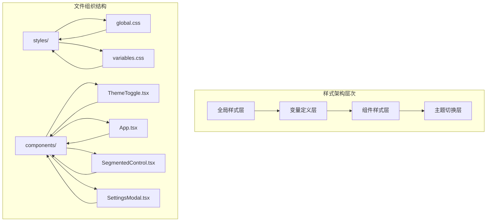

**图表来源**
- [client/src/styles/global.css:1-263](file://client/src/styles/global.css#L1-L263)
- [client/src/styles/variables.css:1-31](file://client/src/styles/variables.css#L1-L31)
- [client/src/components/ThemeToggle.tsx:1-39](file://client/src/components/ThemeToggle.tsx#L1-L39)

**章节来源**
- [client/src/styles/global.css:1-263](file://client/src/styles/global.css#L1-L263)
- [client/src/styles/variables.css:1-31](file://client/src/styles/variables.css#L1-L31)
- [client/src/components/ThemeToggle.tsx:1-39](file://client/src/components/ThemeToggle.tsx#L1-L39)

## 核心组件

### CSS 变量系统

系统使用 CSS 自定义属性实现主题变量的集中管理，支持浅色和深色两种主题模式：

**浅色主题默认值**：
- 主色调：蓝色系 (#2196F3)
- 背景色：白色 (#ffffff)
- 表面色：浅灰 (#f5f5f5)
- 文本色：深灰 (#1a1a1a)
- 次级文本色：中灰 (#666666)
- 边框色：中灰 (#e0e0e0)
- 卡片背景色：白色 (#ffffff)
- 表面悬停色：浅灰 (#eeeeee)

**深色主题变量覆盖**：
- 背景色：深灰 (#121212)
- 表面色：更深灰 (#1e1e1e)
- 文本色：浅灰 (#e0e0e0)
- 次级文本色：浅灰 (#999999)
- 边框色：更深灰 (#333333)
- 卡片背景色：更深灰 (#1a1a1a)
- 表面悬停色：更深灰 (#2a2a2a)

### 主题切换机制

主题切换通过 `data-theme` 数据属性实现，配合 CSS 变量的层叠特性实现无缝切换：

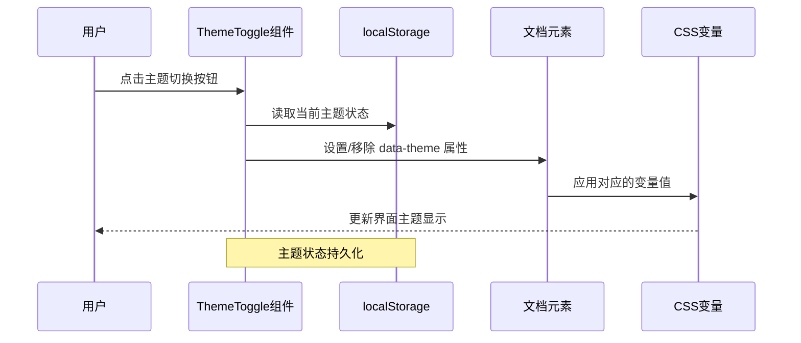

**图表来源**
- [client/src/components/ThemeToggle.tsx:4-17](file://client/src/components/ThemeToggle.tsx#L4-L17)
- [client/src/components/App.tsx:76-81](file://client/src/components/App.tsx#L76-L81)

**章节来源**
- [client/src/styles/variables.css:1-31](file://client/src/styles/variables.css#L1-L31)
- [client/src/components/ThemeToggle.tsx:1-39](file://client/src/components/ThemeToggle.tsx#L1-L39)
- [client/src/components/App.tsx:76-81](file://client/src/components/App.tsx#L76-L81)

## 架构概览

### 整体架构设计

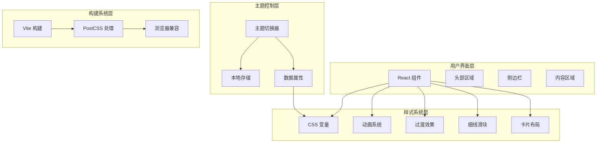

**图表来源**
- [client/src/main.tsx:1-11](file://client/src/main.tsx#L1-L11)
- [client/src/styles/global.css:1-263](file://client/src/styles/global.css#L1-L263)
- [client/vite.config.ts:1-20](file://client/vite.config.ts#L1-L20)

### 样式架构分层

系统采用分层架构设计，确保样式的可维护性和扩展性：

1. **全局重置层**：统一的基础样式重置和默认值
2. **变量定义层**：主题相关的 CSS 变量定义
3. **组件样式层**：各功能模块的具体样式实现
4. **主题切换层**：动态主题切换的控制逻辑

**章节来源**
- [client/src/styles/global.css:1-263](file://client/src/styles/global.css#L1-L263)
- [client/src/styles/variables.css:1-31](file://client/src/styles/variables.css#L1-L31)

## 详细组件分析

### 全局样式系统

全局样式系统提供了完整的样式基础框架，包括基础重置、字体系统、滚动条样式和动画效果。

#### 基础样式重置

系统采用选择器重置的方式，确保跨浏览器的一致性：

- **盒模型统一**：所有元素使用 border-box 盒模型
- **边距归零**：重置所有元素的 margin 和 padding
- **高度宽度**：根元素和页面容器使用 100% 尺寸

#### 字体和排版系统

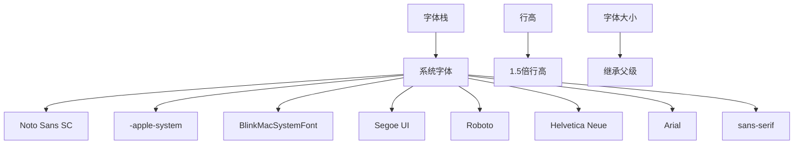

**图表来源**
- [client/src/styles/global.css:16-27](file://client/src/styles/global.css#L16-L27)

#### 滚动条样式系统

系统实现了自定义滚动条样式，支持主题切换：

- **浅色主题**：灰色滚动条轨道，深色滚动条手柄
- **深色主题**：深色滚动条轨道，浅色滚动条手柄
- **悬停效果**：滚动条手柄在悬停时使用次级文本色

### 细线滑块设计系统

**新增功能**：系统现已支持细线滑块设计，提供现代化的滑块控件体验

#### 滑块样式设计

细线滑块采用极简设计，高度仅为4px，提供优雅的视觉效果：

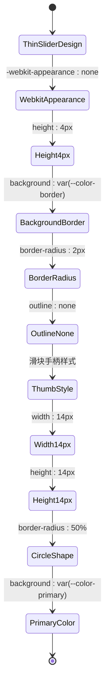

**设计特点**：
- **极简外观**：4px高度，相比传统滑块大幅减小
- **主题一致**：使用 `var(--color-border)` 和 `var(--color-primary)` 变量
- **跨浏览器支持**：同时支持 WebKit 和 Mozilla 内核
- **悬停反馈**：手柄在悬停时提供更好的可识别性

**章节来源**
- [client/src/styles/global.css:220-257](file://client/src/styles/global.css#L220-L257)

### 卡片布局系统

**扩展功能**：系统现已支持更丰富的卡片布局主题变量，提供统一的卡片样式体验

#### 卡片背景变量

新增的 `--card-bg` 变量为卡片组件提供专门的背景色支持：

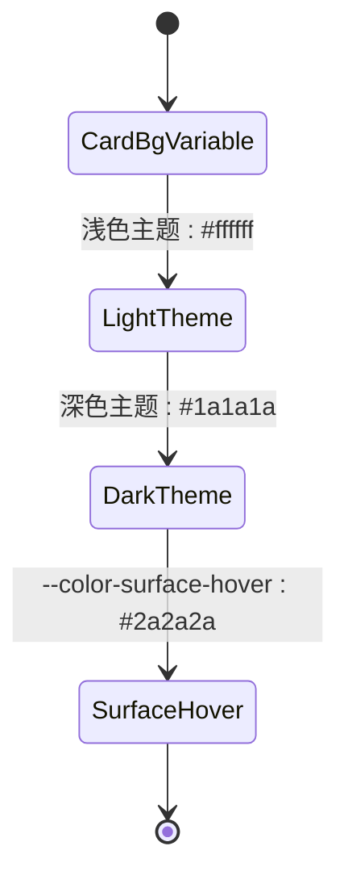

**变量定义**：
- `--card-bg`: 专门用于卡片背景的颜色变量
- `--color-surface-hover`: 表面悬停状态的颜色变量

**使用场景**：
- 设置模态框背景 (`var(--card-bg, #1a1a1a)`)
- 悬停状态的表面颜色 (`var(--color-surface-hover, rgba(255,255,255,0.06))`)
- 统一卡片组件的视觉风格

**章节来源**
- [client/src/styles/variables.css:13-13](file://client/src/styles/variables.css#L13-L13)
- [client/src/styles/variables.css:29-29](file://client/src/styles/variables.css#L29-L29)
- [client/src/styles/variables.css:24-24](file://client/src/styles/variables.css#L24-L24)

### 动画和过渡系统

系统内置了多种动画效果，用于提升用户体验。

#### 性能优化的卡片发光动画

**card-ai-glow 动画**：已从昂贵的 box-shadow 动画重写为使用 outline 的 GPU 加速动画

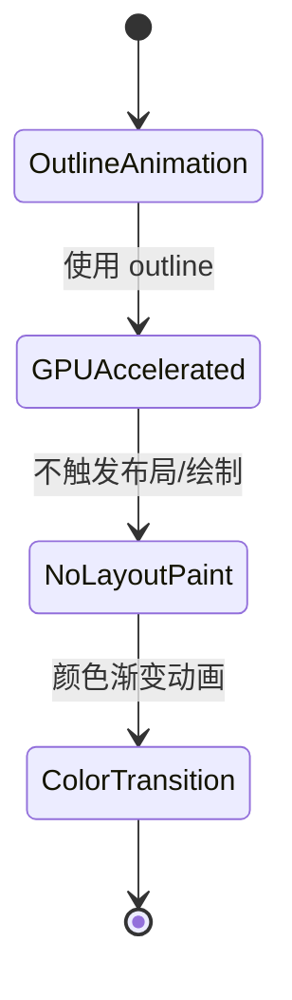

**优化原理**：
- 使用 `outline` 替代 `box-shadow`，避免触发昂贵的布局和绘制
- 利用 GPU 硬件加速进行动画渲染
- 仅使用颜色变换，不改变元素几何属性

**图表来源**
- [client/src/styles/global.css:111-123](file://client/src/styles/global.css#L111-L123)

#### 新增的懒加载卡片淡入动画

**lazyCardFadeIn 动画**：专为懒加载卡片设计的 GPU 加速动画

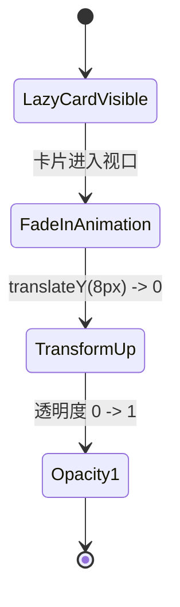

**动画特性**：
- 仅使用 `opacity` 和 `transform` 属性，完全 GPU 加速
- 从 `translateY(8px)` 和 `opacity: 0` 开始，平滑过渡到最终状态
- 适用于大量图片的懒加载场景，提升首屏渲染性能

**章节来源**
- [client/src/styles/global.css:259-263](file://client/src/styles/global.css#L259-L263)

#### 加载状态动画

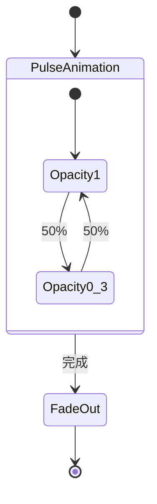

**图表来源**
- [client/src/styles/global.css:56-63](file://client/src/styles/global.css#L56-L63)

#### 输入焦点动画

系统使用圆锥渐变实现 AI 助手输入框的动态边框效果：

- **渐变角度**：使用 CSS @property 定义的 --pa-angle 变量
- **动画循环**：每秒旋转 360 度的连续动画
- **GPU 加速**：使用 padding 和 mask 技术实现硬件加速

**章节来源**
- [client/src/styles/global.css:66-95](file://client/src/styles/global.css#L66-L95)

### 主题切换组件

ThemeToggle 组件是主题系统的核心控制器，负责用户交互和状态管理。

#### 组件架构

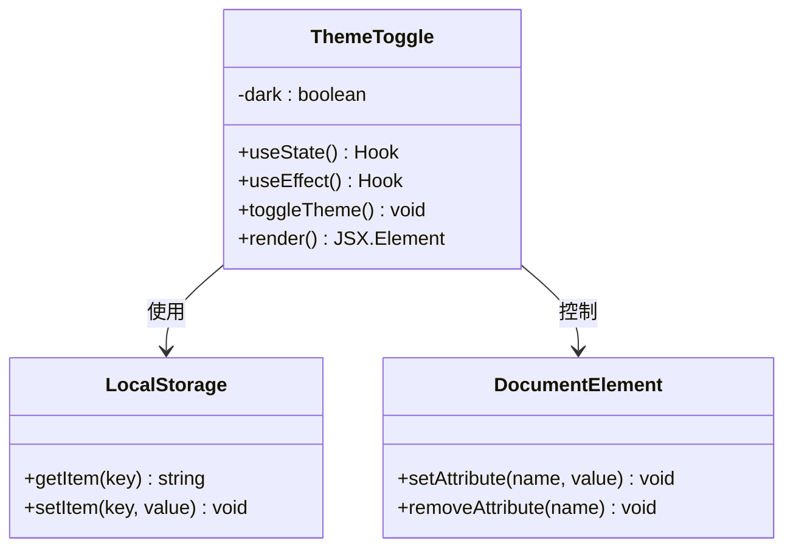

**图表来源**
- [client/src/components/ThemeToggle.tsx:1-39](file://client/src/components/ThemeToggle.tsx#L1-L39)

#### 切换流程

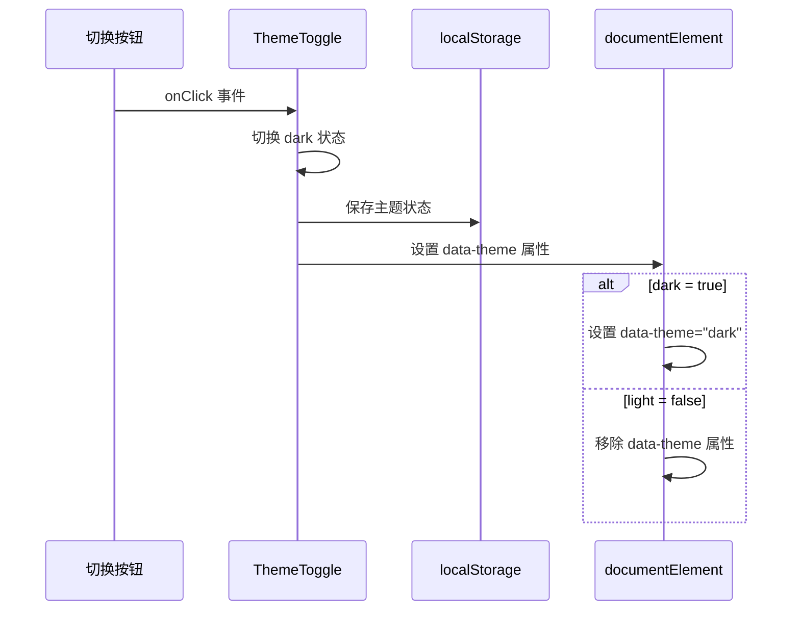

**图表来源**
- [client/src/components/ThemeToggle.tsx:9-17](file://client/src/components/ThemeToggle.tsx#L9-L17)

**章节来源**
- [client/src/components/ThemeToggle.tsx:1-39](file://client/src/components/ThemeToggle.tsx#L1-L39)

### 应用初始化集成

App 组件在应用启动时检查并应用用户的主题偏好设置。

#### 初始化流程

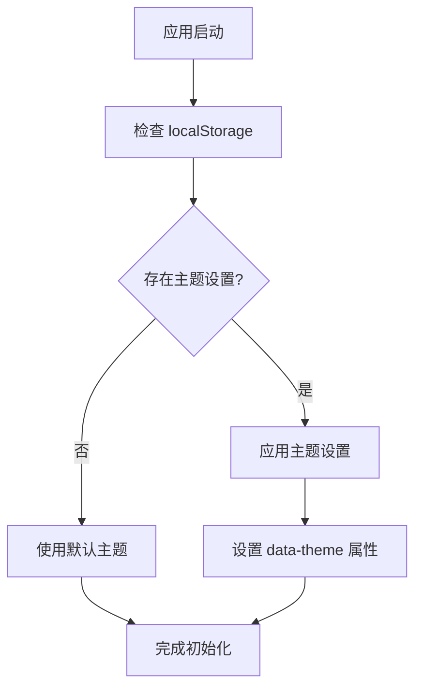

**图表来源**
- [client/src/components/App.tsx:76-81](file://client/src/components/App.tsx#L76-L81)

**章节来源**
- [client/src/components/App.tsx:76-81](file://client/src/components/App.tsx#L76-L81)

### 分段控制组件

SegmentedControl 是一个重要的 UI 组件，展示了主题变量的广泛应用。

#### 组件样式分析

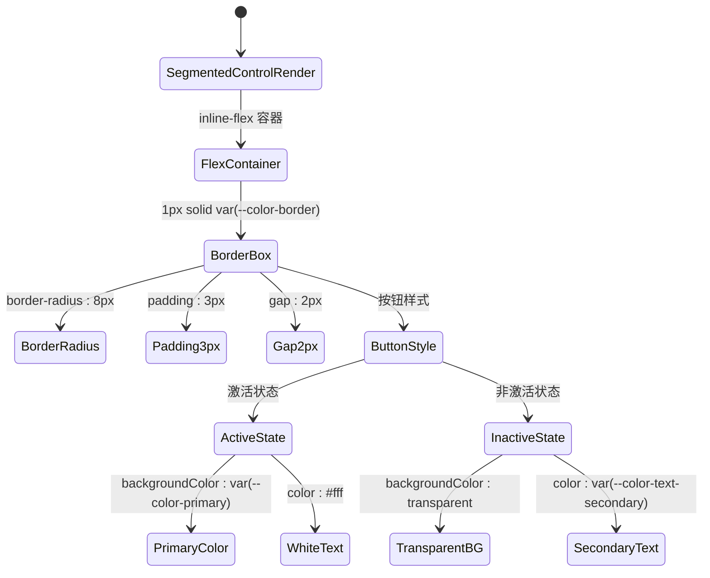

**设计特点**：
- **统一边框**：使用 `var(--color-border)` 实现主题一致的边框
- **激活状态**：使用主色调 `var(--color-primary)` 提供视觉反馈
- **文本对比**：激活状态下使用白色文本，非激活状态下使用次级文本色
- **过渡动画**：0.15秒的平滑过渡效果

**章节来源**
- [client/src/components/SegmentedControl.tsx:14-46](file://client/src/components/SegmentedControl.tsx#L14-L46)

## 依赖关系分析

### 样式依赖链

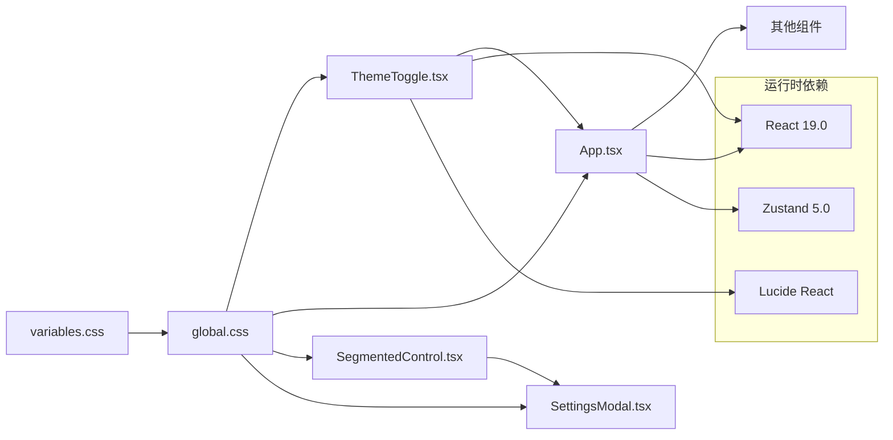

**图表来源**
- [client/src/styles/variables.css:1-31](file://client/src/styles/variables.css#L1-L31)
- [client/src/styles/global.css:1-263](file://client/src/styles/global.css#L1-L263)
- [client/src/components/ThemeToggle.tsx:1-39](file://client/src/components/ThemeToggle.tsx#L1-L39)
- [client/src/components/App.tsx:1-335](file://client/src/components/App.tsx#L1-L335)
- [client/src/components/SegmentedControl.tsx:1-48](file://client/src/components/SegmentedControl.tsx#L1-L48)
- [client/src/components/SettingsModal.tsx:1-239](file://client/src/components/SettingsModal.tsx#L1-L239)
- [client/package.json:11-25](file://client/package.json#L11-L25)

### 组件间交互

系统中的组件通过样式变量实现松耦合的交互：

- **全局样式共享**：所有组件共享 CSS 变量定义
- **主题状态同步**：通过 data-theme 属性实现主题状态的全局同步
- **局部样式隔离**：每个组件使用独立的样式作用域

**章节来源**
- [client/src/main.tsx:1-11](file://client/src/main.tsx#L1-L11)
- [client/src/components/PhotoWall.tsx:1-200](file://client/src/components/PhotoWall.tsx#L1-L200)
- [client/src/components/Sidebar.tsx:1-200](file://client/src/components/Sidebar.tsx#L1-L200)

## 性能考虑

### GPU 加速优化

系统充分利用现代浏览器的 GPU 加速能力，进行了多项性能优化：

#### outline 动画替代策略

**card-ai-glow 动画优化**：这是本次更新的核心性能改进

**优化前的问题**：
- 使用 `box-shadow` 动画会触发昂贵的布局和绘制操作
- 影响页面整体渲染性能，特别是在大量元素同时动画时

**优化后的解决方案**：
- 使用 `outline` 属性替代 `box-shadow`
- `outline` 动画在 GPU 上执行，不会触发布局和绘制
- 保持相同的视觉效果，但性能大幅提升

**实现细节**：
```css
/* 优化前：昂贵的 box-shadow 动画 */
.card-ai-glow {
  box-shadow: 0 0 10px var(--color-primary);
  animation: glow 2s ease-in-out infinite;
}

/* 优化后：GPU 加速的 outline 动画 */
.card-ai-glow {
  outline: 2.5px solid var(--color-primary);
  animation: card-ai-glow-border 2s ease-in-out infinite;
}
```

#### lazyCardFadeIn 动画优化

**新增的懒加载动画**：专为提升大量图片加载性能而设计

**动画特性**：
- 仅使用 `opacity` 和 `transform` 属性，完全 GPU 加速
- 从 `translateY(8px)` 和 `opacity: 0` 开始，平滑过渡到最终状态
- 避免使用任何可能触发布局的属性

**使用场景**：
- 图片墙组件中的懒加载卡片
- 大量图片的首次渲染
- 需要流畅过渡效果的场景

#### 细线滑块性能优化

**新增的细线滑块**：在保持视觉效果的同时优化了性能

**优化策略**：
- 使用 `height: 4px` 替代传统的 `height: 16px`
- 减少绘制面积，提升渲染效率
- 通过 `border-radius: 2px` 实现圆角效果，无需额外的阴影计算
- 滑块手柄使用 `border-radius: 50%` 实现完美的圆形

#### 渲染性能优化

- **IntersectionObserver**：LazyCard 使用懒加载减少初始渲染负担
- **虚拟滚动**：大量图片时使用虚拟滚动技术
- **CSS 变量缓存**：CSS 变量在运行时被浏览器高效缓存
- **will-change 属性**：为动画元素设置 `will-change: transform` 提前通知浏览器优化

### 内存管理

- **事件监听器清理**：组件卸载时清理所有事件监听器
- **定时器管理**：及时清理轮询定时器
- **资源释放**：及时释放 Canvas 和 Blob 资源

**章节来源**
- [client/src/styles/global.css:111-123](file://client/src/styles/global.css#L111-L123)
- [client/src/styles/global.css:220-257](file://client/src/styles/global.css#L220-L257)
- [client/src/styles/global.css:259-263](file://client/src/styles/global.css#L259-L263)

## 故障排除指南

### 常见问题诊断

#### 主题切换失效

**症状**：点击主题切换按钮后界面无变化

**排查步骤**：
1. 检查 localStorage 中是否存在 theme 键
2. 验证 documentElement 是否正确设置了 data-theme 属性
3. 确认 CSS 变量是否正确加载

**解决方案**：
- 清除浏览器缓存重新加载
- 检查网络连接确保样式文件正常加载
- 验证浏览器对 CSS 变量的支持情况

#### 动画效果异常

**症状**：页面动画不流畅或出现闪烁

**排查步骤**：
1. 检查 GPU 加速是否启用
2. 验证 CSS 动画属性是否正确
3. 确认浏览器兼容性

**解决方案**：
- 更新浏览器版本
- 检查硬件加速设置
- 调整动画性能参数

#### outline 动画问题

**症状**：card-ai-glow 动画不生效或效果异常

**排查步骤**：
1. 检查 CSS 选择器是否正确匹配目标元素
2. 验证 outline 属性是否被其他样式覆盖
3. 确认动画关键帧定义是否正确

**解决方案**：
- 检查元素是否正确应用 `card-ai-glow` 类名
- 验证 CSS 优先级，确保动画样式不被覆盖
- 确保浏览器支持 outline 动画

#### 细线滑块显示问题

**症状**：滑块控件显示异常或无法交互

**排查步骤**：
1. 检查 CSS 选择器是否正确匹配 input[type="range"]
2. 验证主题变量是否正确应用
3. 确认浏览器对自定义滑块样式的支持

**解决方案**：
- 检查元素是否正确应用滑块样式类
- 验证 CSS 变量 `--color-border` 和 `--color-primary` 的值
- 确保浏览器支持 `-webkit-slider-thumb` 和 `-moz-range-thumb` 伪元素

### 调试技巧

#### 开发者工具使用

- **CSS 变量检查**：使用 Elements 面板检查 :root 和 [data-theme="dark"] 中的变量值
- **动画调试**：使用 Performance 面板监控动画帧率
- **内存分析**：使用 Memory 面板监控内存使用情况
- **GPU 性能监控**：使用 Chrome DevTools 的 Rendering 面板检查 GPU 加速状态

**章节来源**
- [client/src/components/ThemeToggle.tsx:1-39](file://client/src/components/ThemeToggle.tsx#L1-L39)
- [client/src/styles/global.css:113-123](file://client/src/styles/global.css#L113-L123)

## 结论

CorineKit Pix2Real 项目的样式与主题系统展现了现代前端开发的最佳实践：

### 设计优势

1. **架构清晰**：分层设计确保了代码的可维护性和扩展性
2. **性能优秀**：GPU 加速和懒加载技术提升了用户体验
3. **兼容性强**：渐进增强策略确保了多浏览器支持
4. **开发友好**：模块化设计便于团队协作和代码复用
5. **现代化设计**：细线滑块和统一卡片布局体现了最新的 UI 设计趋势

### 技术亮点

- **CSS 变量驱动**：实现了真正的主题系统架构
- **数据属性选择器**：提供了声明式的主题控制方式
- **本地存储持久化**：确保用户偏好的一致性体验
- **动画性能优化**：充分利用现代浏览器的硬件加速能力
- **GPU 加速实现**：通过 outline 替代 box-shadow，显著提升动画性能
- **细线滑块设计**：提供现代化的滑块控件体验
- **扩展卡片系统**：支持更丰富的卡片布局主题变量

### 改进建议

1. **主题预设系统**：可以考虑添加更多主题预设选项
2. **动态变量调整**：支持用户自定义颜色变量
3. **主题导出导入**：允许用户保存和分享自定义主题
4. **无障碍支持**：增强高对比度和色盲友好的主题选项
5. **响应式滑块**：为移动设备优化滑块交互体验

## 附录

### 主题变量参考表

| 变量类别 | 浅色主题默认值 | 深色主题值 |
|---------|---------------|-----------|
| 主色调 | #2196F3 | 同上 |
| 背景色 | #ffffff | #121212 |
| 表面色 | #f5f5f5 | #1e1e1e |
| 表面悬停色 | #eeeeee | #2a2a2a |
| 文本色 | #1a1a1a | #e0e0e0 |
| 次级文本色 | #666666 | #999999 |
| 边框色 | #e0e0e0 | #333333 |
| 成功色 | #4CAF50 | 同上 |
| 错误色 | #f44336 | 同上 |
| 卡片背景色 | #ffffff | #1a1a1a |
| 间距变量 | 4px/8px/16px/24px/32px | 同上 |

### 样式覆盖规则

1. **全局样式优先级**：:root > [data-theme="dark"] > 组件特定样式
2. **组件样式优先级**：内联样式 > 组件样式 > 全局样式
3. **媒体查询优先级**：具体规则 > 通用规则

### 浏览器兼容性

- **现代浏览器**：Chrome 90+, Firefox 88+, Safari 14+
- **CSS 变量**：IE 不支持，建议使用降级方案
- **@property 规则**：需要浏览器原生支持
- **IntersectionObserver**：需要 polyfill 支持旧版浏览器
- **outline 动画**：现代浏览器广泛支持，性能优异
- **细线滑块**：WebKit 和 Mozilla 内核均支持

### 主题定制指南

#### 添加新主题变量

1. 在 variables.css 中添加新的 CSS 变量定义
2. 在 [data-theme="dark"] 选择器中提供对应的深色值
3. 在组件中使用新的变量进行样式定义

#### 创建自定义主题

1. 基于现有主题变量创建新的颜色方案
2. 在 [data-theme="custom"] 选择器中定义变量值
3. 通过 JavaScript 设置 data-theme="custom"

#### 性能优化建议

1. **减少重绘重排**：优先使用 transform 和 opacity
2. **使用 CSS 变量**：避免频繁的 JavaScript DOM 操作
3. **懒加载资源**：延迟加载非关键样式和图片
4. **GPU 加速**：使用 outline 替代 box-shadow 动画
5. **压缩构建**：使用 Vite 进行生产环境优化
6. **动画优化**：使用 lazyCardFadeIn 等 GPU 加速动画
7. **细线滑块**：使用高度为4px的滑块替代传统粗滑块
8. **卡片系统**：利用 --card-bg 变量统一卡片样式