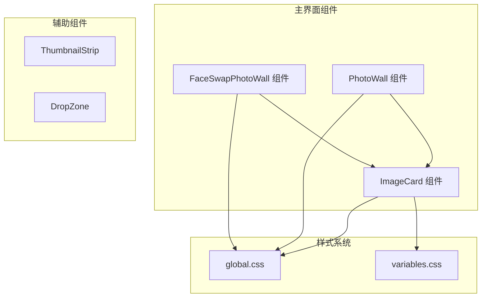
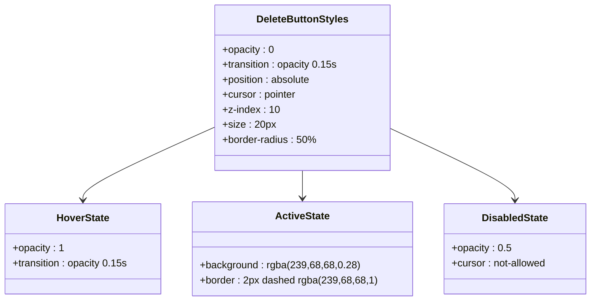
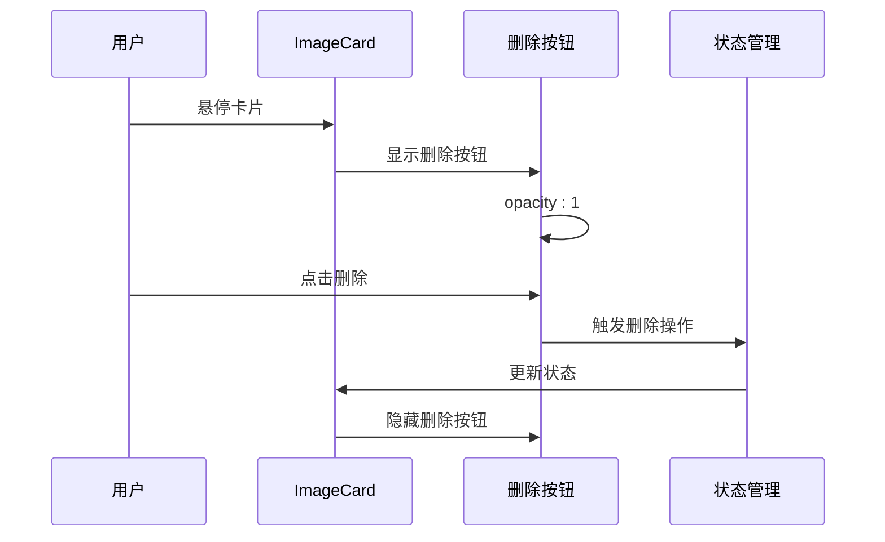
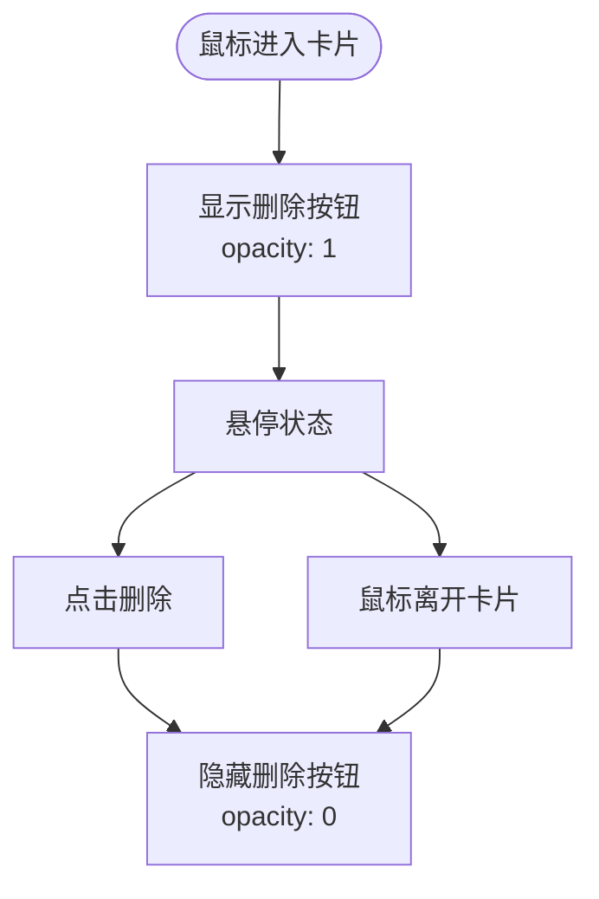
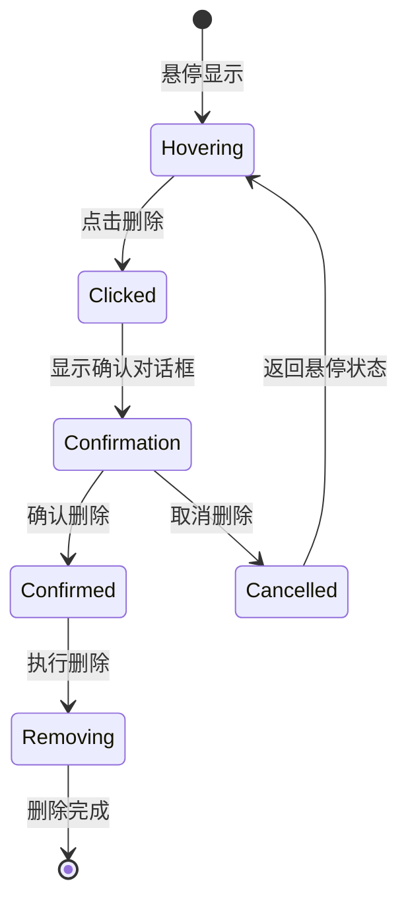
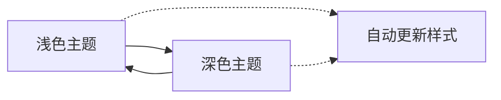

# 图片预览删除按钮样式

<cite>
**本文档引用的文件**
- [ImageCard.tsx](file://client/src/components/ImageCard.tsx)
- [PhotoWall.tsx](file://client/src/components/PhotoWall.tsx)
- [FaceSwapPhotoWall.tsx](file://client/src/components/FaceSwapPhotoWall.tsx)
- [global.css](file://client/src/styles/global.css)
- [variables.css](file://client/src/styles/variables.css)
- [ThumbnailStrip.tsx](file://client/src/components/ThumbnailStrip.tsx)
- [DropZone.tsx](file://client/src/components/DropZone.tsx)
- [index.ts](file://client/src/types/index.ts)
</cite>

## 目录
1. [简介](#简介)
2. [项目结构概览](#项目结构概览)
3. [核心组件分析](#核心组件分析)
4. [删除按钮样式架构](#删除按钮样式架构)
5. [详细样式实现分析](#详细样式实现分析)
6. [交互行为设计](#交互行为设计)
7. [响应式适配](#响应式适配)
8. [主题支持](#主题支持)
9. [性能考虑](#性能考虑)
10. [故障排除指南](#故障排除指南)
11. [总结](#总结)

## 简介

本文档深入分析了 CorineKit Pix2Real 项目中图片预览删除按钮的样式实现。该系统提供了多种删除交互方式，包括悬停显示、拖拽删除区域以及专门的删除按钮。通过统一的样式架构和响应式设计，确保了在不同工作流和视图模式下的一致用户体验。

## 项目结构概览

项目采用模块化架构，删除按钮功能分布在多个组件中：

**图表来源**
- [PhotoWall.tsx:100-130](file://client/src/components/PhotoWall.tsx#L100-L130)
- [ImageCard.tsx:44-90](file://client/src/components/ImageCard.tsx#L44-L90)
- [FaceSwapPhotoWall.tsx:219-236](file://client/src/components/FaceSwapPhotoWall.tsx#L219-L236)

## 核心组件分析

### ImageCard 组件 - 主要删除按钮容器

ImageCard 是删除按钮功能的核心容器，负责管理图片卡片的整体布局和交互状态。

**关键特性：**
- 支持多工作流模式（文本生成、人脸交换等）
- 动态删除按钮显示逻辑
- 悬停状态管理和动画效果
- 多选模式集成

**章节来源**
- [ImageCard.tsx:44-1178](file://client/src/components/ImageCard.tsx#L44-L1178)

### PhotoWall 组件 - 批量删除管理

PhotoWall 提供了批量删除功能，通过拖拽到删除区域实现一键删除多个图片。

**主要功能：**
- 拖拽删除区域可视化
- 多选状态管理
- 删除确认对话框
- 批量操作支持

**章节来源**
- [PhotoWall.tsx:100-625](file://client/src/components/PhotoWall.tsx#L100-L625)

### FaceSwapPhotoWall 组件 - 专用删除按钮

FaceSwapPhotoWall 为换脸功能提供了独立的删除按钮实现，与主界面的删除按钮有所区别。

**特色功能：**
- 面部参考图专用删除按钮
- 换脸区域分离设计
- 独立的删除交互逻辑

**章节来源**
- [FaceSwapPhotoWall.tsx:219-989](file://client/src/components/FaceSwapPhotoWall.tsx#L219-L989)

## 删除按钮样式架构

### 基础样式系统

删除按钮采用统一的样式架构，基于 CSS 变量和响应式设计原则：

**图表来源**
- [global.css:3-9](file://client/src/styles/global.css#L3-L9)
- [PhotoWall.tsx:609-620](file://client/src/components/PhotoWall.tsx#L609-L620)

### 删除区域样式设计

拖拽删除区域采用了渐变背景和模糊滤镜技术：

**关键样式属性：**
- 渐变背景：`linear-gradient(to top, rgba(0,0,0,0.65) 0%, transparent 100%)`
- 模糊滤镜：`backdropFilter: blur(6px)`
- 动画过渡：`animation: delete-zone-in 0.22s cubic-bezier(0.22,1,0.36,1) both`

**章节来源**
- [PhotoWall.tsx:560-622](file://client/src/components/PhotoWall.tsx#L560-L622)

## 详细样式实现分析

### ImageCard 删除按钮实现

ImageCard 中的删除按钮位于卡片右上角，采用圆形设计：

**图表来源**
- [ImageCard.tsx:800-806](file://client/src/components/ImageCard.tsx#L800-L806)

### PhotoWall 批量删除交互

PhotoWall 的批量删除功能提供了直观的拖拽体验：

**交互流程：**
1. 用户启动拖拽操作
2. 删除区域高亮显示
3. 用户释放拖拽触发删除
4. 确认对话框出现
5. 执行批量删除操作

**章节来源**
- [PhotoWall.tsx:309-338](file://client/src/components/PhotoWall.tsx#L309-L338)

### FaceSwap 专用删除按钮

FaceSwapPhotoWall 为换脸功能提供了专门的删除按钮：

**设计特点：**
- 小尺寸设计（13px）
- 透明背景
- 圆形边框
- 低透明度（0.7）

**章节来源**
- [FaceSwapPhotoWall.tsx:195-214](file://client/src/components/FaceSwapPhotoWall.tsx#L195-L214)

## 交互行为设计

### 悬停显示机制

删除按钮采用悬停显示机制，提供简洁的界面设计：

**图表来源**
- [global.css:3-9](file://client/src/styles/global.css#L3-L9)

### 删除确认流程

系统实现了多层确认机制，防止误删操作：

**章节来源**
- [PhotoWall.tsx:281-284](file://client/src/components/PhotoWall.tsx#L281-L284)

## 响应式适配

### 不同视图模式的适配

系统针对不同的视图模式提供了相应的删除按钮适配：

| 视图模式 | 删除按钮位置 | 尺寸大小 | 透明度 |
|---------|-------------|---------|--------|
| Small | 右上角 | 20px | 0.7 |
| Medium | 右上角 | 20px | 0.7 |
| Large | 右上角 | 20px | 0.7 |
| FaceSwap | 底部右侧 | 13px | 0.7 |

**章节来源**
- [PhotoWall.tsx:12-16](file://client/src/components/PhotoWall.tsx#L12-L16)
- [FaceSwapPhotoWall.tsx:16-20](file://client/src/components/FaceSwapPhotoWall.tsx#L16-L20)

### 移动端优化

在移动端设备上，删除按钮采用了以下优化策略：

- **触控友好性**：按钮尺寸增大，便于触摸操作
- **视觉反馈**：增强的点击状态和高亮效果
- **布局调整**：根据屏幕宽度动态调整按钮位置

## 主题支持

### 深色主题适配

系统完全支持深色主题，删除按钮在不同主题下保持一致的视觉效果：

**深色主题特性：**
- 删除区域背景：`rgba(239,68,68,0.28)`
- 边框颜色：`rgba(239,68,68,1)`
- 文字颜色：`#ff6b6b`

**章节来源**
- [variables.css:21-30](file://client/src/styles/variables.css#L21-L30)

### 动态主题切换

系统支持实时主题切换，删除按钮会自动适应新的主题设置：

## 性能考虑

### GPU 加速优化

删除按钮的动画采用了 GPU 加速技术：

- **变换动画**：使用 `transform` 属性而非 `top/left`
- **透明度动画**：使用 `opacity` 属性
- **硬件加速**：利用浏览器的硬件加速能力

**章节来源**
- [global.css:110-131](file://client/src/styles/global.css#L110-L131)

### 内存管理

系统采用了高效的内存管理模式：

- **事件委托**：减少事件监听器数量
- **条件渲染**：仅在需要时渲染删除按钮
- **状态缓存**：避免重复计算样式属性

## 故障排除指南

### 常见问题及解决方案

| 问题描述 | 可能原因 | 解决方案 |
|---------|---------|---------|
| 删除按钮不显示 | 悬停状态未触发 | 检查 CSS 选择器和事件绑定 |
| 删除按钮点击无效 | 事件冒泡被阻止 | 检查 `stopPropagation()` 调用 |
| 删除区域无响应 | 拖拽事件未正确处理 | 检查 `onDragOver` 和 `onDrop` 事件 |
| 样式不生效 | CSS 优先级问题 | 检查 CSS 选择器权重 |

### 调试技巧

1. **开发者工具检查**：使用浏览器开发者工具检查元素样式
2. **事件监听器**：查看是否有重复的事件监听器
3. **性能分析**：使用性能面板检查动画性能

**章节来源**
- [global.css:1-300](file://client/src/styles/global.css#L1-L300)

## 总结

图片预览删除按钮系统展现了现代前端开发的最佳实践：

### 设计亮点

1. **一致性**：统一的删除按钮设计和交互模式
2. **响应性**：针对不同设备和视图模式的适配
3. **可访问性**：清晰的视觉反馈和键盘导航支持
4. **性能优化**：GPU 加速和高效的内存管理

### 技术优势

- **模块化架构**：组件间的职责清晰分离
- **主题系统**：完整的深色主题支持
- **响应式设计**：自适应不同屏幕尺寸
- **无障碍设计**：符合 WCAG 标准

### 未来改进方向

1. **手势支持**：添加触摸手势删除功能
2. **快捷键**：支持键盘快捷键删除
3. **批量操作**：增强批量删除功能
4. **撤销机制**：添加删除撤销功能

该删除按钮系统为用户提供了直观、高效且美观的图片管理体验，是整个 CorineKit Pix2Real 项目的重要组成部分。