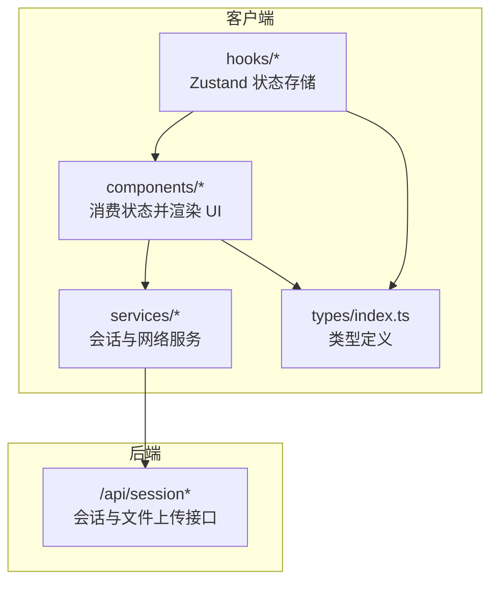
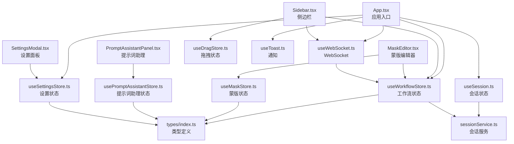
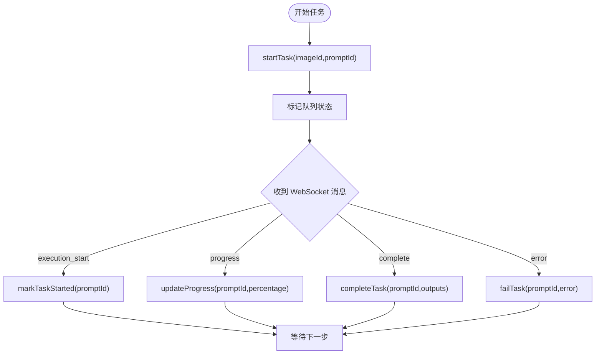
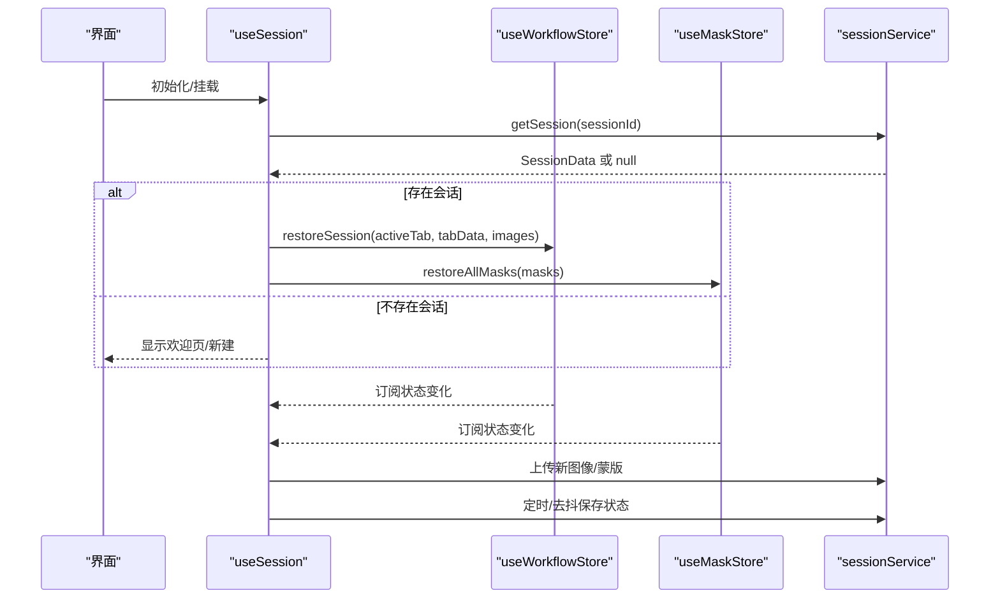
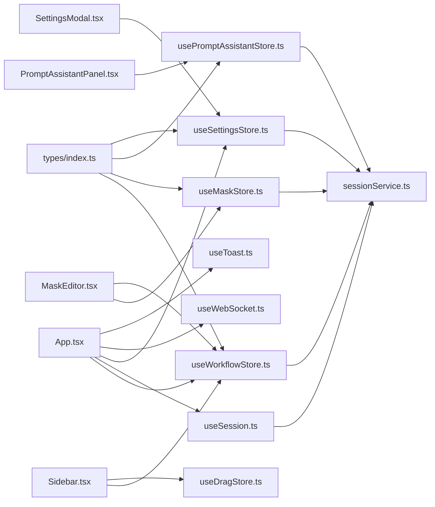

# 状态管理系统

<cite>
**本文引用的文件**
- [useSession.ts](file://client/src/hooks/useSession.ts)
- [useSettingsStore.ts](file://client/src/hooks/useSettingsStore.ts)
- [usePromptAssistantStore.ts](file://client/src/hooks/usePromptAssistantStore.ts)
- [useMaskStore.ts](file://client/src/hooks/useMaskStore.ts)
- [useWorkflowStore.ts](file://client/src/hooks/useWorkflowStore.ts)
- [sessionService.ts](file://client/src/services/sessionService.ts)
- [index.ts](file://client/src/types/index.ts)
- [useDragStore.ts](file://client/src/hooks/useDragStore.ts)
- [useToast.ts](file://client/src/hooks/useToast.ts)
- [useWebSocket.ts](file://client/src/hooks/useWebSocket.ts)
- [App.tsx](file://client/src/components/App.tsx)
- [Sidebar.tsx](file://client/src/components/Sidebar.tsx)
- [MaskEditor.tsx](file://client/src/components/MaskEditor.tsx)
- [PromptAssistantPanel.tsx](file://client/src/components/PromptAssistantPanel.tsx)
- [SettingsModal.tsx](file://client/src/components/SettingsModal.tsx)
</cite>

## 目录
1. [简介](#简介)
2. [项目结构](#项目结构)
3. [核心组件](#核心组件)
4. [架构总览](#架构总览)
5. [详细组件分析](#详细组件分析)
6. [依赖关系分析](#依赖关系分析)
7. [性能考量](#性能考量)
8. [故障排查指南](#故障排查指南)
9. [结论](#结论)
10. [附录](#附录)

## 简介
本项目采用轻量级状态管理方案，以 Zustand 为核心，围绕工作流状态、会话状态、设置状态、提示词助理状态与蒙版状态构建模块化状态体系。系统通过 Hook 封装状态逻辑，结合服务层实现状态持久化与跨组件共享；同时提供 WebSocket 订阅、异步状态处理、状态重置与恢复机制，确保复杂工作流场景下的状态一致性与用户体验。

## 项目结构
状态管理相关代码主要分布在以下位置：
- 客户端前端（React + TypeScript）：hooks 目录下定义各状态存储，components 目录下消费状态并驱动 UI。
- 服务层：封装会话持久化 API，负责与后端交互。
- 类型定义：统一数据结构与消息类型，保障状态契约清晰。

**图表来源**
- [useWorkflowStore.ts:1-645](file://client/src/hooks/useWorkflowStore.ts#L1-L645)
- [useSession.ts:1-422](file://client/src/hooks/useSession.ts#L1-L422)
- [sessionService.ts:1-134](file://client/src/services/sessionService.ts#L1-L134)
- [index.ts:1-58](file://client/src/types/index.ts#L1-L58)

**章节来源**
- [useWorkflowStore.ts:1-645](file://client/src/hooks/useWorkflowStore.ts#L1-L645)
- [useSession.ts:1-422](file://client/src/hooks/useSession.ts#L1-L422)
- [sessionService.ts:1-134](file://client/src/services/sessionService.ts#L1-L134)
- [index.ts:1-58](file://client/src/types/index.ts#L1-L58)

## 核心组件
- 工作流状态（Workflow Store）
  - 管理多标签页的图像列表、提示词、任务进度与输出、选择态、配置等。
  - 提供任务生命周期管理（开始、进度、完成、失败、重置）与批量操作。
  - 支持会话恢复与“闪动”高亮等辅助功能。
- 会话状态（Session）
  - 负责会话 ID 管理、本地持久化、自动保存、文件上传与下载、空会话清理。
  - 通过订阅工作流与蒙版状态变化，实现增量保存与同步。
- 设置状态（Settings）
  - 维护启动行为与反推模型等用户偏好，持久化到 localStorage。
- 提示词助理状态（Prompt Assistant）
  - 控制面板开关、活动模式与会话键，支持多种提示词生成模式。
- 蒙版状态（Mask）
  - 存储每个图像的蒙版像素数据与编辑器状态，支持打开/关闭编辑器与批量恢复。
- 其他支撑状态
  - 拖拽状态（Drag）、通知（Toast）、WebSocket 连接与消息分发。

**章节来源**
- [useWorkflowStore.ts:35-88](file://client/src/hooks/useWorkflowStore.ts#L35-L88)
- [useSession.ts:116-422](file://client/src/hooks/useSession.ts#L116-L422)
- [useSettingsStore.ts:1-31](file://client/src/hooks/useSettingsStore.ts#L1-L31)
- [usePromptAssistantStore.ts:1-33](file://client/src/hooks/usePromptAssistantStore.ts#L1-L33)
- [useMaskStore.ts:21-51](file://client/src/hooks/useMaskStore.ts#L21-L51)
- [useDragStore.ts:1-17](file://client/src/hooks/useDragStore.ts#L1-L17)
- [useToast.ts:1-33](file://client/src/hooks/useToast.ts#L1-L33)
- [useWebSocket.ts:1-99](file://client/src/hooks/useWebSocket.ts#L1-L99)

## 架构总览
Zustand 状态通过 Hook 暴露给组件，组件直接读取与更新状态；服务层负责与后端交互，实现状态持久化与文件上传/下载。WebSocket 作为外部事件源，将进度、完成、错误等消息注入工作流状态，形成异步状态处理闭环。

**图表来源**
- [App.tsx:1-335](file://client/src/components/App.tsx#L1-L335)
- [Sidebar.tsx:1-425](file://client/src/components/Sidebar.tsx#L1-L425)
- [MaskEditor.tsx:1-375](file://client/src/components/MaskEditor.tsx#L1-L375)
- [PromptAssistantPanel.tsx:1-139](file://client/src/components/PromptAssistantPanel.tsx#L1-L139)
- [SettingsModal.tsx:1-238](file://client/src/components/SettingsModal.tsx#L1-L238)
- [useWorkflowStore.ts:1-645](file://client/src/hooks/useWorkflowStore.ts#L1-L645)
- [useSession.ts:1-422](file://client/src/hooks/useSession.ts#L1-L422)
- [useSettingsStore.ts:1-31](file://client/src/hooks/useSettingsStore.ts#L1-L31)
- [useMaskStore.ts:1-51](file://client/src/hooks/useMaskStore.ts#L1-L51)
- [usePromptAssistantStore.ts:1-33](file://client/src/hooks/usePromptAssistantStore.ts#L1-L33)
- [useDragStore.ts:1-17](file://client/src/hooks/useDragStore.ts#L1-L17)
- [useToast.ts:1-33](file://client/src/hooks/useToast.ts#L1-L33)
- [useWebSocket.ts:1-99](file://client/src/hooks/useWebSocket.ts#L1-L99)
- [sessionService.ts:1-134](file://client/src/services/sessionService.ts#L1-L134)
- [index.ts:1-58](file://client/src/types/index.ts#L1-L58)

## 详细组件分析

### 工作流状态（Workflow Store）
- 设计要点
  - 多标签页 TabData 结构化存储图像、提示词、任务、索引与配置。
  - 任务状态机：idle/uploading/queued/processing/done/error，支持批量更新与跨标签搜索定位。
  - 原子性更新：通过 setState 的不可变合并策略，避免部分字段遗漏导致的数据不一致。
  - 会话恢复：restoreSession 将序列化数据映射为运行时状态，兼容不同标签页差异。
- 关键流程
  - 添加/删除图像、批量选择、切换姿态、设置人脸交换区域等。
  - 任务生命周期：startTask/markTaskStarted/updateProgress/completeTask/failTask/resetTask/removeOutput。
  - 文本生成卡（Text2Img/ZIT）添加，生成占位文件以保证会话上传/恢复正常。
- 性能与可靠性
  - 避免不必要的深层拷贝，仅对变更字段进行浅合并。
  - 对输出数组进行就地更新，减少对象重建成本。
  - 通过 isProcessing 快速判断是否处于处理中，优化 UI 渲染。

**图表来源**
- [useWorkflowStore.ts:377-500](file://client/src/hooks/useWorkflowStore.ts#L377-L500)
- [useWebSocket.ts:26-47](file://client/src/hooks/useWebSocket.ts#L26-L47)

**章节来源**
- [useWorkflowStore.ts:35-645](file://client/src/hooks/useWorkflowStore.ts#L35-L645)
- [index.ts:17-25](file://client/src/types/index.ts#L17-L25)

### 会话状态（Session）
- 设计要点
  - 会话 ID 本地持久化，首次使用自动生成；支持命名与切换。
  - 自动保存：订阅工作流与蒙版状态变化，去抖保存，避免频繁 IO。
  - 文件上传：图像与蒙版分别上传至对应目录，保存 sessionUrl 以便后续恢复。
  - 恢复策略：根据启动行为（恢复/新建/欢迎页）决定加载逻辑；空会话清理。
  - 原子性：保存前序列化状态，保存后更新时间戳；beforeunload 使用 Beacon 强制提交。
- 关键流程
  - 新建会话：清空当前状态，重置上传与保存记录。
  - 挂载恢复：拉取会话元数据，按标签页恢复图像与蒙版，更新 store。
  - 文件同步：检测新增图像与蒙版，异步上传并回填 sessionUrl/键值。

**图表来源**
- [useSession.ts:184-265](file://client/src/hooks/useSession.ts#L184-L265)
- [sessionService.ts:69-133](file://client/src/services/sessionService.ts#L69-L133)
- [useWorkflowStore.ts:600-636](file://client/src/hooks/useWorkflowStore.ts#L600-L636)
- [useMaskStore.ts:29-30](file://client/src/hooks/useMaskStore.ts#L29-L30)

**章节来源**
- [useSession.ts:116-422](file://client/src/hooks/useSession.ts#L116-L422)
- [sessionService.ts:1-134](file://client/src/services/sessionService.ts#L1-L134)

### 设置状态（Settings）
- 设计要点
  - 用户偏好（反推模型、启动行为）持久化到 localStorage，初始化时从本地读取。
  - 开关面板状态独立管理，便于弹窗控制。
- 最佳实践
  - 修改设置后立即同步到本地存储与状态，避免刷新丢失。
  - 在设置面板中提供即时反馈（如分段控件），提升交互体验。

**章节来源**
- [useSettingsStore.ts:1-31](file://client/src/hooks/useSettingsStore.ts#L1-L31)

### 提示词助理状态（Prompt Assistant）
- 设计要点
  - 面板开关、活动模式与初始文本管理；sessionKey 用于强制重新渲染面板内容。
  - 支持多种模式（转换、变体、细节、后续场景、分镜、标签合成）。
- 使用建议
  - 通过 openPanel(initialText?) 触发面板，结合 sessionKey 避免旧内容残留。
  - setMode 切换模式时保持初始文本上下文。

**章节来源**
- [usePromptAssistantStore.ts:1-33](file://client/src/hooks/usePromptAssistantStore.ts#L1-L33)
- [PromptAssistantPanel.tsx:1-139](file://client/src/components/PromptAssistantPanel.tsx#L1-L139)

### 蒙版状态（Mask）
- 设计要点
  - MaskEntry 存储 RGBA 像素数据与尺寸信息；支持按 key（图像ID:输出索引）存取。
  - 编辑器状态包含原始图、结果图（可选）与模式（A/B），用于导出混合结果。
  - 恢复：一次性恢复所有蒙版，简化挂载阶段的初始化。
- 数据结构复杂度
  - 存取：O(1) 字典访问；像素数据为一维 Uint8ClampedArray，空间紧凑。
  - 更新：浅合并 masks 字典，避免深层遍历。

**章节来源**
- [useMaskStore.ts:1-51](file://client/src/hooks/useMaskStore.ts#L1-L51)
- [MaskEditor.tsx:1-375](file://client/src/components/MaskEditor.tsx#L1-L375)

### 拖拽与通知、WebSocket
- 拖拽状态（Drag）
  - 统一卡片与输出拖拽状态，避免跨组件重复逻辑。
- 通知（Toast）
  - 全局监听器广播消息，组件订阅展示；带退出动画与定时清理。
- WebSocket
  - 单例连接，自动重连；按需订阅，消息到达后统一更新工作流状态。

**章节来源**
- [useDragStore.ts:1-17](file://client/src/hooks/useDragStore.ts#L1-L17)
- [useToast.ts:1-33](file://client/src/hooks/useToast.ts#L1-L33)
- [useWebSocket.ts:1-99](file://client/src/hooks/useWebSocket.ts#L1-L99)

## 依赖关系分析
- 组件与状态
  - App.tsx 作为根组件，订阅工作流与会话状态，驱动主界面与底部状态条。
  - Sidebar 依赖工作流与拖拽状态，实现标签切换、拖放复制与队列面板。
  - MaskEditor 依赖蒙版与工作流状态，实现蒙版绘制、自动识别与导出。
  - PromptAssistantPanel 与 SettingsModal 分别消费提示词助理与设置状态。
- 状态间耦合
  - 工作流状态与会话状态通过订阅建立弱耦合：会话监听工作流与蒙版变化，实现无侵入的持久化。
  - WebSocket 作为外部事件源，仅与工作流状态交互，保持状态中心单一。
- 外部依赖
  - sessionService.ts 封装 /api/session* 接口，提供上传图像/蒙版、保存/加载会话、列出与删除会话的能力。
  - 类型定义 index.ts 统一任务状态、消息格式与图像项结构，降低耦合风险。

**图表来源**
- [App.tsx:1-335](file://client/src/components/App.tsx#L1-L335)
- [Sidebar.tsx:1-425](file://client/src/components/Sidebar.tsx#L1-L425)
- [MaskEditor.tsx:1-375](file://client/src/components/MaskEditor.tsx#L1-L375)
- [PromptAssistantPanel.tsx:1-139](file://client/src/components/PromptAssistantPanel.tsx#L1-L139)
- [SettingsModal.tsx:1-238](file://client/src/components/SettingsModal.tsx#L1-L238)
- [useWorkflowStore.ts:1-645](file://client/src/hooks/useWorkflowStore.ts#L1-L645)
- [useSession.ts:1-422](file://client/src/hooks/useSession.ts#L1-L422)
- [useSettingsStore.ts:1-31](file://client/src/hooks/useSettingsStore.ts#L1-L31)
- [useMaskStore.ts:1-51](file://client/src/hooks/useMaskStore.ts#L1-L51)
- [usePromptAssistantStore.ts:1-33](file://client/src/hooks/usePromptAssistantStore.ts#L1-L33)
- [useDragStore.ts:1-17](file://client/src/hooks/useDragStore.ts#L1-L17)
- [useToast.ts:1-33](file://client/src/hooks/useToast.ts#L1-L33)
- [useWebSocket.ts:1-99](file://client/src/hooks/useWebSocket.ts#L1-L99)
- [sessionService.ts:1-134](file://client/src/services/sessionService.ts#L1-L134)
- [index.ts:1-58](file://client/src/types/index.ts#L1-L58)

**章节来源**
- [App.tsx:1-335](file://client/src/components/App.tsx#L1-L335)
- [Sidebar.tsx:1-425](file://client/src/components/Sidebar.tsx#L1-L425)
- [MaskEditor.tsx:1-375](file://client/src/components/MaskEditor.tsx#L1-L375)
- [PromptAssistantPanel.tsx:1-139](file://client/src/components/PromptAssistantPanel.tsx#L1-L139)
- [SettingsModal.tsx:1-238](file://client/src/components/SettingsModal.tsx#L1-L238)
- [sessionService.ts:1-134](file://client/src/services/sessionService.ts#L1-L134)
- [index.ts:1-58](file://client/src/types/index.ts#L1-L58)

## 性能考量
- 状态更新原子性
  - 使用 setState 的不可变合并策略，避免部分字段遗漏；对任务输出数组采用就地更新，减少对象重建。
- 订阅与去抖
  - 会话保存采用 500ms 去抖，合并短时间内多次变更；上传图像与蒙版使用异步回调回填，避免阻塞主线程。
- 内存管理
  - 图像预览 URL 通过 revokeObjectURL 释放；空会话清理与 beforeunload 强制提交，防止资源泄漏。
- 渲染优化
  - 组件按需订阅状态片段（如 images、activeTab），避免无关重渲染；拖拽与通知使用稳定回调，减少副作用。

## 故障排查指南
- 会话恢复失败
  - 检查 getSession 返回值与启动行为设置；确认 /api/session/* 接口可用。
  - 查看控制台警告与异常堆栈，定位上传/下载失败的具体键值。
- WebSocket 不生效
  - 确认 /ws 地址协议与主机正确；检查 onclose 是否触发自动重连。
  - 核对消息类型与 promptId 是否匹配，避免跨标签页误更新。
- 蒙版保存未生效
  - 确认蒙版编辑器已关闭并触发 setMask；检查上传接口返回状态码。
- 空会话被删除
  - beforeunload 会在空会话时发送 DELETE 请求；若需要保留，请在保存后再清空。

**章节来源**
- [useSession.ts:389-418](file://client/src/hooks/useSession.ts#L389-L418)
- [useWebSocket.ts:53-73](file://client/src/hooks/useWebSocket.ts#L53-L73)
- [useMaskStore.ts:47-49](file://client/src/hooks/useMaskStore.ts#L47-L49)

## 结论
本项目以 Zustand 为核心，构建了模块化、可扩展且易于维护的状态管理体系。通过明确的职责划分与严格的订阅/去抖策略，实现了工作流状态、会话状态、设置状态、提示词助理状态与蒙版状态的协同运作。配合服务层与 WebSocket，系统在复杂业务场景下仍能保持良好的响应性与一致性。建议在后续迭代中进一步完善错误边界与日志埋点，持续优化性能与可观测性。

## 附录
- Hook 使用模式
  - 读取状态：const images = useWorkflowStore(s => s.tabData[s.activeTab].images)
  - 更新状态：useWorkflowStore.getState().addImages(files)
  - 订阅状态：useEffect(() => useWorkflowStore.subscribe(cb))
- 最佳实践
  - 将 UI 与状态解耦，尽量通过 Hook 暴露最小必要片段。
  - 对异步操作使用去抖与防抖，避免频繁 IO。
  - 对大对象（如蒙版像素）采用浅拷贝策略，减少深拷贝成本。
  - 在组件卸载时清理定时器与事件监听，防止内存泄漏。