# 路由与导航设计

<cite>
**本文档引用的文件**
- [main.tsx](file://client/src/main.tsx)
- [App.tsx](file://client/src/components/App.tsx)
- [Sidebar.tsx](file://client/src/components/Sidebar.tsx)
- [useWorkflowStore.ts](file://client/src/hooks/useWorkflowStore.ts)
- [useSession.ts](file://client/src/hooks/useSession.ts)
- [WelcomePage.tsx](file://client/src/components/WelcomePage.tsx)
- [sessionService.ts](file://client/src/services/sessionService.ts)
- [vite.config.ts](file://client/vite.config.ts)
- [index.ts](file://server/src/index.ts)
- [session.ts](file://server/src/routes/session.ts)
- [workflow.ts](file://server/src/routes/workflow.ts)
- [output.ts](file://server/src/routes/output.ts)
- [comfyui.ts](file://server/src/services/comfyui.ts)
- [sessionManager.ts](file://server/src/services/sessionManager.ts)
- [index.ts](file://server/src/adapters/index.ts)
- [BaseAdapter.ts](file://server/src/adapters/BaseAdapter.ts)
- [Workflow0Adapter.ts](file://server/src/adapters/Workflow0Adapter.ts)
- [Workflow1Adapter.ts](file://server/src/adapters/Workflow1Adapter.ts)
- [Workflow2Adapter.ts](file://server/src/adapters/Workflow2Adapter.ts)
- [Workflow3Adapter.ts](file://server/src/adapters/Workflow3Adapter.ts)
- [Workflow4Adapter.ts](file://server/src/adapters/Workflow4Adapter.ts)
- [Workflow5Adapter.ts](file://server/src/adapters/Workflow5Adapter.ts)
- [Workflow6Adapter.ts](file://server/src/adapters/Workflow6Adapter.ts)
- [Workflow7Adapter.ts](file://server/src/adapters/Workflow7Adapter.ts)
- [Workflow8Adapter.ts](file://server/src/adapters/Workflow8Adapter.ts)
- [Workflow9Adapter.ts](file://server/src/adapters/Workflow9Adapter.ts)
</cite>

## 目录
1. [引言](#引言)
2. [项目结构](#项目结构)
3. [核心组件](#核心组件)
4. [架构概览](#架构概览)
5. [详细组件分析](#详细组件分析)
6. [依赖关系分析](#依赖关系分析)
7. [性能考虑](#性能考虑)
8. [故障排除指南](#故障排除指南)
9. [结论](#结论)

## 引言

Pix2Real 是一个基于 React 和 TypeScript 的图像处理应用，采用前端单页应用架构。本项目通过自定义的状态管理和会话持久化机制实现了完整的路由与导航功能，无需传统前端路由库即可实现页面级导航和状态管理。

该应用的核心设计理念是"工作流驱动的导航"，通过工作流标签页（Workflow Tabs）作为主要导航载体，每个工作流对应不同的图像处理功能。应用提供了会话级别的导航状态管理，支持会话的创建、加载、切换和持久化。

## 项目结构

### 前端架构概览

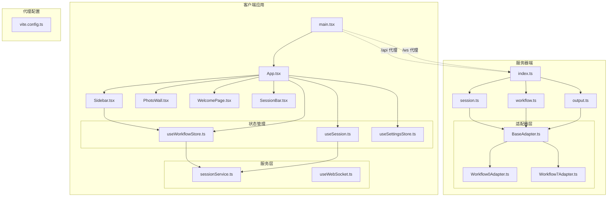

**图表来源**
- [main.tsx:1-11](file://client/src/main.tsx#L1-L11)
- [App.tsx:54-335](file://client/src/components/App.tsx#L54-L335)
- [Sidebar.tsx:30-425](file://client/src/components/Sidebar.tsx#L30-L425)
- [vite.config.ts:4-19](file://client/vite.config.ts#L4-L19)

### 工作流导航结构

应用定义了10个工作流标签页，每个标签页代表不同的图像处理功能：

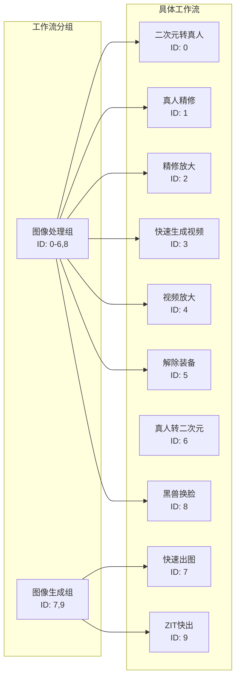

**图表来源**
- [useWorkflowStore.ts:6-17](file://client/src/hooks/useWorkflowStore.ts#L6-L17)
- [Sidebar.tsx:11-15](file://client/src/components/Sidebar.tsx#L11-L15)

**章节来源**
- [main.tsx:1-11](file://client/src/main.tsx#L1-L11)
- [App.tsx:54-335](file://client/src/components/App.tsx#L54-L335)
- [Sidebar.tsx:30-425](file://client/src/components/Sidebar.tsx#L30-L425)

## 核心组件

### 应用主组件 (App)

App.tsx 是整个应用的根组件，负责协调所有子组件和状态管理：

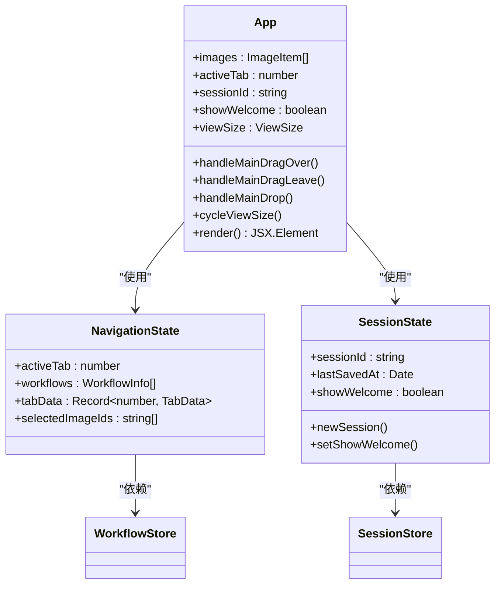

**图表来源**
- [App.tsx:54-335](file://client/src/components/App.tsx#L54-L335)
- [useWorkflowStore.ts:35-88](file://client/src/hooks/useWorkflowStore.ts#L35-L88)
- [useSession.ts:108-114](file://client/src/hooks/useSession.ts#L108-L114)

### 工作流状态管理

工作流状态管理通过 Zustand 实现，提供响应式的状态更新和计算属性：

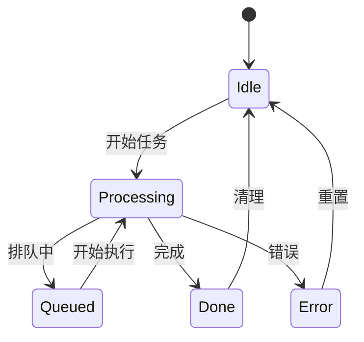

**图表来源**
- [useWorkflowStore.ts:197-283](file://client/src/hooks/useWorkflowStore.ts#L197-L283)
- [useWorkflowStore.ts:377-500](file://client/src/hooks/useWorkflowStore.ts#L377-L500)

**章节来源**
- [App.tsx:54-335](file://client/src/components/App.tsx#L54-L335)
- [useWorkflowStore.ts:96-645](file://client/src/hooks/useWorkflowStore.ts#L96-L645)
- [useSession.ts:116-422](file://client/src/hooks/useSession.ts#L116-L422)

## 架构概览

### 导航架构设计

Pix2Real 采用了独特的导航架构，通过工作流标签页实现页面级导航：

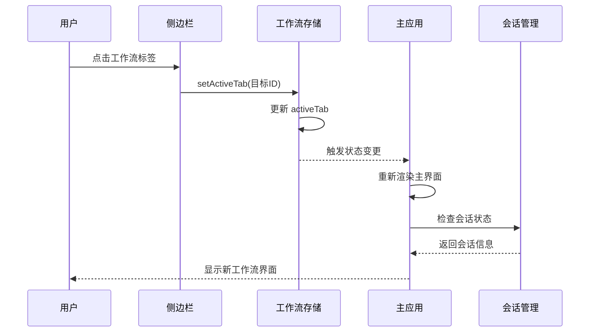

**图表来源**
- [Sidebar.tsx:285](file://client/src/components/Sidebar.tsx#L285)
- [useWorkflowStore.ts:115](file://client/src/hooks/useWorkflowStore.ts#L115)
- [App.tsx:208-279](file://client/src/components/App.tsx#L208-L279)

### 会话导航流程

应用的会话导航通过欢迎页面实现，支持会话的创建、加载和切换：

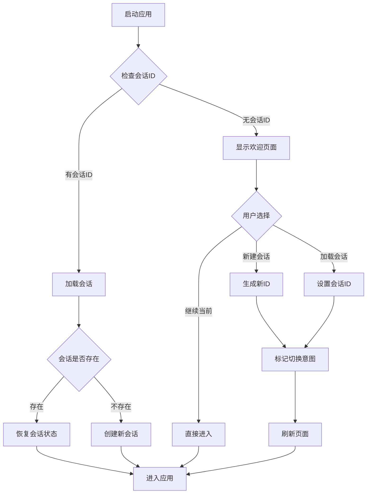

**图表来源**
- [WelcomePage.tsx:104-112](file://client/src/components/WelcomePage.tsx#L104-L112)
- [useSession.ts:290-387](file://client/src/hooks/useSession.ts#L290-L387)

**章节来源**
- [Sidebar.tsx:285-347](file://client/src/components/Sidebar.tsx#L285-L347)
- [WelcomePage.tsx:59-470](file://client/src/components/WelcomePage.tsx#L59-L470)
- [useSession.ts:116-422](file://client/src/hooks/useSession.ts#L116-L422)

## 详细组件分析

### 侧边栏导航组件

Sidebar.tsx 实现了主要的导航功能，包括工作流切换、拖拽操作和队列管理：

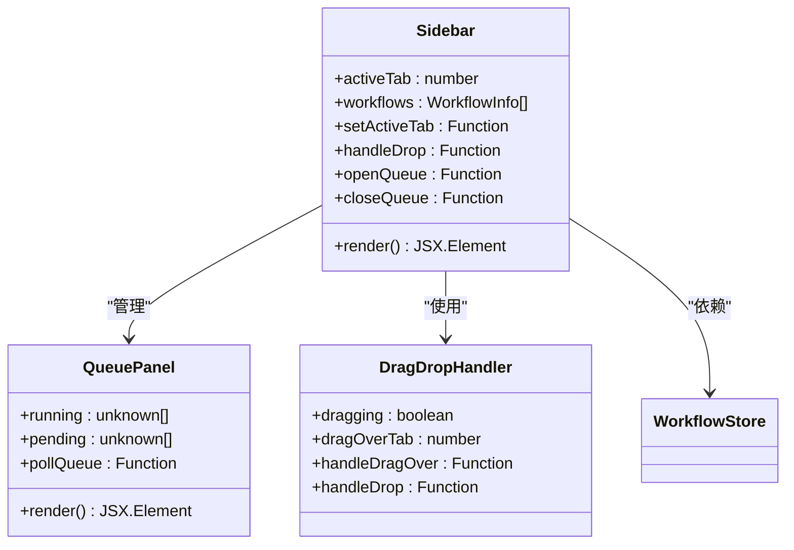

**图表来源**
- [Sidebar.tsx:30-425](file://client/src/components/Sidebar.tsx#L30-L425)
- [Sidebar.tsx:124-209](file://client/src/components/Sidebar.tsx#L124-L209)

#### 工作流切换机制

工作流切换通过简单的状态更新实现，支持动画指示器和拖拽反馈：

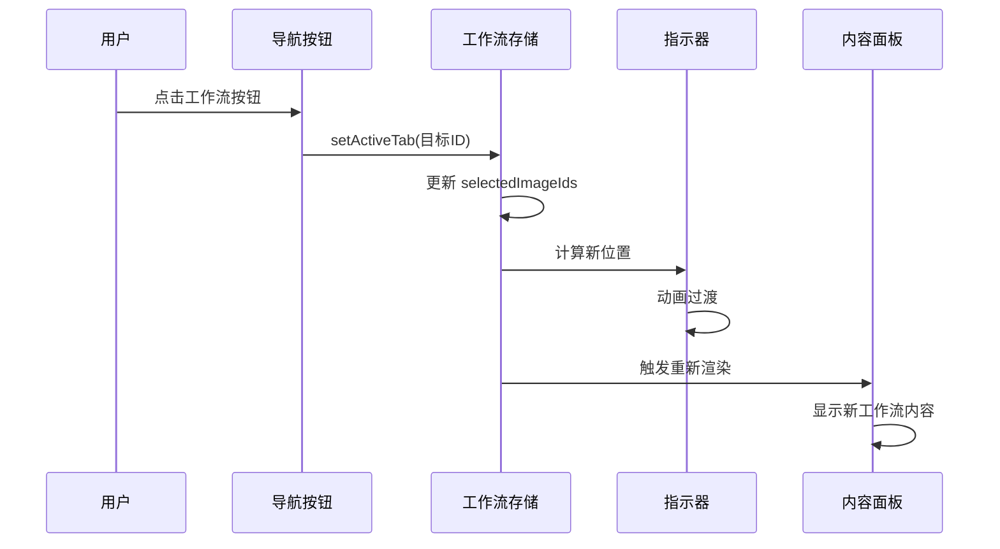

**图表来源**
- [Sidebar.tsx:285](file://client/src/components/Sidebar.tsx#L285)
- [useWorkflowStore.ts:115](file://client/src/hooks/useWorkflowStore.ts#L115)
- [Sidebar.tsx:84-96](file://client/src/components/Sidebar.tsx#L84-L96)

**章节来源**
- [Sidebar.tsx:30-425](file://client/src/components/Sidebar.tsx#L30-L425)
- [useWorkflowStore.ts:96-130](file://client/src/hooks/useWorkflowStore.ts#L96-L130)

### 会话管理系统

会话管理实现了完整的生命周期管理，包括创建、恢复、保存和清理：

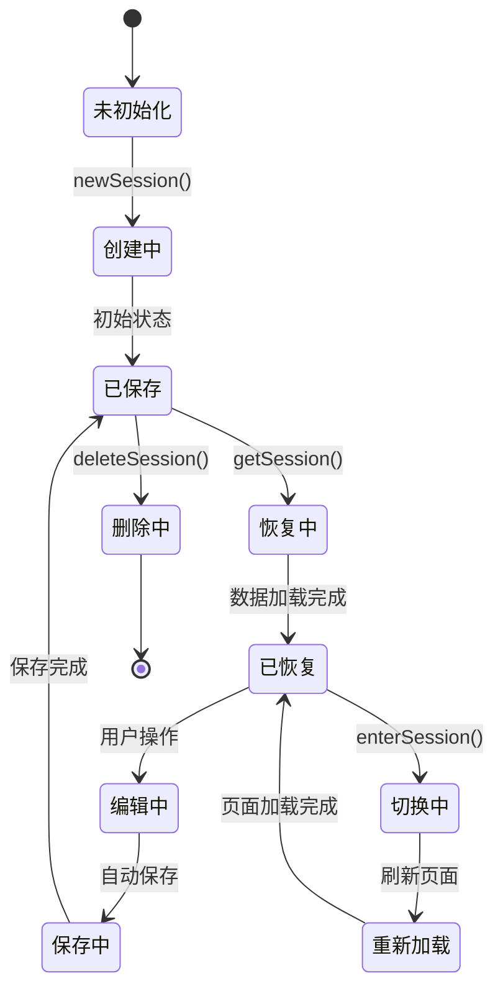

**图表来源**
- [useSession.ts:164-175](file://client/src/hooks/useSession.ts#L164-L175)
- [useSession.ts:268-288](file://client/src/hooks/useSession.ts#L268-L288)
- [WelcomePage.tsx:108-112](file://client/src/components/WelcomePage.tsx#L108-L112)

#### 会话持久化机制

会话数据通过分层存储策略实现高效持久化：

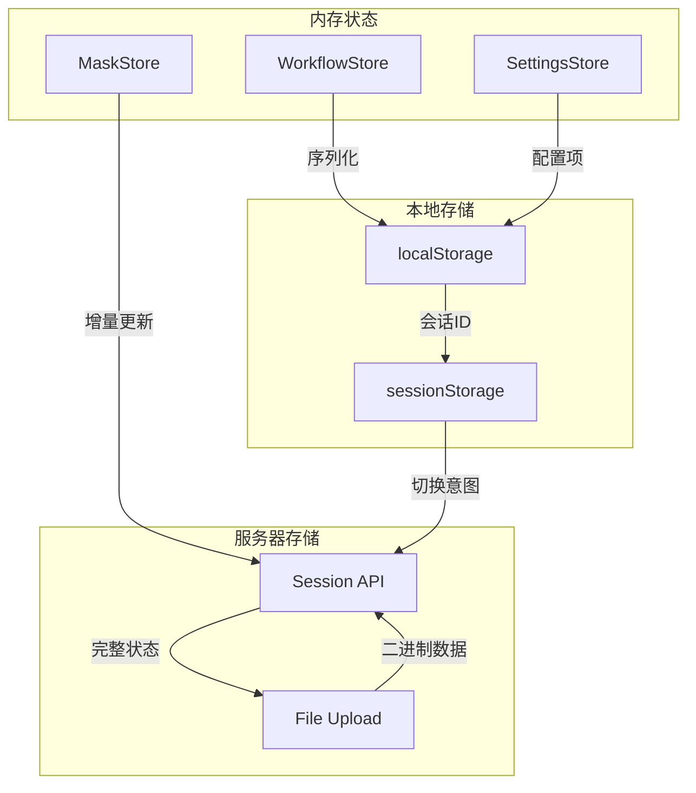

**图表来源**
- [sessionService.ts:102-121](file://client/src/services/sessionService.ts#L102-L121)
- [useSession.ts:138-162](file://client/src/hooks/useSession.ts#L138-L162)

**章节来源**
- [useSession.ts:116-422](file://client/src/hooks/useSession.ts#L116-L422)
- [sessionService.ts:1-134](file://client/src/services/sessionService.ts#L1-134)

### 欢迎页面导航

欢迎页面提供了会话选择和管理界面：

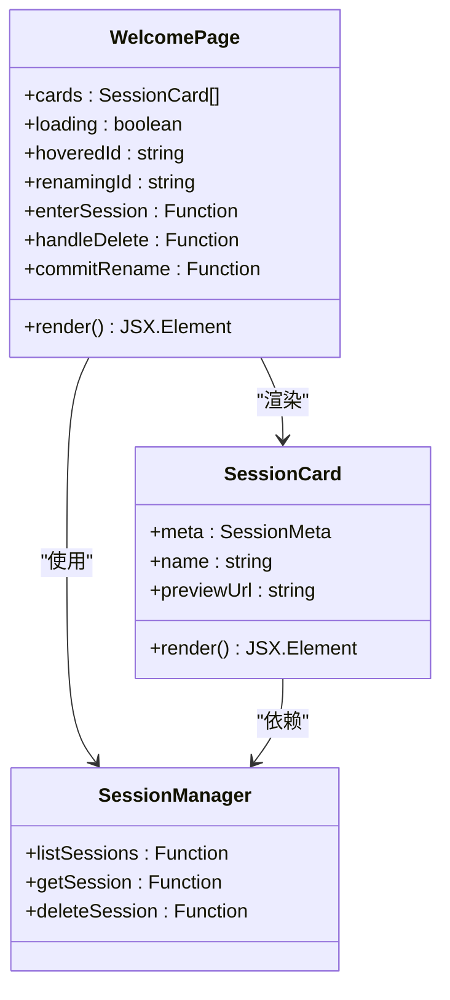

**图表来源**
- [WelcomePage.tsx:59-470](file://client/src/components/WelcomePage.tsx#L59-L470)
- [WelcomePage.tsx:108-112](file://client/src/components/WelcomePage.tsx#L108-L112)

**章节来源**
- [WelcomePage.tsx:59-470](file://client/src/components/WelcomePage.tsx#L59-L470)

## 依赖关系分析

### 前端依赖关系

```mermaid
graph TD
subgraph "核心依赖"
A[React 19.0.0]
B[zustand 5.0.0]
C[lucide-react 0.468.0]
end
subgraph "构建工具"
D[Vite 6.0.0]
E[@vitejs/plugin-react]
F[TypeScript 5.7.0]
end
subgraph "应用模块"
G[main.tsx]
H[App.tsx]
I[Sidebar.tsx]
J[useWorkflowStore.ts]
K[useSession.ts]
L[WelcomePage.tsx]
end
G --> A
H --> A
I --> A
J --> B
K --> B
L --> A
G --> D
H --> D
I --> D
J --> F
K --> F
L --> F
```

**图表来源**
- [package.json:11-24](file://client/package.json#L11-L24)
- [vite.config.ts:1-20](file://client/vite.config.ts#L1-L20)

### 服务器端集成

应用通过 Vite 代理实现前后端分离架构：

```mermaid
graph LR
subgraph "开发环境"
A[前端 Vite 服务器<br/>:5173]
B[后端 Express 服务器<br/>:3000]
end
subgraph "代理配置"
C[/api -> :3000]
D[/ws -> :3000 (WebSocket)]
end
A -.->|HTTP 请求| C
C -.->|转发| B
A -.->|WebSocket| D
D -.->|转发| B
```

**图表来源**
- [vite.config.ts:6-18](file://client/vite.config.ts#L6-L18)

**章节来源**
- [package.json:11-24](file://client/package.json#L11-L24)
- [vite.config.ts:1-20](file://client/vite.config.ts#L1-L20)

## 性能考虑

### 状态管理优化

应用采用分层状态管理模式，通过以下机制优化性能：

1. **选择性订阅**: 使用 Zustand 的选择器模式，只订阅需要的状态变化
2. **批量更新**: 合并多个状态更新操作，减少重渲染次数
3. **懒加载**: 图像文件使用 URL.createObjectURL 懒加载预览图
4. **内存管理**: 及时释放不再使用的 Blob URL

### 导航性能优化

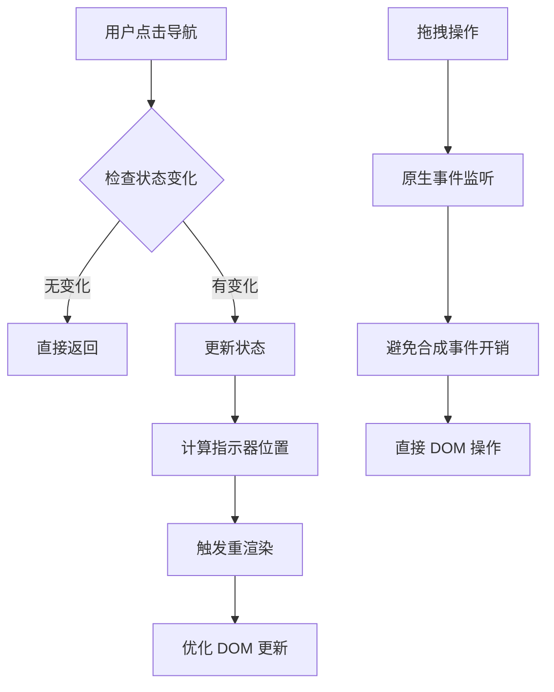

**图表来源**
- [Sidebar.tsx:52-65](file://client/src/components/Sidebar.tsx#L52-L65)
- [useWorkflowStore.ts:115](file://client/src/hooks/useWorkflowStore.ts#L115)

### 缓存策略

应用实现了多层缓存机制：

1. **会话缓存**: localStorage 存储会话标识和配置
2. **图像缓存**: Blob URL 缓存预览图像
3. **队列缓存**: 2秒轮询更新任务队列状态
4. **设置缓存**: 本地存储用户偏好设置

## 故障排除指南

### 常见问题诊断

#### 会话加载失败

**症状**: 欢迎页面显示错误或空白

**可能原因**:
1. 服务器未启动或端口冲突
2. 会话数据损坏或格式错误
3. 浏览器存储空间不足

**解决方案**:
1. 检查服务器日志和网络连接
2. 清除浏览器缓存和存储
3. 验证会话数据完整性

#### 导航状态异常

**症状**: 工作流切换后界面不更新

**可能原因**:
1. Zustand 状态未正确更新
2. React 组件未正确订阅状态变化
3. 事件处理器绑定错误

**解决方案**:
1. 检查状态更新函数调用
2. 验证组件订阅逻辑
3. 确认事件处理器作用域

#### 文件上传问题

**症状**: 图像拖拽或上传失败

**可能原因**:
1. CORS 配置错误
2. 文件大小限制
3. 服务器存储权限问题

**解决方案**:
1. 检查代理配置和服务器响应
2. 验证文件类型和大小
3. 确认服务器存储路径权限

**章节来源**
- [useSession.ts:389-418](file://client/src/hooks/useSession.ts#L389-L418)
- [Sidebar.tsx:124-209](file://client/src/components/Sidebar.tsx#L124-L209)

## 结论

Pix2Real 的路由与导航设计体现了现代前端应用的最佳实践。通过工作流驱动的导航架构，应用实现了：

1. **简洁的导航体验**: 基于工作流标签页的直观导航
2. **强大的状态管理**: 响应式的工作流状态和会话管理
3. **高效的性能表现**: 分层状态管理和优化的渲染策略
4. **可靠的持久化机制**: 多层次的数据持久化和恢复能力

该架构的优势在于其简单性和可控性，避免了复杂路由库带来的额外依赖，同时保持了良好的用户体验和扩展性。通过合理的状态分离和组件职责划分，应用实现了清晰的代码结构和易于维护的架构设计。

未来可以考虑的功能增强包括：
- 添加浏览器历史记录支持
- 实现更精细的权限控制
- 增强错误边界和恢复机制
- 优化移动端导航体验