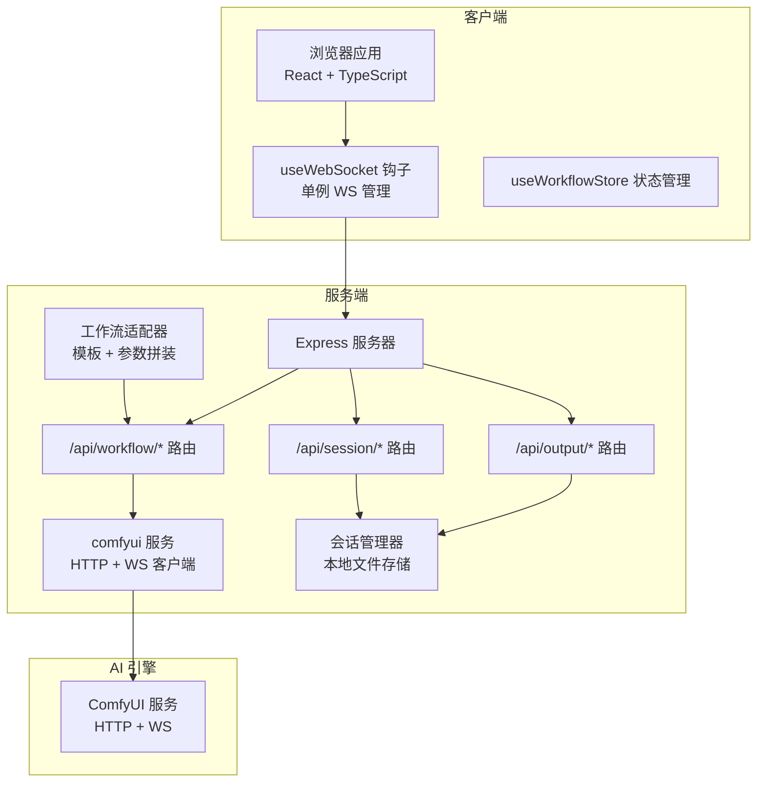
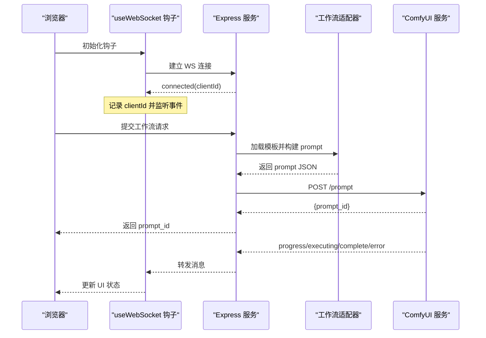
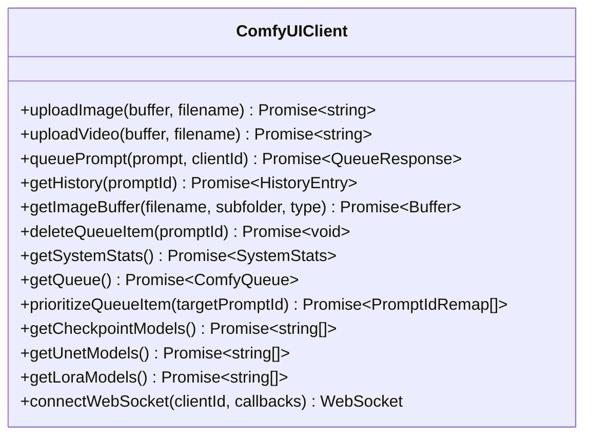
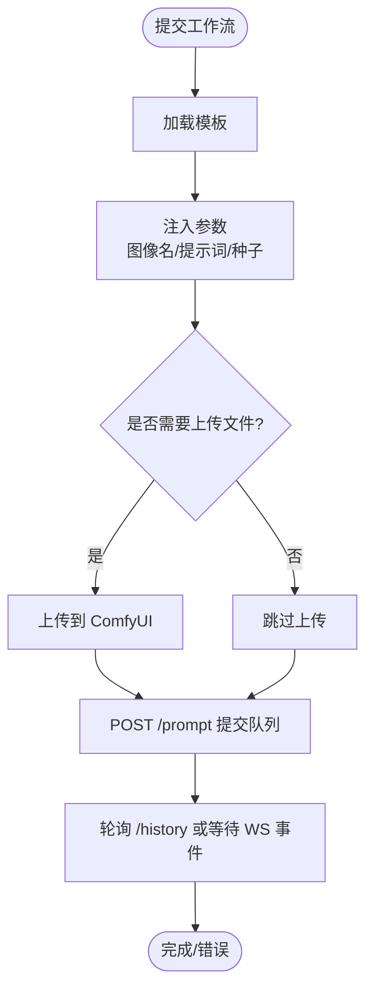
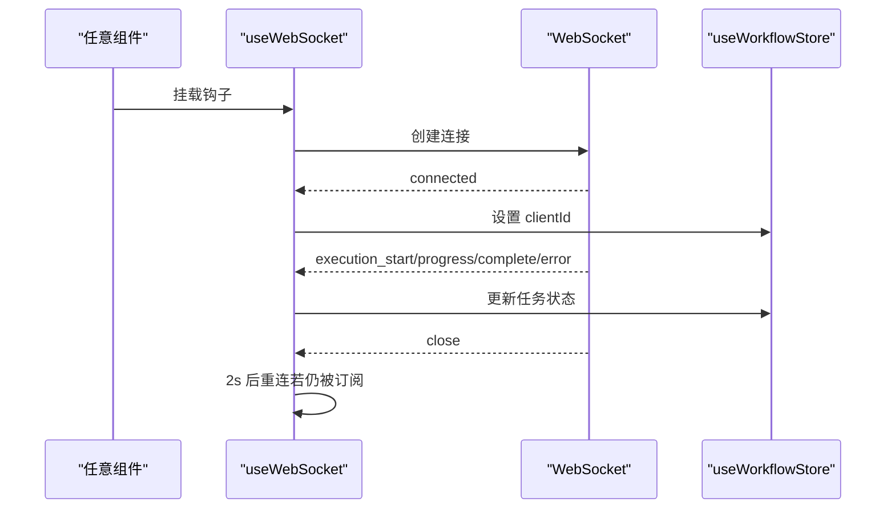
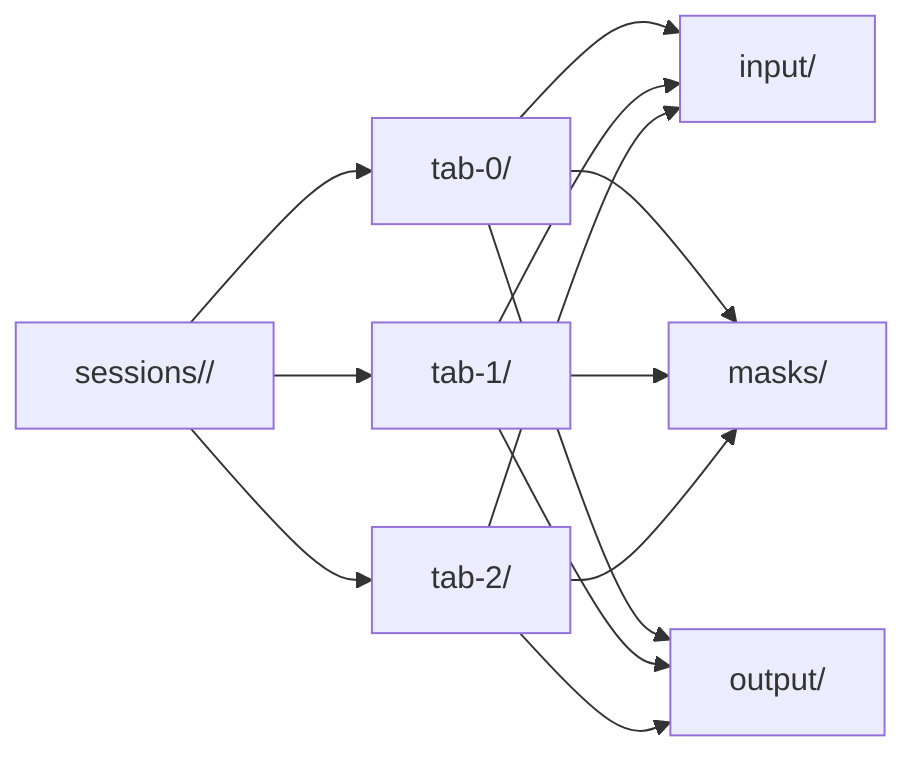
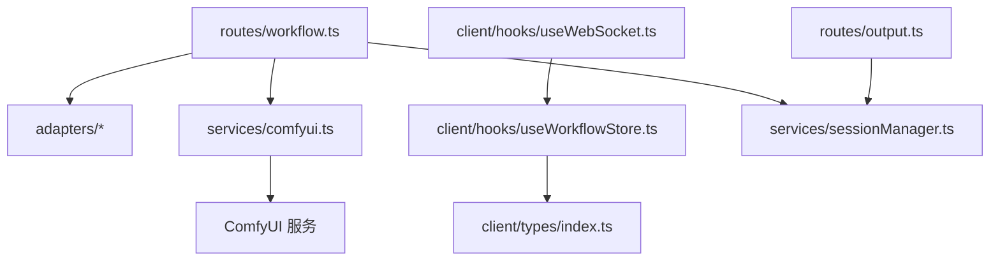

# ComfyUI 集成方案

<cite>
**本文档引用的文件**
- [comfyui.ts](file://server/src/services/comfyui.ts)
- [workflow.ts](file://server/src/routes/workflow.ts)
- [output.ts](file://server/src/routes/output.ts)
- [session.ts](file://server/src/routes/session.ts)
- [index.ts](file://server/src/types/index.ts)
- [sessionManager.ts](file://server/src/services/sessionManager.ts)
- [useWebSocket.ts](file://client/src/hooks/useWebSocket.ts)
- [useWorkflowStore.ts](file://client/src/hooks/useWorkflowStore.ts)
- [index.ts](file://client/src/types/index.ts)
- [README.md](file://README.md)
- [package.json](file://package.json)
</cite>

## 目录
1. [简介](#简介)
2. [项目结构](#项目结构)
3. [核心组件](#核心组件)
4. [架构总览](#架构总览)
5. [详细组件分析](#详细组件分析)
6. [依赖关系分析](#依赖关系分析)
7. [性能考虑](#性能考虑)
8. [故障排除指南](#故障排除指南)
9. [结论](#结论)
10. [附录](#附录)

## 简介
本方案面向 CorineKit Pix2Real 项目，提供与 ComfyUI 的完整集成方案，涵盖 ComfyUI API 调用封装、WebSocket 连接管理、工作流提交流程、历史记录获取、图像缓冲区处理与输出文件下载机制，并给出连接池管理、错误重试策略与超时处理建议，以及性能优化与故障排除指南，帮助开发者快速理解与 AI 引擎的集成架构与通信协议。

## 项目结构
项目采用前后端分离架构：前端使用 React + TypeScript（Vite），后端使用 Express + TypeScript。后端通过适配器模式加载 ComfyUI 工作流模板，动态构建 prompt 并提交到 ComfyUI；前端通过单例 WebSocket 与后端通信，实时接收进度与完成事件。

**图表来源**
- [useWebSocket.ts:1-99](file://client/src/hooks/useWebSocket.ts#L1-L99)
- [useWorkflowStore.ts:1-645](file://client/src/hooks/useWorkflowStore.ts#L1-L645)
- [workflow.ts:1-862](file://server/src/routes/workflow.ts#L1-L862)
- [output.ts:1-134](file://server/src/routes/output.ts#L1-L134)
- [session.ts:1-95](file://server/src/routes/session.ts#L1-L95)
- [comfyui.ts:1-285](file://server/src/services/comfyui.ts#L1-L285)
- [sessionManager.ts:1-164](file://server/src/services/sessionManager.ts#L1-L164)

**章节来源**
- [README.md:41-79](file://README.md#L41-L79)
- [package.json:1-15](file://package.json#L1-L15)

## 核心组件
- 服务端 ComfyUI 客户端：封装上传、队列提交、历史查询、图像获取、系统统计、队列优先级调整等 API。
- 工作流路由：根据工作流 ID 加载模板，注入参数，提交到 ComfyUI，并处理批量执行、内存释放、队列操作等。
- 前端 WebSocket 钩子：单例连接，统一接收进度、开始、完成、错误事件，驱动状态更新。
- 会话管理：在本地磁盘维护会话目录结构，保存输入图像、掩码、输出文件与会话状态。
- 输出路由：提供输出文件列表与下载，支持跨路径打开文件与文件夹。

**章节来源**
- [comfyui.ts:1-285](file://server/src/services/comfyui.ts#L1-L285)
- [workflow.ts:1-862](file://server/src/routes/workflow.ts#L1-L862)
- [useWebSocket.ts:1-99](file://client/src/hooks/useWebSocket.ts#L1-L99)
- [sessionManager.ts:1-164](file://server/src/services/sessionManager.ts#L1-L164)
- [output.ts:1-134](file://server/src/routes/output.ts#L1-L134)

## 架构总览
整体通信链路如下：前端通过单例 WebSocket 与后端建立长连接，后端作为 ComfyUI 的代理，负责模板加载、参数拼装、队列提交与历史轮询，最终将进度与结果通过 WebSocket 推送回前端。

**图表来源**
- [useWebSocket.ts:1-99](file://client/src/hooks/useWebSocket.ts#L1-L99)
- [workflow.ts:1-862](file://server/src/routes/workflow.ts#L1-L862)
- [comfyui.ts:1-285](file://server/src/services/comfyui.ts#L1-L285)

## 详细组件分析

### 服务端 ComfyUI 客户端（comfyui.ts）
- HTTP API 封装
  - 上传图像/视频：支持覆盖写入，返回 ComfyUI 文件名。
  - 提交队列：传入 prompt 与 clientId，返回 prompt_id。
  - 获取历史：按 prompt_id 查询执行状态与输出。
  - 获取图像缓冲区：通过 /view 接口下载二进制数据为 Buffer。
  - 队列管理：删除指定任务、查询当前队列、优先级调整（重新排队）。
  - 系统统计：获取 VRAM/内存使用率。
  - 模型枚举：从对象信息接口读取可用模型列表。
- WebSocket 连接
  - 单连接 per 客户端，解析消息类型，分发进度、执行开始、完成、错误事件。
  - 使用 Set 防止重复触发执行开始与完成事件。
  - 对非 JSON 消息进行容错处理（如二进制预览帧）。

**图表来源**
- [comfyui.ts:1-285](file://server/src/services/comfyui.ts#L1-L285)

**章节来源**
- [comfyui.ts:9-285](file://server/src/services/comfyui.ts#L9-L285)

### 工作流路由（workflow.ts）
- 路由职责
  - 列表与执行：GET /api/workflows，POST /api/workflow/:id/execute。
  - 批量执行：POST /api/workflow/:id/batch。
  - 内存释放：POST /api/workflow/release-memory。
  - 队列操作：GET /api/workflow/queue，POST /api/workflow/queue/prioritize/:promptId，POST /api/workflow/cancel-queue/:promptId。
  - 反推提示词与提示词助理：调用专用模板，轮询历史，读取临时文件返回文本。
  - 系统统计：GET /api/workflow/system-stats。
  - 打开输出目录：POST /api/workflow/:id/open-folder。
- 关键流程
  - 适配器模式：每个工作流对应一个适配器，加载模板并注入参数（图像名、提示词、种子等）。
  - 文件上传：根据工作流类型选择上传图像或视频。
  - 队列优先级：通过删除全部待处理项并重新排队的方式，将目标任务置顶。

**图表来源**
- [workflow.ts:407-455](file://server/src/routes/workflow.ts#L407-L455)
- [workflow.ts:674-744](file://server/src/routes/workflow.ts#L674-L744)

**章节来源**
- [workflow.ts:29-862](file://server/src/routes/workflow.ts#L29-L862)

### 前端 WebSocket 钩子（useWebSocket.ts）
- 单例连接：模块级全局变量确保同一页面只维持一个 WebSocket 实例。
- 自动重连：断线后延迟重连，仅当存在订阅者时重连。
- 事件分发：解析消息类型，更新工作流状态（连接、开始、进度、完成、错误）。

**图表来源**
- [useWebSocket.ts:1-99](file://client/src/hooks/useWebSocket.ts#L1-L99)
- [useWorkflowStore.ts:398-498](file://client/src/hooks/useWorkflowStore.ts#L398-L498)

**章节来源**
- [useWebSocket.ts:1-99](file://client/src/hooks/useWebSocket.ts#L1-L99)
- [useWorkflowStore.ts:357-498](file://client/src/hooks/useWorkflowStore.ts#L357-L498)

### 会话管理（sessionManager.ts）
- 目录结构：每个会话包含多个标签页，每页含 input/masks/output 子目录。
- 文件 I/O：保存输入图像、掩码与输出文件，返回可访问 URL。
- 状态持久化：序列化会话状态（包括任务、提示词、选中输出索引等）到 session.json。
- 清理策略：列出会话并删除最旧的若干个。

**图表来源**
- [sessionManager.ts:10-57](file://server/src/services/sessionManager.ts#L10-L57)

**章节来源**
- [sessionManager.ts:1-164](file://server/src/services/sessionManager.ts#L1-L164)

### 输出路由（output.ts）
- 文件列表：GET /api/output/:workflowId 列出该工作流最近生成的文件。
- 文件下载：GET /api/output/:workflowId/:filename 直接发送文件。
- 打开文件：POST /api/output/open-file 支持多种 URL 形式，跨平台打开默认应用。

**章节来源**
- [output.ts:1-134](file://server/src/routes/output.ts#L1-L134)

### 类型定义（types/index.ts）
- 定义了工作流适配器接口、WebSocket 消息类型、输出文件结构、队列响应与历史条目等。

**章节来源**
- [index.ts:1-52](file://server/src/types/index.ts#L1-L52)
- [index.ts:1-58](file://client/src/types/index.ts#L1-L58)

## 依赖关系分析
- 组件耦合
  - 路由层依赖适配器与 ComfyUI 服务，负责业务编排。
  - 前端钩子与状态管理解耦于后端具体实现，通过消息契约交互。
  - 会话管理独立于 ComfyUI，仅依赖本地文件系统。
- 外部依赖
  - ComfyUI HTTP/WS 接口。
  - 浏览器 WebSocket API。
  - Node.js 文件系统与 child_process（用于打开文件/文件夹）。

**图表来源**
- [workflow.ts:1-862](file://server/src/routes/workflow.ts#L1-L862)
- [comfyui.ts:1-285](file://server/src/services/comfyui.ts#L1-L285)
- [useWebSocket.ts:1-99](file://client/src/hooks/useWebSocket.ts#L1-L99)
- [useWorkflowStore.ts:1-645](file://client/src/hooks/useWorkflowStore.ts#L1-L645)
- [sessionManager.ts:1-164](file://server/src/services/sessionManager.ts#L1-L164)
- [output.ts:1-134](file://server/src/routes/output.ts#L1-L134)

**章节来源**
- [workflow.ts:1-862](file://server/src/routes/workflow.ts#L1-L862)
- [comfyui.ts:1-285](file://server/src/services/comfyui.ts#L1-L285)
- [useWebSocket.ts:1-99](file://client/src/hooks/useWebSocket.ts#L1-L99)
- [useWorkflowStore.ts:1-645](file://client/src/hooks/useWorkflowStore.ts#L1-L645)
- [sessionManager.ts:1-164](file://server/src/services/sessionManager.ts#L1-L164)
- [output.ts:1-134](file://server/src/routes/output.ts#L1-L134)

## 性能考虑
- 连接池与并发
  - 前端使用单例 WebSocket，避免多连接带来的资源浪费与事件竞争。
  - 后端对每个浏览器客户端维护一个 WS 连接，避免重复连接成本。
- 队列优先级
  - 通过删除全部待处理项并重新排队的方式提升特定任务优先级，减少等待时间。
- 图像传输
  - 使用内存存储（multer.memoryStorage）以减少磁盘 IO，适合本地部署场景。
- 轮询策略
  - 反推提示词与提示词助理使用轮询历史，设置合理超时（如 180 秒），避免长时间占用连接。
- 缓冲区处理
  - 通过 /view 接口直接获取二进制缓冲区，避免中间层转换开销。

[本节为通用性能建议，不直接分析具体文件，故无“章节来源”]

## 故障排除指南
- ComfyUI 不可用
  - 现象：系统统计、队列查询、历史轮询返回 502。
  - 处理：检查 ComfyUI 是否运行在默认端口，确认网络连通性。
- WebSocket 断开重连
  - 现象：页面短暂离焦后重连。
  - 处理：前端已内置 2 秒延迟重连，确保组件卸载时正确清理计时器。
- 任务卡在队列
  - 现象：任务长时间未开始。
  - 处理：使用取消队列或优先级调整接口，必要时释放内存。
- 输出文件缺失
  - 现象：无法打开或下载输出文件。
  - 处理：确认输出目录存在且文件未被外部程序占用；使用打开文件接口验证路径。
- 会话状态异常
  - 现象：恢复会话后任务状态不一致。
  - 处理：检查 session.json 结构与字段完整性，必要时清理旧会话。

**章节来源**
- [workflow.ts:532-540](file://server/src/routes/workflow.ts#L532-L540)
- [workflow.ts:522-530](file://server/src/routes/workflow.ts#L522-L530)
- [workflow.ts:571-579](file://server/src/routes/workflow.ts#L571-L579)
- [output.ts:75-131](file://server/src/routes/output.ts#L75-L131)
- [sessionManager.ts:157-163](file://server/src/services/sessionManager.ts#L157-L163)

## 结论
本方案通过适配器模式与单例 WebSocket 设计，实现了与 ComfyUI 的稳定集成：前端实时获知进度与结果，后端负责模板拼装与队列调度，会话管理保障本地持久化能力。结合队列优先级、合理的轮询与缓冲区处理策略，可在本地环境下获得良好的用户体验与性能表现。

[本节为总结性内容，不直接分析具体文件，故无“章节来源”]

## 附录

### API 一览（后端）
- 工作流
  - GET /api/workflows：列出可用工作流。
  - POST /api/workflow/:id/execute：单图执行。
  - POST /api/workflow/:id/batch：批量执行。
  - POST /api/workflow/release-memory：释放内存。
  - GET /api/workflow/queue：查看队列。
  - POST /api/workflow/queue/prioritize/:promptId：置顶优先级。
  - POST /api/workflow/cancel-queue/:promptId：取消队列项。
  - GET /api/workflow/system-stats：系统统计。
  - POST /api/workflow/:id/open-folder：打开输出目录。
  - POST /api/workflow/reverse-prompt：反推提示词。
  - POST /api/workflow/prompt-assistant：提示词助理。
- 输出
  - GET /api/output/:workflowId：列出输出文件。
  - GET /api/output/:workflowId/:filename：下载文件。
  - POST /api/output/open-file：打开文件。
- 会话
  - POST /api/session/:sessionId/images：保存输入图像。
  - POST /api/session/:sessionId/masks：保存掩码。
  - PUT /api/session/:sessionId/state：保存会话状态。
  - GET /api/session/:sessionId：加载会话。
  - GET /api/sessions：列出会话。
  - DELETE /api/session/:sessionId：删除会话。

**章节来源**
- [workflow.ts:29-862](file://server/src/routes/workflow.ts#L29-L862)
- [output.ts:1-134](file://server/src/routes/output.ts#L1-L134)
- [session.ts:1-95](file://server/src/routes/session.ts#L1-L95)

### 前端集成要点
- 使用单例 WebSocket 钩子，确保全局唯一连接。
- 在 store 中维护任务状态映射（imageId ↔ promptId），便于跨标签页同步。
- 对于视频工作流，注意上传类型与模板差异。

**章节来源**
- [useWebSocket.ts:1-99](file://client/src/hooks/useWebSocket.ts#L1-L99)
- [useWorkflowStore.ts:166-195](file://client/src/hooks/useWorkflowStore.ts#L166-L195)