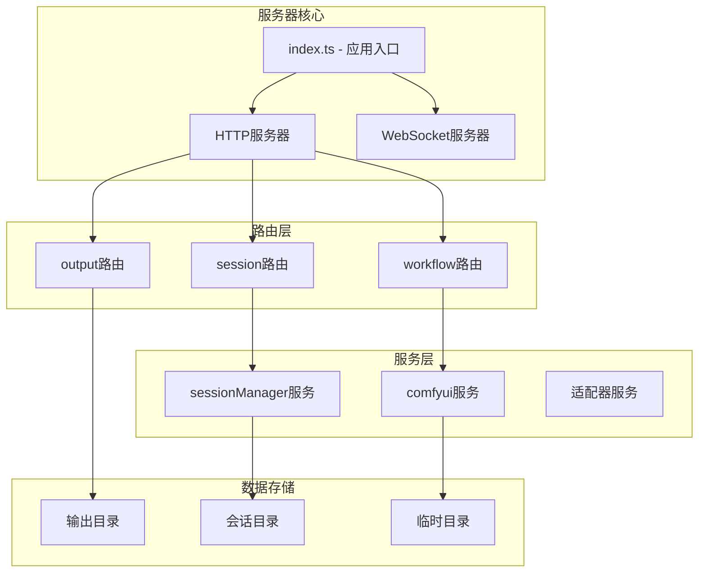
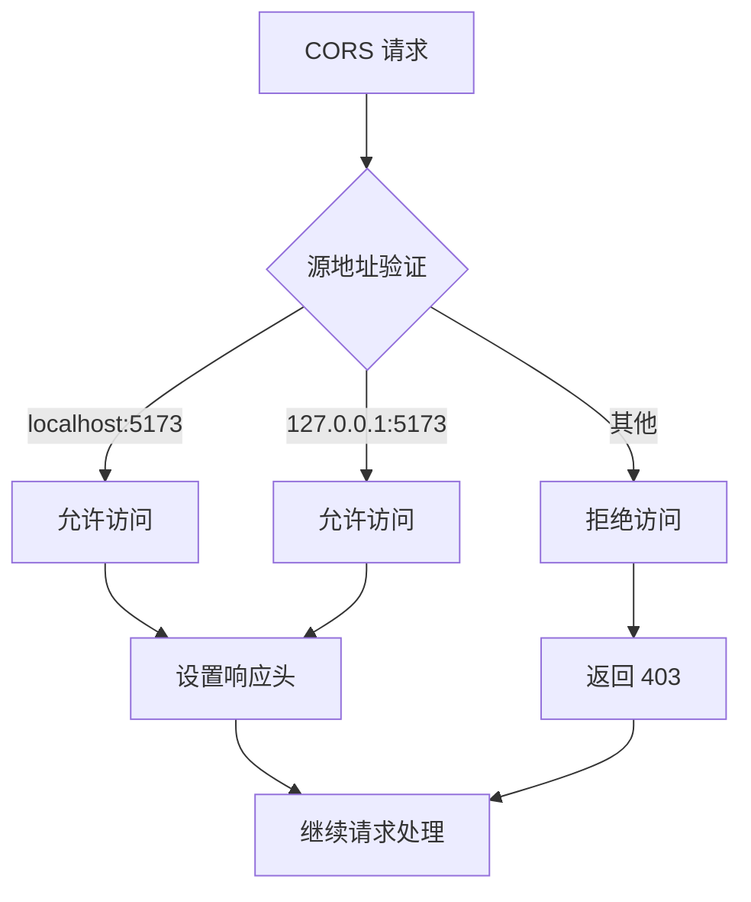
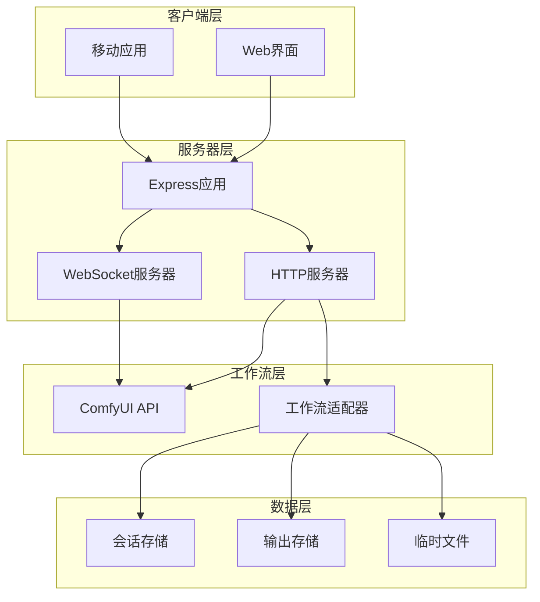
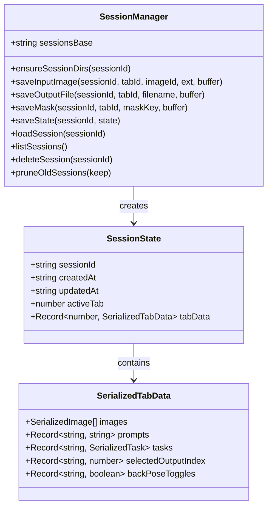
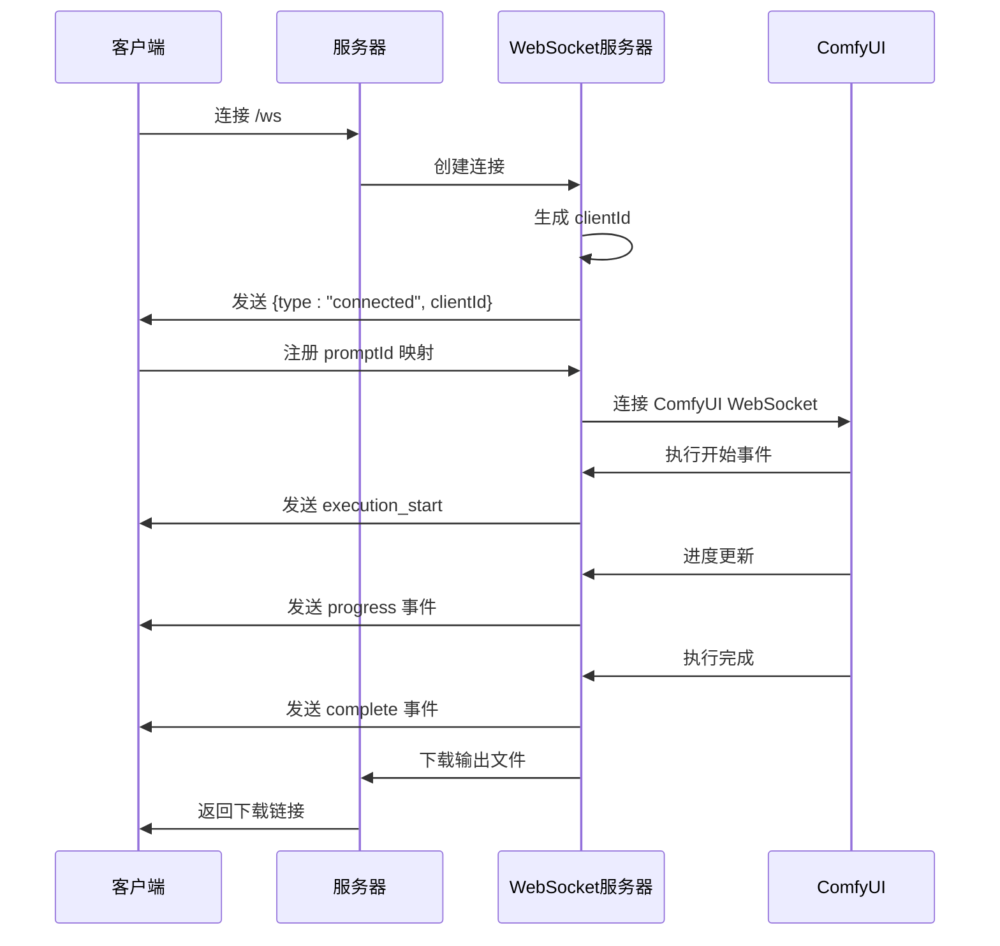
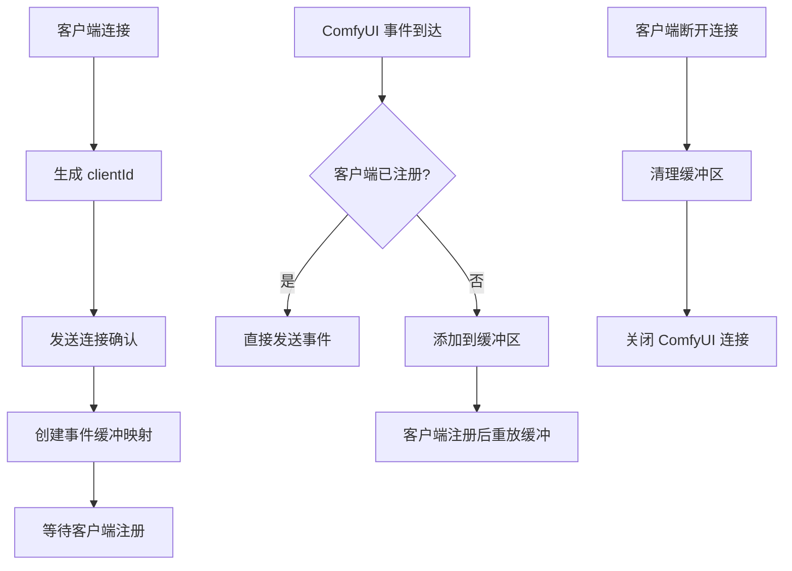
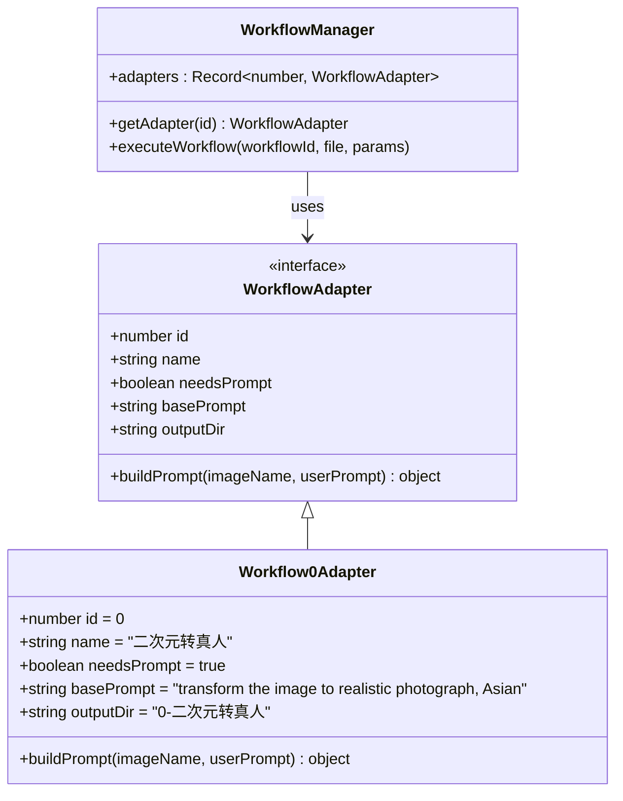
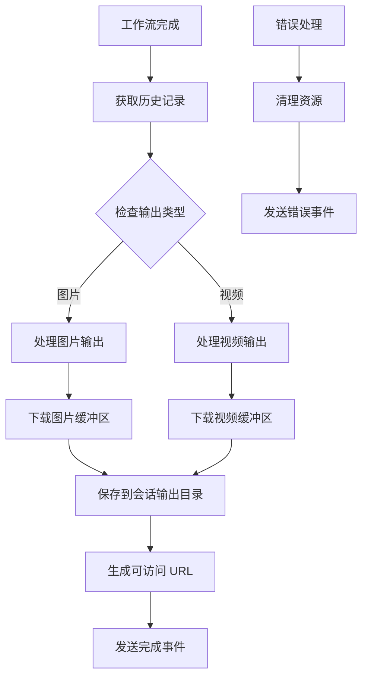
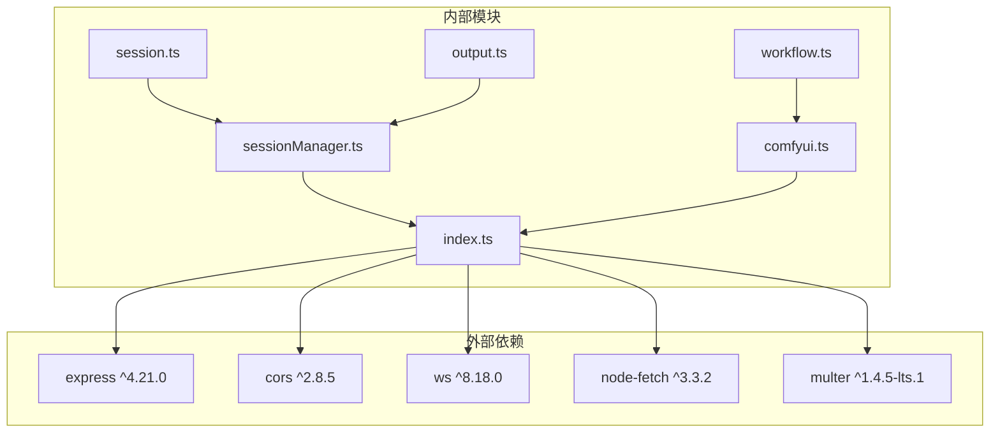
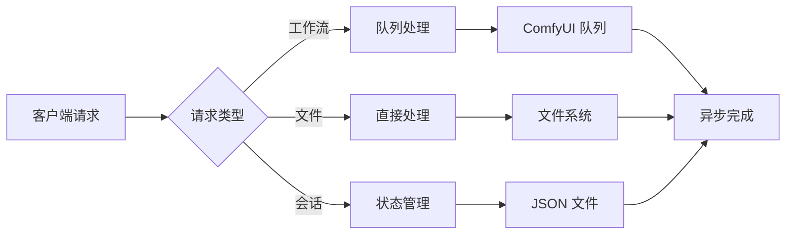

# Express 服务器配置

<cite>
**本文档引用的文件**
- [server/src/index.ts](file://server/src/index.ts)
- [server/package.json](file://server/package.json)
- [server/src/services/sessionManager.ts](file://server/src/services/sessionManager.ts)
- [server/src/routes/session.ts](file://server/src/routes/session.ts)
- [server/src/routes/output.ts](file://server/src/routes/output.ts)
- [server/src/routes/workflow.ts](file://server/src/routes/workflow.ts)
- [server/src/services/comfyui.ts](file://server/src/services/comfyui.ts)
- [server/src/types/index.ts](file://server/src/types/index.ts)
- [server/src/adapters/index.ts](file://server/src/adapters/index.ts)
- [server/src/adapters/Workflow0Adapter.ts](file://server/src/adapters/Workflow0Adapter.ts)
- [package.json](file://package.json)
</cite>

## 目录
1. [简介](#简介)
2. [项目结构](#项目结构)
3. [核心组件](#核心组件)
4. [架构概览](#架构概览)
5. [详细组件分析](#详细组件分析)
6. [依赖关系分析](#依赖关系分析)
7. [性能考虑](#性能考虑)
8. [故障排除指南](#故障排除指南)
9. [结论](#结论)

## 简介

CorineKit Pix2Real 项目是一个基于 Express.js 的服务器应用，用于管理图像处理工作流和与 ComfyUI 进行交互。该服务器提供了完整的 API 接口，支持多种图像处理工作流，包括二次元转真人、真人精修、视频处理等功能。

## 项目结构

服务器采用模块化的架构设计，主要分为以下几个核心部分：



**图表来源**
- [server/src/index.ts:1-228](file://server/src/index.ts#L1-L228)
- [server/src/routes/workflow.ts:1-862](file://server/src/routes/workflow.ts#L1-L862)

**章节来源**
- [server/src/index.ts:1-228](file://server/src/index.ts#L1-L228)
- [package.json:1-15](file://package.json#L1-L15)

## 核心组件

### 服务器初始化过程

服务器启动时执行以下初始化步骤：

1. **目录结构检查与创建**
   - 输出目录自动创建：确保所有预定义的工作流输出目录存在
   - 会话目录创建：初始化 sessions 基础目录

2. **中间件配置**
   - CORS 配置：允许特定源访问
   - JSON 解析器：支持大文件上传（50MB限制）

3. **路由注册**
   - 工作流相关 API
   - 输出文件管理 API
   - 会话状态管理 API

4. **静态文件服务**
   - 输出文件静态服务
   - 会话文件静态服务

**章节来源**
- [server/src/index.ts:17-61](file://server/src/index.ts#L17-L61)

### CORS 配置策略

服务器采用严格的 CORS 策略，仅允许本地开发环境访问：



**图表来源**
- [server/src/index.ts:46-49](file://server/src/index.ts#L46-L49)

**章节来源**
- [server/src/index.ts:46-49](file://server/src/index.ts#L46-L49)

### 静态文件服务设置

服务器提供两个主要的静态文件服务：

1. **输出文件服务**
   - 路径：`/output`
   - 作用域：工作流生成的最终输出文件
   - 目录：项目根目录下的 output 文件夹

2. **会话文件服务**
   - 路径：`/api/session-files`
   - 作用域：用户会话相关的输入、掩码、输出文件
   - 目录：项目根目录下的 sessions 文件夹

**章节来源**
- [server/src/index.ts:58-60](file://server/src/index.ts#L58-L60)
- [server/src/routes/output.ts:55-73](file://server/src/routes/output.ts#L55-L73)

## 架构概览



**图表来源**
- [server/src/index.ts:42-63](file://server/src/index.ts#L42-L63)
- [server/src/services/comfyui.ts:127-188](file://server/src/services/comfyui.ts#L127-L188)

## 详细组件分析

### 会话管理系统

会话管理系统负责管理用户的工作进度和相关文件：



**图表来源**
- [server/src/services/sessionManager.ts:10-164](file://server/src/services/sessionManager.ts#L10-L164)

#### 会话目录管理机制

会话目录采用标准化的层级结构：

```
sessions/
└── {sessionId}/
    ├── tab-0/
    │   ├── input/    (输入文件)
    │   ├── masks/    (掩码文件)
    │   └── output/   (输出文件)
    ├── tab-1/
    │   ├── input/
    │   ├── masks/
    │   └── output/
    └── session.json  (会话状态文件)
```

**章节来源**
- [server/src/services/sessionManager.ts:10-16](file://server/src/services/sessionManager.ts#L10-L16)

### WebSocket 服务器集成

WebSocket 服务器实现了客户端与 ComfyUI 的双向通信：



**图表来源**
- [server/src/index.ts:73-219](file://server/src/index.ts#L73-L219)

#### 客户端 ID 生成策略

服务器使用简单而有效的客户端 ID 生成算法：

```mermaid
flowchart TD
A[生成客户端 ID] --> B[添加前缀 "pix2real_"]
B --> C[添加时间戳]
C --> D[添加随机字符串]
D --> E[格式: pix2real_{timestamp}_{random}]
F[随机字符串生成] --> G[获取随机数]
G --> H[转换为 36 进制]
I[截取子串] --> J[去除前缀]
J --> K[得到唯一标识符]
```

**图表来源**
- [server/src/index.ts:65-68](file://server/src/index.ts#L65-L68)

**章节来源**
- [server/src/index.ts:65-68](file://server/src/index.ts#L65-L68)

#### 事件缓冲机制

为了处理客户端连接时机问题，服务器实现了事件缓冲机制：



**图表来源**
- [server/src/index.ts:83-213](file://server/src/index.ts#L83-L213)

**章节来源**
- [server/src/index.ts:83-90](file://server/src/index.ts#L83-L90)

### 工作流执行系统

工作流系统支持多种图像处理任务：



**图表来源**
- [server/src/adapters/index.ts:1-31](file://server/src/adapters/index.ts#L1-L31)
- [server/src/adapters/Workflow0Adapter.ts:1-35](file://server/src/adapters/Workflow0Adapter.ts#L1-L35)

**章节来源**
- [server/src/adapters/index.ts:13-28](file://server/src/adapters/index.ts#L13-L28)

### 输出文件管理

输出文件管理系统提供了完整的文件生命周期管理：



**图表来源**
- [server/src/index.ts:113-175](file://server/src/index.ts#L113-L175)

**章节来源**
- [server/src/index.ts:113-175](file://server/src/index.ts#L113-L175)

## 依赖关系分析



**图表来源**
- [server/package.json:11-18](file://server/package.json#L11-L18)
- [server/src/index.ts:1-12](file://server/src/index.ts#L1-L12)

**章节来源**
- [server/package.json:11-26](file://server/package.json#L11-L26)

## 性能考虑

### 内存管理

服务器在处理大文件时采用了内存优化策略：

1. **Multer 内存存储**：使用 `memoryStorage()` 处理文件上传，避免临时磁盘写入
2. **流式处理**：WebSocket 事件采用流式传输，减少内存占用
3. **批量操作**：支持批量工作流执行，提高整体效率

### 并发处理



**图表来源**
- [server/src/routes/workflow.ts:458-520](file://server/src/routes/workflow.ts#L458-L520)

### 缓存策略

服务器实现了多层缓存机制：

1. **事件缓冲**：WebSocket 事件的内存缓存
2. **目录结构**：预先创建的目录结构避免运行时创建开销
3. **模板缓存**：工作流模板的内存缓存

## 故障排除指南

### 常见问题及解决方案

#### CORS 错误
**症状**：浏览器控制台显示跨域错误
**原因**：客户端地址不在允许列表中
**解决**：修改 CORS 配置中的允许源地址

#### WebSocket 连接失败
**症状**：客户端无法连接到 /ws 端点
**原因**：端口被占用或防火墙阻止
**解决**：检查端口使用情况和防火墙设置

#### 文件上传失败
**症状**：工作流执行时报文件上传错误
**原因**：文件大小超过限制或 ComfyUI 不可用
**解决**：调整 JSON 解析器大小限制或检查 ComfyUI 服务状态

#### 会话文件访问错误
**症状**：无法访问会话文件
**原因**：文件路径不正确或权限问题
**解决**：检查 sessions 目录权限和文件路径

**章节来源**
- [server/src/index.ts:221-228](file://server/src/index.ts#L221-L228)

## 结论

CorineKit Pix2Real 项目的 Express 服务器配置展现了现代 Web 应用的最佳实践。通过模块化的设计、严格的 CORS 策略、高效的文件管理和完善的错误处理机制，该服务器为复杂的图像处理工作流提供了稳定可靠的技术基础。

关键特性包括：
- 清晰的模块化架构便于维护和扩展
- 严格的安全策略保护开发环境
- 高效的文件处理机制支持大文件操作
- 完善的会话管理确保用户体验
- 灵活的 WebSocket 集成提供实时反馈

这些设计决策为后续的功能扩展和性能优化奠定了坚实的基础。