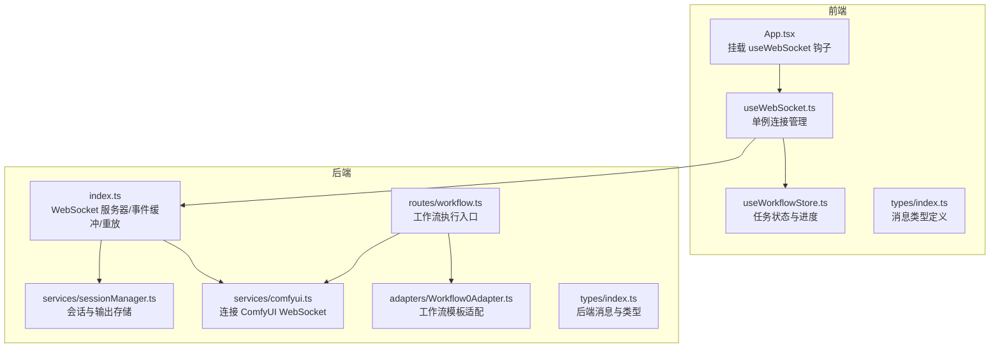
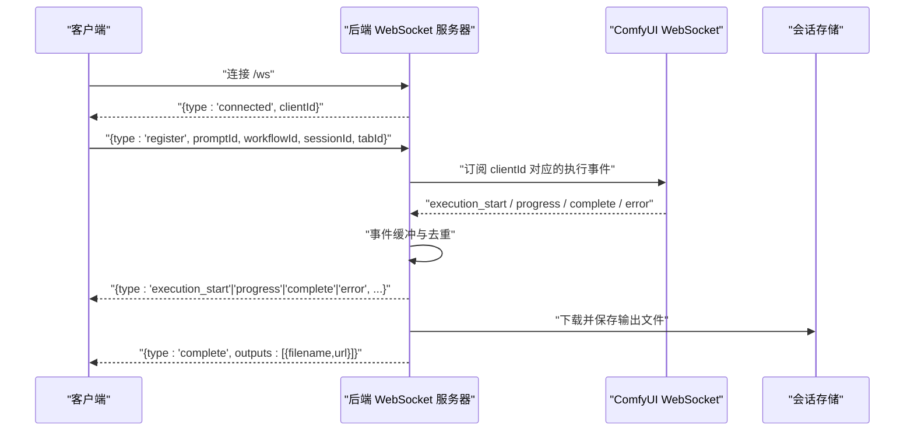
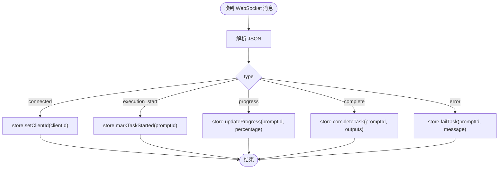
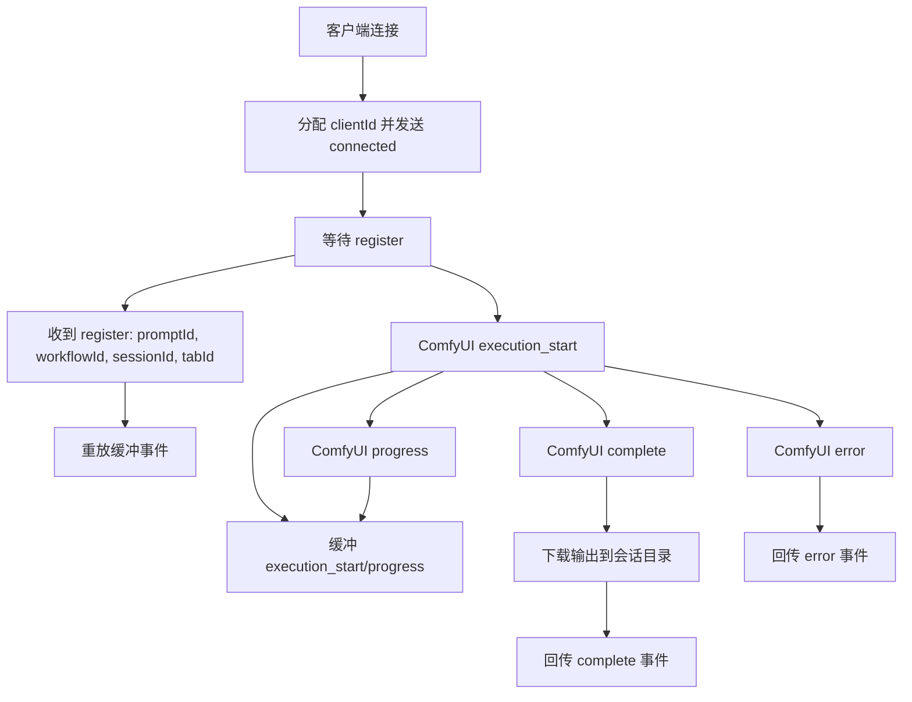
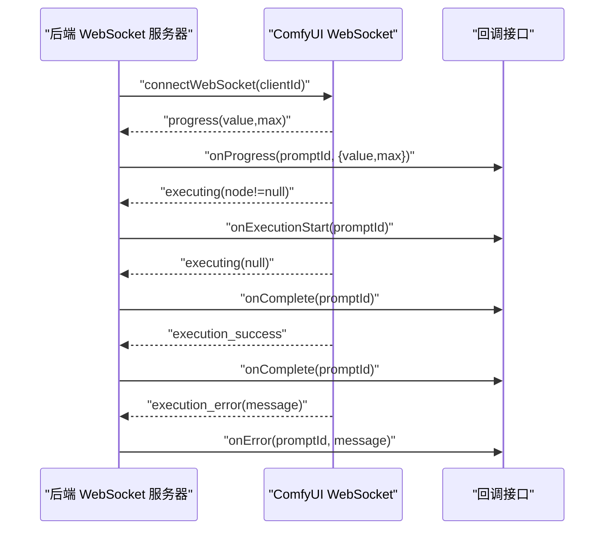
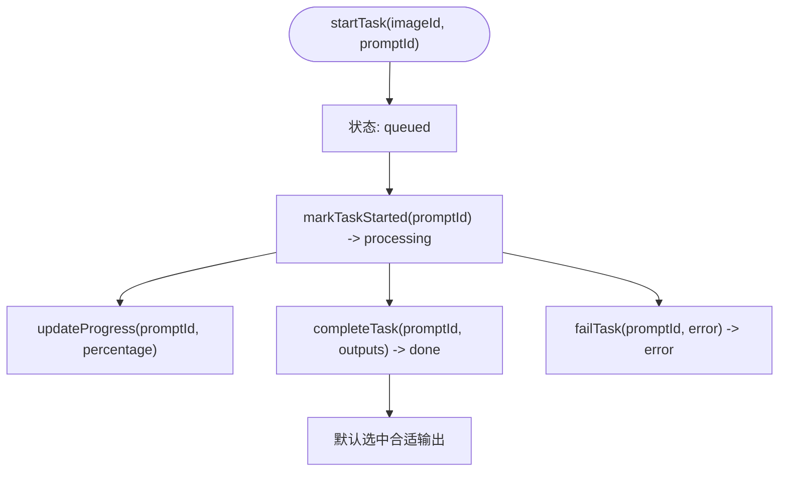
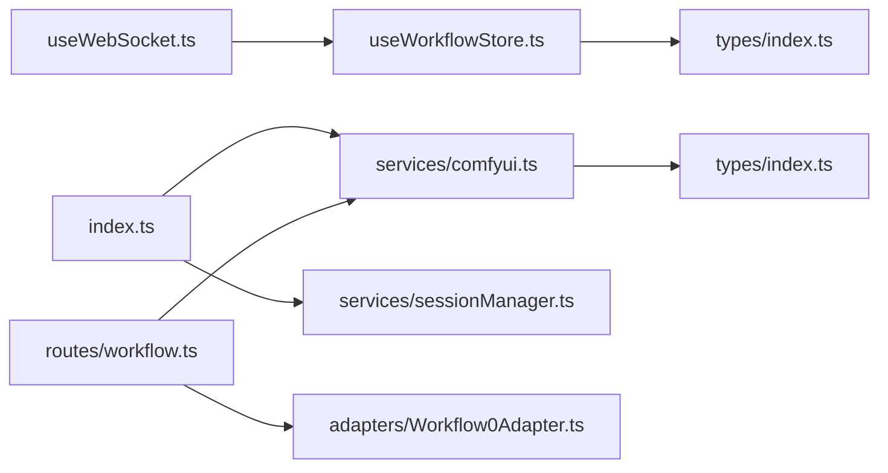

# WebSocket 通信架构

<cite>
**本文档引用的文件**
- [client/src/hooks/useWebSocket.ts](file://client/src/hooks/useWebSocket.ts)
- [client/src/hooks/useWorkflowStore.ts](file://client/src/hooks/useWorkflowStore.ts)
- [client/src/types/index.ts](file://client/src/types/index.ts)
- [server/src/index.ts](file://server/src/index.ts)
- [server/src/services/comfyui.ts](file://server/src/services/comfyui.ts)
- [server/src/services/sessionManager.ts](file://server/src/services/sessionManager.ts)
- [server/src/routes/workflow.ts](file://server/src/routes/workflow.ts)
- [server/src/adapters/Workflow0Adapter.ts](file://server/src/adapters/Workflow0Adapter.ts)
- [server/src/types/index.ts](file://server/src/types/index.ts)
</cite>

## 目录
1. [简介](#简介)
2. [项目结构](#项目结构)
3. [核心组件](#核心组件)
4. [架构总览](#架构总览)
5. [详细组件分析](#详细组件分析)
6. [依赖关系分析](#依赖关系分析)
7. [性能考虑](#性能考虑)
8. [故障排查指南](#故障排查指南)
9. [结论](#结论)

## 简介
本文件系统性阐述 CorineKit Pix2Real 项目的 WebSocket 通信架构，重点覆盖：
- 客户端与 ComfyUI 的双向通信机制
- 事件缓冲策略与 promptId 映射管理
- execution_start、progress、complete、error 等事件类型的处理流程
- 客户端注册机制、事件重放功能、连接状态管理
- 通信协议格式、错误处理策略与性能优化建议

## 项目结构
该项目采用前后端分离的架构，前端使用 React + Zustand 状态管理，后端使用 Node.js + Express + ws 实现 WebSocket 服务，并通过适配器模式对接多种工作流模板。

图表来源
- [client/src/components/App.tsx:74-74](file://client/src/components/App.tsx#L74-L74)
- [client/src/hooks/useWebSocket.ts:10-73](file://client/src/hooks/useWebSocket.ts#L10-L73)
- [client/src/hooks/useWorkflowStore.ts:398-419](file://client/src/hooks/useWorkflowStore.ts#L398-L419)
- [client/src/types/index.ts:27-57](file://client/src/types/index.ts#L27-L57)
- [server/src/index.ts:63-219](file://server/src/index.ts#L63-L219)
- [server/src/services/comfyui.ts:127-188](file://server/src/services/comfyui.ts#L127-L188)
- [server/src/services/sessionManager.ts:34-44](file://server/src/services/sessionManager.ts#L34-L44)
- [server/src/routes/workflow.ts:408-455](file://server/src/routes/workflow.ts#L408-L455)
- [server/src/adapters/Workflow0Adapter.ts:16-33](file://server/src/adapters/Workflow0Adapter.ts#L16-L33)
- [server/src/types/index.ts:10-30](file://server/src/types/index.ts#L10-L30)

章节来源
- [client/src/components/App.tsx:74-74](file://client/src/components/App.tsx#L74-L74)
- [server/src/index.ts:63-219](file://server/src/index.ts#L63-L219)

## 核心组件
- 前端 WebSocket 钩子：负责建立/维护单例连接、发送消息、接收并分发事件到状态管理。
- 前端状态管理：集中管理任务状态、进度、输出等，支持跨标签页同步更新。
- 后端 WebSocket 服务器：为每个客户端生成唯一 clientId，连接 ComfyUI WebSocket，缓冲并重放事件，完成时下载输出并回传。
- 适配器层：根据工作流 ID 生成 ComfyUI prompt JSON，统一输入参数与输出目录。
- 会话管理：将 ComfyUI 输出保存到会话目录，提供持久化访问路径。

章节来源
- [client/src/hooks/useWebSocket.ts:10-98](file://client/src/hooks/useWebSocket.ts#L10-L98)
- [client/src/hooks/useWorkflowStore.ts:398-499](file://client/src/hooks/useWorkflowStore.ts#L398-L499)
- [server/src/index.ts:73-219](file://server/src/index.ts#L73-L219)
- [server/src/services/comfyui.ts:127-188](file://server/src/services/comfyui.ts#L127-L188)
- [server/src/services/sessionManager.ts:34-44](file://server/src/services/sessionManager.ts#L34-L44)

## 架构总览
整体通信链路如下：
- 客户端首次连接后，后端分配 clientId 并立即发送 connected 事件。
- 客户端在任务开始前向后端发送 register 事件，携带 promptId、workflowId、sessionId、tabId。
- 后端将 ComfyUI 的 progress/execution_start/complete/error 事件转换为前端消息格式并转发；若客户端在 ComfyUI 开始处理后再注册，则后端会重放已缓冲的事件。
- 完成事件中包含输出文件的持久化 URL，便于前端直接访问。

图表来源
- [server/src/index.ts:73-219](file://server/src/index.ts#L73-L219)
- [server/src/services/comfyui.ts:127-188](file://server/src/services/comfyui.ts#L127-L188)
- [server/src/services/sessionManager.ts:34-44](file://server/src/services/sessionManager.ts#L34-L44)

## 详细组件分析

### 前端 WebSocket 钩子与事件分发
- 单例连接：全局维护一个 WebSocket 实例，避免重复连接；连接计数用于控制自动重连。
- 事件分发：解析收到的消息，按 type 分派到状态管理的动作：
  - connected：记录 clientId
  - execution_start：标记任务开始
  - progress：更新百分比进度
  - complete：合并输出并默认选中合适的结果
  - error：标记任务失败
- 发送消息：通过 sendMessage 将对象序列化后发送，供客户端向后端注册或控制。

图表来源
- [client/src/hooks/useWebSocket.ts:26-51](file://client/src/hooks/useWebSocket.ts#L26-L51)
- [client/src/hooks/useWorkflowStore.ts:398-499](file://client/src/hooks/useWorkflowStore.ts#L398-L499)

章节来源
- [client/src/hooks/useWebSocket.ts:10-98](file://client/src/hooks/useWebSocket.ts#L10-L98)
- [client/src/hooks/useWorkflowStore.ts:398-499](file://client/src/hooks/useWorkflowStore.ts#L398-L499)

### 后端 WebSocket 服务器与事件缓冲
- clientId 分配：每次连接生成唯一标识，立即通知前端。
- 事件缓冲：为每个 promptId 维护最近事件列表，确保客户端即使在 ComfyUI 已开始处理后再注册也能收到历史事件。
- 事件重放：当客户端发送 register 时，后端将该 promptId 的缓冲事件逐一重放给客户端。
- 完成处理：完成后从 ComfyUI 历史中获取输出，下载到会话目录，生成持久化 URL 并回传前端。
- 错误处理：捕获异常并回传 error 事件，清理缓冲与映射。

图表来源
- [server/src/index.ts:73-219](file://server/src/index.ts#L73-L219)

章节来源
- [server/src/index.ts:73-219](file://server/src/index.ts#L73-L219)

### ComfyUI WebSocket 连接与事件转换
- 连接：使用 clientId 作为查询参数连接 ComfyUI WebSocket。
- 去重与完成判定：使用 Set 跟踪已触发的 execution_start 与已完成的任务，避免重复回调。
- 事件转换：将 ComfyUI 的 progress/executing/execution_success/execution_error 转换为前端统一的消息格式。

图表来源
- [server/src/services/comfyui.ts:127-188](file://server/src/services/comfyui.ts#L127-L188)

章节来源
- [server/src/services/comfyui.ts:127-188](file://server/src/services/comfyui.ts#L127-L188)

### 任务状态管理与进度更新
- 任务生命周期：startTask → markTaskStarted → updateProgress → completeTask/failTask。
- 跨标签页同步：updateProgress 会在所有标签页中查找匹配的 promptId，保证进度一致。
- 输出合并：completeTask 支持合并多次输出，默认选择合适的结果作为当前选中项（视频工作流优先选择插帧）。

图表来源
- [client/src/hooks/useWorkflowStore.ts:377-499](file://client/src/hooks/useWorkflowStore.ts#L377-L499)

章节来源
- [client/src/hooks/useWorkflowStore.ts:377-499](file://client/src/hooks/useWorkflowStore.ts#L377-L499)

### 通信协议与消息格式
- 客户端 → 服务器
  - register：{ type: 'register', promptId, workflowId, sessionId?, tabId? }
- 服务器 → 客户端
  - connected：{ type: 'connected', clientId }
  - execution_start：{ type: 'execution_start', promptId }
  - progress：{ type: 'progress', promptId, value, max, percentage }
  - complete：{ type: 'complete', promptId, outputs: [{ filename, url }] }
  - error：{ type: 'error', promptId, message }

章节来源
- [client/src/types/index.ts:27-57](file://client/src/types/index.ts#L27-L57)
- [server/src/types/index.ts:10-30](file://server/src/types/index.ts#L10-L30)

### 客户端注册机制与事件重放
- 注册时机：在任务开始前，客户端向后端发送 register，携带 promptId 与工作流/会话信息。
- 重放策略：若 ComfyUI 在客户端注册前已开始处理，后端会将缓冲的 execution_start/progress 事件重放给客户端。
- 映射管理：后端维护 promptId → workflowId/sessionId/tabId 的映射，用于完成后的输出持久化与回传。

章节来源
- [server/src/index.ts:192-213](file://server/src/index.ts#L192-L213)

### 连接状态管理与重连
- 单例连接：前端维护全局 WebSocket 实例，连接计数控制生命周期。
- 自动重连：断开后若仍有订阅者，延迟 2 秒重连；关闭时清理定时器与连接。
- 关闭策略：当连接计数归零时主动关闭连接，避免资源泄漏。

章节来源
- [client/src/hooks/useWebSocket.ts:10-98](file://client/src/hooks/useWebSocket.ts#L10-L98)

## 依赖关系分析
- 前端依赖
  - useWebSocket 依赖 useWorkflowStore 进行状态更新
  - useWorkflowStore 依赖 types 中的任务与消息类型定义
- 后端依赖
  - index.ts 依赖 comfyui.ts 连接 ComfyUI，依赖 sessionManager.ts 保存输出
  - workflow 路由依赖 adapters 生成 prompt JSON
  - types/index.ts 为前后端共享的类型定义

图表来源
- [client/src/hooks/useWebSocket.ts:1-98](file://client/src/hooks/useWebSocket.ts#L1-L98)
- [client/src/hooks/useWorkflowStore.ts:1-645](file://client/src/hooks/useWorkflowStore.ts#L1-L645)
- [client/src/types/index.ts:1-58](file://client/src/types/index.ts#L1-L58)
- [server/src/index.ts:1-228](file://server/src/index.ts#L1-L228)
- [server/src/services/comfyui.ts:1-285](file://server/src/services/comfyui.ts#L1-L285)
- [server/src/services/sessionManager.ts:1-164](file://server/src/services/sessionManager.ts#L1-L164)
- [server/src/routes/workflow.ts:1-862](file://server/src/routes/workflow.ts#L1-L862)
- [server/src/adapters/Workflow0Adapter.ts:1-35](file://server/src/adapters/Workflow0Adapter.ts#L1-L35)
- [server/src/types/index.ts:1-52](file://server/src/types/index.ts#L1-L52)

章节来源
- [server/src/index.ts:1-228](file://server/src/index.ts#L1-L228)
- [server/src/services/comfyui.ts:1-285](file://server/src/services/comfyui.ts#L1-L285)
- [server/src/routes/workflow.ts:1-862](file://server/src/routes/workflow.ts#L1-L862)

## 性能考虑
- 事件缓冲大小：当前实现对每个 promptId 维护事件列表，建议限制最大缓冲长度，避免内存膨胀。
- 进度更新频率：前端 updateProgress 在所有标签页中遍历匹配，建议仅在活跃标签页更新或增加节流。
- 输出下载并发：完成时批量下载输出，建议引入队列与并发上限，避免阻塞。
- 连接池与心跳：可考虑在后端维护多个 ComfyUI 连接或心跳检测，提升稳定性。
- 前端渲染优化：大量进度更新时可采用虚拟滚动与懒加载，减少 DOM 更新压力。

## 故障排查指南
- 无法连接 ComfyUI
  - 检查后端连接地址与端口配置
  - 查看后端日志中的连接错误
- 事件丢失或顺序错乱
  - 确认客户端是否在 ComfyUI 开始处理前发送 register
  - 检查后端事件缓冲是否被清理
- 输出无法访问
  - 确认会话目录存在且可写
  - 检查输出文件是否成功下载并保存
- 任务状态异常
  - 检查前端状态动作是否正确调用
  - 确认 promptId 映射是否正确

章节来源
- [server/src/services/comfyui.ts:127-188](file://server/src/services/comfyui.ts#L127-L188)
- [server/src/index.ts:109-175](file://server/src/index.ts#L109-L175)
- [server/src/services/sessionManager.ts:34-44](file://server/src/services/sessionManager.ts#L34-L44)

## 结论
本项目通过“后端事件缓冲 + 客户端注册重放”的机制，有效解决了客户端与 ComfyUI 之间的时间差问题，确保任务状态的完整与一致。配合统一的消息格式与完善的错误处理，实现了稳定可靠的实时通信体验。后续可在事件缓冲策略、进度更新频率与输出下载并发等方面进一步优化，以提升大规模场景下的性能与稳定性。