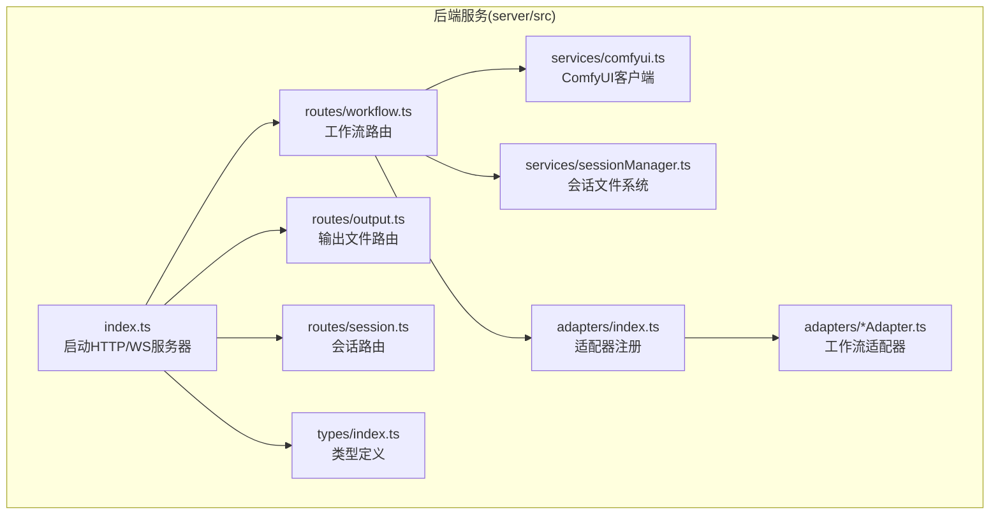
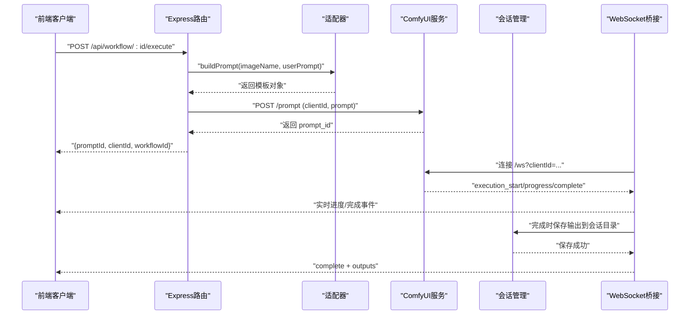
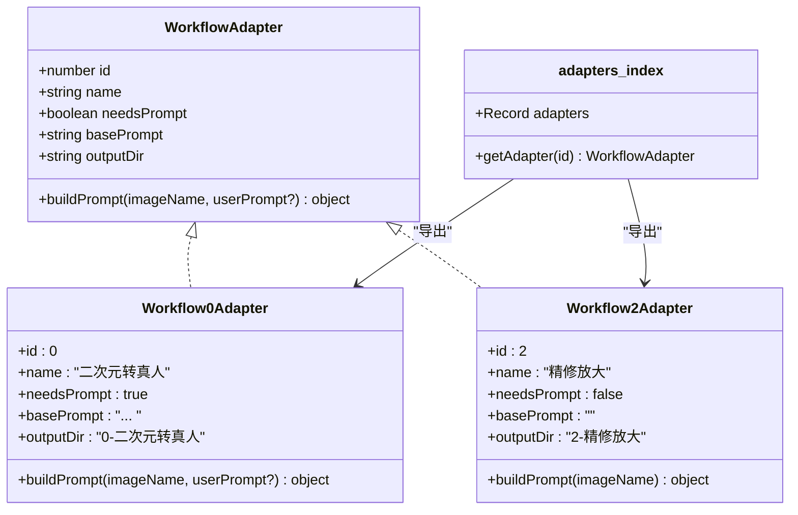
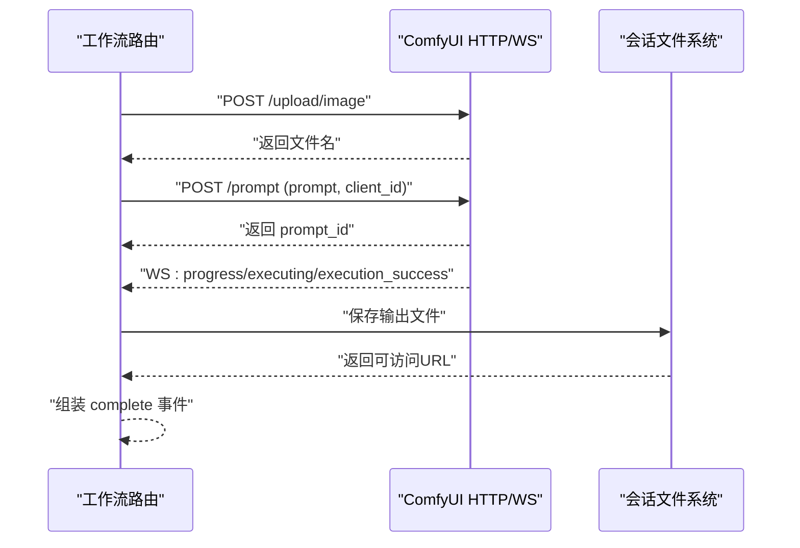
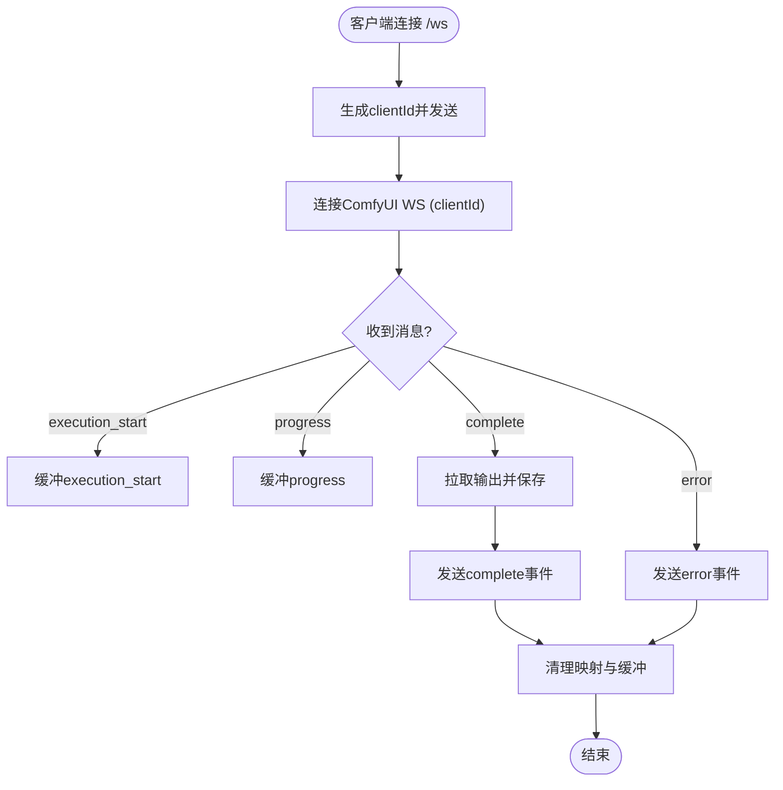
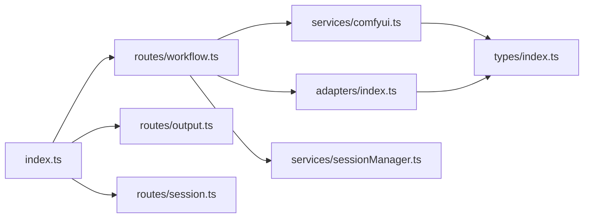

# 后端服务架构

<cite>
**本文引用的文件**
- [server/src/index.ts](file://server/src/index.ts)
- [server/src/route/workflow.ts](file://server/src/routes/workflow.ts)
- [server/src/route/output.ts](file://server/src/routes/output.ts)
- [server/src/route/session.ts](file://server/src/routes/session.ts)
- [server/src/services/comfyui.ts](file://server/src/services/comfyui.ts)
- [server/src/services/sessionManager.ts](file://server/src/services/sessionManager.ts)
- [server/src/adapters/index.ts](file://server/src/adapters/index.ts)
- [server/src/adapters/BaseAdapter.ts](file://server/src/adapters/BaseAdapter.ts)
- [server/src/adapters/Workflow0Adapter.ts](file://server/src/adapters/Workflow0Adapter.ts)
- [server/src/adapters/Workflow2Adapter.ts](file://server/src/adapters/Workflow2Adapter.ts)
- [server/src/adapters/Workflow5Adapter.ts](file://server/src/adapters/Workflow5Adapter.ts)
- [server/src/types/index.ts](file://server/src/types/index.ts)
- [server/package.json](file://server/package.json)
- [README.md](file://README.md)
</cite>

## 目录
1. [简介](#简介)
2. [项目结构](#项目结构)
3. [核心组件](#核心组件)
4. [架构总览](#架构总览)
5. [详细组件分析](#详细组件分析)
6. [依赖关系分析](#依赖关系分析)
7. [性能考量](#性能考量)
8. [故障排查指南](#故障排查指南)
9. [结论](#结论)
10. [附录](#附录)

## 简介
本项目为 CorineKit Pix2Real 的后端服务，采用 Express + TypeScript 技术栈，围绕 ComfyUI 构建本地 Web 图像/视频批处理流水线。后端通过适配器模式抽象不同工作流（Workflow），统一路由入口，结合 WebSocket 实现实时进度推送，并提供会话状态持久化与输出文件管理能力。本文档系统阐述架构设计、适配器模式应用、路由与中间件策略、与 ComfyUI 的集成方式、WebSocket 连接管理、文件处理机制、错误处理与日志记录、安全考虑以及扩展建议。

## 项目结构
后端位于 server/src 目录，按职责分层组织：
- 入口与服务器：index.ts 负责启动 HTTP/WS 服务器、CORS、静态资源、路由挂载与 WebSocket 事件桥接。
- 路由层：routes 下按功能划分，分别处理工作流执行、输出文件访问、会话数据存取。
- 服务层：services 提供与 ComfyUI 的 HTTP/WebSocket 客户端封装、会话文件系统管理。
- 适配器层：adapters 以适配器模式封装各工作流模板与参数构建逻辑。
- 类型定义：types 统一前后端交互的数据契约。

图表来源
- [server/src/index.ts:1-228](file://server/src/index.ts#L1-L228)
- [server/src/routes/workflow.ts:1-862](file://server/src/routes/workflow.ts#L1-L862)
- [server/src/routes/output.ts:1-134](file://server/src/routes/output.ts#L1-L134)
- [server/src/routes/session.ts:1-95](file://server/src/routes/session.ts#L1-L95)
- [server/src/services/comfyui.ts:1-285](file://server/src/services/comfyui.ts#L1-L285)
- [server/src/services/sessionManager.ts:1-164](file://server/src/services/sessionManager.ts#L1-L164)
- [server/src/adapters/index.ts:1-31](file://server/src/adapters/index.ts#L1-L31)
- [server/src/types/index.ts:1-52](file://server/src/types/index.ts#L1-L52)

章节来源
- [README.md:41-62](file://README.md#L41-L62)
- [server/src/index.ts:1-228](file://server/src/index.ts#L1-L228)

## 核心组件
- Express 应用与中间件
  - CORS 配置允许前端本地开发域访问。
  - JSON 请求体解析，限制大小以避免过大负载。
  - 静态资源：输出目录与会话文件目录对外暴露。
- 路由模块
  - 工作流路由：统一调度适配器与 ComfyUI 模板，支持单图/批量执行、队列管理、系统统计、提示词反推与提示词助理等。
  - 输出路由：列出与下载历史输出文件，跨路径打开默认应用。
  - 会话路由：保存输入图像/蒙版、序列化会话状态、列出/删除会话。
- 服务模块
  - ComfyUI 客户端：上传图像/视频、入队、查询历史、获取进度、系统统计、队列操作、WebSocket 连接。
  - 会话管理：确保会话目录结构、保存输入/输出文件、保存/加载会话状态、会话列表与清理。
- 适配器模块
  - 以适配器模式封装各工作流模板，仅变更必要节点（如图像名、提示词、种子）。
- 类型定义
  - 统一事件、队列、历史、输出文件等数据结构，保证前后端契约一致。

章节来源
- [server/src/index.ts:42-61](file://server/src/index.ts#L42-L61)
- [server/src/routes/workflow.ts:1-862](file://server/src/routes/workflow.ts#L1-L862)
- [server/src/routes/output.ts:1-134](file://server/src/routes/output.ts#L1-L134)
- [server/src/routes/session.ts:1-95](file://server/src/routes/session.ts#L1-L95)
- [server/src/services/comfyui.ts:1-285](file://server/src/services/comfyui.ts#L1-L285)
- [server/src/services/sessionManager.ts:1-164](file://server/src/services/sessionManager.ts#L1-L164)
- [server/src/adapters/index.ts:1-31](file://server/src/adapters/index.ts#L1-L31)
- [server/src/types/index.ts:1-52](file://server/src/types/index.ts#L1-L52)

## 架构总览
后端整体采用“路由层-服务层-适配器层”的分层设计，配合 WebSocket 实现从 ComfyUI 到浏览器的实时进度转发。请求流经 Express 中间件，路由根据工作流 ID 选择对应适配器或专用路由，服务层调用 ComfyUI 接口并维护会话文件系统，最终通过 WebSocket 将进度与完成事件回传给前端。

图表来源
- [server/src/routes/workflow.ts:407-455](file://server/src/routes/workflow.ts#L407-L455)
- [server/src/services/comfyui.ts:47-60](file://server/src/services/comfyui.ts#L47-L60)
- [server/src/services/comfyui.ts:127-188](file://server/src/services/comfyui.ts#L127-L188)
- [server/src/index.ts:73-219](file://server/src/index.ts#L73-L219)
- [server/src/services/sessionManager.ts:34-44](file://server/src/services/sessionManager.ts#L34-L44)

## 详细组件分析

### 适配器模式在工作流处理中的应用
- 设计思想
  - 以适配器接口统一工作流行为，每个适配器负责加载对应 JSON 模板并只修改必要节点（如图像名、提示词、随机种子）。
  - 通过集中注册表导出适配器集合，路由层按 ID 获取适配器，减少分支判断与重复代码。
- 关键实现
  - 适配器接口定义：id、name、needsPrompt、basePrompt、outputDir、buildPrompt。
  - 注册表：adapters/index.ts 将 0–9 的适配器集中导出，提供 getAdapter 查询。
  - 典型适配器：Workflow0Adapter 使用 Qwen 文生图编辑节点；Workflow2Adapter 使用 SeedVR2 视频放大节点；Workflow5Adapter 采用专用路由处理“解除装备”场景。
- 扩展建议
  - 新增工作流时，新增一个适配器文件并在注册表中注册，即可复用通用路由与 WebSocket 事件桥接。

图表来源
- [server/src/types/index.ts:1-8](file://server/src/types/index.ts#L1-L8)
- [server/src/adapters/index.ts:13-28](file://server/src/adapters/index.ts#L13-L28)
- [server/src/adapters/Workflow0Adapter.ts:9-34](file://server/src/adapters/Workflow0Adapter.ts#L9-L34)
- [server/src/adapters/Workflow2Adapter.ts:9-27](file://server/src/adapters/Workflow2Adapter.ts#L9-L27)

章节来源
- [server/src/adapters/index.ts:1-31](file://server/src/adapters/index.ts#L1-L31)
- [server/src/adapters/Workflow0Adapter.ts:1-35](file://server/src/adapters/Workflow0Adapter.ts#L1-L35)
- [server/src/adapters/Workflow2Adapter.ts:1-28](file://server/src/adapters/Workflow2Adapter.ts#L1-L28)
- [server/src/adapters/Workflow5Adapter.ts:1-15](file://server/src/adapters/Workflow5Adapter.ts#L1-L15)
- [README.md:76-78](file://README.md#L76-L78)

### 路由设计原则与中间件使用策略
- 路由设计
  - 工作流路由：统一入口 /api/workflow，按工作流 ID 分发至通用或专用处理器；支持批量执行、队列优先级调整、系统统计、提示词反推与提示词助理。
  - 输出路由：列出与下载历史输出文件，支持跨路径打开默认应用。
  - 会话路由：保存输入图像/蒙版、序列化会话状态、列出/删除会话。
- 中间件策略
  - CORS：限定前端开发域，允许凭证。
  - JSON 解析：限制请求体大小，防止内存压力。
  - 静态资源：输出目录与会话文件目录对外暴露，便于直接访问与打开。
- 错误处理
  - 路由层对异常进行捕获并返回标准错误响应；服务层对 HTTP/WS 失败抛出可读错误信息。

章节来源
- [server/src/index.ts:42-61](file://server/src/index.ts#L42-L61)
- [server/src/routes/workflow.ts:29-38](file://server/src/routes/workflow.ts#L29-L38)
- [server/src/routes/output.ts:22-53](file://server/src/routes/output.ts#L22-L53)
- [server/src/routes/session.ts:18-33](file://server/src/routes/session.ts#L18-L33)

### 与 ComfyUI 的集成架构
- HTTP 接口封装
  - 上传图像/视频：统一使用 /upload/image，支持覆盖与子文件夹类型。
  - 入队：POST /prompt，携带 client_id 与 prompt。
  - 历史查询：GET /history/{promptId}。
  - 系统统计：GET /system_stats。
  - 队列管理：GET /queue、POST /queue 删除与重新排队。
  - 模型列表：通过 object_info 获取 Checkpoint/UNET/LoRA 名称。
- WebSocket 连接
  - 服务层建立与 ComfyUI 的 WS 连接，监听 progress/executing 等事件。
  - 后端为每个浏览器客户端维护一个 WS 连接，事件去重与完成信号合并，确保稳定推送。
- 文件下载与保存
  - 完成事件触发后，从 /view 拉取输出图像/视频缓冲区，写入会话输出目录，并返回可访问 URL。

图表来源
- [server/src/services/comfyui.ts:9-83](file://server/src/services/comfyui.ts#L9-L83)
- [server/src/services/comfyui.ts:127-188](file://server/src/services/comfyui.ts#L127-L188)
- [server/src/services/sessionManager.ts:34-44](file://server/src/services/sessionManager.ts#L34-L44)

章节来源
- [server/src/services/comfyui.ts:1-285](file://server/src/services/comfyui.ts#L1-L285)

### WebSocket 连接管理
- 连接生命周期
  - 服务端创建 WebSocketServer 并监听 /ws。
  - 为每个客户端生成唯一 clientId 并发送给前端。
  - 为每个客户端建立到 ComfyUI 的 WS 连接，转发进度与完成事件。
- 事件缓冲与重放
  - 对同一 promptId 缓存最近事件，若客户端在执行开始前连接，自动重放已发生的事件。
- 完成与清理
  - 完成事件触发后，拉取输出并保存，清理映射与缓冲。
  - 客户端断开时关闭对应 ComfyUI 连接。

图表来源
- [server/src/index.ts:73-219](file://server/src/index.ts#L73-L219)

章节来源
- [server/src/index.ts:73-219](file://server/src/index.ts#L73-L219)

### 文件处理机制
- 输出目录
  - 后端启动时确保输出目录存在，按工作流分类存储。
- 会话文件系统
  - 会话目录包含 input/masks/output 三类子目录，按 tab-0..5 组织。
  - 支持保存输入图像、蒙版与输出文件，并生成可访问 URL。
- 跨路径打开
  - 输出路由支持根据 URL 自动定位文件并调用系统默认应用打开。

章节来源
- [server/src/index.ts:17-40](file://server/src/index.ts#L17-L40)
- [server/src/services/sessionManager.ts:10-57](file://server/src/services/sessionManager.ts#L10-L57)
- [server/src/routes/output.ts:75-131](file://server/src/routes/output.ts#L75-L131)

### 错误处理与日志记录
- 错误处理
  - 路由层捕获异常并返回 4xx/5xx 错误码与错误信息。
  - 服务层对 HTTP/WS 失败抛出明确错误，便于上层统一处理。
- 日志记录
  - 控制台输出关键事件与错误，便于调试与运维。
- 安全考虑
  - CORS 仅允许受信前端域。
  - 静态资源路径严格解码与校验，避免路径穿越。
  - 上传文件大小限制，防止拒绝服务。

章节来源
- [server/src/routes/workflow.ts:88-91](file://server/src/routes/workflow.ts#L88-L91)
- [server/src/routes/workflow.ts:145-148](file://server/src/routes/workflow.ts#L145-L148)
- [server/src/services/comfyui.ts:183-185](file://server/src/services/comfyui.ts#L183-L185)
- [server/src/index.ts:46-49](file://server/src/index.ts#L46-L49)
- [server/src/routes/output.ts:85-109](file://server/src/routes/output.ts#L85-L109)

## 依赖关系分析
- 模块耦合
  - 路由层依赖适配器注册表与服务层；服务层依赖 ComfyUI 接口与文件系统；适配器层依赖模板文件。
- 外部依赖
  - Express、CORS、Multer、node-fetch、ws、form-data。
- 可能的循环依赖
  - 当前结构清晰，无明显循环导入风险。

图表来源
- [server/src/routes/workflow.ts:1-10](file://server/src/routes/workflow.ts#L1-L10)
- [server/src/adapters/index.ts:1-31](file://server/src/adapters/index.ts#L1-L31)
- [server/src/services/comfyui.ts:1-8](file://server/src/services/comfyui.ts#L1-L8)
- [server/src/services/sessionManager.ts:1-6](file://server/src/services/sessionManager.ts#L1-L6)
- [server/src/index.ts:8-12](file://server/src/index.ts#L8-L12)
- [server/src/types/index.ts:1-52](file://server/src/types/index.ts#L1-L52)

章节来源
- [server/src/package.json:11-26](file://server/src/package.json#L11-L26)

## 性能考量
- 内存与并发
  - Multer 使用内存存储，注意控制上传文件数量与大小，避免内存峰值过高。
  - WebSocket 连接按客户端维度管理，避免过多并发导致资源紧张。
- I/O 优化
  - 输出文件写入与读取尽量异步化，避免阻塞事件循环。
  - 批量任务应合理拆分，避免单次队列堆积。
- 网络与超时
  - ComfyUI 接口失败时及时抛错并回退，避免长时间等待。
  - 提示词反推与提示词助理等耗时操作设置合理超时阈值。

## 故障排查指南
- ComfyUI 不可用
  - 确认 ComfyUI 在 http://127.0.0.1:8188 运行。
  - 检查 /system_stats 与 /queue 接口是否返回有效数据。
- WebSocket 无法接收进度
  - 检查 /ws 是否正常连接，确认客户端已发送 register 消息并正确绑定 promptId。
  - 查看后端日志是否存在 WS 错误或事件解析异常。
- 文件无法下载或打开
  - 确认输出目录与会话目录权限，检查路径编码与解码是否正确。
  - 使用 /api/output/open-file 或 /api/session-files 打开文件时，确保 URL 符合预期格式。
- 队列异常
  - 使用 /api/workflow/queue 查看队列状态，必要时删除或重新排队。

章节来源
- [server/src/services/comfyui.ts:106-125](file://server/src/services/comfyui.ts#L106-L125)
- [server/src/routes/workflow.ts:561-569](file://server/src/routes/workflow.ts#L561-L569)
- [server/src/routes/output.ts:75-131](file://server/src/routes/output.ts#L75-L131)

## 结论
本后端以 Express + TypeScript 构建，通过适配器模式将多工作流模板化，结合 ComfyUI 的 HTTP/WS 接口实现批处理与实时进度推送。路由层统一调度、服务层抽象外部依赖、适配器层专注模板拼装，形成高内聚低耦合的架构。配合会话文件系统与静态资源服务，满足本地 Web UI 的完整工作流闭环。后续可在适配器扩展、队列治理与监控告警方面进一步完善。

## 附录
- 开发与运行
  - 安装依赖后运行 npm run dev 启动开发服务器。
  - 前端通过 http://localhost:5173 访问，后端监听 http://localhost:3000。
- 扩展建议
  - 新增工作流：新增适配器文件并在注册表导出，复用通用路由与 WebSocket 事件桥接。
  - 队列治理：增加队列优先级策略与重试机制。
  - 监控与日志：引入结构化日志与指标上报，增强可观测性。
  - 安全加固：增加鉴权与速率限制，限制上传类型与大小，启用 HTTPS。