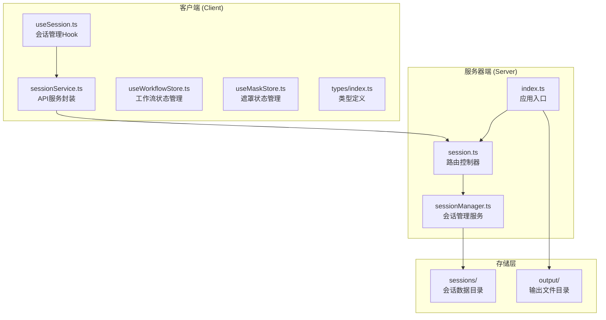
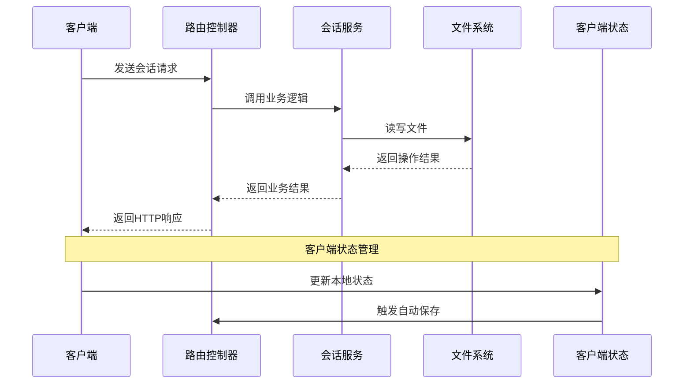
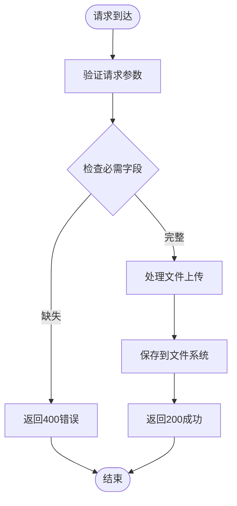
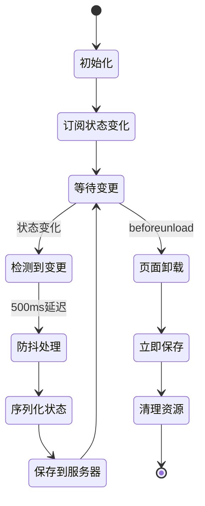
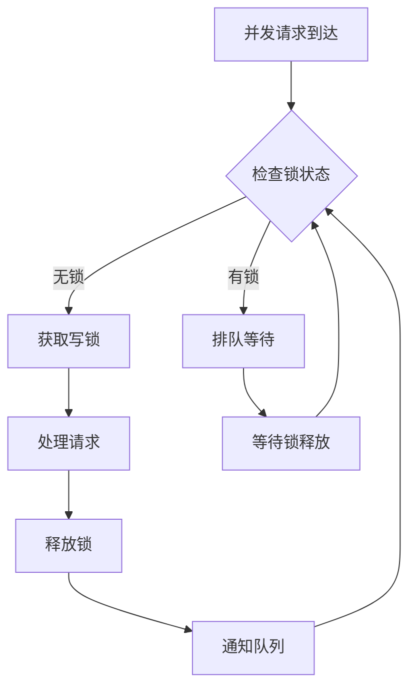
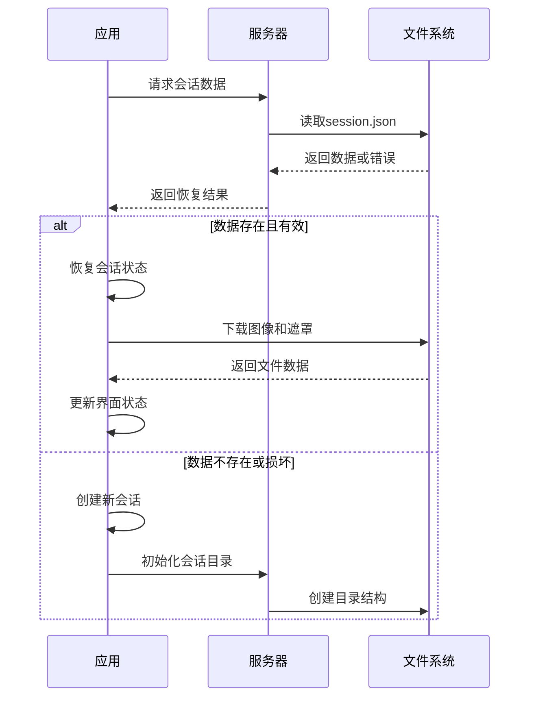
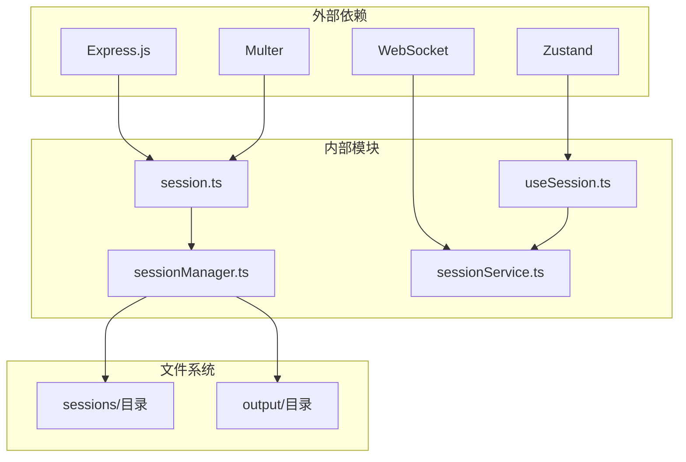

# 会话路由模块

<cite>
**本文档引用的文件**
- [server/src/routes/session.ts](file://server/src/routes/session.ts)
- [server/src/services/sessionManager.ts](file://server/src/services/sessionManager.ts)
- [server/src/index.ts](file://server/src/index.ts)
- [client/src/hooks/useSession.ts](file://client/src/hooks/useSession.ts)
- [client/src/services/sessionService.ts](file://client/src/services/sessionService.ts)
- [client/src/types/index.ts](file://client/src/types/index.ts)
- [client/src/hooks/useWorkflowStore.ts](file://client/src/hooks/useWorkflowStore.ts)
- [client/src/hooks/useMaskStore.ts](file://client/src/hooks/useMaskStore.ts)
- [TODO-session-persistence.md](file://TODO-session-persistence.md)
</cite>

## 目录
1. [简介](#简介)
2. [项目结构](#项目结构)
3. [核心组件](#核心组件)
4. [架构概览](#架构概览)
5. [详细组件分析](#详细组件分析)
6. [依赖关系分析](#依赖关系分析)
7. [性能考虑](#性能考虑)
8. [故障排除指南](#故障排除指南)
9. [结论](#结论)

## 简介

会话路由模块是 CorineKit Pix2Real 项目中负责会话管理的核心模块。该模块实现了完整的会话生命周期管理，包括会话创建、状态保存、文件上传、会话列表管理等功能。模块采用前后端分离的设计模式，前端使用 React Hook 和 Zustand 状态管理，后端基于 Express.js 和 TypeScript 构建。

## 项目结构

会话路由模块在项目中的组织结构如下：

**图表来源**
- [server/src/routes/session.ts:1-95](file://server/src/routes/session.ts#L1-L95)
- [server/src/services/sessionManager.ts:1-164](file://server/src/services/sessionManager.ts#L1-L164)
- [server/src/index.ts:1-228](file://server/src/index.ts#L1-L228)

**章节来源**
- [server/src/routes/session.ts:1-95](file://server/src/routes/session.ts#L1-L95)
- [server/src/services/sessionManager.ts:1-164](file://server/src/services/sessionManager.ts#L1-L164)
- [server/src/index.ts:1-228](file://server/src/index.ts#L1-L228)

## 核心组件

会话路由模块包含以下核心组件：

### 1. 会话路由控制器
- **路径**: `server/src/routes/session.ts`
- **功能**: 处理所有会话相关的 HTTP 请求
- **路由**: 
  - `POST /api/session/:sessionId/images` - 上传输入图像
  - `POST /api/session/:sessionId/masks` - 上传遮罩文件
  - `PUT /api/session/:sessionId/state` - 保存会话状态
  - `GET /api/session/:sessionId` - 获取会话详情
  - `GET /api/sessions` - 列出会话列表
  - `DELETE /api/session/:sessionId` - 删除会话

### 2. 会话管理服务
- **路径**: `server/src/services/sessionManager.ts`
- **功能**: 提供会话数据的持久化操作
- **核心方法**:
  - `ensureSessionDirs()` - 确保会话目录结构完整
  - `saveInputImage()` - 保存输入图像
  - `saveMask()` - 保存遮罩文件
  - `saveState()` - 保存会话状态到 JSON 文件
  - `loadSession()` - 从文件系统加载会话
  - `listSessions()` - 列出所有会话
  - `deleteSession()` - 删除指定会话

### 3. 客户端会话管理
- **路径**: `client/src/hooks/useSession.ts`
- **功能**: 管理客户端会话状态和与服务器的同步
- **特性**:
  - 自动保存机制
  - 会话恢复功能
  - 并发控制
  - 错误处理

**章节来源**
- [server/src/routes/session.ts:1-95](file://server/src/routes/session.ts#L1-L95)
- [server/src/services/sessionManager.ts:1-164](file://server/src/services/sessionManager.ts#L1-L164)
- [client/src/hooks/useSession.ts:1-422](file://client/src/hooks/useSession.ts#L1-L422)

## 架构概览

会话路由模块采用分层架构设计，清晰分离了关注点：

**图表来源**
- [server/src/routes/session.ts:18-85](file://server/src/routes/session.ts#L18-L85)
- [server/src/services/sessionManager.ts:90-110](file://server/src/services/sessionManager.ts#L90-L110)
- [client/src/hooks/useSession.ts:164-175](file://client/src/hooks/useSession.ts#L164-L175)

## 详细组件分析

### 会话创建路由 (/api/session)

会话创建路由负责处理新的会话请求，但实际的会话创建是通过客户端发起的。服务器端的会话创建逻辑主要体现在会话状态保存时的目录初始化。

#### 参数验证机制

会话路由对请求参数进行严格的验证：

**图表来源**
- [server/src/routes/session.ts:20-33](file://server/src/routes/session.ts#L20-L33)
- [server/src/routes/session.ts:37-49](file://server/src/routes/session.ts#L37-L49)

#### 会话初始化流程

会话初始化过程包括目录创建和状态文件准备：

1. **目录结构创建**: 确保会话目录下的所有标签页子目录都存在
2. **文件权限设置**: 创建必要的输入、输出、遮罩目录
3. **状态文件准备**: 初始化 session.json 文件

#### 默认配置设置

会话管理器提供默认的配置设置：
- 支持 10 个标签页 (0-9)
- 每个标签页包含 input、masks、output 三个子目录
- 文件名安全处理，特别是遮罩文件名中的特殊字符替换

**章节来源**
- [server/src/routes/session.ts:18-49](file://server/src/routes/session.ts#L18-L49)
- [server/src/services/sessionManager.ts:10-16](file://server/src/services/sessionManager.ts#L10-L16)

### 会话列表路由 (/api/session/list)

会话列表路由提供会话历史管理功能。

#### 数据结构

会话列表返回的数据结构包含：
- `sessionId`: 会话唯一标识符
- `createdAt`: 创建时间
- `updatedAt`: 最后更新时间

#### 排序规则

会话列表按照最后更新时间进行降序排序：
- 最近更新的会话排在前面
- 使用时间戳比较算法
- 支持毫秒级精度的时间比较

#### 过滤条件

当前实现支持的过滤方式：
- 基于文件存在性的简单过滤
- 跳过损坏或不完整的会话条目
- 仅返回有效的会话元数据

**章节来源**
- [server/src/routes/session.ts:81-85](file://server/src/routes/session.ts#L81-L85)
- [server/src/services/sessionManager.ts:130-148](file://server/src/services/sessionManager.ts#L130-L148)

### 会话状态同步机制

会话状态同步采用事件驱动的自动保存机制：

**图表来源**
- [client/src/hooks/useSession.ts:164-181](file://client/src/hooks/useSession.ts#L164-L181)
- [client/src/hooks/useSession.ts:397-418](file://client/src/hooks/useSession.ts#L397-L418)

#### 自动保存触发时机

自动保存在以下情况下触发：
- **状态变更**: 工作流状态发生有意义的变化
- **图像上传**: 新图像上传完成后
- **遮罩保存**: 遮罩绘制完成后
- **定时保存**: 500ms 防抖延迟后
- **页面卸载**: 用户关闭页面前的最终保存

#### 手动保存接口

手动保存通过以下接口实现：
- `PUT /api/session/:sessionId/state` - 正常保存
- `POST /api/session/:sessionId/state` - 页面关闭时的 beacon 保存

**章节来源**
- [client/src/hooks/useSession.ts:164-181](file://client/src/hooks/useSession.ts#L164-L181)
- [client/src/services/sessionService.ts:102-113](file://client/src/services/sessionService.ts#L102-L113)

### 会话数据持久化

会话数据持久化采用 JSON 文件格式存储：

#### 序列化格式

会话数据的序列化格式包含以下关键字段：

| 字段名 | 类型 | 描述 | 必需 |
|--------|------|------|------|
| sessionId | string | 会话唯一标识符 | 是 |
| createdAt | string | ISO 8601 格式创建时间 | 是 |
| updatedAt | string | ISO 8601 格式更新时间 | 是 |
| activeTab | number | 当前激活的标签页索引 | 是 |
| tabData | object | 各标签页的数据对象 | 是 |

#### 版本兼容性处理

系统提供了基本的版本兼容性处理：
- 保持现有 `createdAt` 时间戳不变
- 动态添加新字段而不破坏现有数据
- 错误处理确保数据完整性

#### 并发访问控制

并发访问控制通过以下机制实现：

**图表来源**
- [server/src/services/sessionManager.ts:91-110](file://server/src/services/sessionManager.ts#L91-L110)
- [client/src/hooks/useSession.ts:164-175](file://client/src/hooks/useSession.ts#L164-L175)

**章节来源**
- [server/src/services/sessionManager.ts:61-110](file://server/src/services/sessionManager.ts#L61-L110)
- [client/src/hooks/useSession.ts:137-175](file://client/src/hooks/useSession.ts#L137-L175)

### 异常恢复机制

系统实现了多层次的异常恢复机制：

#### 客户端恢复策略

1. **启动时恢复**: 应用启动时自动尝试恢复会话
2. **网络异常处理**: 网络失败时记录错误并继续运行
3. **部分恢复**: 即使部分数据无法恢复也保证核心功能可用

#### 服务器端容错

1. **文件系统保护**: 损坏的会话文件不会影响其他会话
2. **目录结构修复**: 自动创建缺失的目录结构
3. **数据完整性检查**: 验证 JSON 文件的完整性

#### 恢复流程

**图表来源**
- [client/src/hooks/useSession.ts:305-384](file://client/src/hooks/useSession.ts#L305-L384)
- [server/src/services/sessionManager.ts:112-120](file://server/src/services/sessionManager.ts#L112-L120)

**章节来源**
- [client/src/hooks/useSession.ts:305-384](file://client/src/hooks/useSession.ts#L305-L384)
- [server/src/services/sessionManager.ts:112-120](file://server/src/services/sessionManager.ts#L112-L120)

## 依赖关系分析

会话路由模块的依赖关系如下：

**图表来源**
- [server/src/index.ts:53-60](file://server/src/index.ts#L53-L60)
- [server/src/routes/session.ts:1-16](file://server/src/routes/session.ts#L1-L16)

### 直接依赖

- **Express.js**: Web 框架，提供 HTTP 服务器功能
- **Multer**: 文件上传中间件，处理 multipart/form-data
- **Zustand**: 轻量级状态管理库
- **WebSocket**: 实时通信支持

### 间接依赖

- **文件系统**: 存储会话数据和输出文件
- **CORS**: 跨域资源共享配置
- **静态文件服务**: 提供会话文件的静态访问

**章节来源**
- [server/src/index.ts:1-228](file://server/src/index.ts#L1-L228)
- [server/src/routes/session.ts:1-16](file://server/src/routes/session.ts#L1-L16)

## 性能考虑

会话路由模块在设计时充分考虑了性能优化：

### 1. 文件上传优化
- 使用内存存储处理小文件，避免磁盘 I/O
- 支持大文件上传，最大支持 50MB
- 异步处理上传操作，不阻塞主线程

### 2. 状态保存优化
- 防抖机制减少频繁保存操作
- 批量保存合并多个状态变更
- 增量更新只保存必要的数据

### 3. 缓存策略
- 客户端缓存已上传的文件 URL
- 会话数据缓存在内存中
- 避免重复的网络请求

### 4. 并发处理
- 使用互斥锁防止并发写入冲突
- 异步操作队列管理
- 资源清理和连接池管理

## 故障排除指南

### 常见问题及解决方案

#### 1. 会话无法恢复
**症状**: 应用启动后丢失之前的会话数据
**可能原因**:
- 会话文件损坏
- 文件系统权限问题
- 网络连接异常

**解决步骤**:
1. 检查 `sessions/` 目录是否存在
2. 验证会话文件的 JSON 格式
3. 确认文件权限设置正确
4. 查看服务器日志获取详细错误信息

#### 2. 图像上传失败
**症状**: 上传图像后无法显示或保存失败
**可能原因**:
- 文件格式不支持
- 磁盘空间不足
- 网络连接中断

**解决步骤**:
1. 检查图像文件格式是否为 PNG/JPEG
2. 验证磁盘空间是否充足
3. 确认网络连接稳定
4. 查看浏览器开发者工具的网络面板

#### 3. 状态保存异常
**症状**: 修改内容后未保存或保存失败
**可能原因**:
- 防抖机制导致保存延迟
- 服务器端错误
- 客户端状态不同步

**解决步骤**:
1. 等待 500ms 防抖期结束后再次尝试
2. 检查服务器端日志
3. 刷新页面重新加载状态
4. 清除浏览器缓存后重试

#### 4. 并发访问冲突
**症状**: 多个用户同时操作时出现数据不一致
**可能原因**:
- 缺少适当的并发控制
- 状态管理冲突

**解决步骤**:
1. 检查互斥锁机制是否正常工作
2. 验证客户端状态同步逻辑
3. 确认服务器端事务处理
4. 实施适当的重试机制

**章节来源**
- [client/src/hooks/useSession.ts:164-175](file://client/src/hooks/useSession.ts#L164-L175)
- [server/src/services/sessionManager.ts:91-110](file://server/src/services/sessionManager.ts#L91-L110)

## 结论

会话路由模块为 CorineKit Pix2Real 项目提供了完整的会话管理解决方案。该模块具有以下特点：

### 设计优势
- **模块化设计**: 清晰的分层架构，职责分离明确
- **事件驱动**: 自动保存机制减少了用户干预
- **容错性强**: 多层次的异常处理和恢复机制
- **性能优化**: 防抖、缓存等优化技术提升用户体验

### 技术特色
- **前后端协作**: 客户端状态管理和服务器端持久化的完美结合
- **实时同步**: WebSocket 支持实时状态更新
- **版本兼容**: 渐进式数据结构演进支持
- **并发控制**: 有效的并发访问控制机制

### 扩展性
模块设计充分考虑了未来的扩展需求，支持：
- 更多标签页类型的扩展
- 新增数据类型的序列化支持
- 更复杂的并发控制策略
- 增强的错误处理和监控能力

该会话路由模块为整个 Pix2Real 项目提供了稳定可靠的数据持久化基础，确保用户能够在任何设备和环境下无缝继续他们的创作工作。