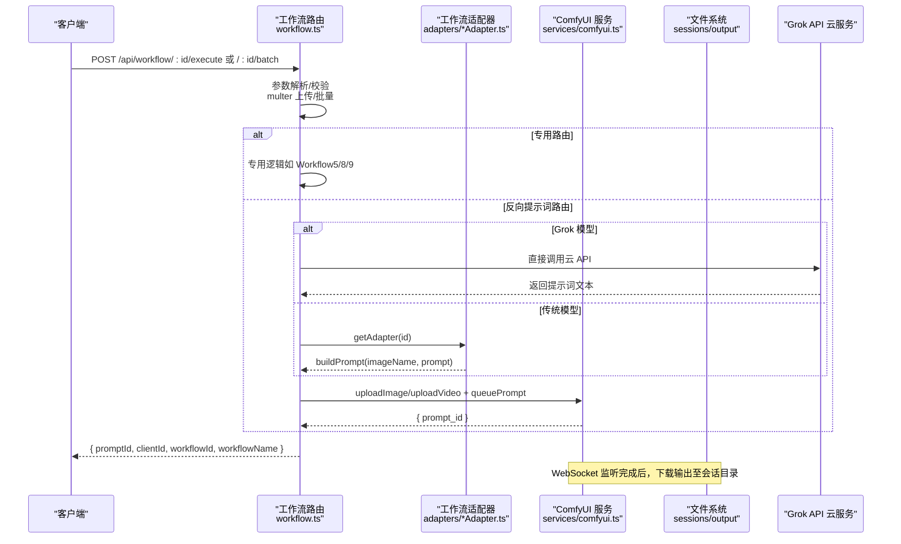
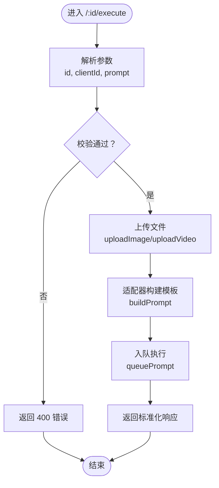
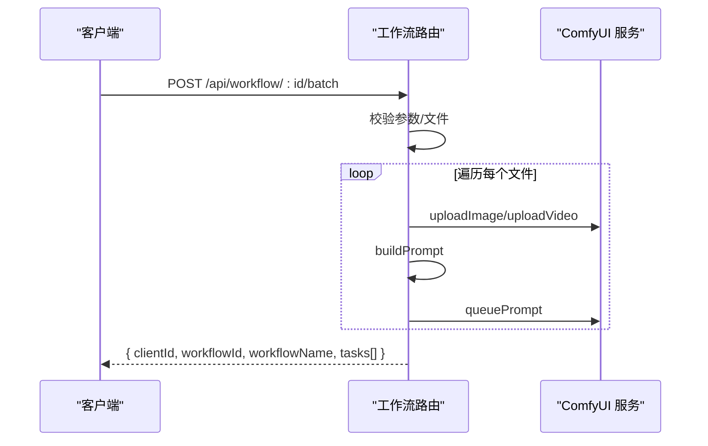
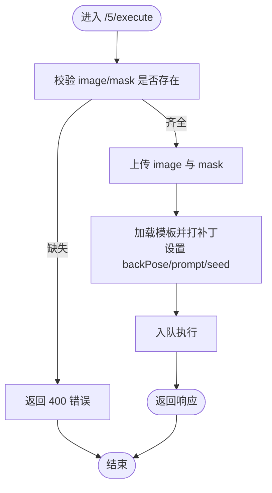
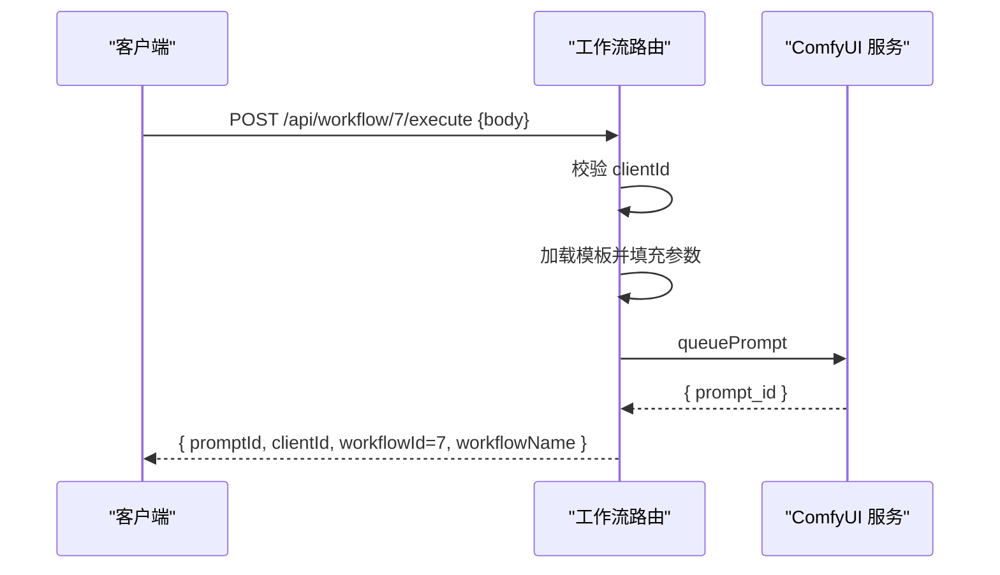
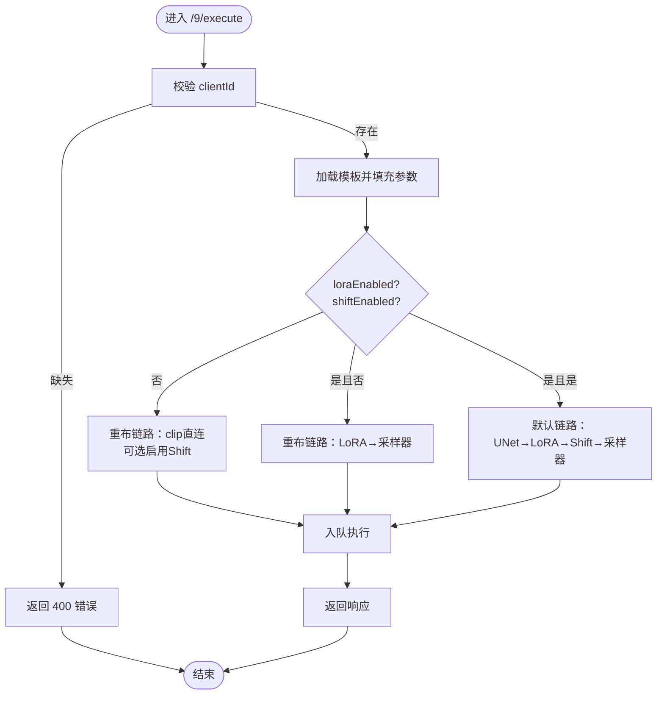
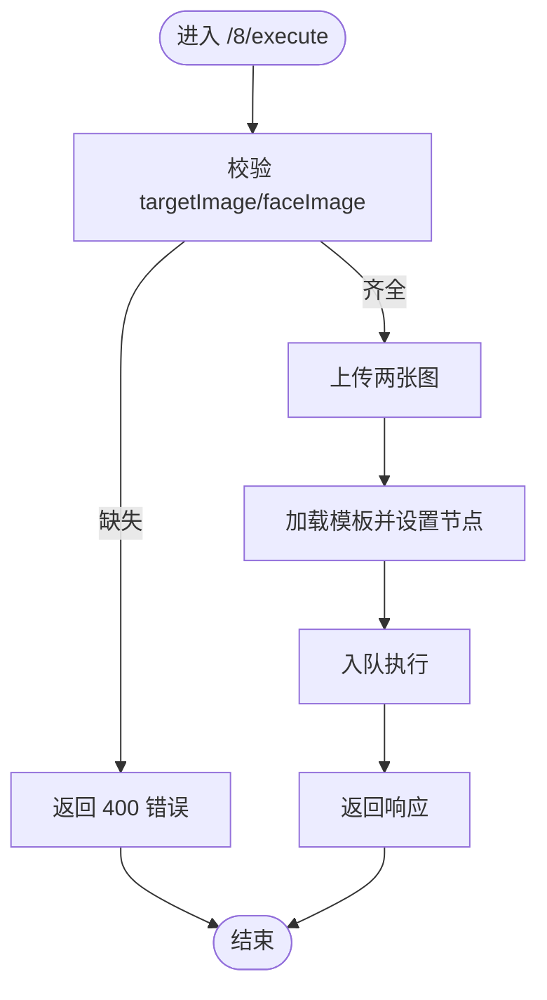
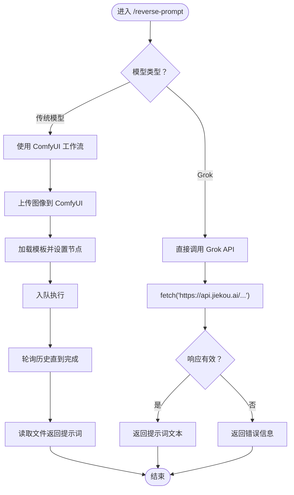
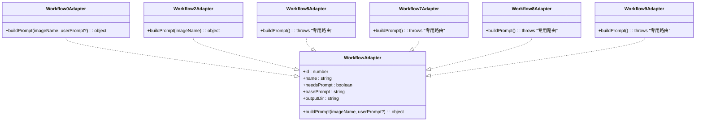
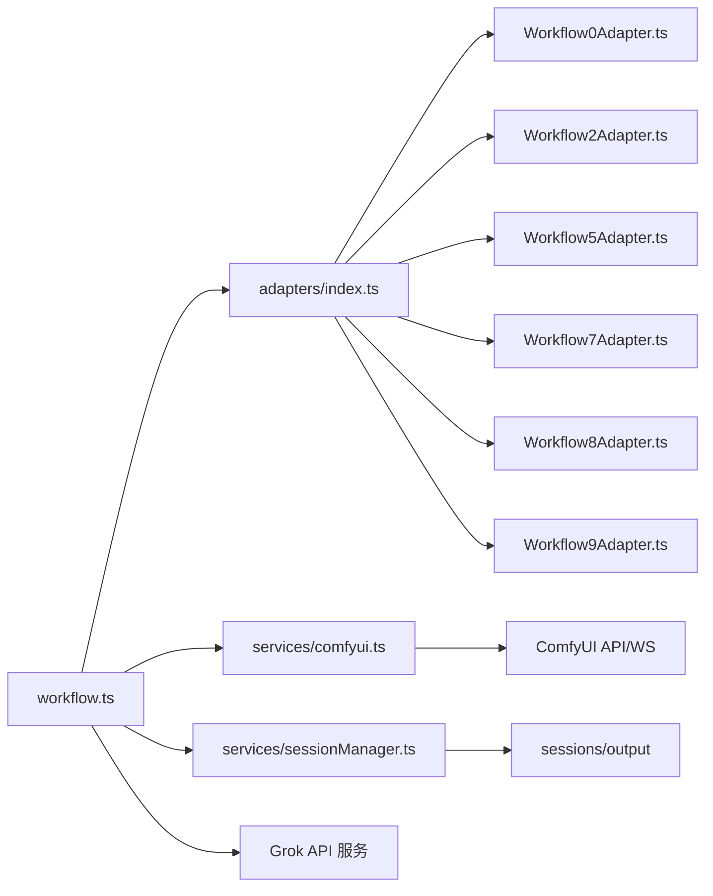

# 工作流路由模块

<cite>
**本文档引用的文件**
- [workflow.ts](file://server/src/routes/workflow.ts)
- [index.ts](file://server/src/index.ts)
- [comfyui.ts](file://server/src/services/comfyui.ts)
- [sessionManager.ts](file://server/src/services/sessionManager.ts)
- [index.ts（类型定义）](file://server/src/types/index.ts)
- [index.ts（适配器索引）](file://server/src/adapters/index.ts)
- [BaseAdapter.ts](file://server/src/adapters/BaseAdapter.ts)
- [Workflow0Adapter.ts](file://server/src/adapters/Workflow0Adapter.ts)
- [Workflow2Adapter.ts](file://server/src/adapters/Workflow2Adapter.ts)
- [Workflow5Adapter.ts](file://server/src/adapters/Workflow5Adapter.ts)
- [Workflow7Adapter.ts](file://server/src/adapters/Workflow7Adapter.ts)
- [Workflow8Adapter.ts](file://server/src/adapters/Workflow8Adapter.ts)
- [Workflow9Adapter.ts](file://server/src/adapters/Workflow9Adapter.ts)
- [useSettingsStore.ts](file://client/src/hooks/useSettingsStore.ts)
</cite>

## 更新摘要
**变更内容**
- 新增 Grok 反向提示词模型支持，提供绕过传统 ComfyUI 工作流的新路径
- 在 `/reverse-prompt` 路由中实现条件分支处理不同模型类型
- 添加 Grok API 调用、错误处理和响应处理的完整实现
- 更新客户端设置存储以支持新的 Grok 模型选项

## 目录
1. [简介](#简介)
2. [项目结构](#项目结构)
3. [核心组件](#核心组件)
4. [架构总览](#架构总览)
5. [详细组件分析](#详细组件分析)
6. [依赖关系分析](#依赖关系分析)
7. [性能考虑](#性能考虑)
8. [故障排除指南](#故障排除指南)
9. [结论](#结论)

## 简介
本文件系统性阐述 CorineKit Pix2Real 项目的"工作流路由模块"，重点覆盖以下内容：
- 单张图片处理路由（/:id/execute）
- 批量处理路由（/:id/batch）
- 特定工作流专用路由（如 /5/execute、/7/execute、/8/execute、/9/execute）
- 反向提示词模型支持（包括新增的 Grok 模型）
- 路由参数解析、文件上传处理、工作流适配器调用流程
- 不同工作流的特殊处理逻辑：解除装备的双文件上传、ZIT快出的 UNet+LoRA 模型配置、黑兽换脸的人脸交换处理
- 请求验证、错误处理、响应格式标准化

该模块通过 Express 路由统一入口，结合 ComfyUI 服务与会话管理服务，完成从请求到工作流执行、输出下载与事件推送的完整链路。

## 项目结构
工作流路由模块位于 server/src/routes 下，核心文件为 workflow.ts；配合适配器体系（adapters）、ComfyUI 服务（services/comfyui.ts）、会话管理（services/sessionManager.ts）以及类型定义（types/index.ts）共同构成完整的执行链路。

**图表来源**
- [index.ts:54-61](file://server/src/index.ts#L54-L61)
- [workflow.ts:1-25](file://server/src/routes/workflow.ts#L1-L25)
- [index.ts（适配器索引）:13-28](file://server/src/adapters/index.ts#L13-L28)
- [comfyui.ts:6-8](file://server/src/services/comfyui.ts#L6-L8)
- [sessionManager.ts](file://server/src/services/sessionManager.ts#L6)

**章节来源**
- [index.ts:54-61](file://server/src/index.ts#L54-L61)
- [workflow.ts:1-25](file://server/src/routes/workflow.ts#L1-L25)
- [index.ts（适配器索引）:13-28](file://server/src/adapters/index.ts#L13-L28)

## 核心组件
- 路由控制器：集中于 workflow.ts，负责路由注册、参数解析、文件上传、工作流适配器调用、错误处理与响应标准化。
- 适配器体系：每个工作流对应一个适配器，提供 buildPrompt 方法构建 ComfyUI 模板；通用工作流（0、2）使用模板文件，专用工作流（5、7、8、9）走独立路由。
- ComfyUI 服务：封装上传图像/视频、入队、查询历史、系统统计、队列操作、WebSocket 连接等。
- 会话管理服务：负责 sessions 目录结构、输入/输出/掩码文件保存、会话状态持久化。
- 类型定义：统一事件、队列、历史、输出等数据结构。
- Grok 反向提示词模型：提供绕过传统 ComfyUI 工作流的云 API 调用能力。

**章节来源**
- [workflow.ts:29-38](file://server/src/routes/workflow.ts#L29-L38)
- [index.ts（适配器索引）:13-28](file://server/src/adapters/index.ts#L13-L28)
- [comfyui.ts:9-60](file://server/src/services/comfyui.ts#L9-L60)
- [sessionManager.ts:20-57](file://server/src/services/sessionManager.ts#L20-L57)
- [index.ts（类型定义）:1-52](file://server/src/types/index.ts#L1-L52)

## 架构总览
工作流路由模块的总体执行路径如下：

**图表来源**
- [workflow.ts:407-455](file://server/src/routes/workflow.ts#L407-L455)
- [workflow.ts:457-520](file://server/src/routes/workflow.ts#L457-L520)
- [workflow.ts:679-745](file://server/src/routes/workflow.ts#L679-L745)
- [index.ts（适配器索引）:26-28](file://server/src/adapters/index.ts#L26-L28)
- [comfyui.ts:47-60](file://server/src/services/comfyui.ts#L47-L60)
- [index.ts:92-189](file://server/src/index.ts#L92-L189)

## 详细组件分析

### 通用路由：单张图片处理（/:id/execute）
- 路由设计
  - 使用动态参数 id，通过 getAdapter(id) 获取适配器实例。
  - 支持普通图片与视频（workflowId=4 时上传为视频）。
  - 通过 query 或 body 获取 clientId，支持可选用户提示词 prompt。
- 处理流程
  - 校验必填项（文件、clientId）。
  - 上传文件至 ComfyUI，得到 Comfy 文件名。
  - 调用适配器 buildPrompt 构建模板，入队执行。
  - 返回标准化响应（promptId、clientId、workflowId、workflowName）。
- 错误处理
  - 未知工作流、缺少文件、缺少 clientId、入队失败均返回 4xx/5xx 并附错误信息。
- 响应格式
  - 统一字段：promptId、clientId、workflowId、workflowName。

**图表来源**
- [workflow.ts:407-455](file://server/src/routes/workflow.ts#L407-L455)
- [index.ts（适配器索引）:26-28](file://server/src/adapters/index.ts#L26-L28)
- [comfyui.ts:9-45](file://server/src/services/comfyui.ts#L9-L45)

**章节来源**
- [workflow.ts:407-455](file://server/src/routes/workflow.ts#L407-L455)

### 通用路由：批量处理（/:id/batch）
- 路由设计
  - 接收 images 数组（最多 50 张），逐个处理。
  - 支持 prompts JSON 数组或单一 prompt 对齐到每张图片。
  - 同一 clientId 下顺序入队，返回任务列表。
- 处理流程
  - 校验工作流与文件集合。
  - 遍历文件，分别上传、构建模板、入队。
  - 汇总结果返回（每项含 originalName 与 promptId）。
- 错误处理
  - 任一环节异常中断，返回 500 并附错误信息。
- 响应格式
  - 包含 clientId、workflowId、workflowName、tasks 列表。

**图表来源**
- [workflow.ts:457-520](file://server/src/routes/workflow.ts#L457-L520)
- [comfyui.ts:9-45](file://server/src/services/comfyui.ts#L9-L45)

**章节来源**
- [workflow.ts:457-520](file://server/src/routes/workflow.ts#L457-L520)

### 专用路由：解除装备（/5/execute）
- 特殊点
  - 双文件上传：image 与 mask，二者缺一不可。
  - 支持 backPose 布尔参数控制姿态修正。
  - 支持用户自定义 prompt（为空则保留默认）。
- 处理流程
  - 校验两个文件与 clientId。
  - 分别上传 image 与 mask 至 ComfyUI。
  - 加载固定模板，设置节点输入（图像名、backPose、随机种子、prompt）。
  - 入队并返回标准化响应。

**图表来源**
- [workflow.ts:40-92](file://server/src/routes/workflow.ts#L40-L92)

**章节来源**
- [workflow.ts:40-92](file://server/src/routes/workflow.ts#L40-L92)

### 专用路由：快速出图（/7/execute）
- 特殊点
  - 文本生图专用路由，不涉及文件上传。
  - 通过 JSON Body 传入 clientId、model、prompt、尺寸、采样器、调度器、名称等。
- 处理流程
  - 校验 clientId。
  - 加载固定模板，按参数设置节点（模型、尺寸、采样、随机种子、prompt、输出前缀）。
  - 入队并返回标准化响应。

**图表来源**
- [workflow.ts:94-149](file://server/src/routes/workflow.ts#L94-L149)

**章节来源**
- [workflow.ts:94-149](file://server/src/routes/workflow.ts#L94-L149)

### 专用路由：ZIT快出（/9/execute）
- 特殊点
  - 文本生图，支持 UNet + LoRA 模型组合与 AuraFlow Shift。
  - 通过 JSON Body 传入 clientId、unetModel、loraModel、loraEnabled、shiftEnabled、shift、prompt、尺寸、采样器、调度器、名称等。
  - 根据 loraEnabled 与 shiftEnabled 动态重连模型链路（模板连线重布）。
- 处理流程
  - 校验 clientId。
  - 加载模板，设置 UNet、LoRA、尺寸、采样、随机种子、prompt、输出前缀。
  - 条件重布链路：当禁用 LoRA 时，clip 直连；启用 LoRA 且禁用 Shift 时，LoRA 输出给采样器；两者都启用则默认链路。
  - 入队并返回标准化响应。

**图表来源**
- [workflow.ts:181-261](file://server/src/routes/workflow.ts#L181-L261)

**章节来源**
- [workflow.ts:181-261](file://server/src/routes/workflow.ts#L181-L261)

### 专用路由：黑兽换脸（/8/execute）
- 特殊点
  - 双文件上传：targetImage（目标图）与 faceImage（人脸素材）。
  - 通过模板节点设置两张图的输入，随机种子。
- 处理流程
  - 校验两个文件与 clientId。
  - 分别上传两张图。
  - 加载模板，设置节点输入（目标图、人脸图、随机种子）。
  - 入队并返回标准化响应。

**图表来源**
- [workflow.ts:263-310](file://server/src/routes/workflow.ts#L263-L310)

**章节来源**
- [workflow.ts:263-310](file://server/src/routes/workflow.ts#L263-L310)

### 反向提示词模型支持（新增）
- 模型类型
  - 支持 Qwen3VL、Florence、WD-14 传统模型和新增的 Grok 云模型。
  - Grok 模型提供绕过传统 ComfyUI 工作流的直接 API 调用。
- 处理流程
  - 传统模型：通过 ComfyUI 工作流执行，使用模板节点生成提示词。
  - Grok 模型：直接调用云 API，无需上传到 ComfyUI。
- Grok 模型特性
  - 直接调用 https://api.jiekou.ai/openai/v1/chat/completions。
  - 使用 grok-4-fast-non-reasoning 模型。
  - 支持图像 URL 和文本提示的多模态输入。
  - 自动判断图片类型并返回相应格式的提示词。

**图表来源**
- [workflow.ts:679-745](file://server/src/routes/workflow.ts#L679-L745)

**章节来源**
- [workflow.ts:679-745](file://server/src/routes/workflow.ts#L679-L745)

### 通用适配器与模板构建
- 通用工作流（如 0、2）通过适配器读取对应 JSON 模板，设置输入节点（图像名、提示词、随机种子等），再入队。
- 专用工作流（5、7、8、9）不走通用适配器，直接在路由内加载模板并打补丁。

**图表来源**
- [index.ts（类型定义）:1-8](file://server/src/types/index.ts#L1-L8)
- [BaseAdapter.ts:1-4](file://server/src/adapters/BaseAdapter.ts#L1-L4)
- [Workflow0Adapter.ts:9-34](file://server/src/adapters/Workflow0Adapter.ts#L9-L34)
- [Workflow2Adapter.ts:9-27](file://server/src/adapters/Workflow2Adapter.ts#L9-L27)
- [Workflow5Adapter.ts:4-14](file://server/src/adapters/Workflow5Adapter.ts#L4-L14)
- [Workflow7Adapter.ts:3-13](file://server/src/adapters/Workflow7Adapter.ts#L3-L13)
- [Workflow8Adapter.ts:3-13](file://server/src/adapters/Workflow8Adapter.ts#L3-L13)
- [Workflow9Adapter.ts:3-13](file://server/src/adapters/Workflow9Adapter.ts#L3-L13)

**章节来源**
- [Workflow0Adapter.ts:16-33](file://server/src/adapters/Workflow0Adapter.ts#L16-L33)
- [Workflow2Adapter.ts:16-26](file://server/src/adapters/Workflow2Adapter.ts#L16-L26)
- [index.ts（适配器索引）:13-28](file://server/src/adapters/index.ts#L13-L28)

## 依赖关系分析
- 路由对适配器的依赖：通过 getAdapter(id) 获取具体适配器，解耦不同工作流的模板构建逻辑。
- 路由对 ComfyUI 服务的依赖：统一处理上传、入队、历史查询、系统统计、队列操作与 WebSocket 连接。
- 路由对会话管理服务的依赖：用于打开输出目录、导出混合结果等。
- 路由对 Grok API 的依赖：新增的云服务调用能力，提供绕过传统工作流的直接响应。
- 事件驱动：WebSocket 监听 ComfyUI 执行进度与完成事件，完成后自动下载输出到会话目录。

**图表来源**
- [workflow.ts:7-11](file://server/src/routes/workflow.ts#L7-L11)
- [index.ts（适配器索引）:13-28](file://server/src/adapters/index.ts#L13-L28)
- [comfyui.ts:6-8](file://server/src/services/comfyui.ts#L6-L8)
- [sessionManager.ts](file://server/src/services/sessionManager.ts#L6)

**章节来源**
- [workflow.ts:7-11](file://server/src/routes/workflow.ts#L7-L11)
- [index.ts（适配器索引）:13-28](file://server/src/adapters/index.ts#L13-L28)

## 性能考虑
- 批量处理限制：单次最多 50 张图片，避免一次性占用过多资源。
- 视频上传：workflowId=4 时使用 uploadVideo，注意视频体积与内存占用。
- WebSocket 事件缓冲：首次连接时可重放近期事件，减少客户端等待时间。
- 模型链路重布：ZIT快出根据开关动态调整 UNet→LoRA→Shift 的连接，避免不必要的中间节点，提升吞吐。
- 系统统计：提供 VRAM/内存使用情况，便于监控与资源调度。
- Grok API 调用：直接云 API 调用，避免本地计算资源占用，但需考虑网络延迟和 API 限流。

## 故障排除指南
- 常见错误与处理
  - 缺少文件或参数：返回 400，检查 clientId、文件上传、JSON 字段。
  - 未知工作流：返回 400，确认 id 在适配器映射中。
  - 入队失败：返回 500，检查 ComfyUI 可达性与模板节点配置。
  - 专用路由误用：如 /5/execute 需要双文件，否则返回 400。
  - Grok API 错误：返回 502，检查 API 密钥和网络连接。
- 响应格式标准化
  - 成功：统一包含 promptId、clientId、workflowId、workflowName。
  - 失败：统一包含 error 字段，状态码与错误信息明确。
- 日志与调试
  - 路由层记录 [Workflow X Execute Error] 等错误日志，便于定位问题。
  - WebSocket 层记录执行开始、进度、完成与错误事件，辅助排障。
  - Grok API 调用记录详细的 API 错误信息和响应状态。

**章节来源**
- [workflow.ts:88-91](file://server/src/routes/workflow.ts#L88-L91)
- [workflow.ts:145-148](file://server/src/routes/workflow.ts#L145-L148)
- [workflow.ts:257-260](file://server/src/routes/workflow.ts#L257-L260)
- [workflow.ts:306-309](file://server/src/routes/workflow.ts#L306-L309)
- [workflow.ts:451-454](file://server/src/routes/workflow.ts#L451-L454)
- [workflow.ts:720-726](file://server/src/routes/workflow.ts#L720-L726)
- [workflow.ts:740-744](file://server/src/routes/workflow.ts#L740-L744)
- [index.ts:92-189](file://server/src/index.ts#L92-L189)

## 结论
工作流路由模块以"通用路由 + 专用路由 + 适配器模板"的架构实现了灵活、可扩展的工作流执行体系。通过严格的参数校验、标准化响应与完善的错误处理，确保了跨工作流的一致体验。专用路由针对特定业务场景（双文件上传、UNet+LoRA 链路重布、人脸交换）提供了精确的实现路径，同时保持与通用适配器的解耦，便于后续新增工作流与维护。

**新增的 Grok 反向提示词模型支持**进一步增强了系统的灵活性，为用户提供绕过传统 ComfyUI 工作流的直接 API 能力，特别适合需要快速获取提示词文本的场景。这一功能的加入体现了系统在保持向后兼容性的同时，积极采用新技术来提升用户体验的设计理念。