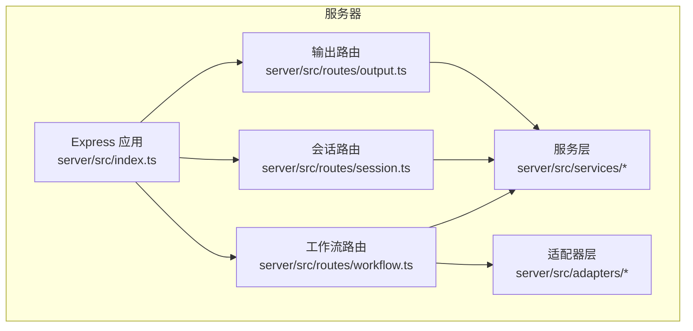
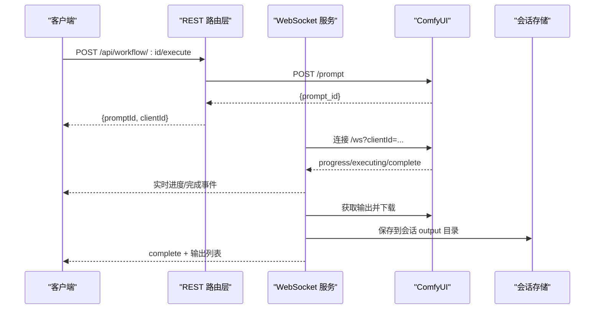
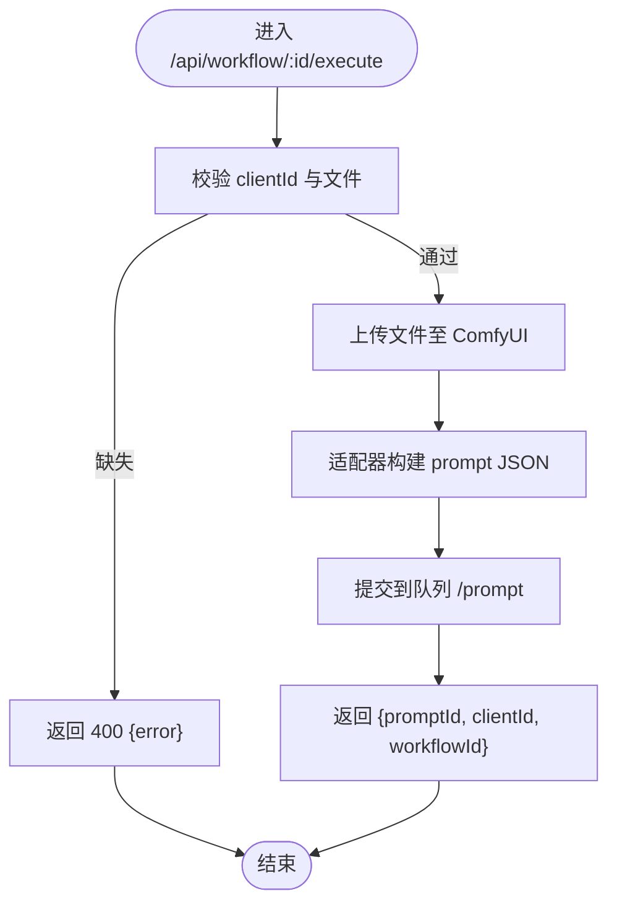
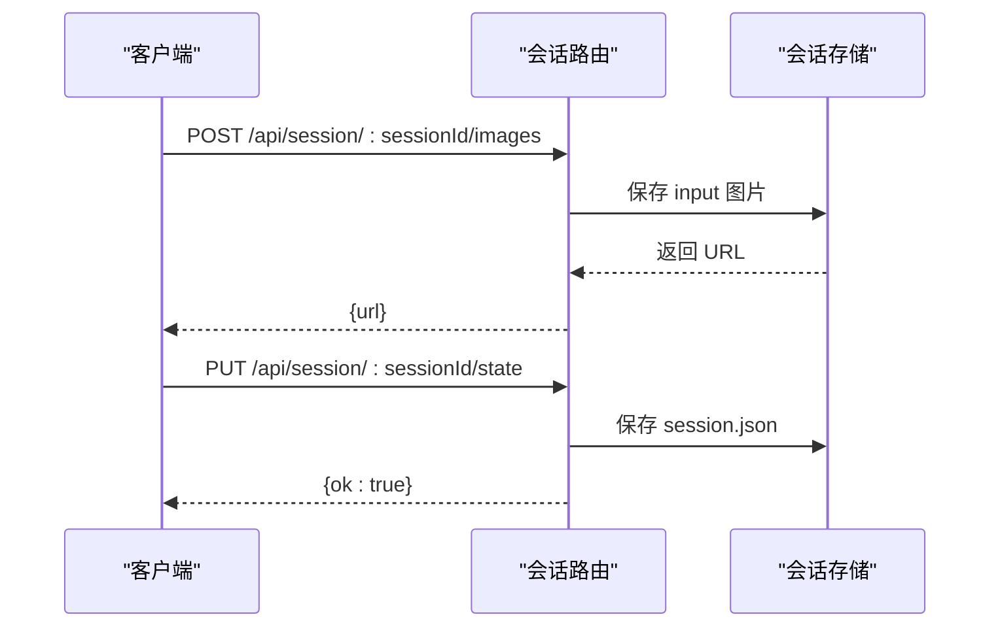
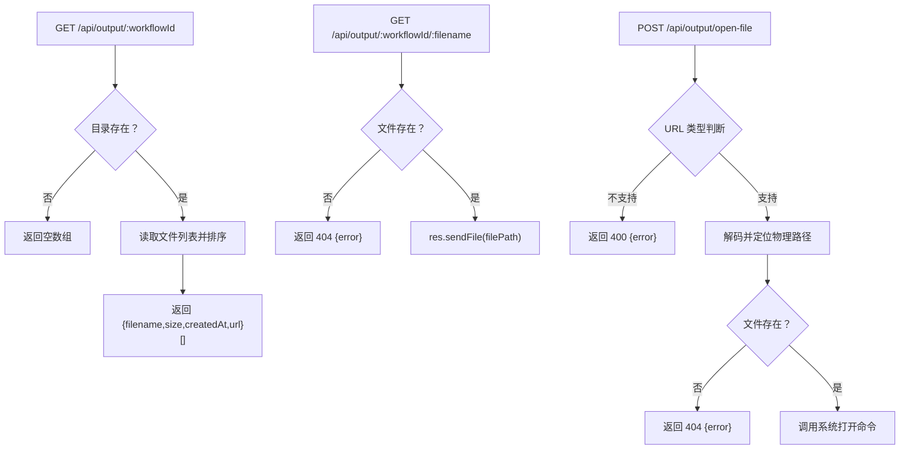
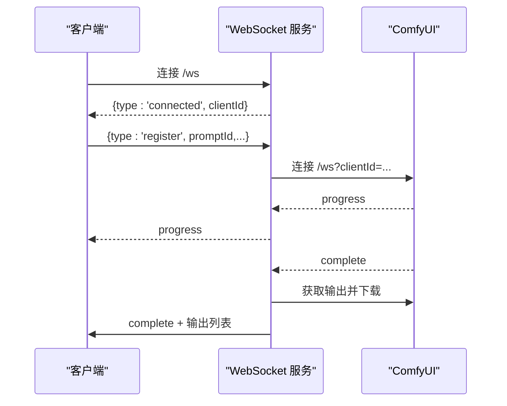
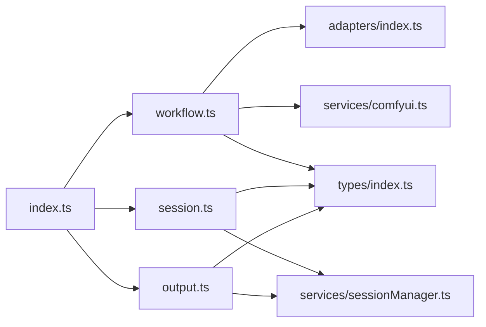

# 路由系统设计

<cite>
**本文档引用的文件**
- [server/src/index.ts](file://server/src/index.ts)
- [server/src/routes/workflow.ts](file://server/src/routes/workflow.ts)
- [server/src/routes/session.ts](file://server/src/routes/session.ts)
- [server/src/routes/output.ts](file://server/src/routes/output.ts)
- [server/src/services/comfyui.ts](file://server/src/services/comfyui.ts)
- [server/src/services/sessionManager.ts](file://server/src/services/sessionManager.ts)
- [server/src/adapters/index.ts](file://server/src/adapters/index.ts)
- [server/src/adapters/Workflow0Adapter.ts](file://server/src/adapters/Workflow0Adapter.ts)
- [server/src/types/index.ts](file://server/src/types/index.ts)
</cite>

## 目录
1. [简介](#简介)
2. [项目结构](#项目结构)
3. [核心组件](#核心组件)
4. [架构总览](#架构总览)
5. [详细组件分析](#详细组件分析)
6. [依赖关系分析](#依赖关系分析)
7. [性能考量](#性能考量)
8. [故障排除指南](#故障排除指南)
9. [结论](#结论)

## 简介
本设计文档面向 CorineKit Pix2Real 项目的路由系统，系统采用基于 Express 的 RESTful API 架构，结合 WebSocket 实时通信与 ComfyUI 工作流引擎，提供图像/视频生成、会话管理、输出文件服务等能力。本文档重点阐述：
- RESTful API 路由组织结构与命名规范
- 工作流路由（workflow）的设计原则与参数处理
- 输出文件路由（output）的静态服务与动态下载
- 会话路由（session）的状态持久化与文件存储
- 请求验证、响应格式标准化与错误处理机制
- 静态文件服务配置、目录映射策略与访问控制
- 安全考虑与最佳实践

## 项目结构
后端服务位于 server 目录，采用分层架构：
- 入口文件负责中间件、静态资源、路由挂载与 WebSocket 连接
- 路由层按功能域划分：工作流、会话、输出
- 服务层封装与 ComfyUI 的交互以及会话文件系统操作
- 适配器层抽象不同工作流的模板构建逻辑
- 类型定义统一事件与数据结构

图表来源
- [server/src/index.ts:42-61](file://server/src/index.ts#L42-L61)
- [server/src/routes/workflow.ts:22-27](file://server/src/routes/workflow.ts#L22-L27)
- [server/src/routes/session.ts:15-16](file://server/src/routes/session.ts#L15-L16)
- [server/src/routes/output.ts:11-12](file://server/src/routes/output.ts#L11-L12)

章节来源
- [server/src/index.ts:42-61](file://server/src/index.ts#L42-L61)
- [server/src/routes/workflow.ts:22-27](file://server/src/routes/workflow.ts#L22-L27)
- [server/src/routes/session.ts:15-16](file://server/src/routes/session.ts#L15-L16)
- [server/src/routes/output.ts:11-12](file://server/src/routes/output.ts#L11-L12)

## 核心组件
- RESTful 路由组织
  - /api/workflow：工作流执行、队列管理、模型列表、系统状态、提示词反推、提示词助理等
  - /api/session：会话创建、保存状态、上传输入图片/掩码、列出与删除会话
  - /api/output：列出工作流输出文件、下载单个文件、打开文件
- 中间件与静态服务
  - CORS、JSON 解析、静态目录映射（/output、/api/session-files）
- WebSocket 服务
  - /ws：连接 ComfyUI 并向客户端推送进度、完成与错误事件，同时自动下载输出到会话目录
- 服务与适配器
  - comfyui.ts：与 ComfyUI 的 HTTP/WebSocket 交互
  - sessionManager.ts：会话文件系统操作与状态持久化
  - adapters/index.ts + 各 Adapter：工作流模板构建

章节来源
- [server/src/index.ts:42-61](file://server/src/index.ts#L42-L61)
- [server/src/routes/workflow.ts:29-38](file://server/src/routes/workflow.ts#L29-L38)
- [server/src/routes/session.ts:18-33](file://server/src/routes/session.ts#L18-L33)
- [server/src/routes/output.ts:22-53](file://server/src/routes/output.ts#L22-L53)

## 架构总览
整体架构围绕“路由层-服务层-适配器层-外部系统”的分层设计展开，WebSocket 作为实时事件通道贯穿整个流程。

图表来源
- [server/src/index.ts:73-219](file://server/src/index.ts#L73-L219)
- [server/src/services/comfyui.ts:47-83](file://server/src/services/comfyui.ts#L47-L83)
- [server/src/services/sessionManager.ts:34-44](file://server/src/services/sessionManager.ts#L34-L44)

## 详细组件分析

### 工作流路由（/api/workflow）
- 设计原则
  - 资源化命名：以工作流 ID 组织执行端点，支持单次与批量执行
  - 参数处理：优先从查询参数或请求体读取 clientId；对文件上传使用 multer 内存存储
  - 响应标准化：统一返回 {promptId, clientId, workflowId, workflowName, tasks 等}
  - 错误处理：捕获异常并返回 4xx/5xx 与错误信息
- 关键端点
  - GET /api/workflow：列出可用工作流及其元信息
  - POST /api/workflow/:id/execute：单张图片/视频执行
  - POST /api/workflow/:id/batch：批量执行（最多 50 张）
  - POST /api/workflow/:id/open-folder：打开会话输出目录
  - POST /api/workflow/export-blend：保存混合结果到会话输出
  - POST /api/workflow/reverse-prompt：提示词反推（多模型）
  - POST /api/workflow/prompt-assistant：提示词助理
  - GET /api/workflow/models/*：列举模型列表
  - GET /api/workflow/system-stats：系统资源统计
  - GET /api/workflow/queue：队列状态
  - POST /api/workflow/queue/prioritize/:promptId：置顶队列项
  - POST /api/workflow/cancel-queue/:promptId：取消队列项
  - POST /api/workflow/release-memory：释放显存/内存
- 请求验证与响应
  - 必填参数校验：clientId、文件存在性、工作流 ID 有效性
  - 响应格式：成功统一返回对象；失败返回 {error}，状态码 400/404/500/502/504
- 适配器与模板
  - 通过适配器工厂选择对应工作流模板，构建 prompt JSON 并入队
  - 特定工作流（如 Workflow 5/8/9）有专用模板与参数映射
- 安全与健壮性
  - 文件名清洗：导出混合结果时对文件名进行安全过滤
  - 超时控制：提示词反推与提示词助理设置超时轮询
  - 资源清理：临时文件在读取后删除

图表来源
- [server/src/routes/workflow.ts:408-455](file://server/src/routes/workflow.ts#L408-L455)
- [server/src/adapters/index.ts:26-28](file://server/src/adapters/index.ts#L26-L28)

章节来源
- [server/src/routes/workflow.ts:29-38](file://server/src/routes/workflow.ts#L29-L38)
- [server/src/routes/workflow.ts:408-455](file://server/src/routes/workflow.ts#L408-L455)
- [server/src/routes/workflow.ts:457-520](file://server/src/routes/workflow.ts#L457-L520)
- [server/src/routes/workflow.ts:581-623](file://server/src/routes/workflow.ts#L581-L623)
- [server/src/routes/workflow.ts:626-655](file://server/src/routes/workflow.ts#L626-L655)
- [server/src/routes/workflow.ts:674-744](file://server/src/routes/workflow.ts#L674-L744)
- [server/src/routes/workflow.ts:746-800](file://server/src/routes/workflow.ts#L746-L800)
- [server/src/routes/workflow.ts:151-179](file://server/src/routes/workflow.ts#L151-L179)
- [server/src/routes/workflow.ts:532-539](file://server/src/routes/workflow.ts#L532-L539)
- [server/src/routes/workflow.ts:561-569](file://server/src/routes/workflow.ts#L561-L569)
- [server/src/routes/workflow.ts:571-579](file://server/src/routes/workflow.ts#L571-L579)
- [server/src/routes/workflow.ts:542-559](file://server/src/routes/workflow.ts#L542-L559)

### 会话路由（/api/session）
- 设计原则
  - 会话即资源：每个 sessionId 对应一个独立的工作空间
  - 分页标签（tab）隔离：每个 tab 下维护 input/masks/output 子目录
  - 状态持久化：支持 PUT 与 POST 两种方式保存状态（兼容页面关闭场景）
- 关键端点
  - POST /api/session/:sessionId/images：上传输入图片，返回可访问 URL
  - POST /api/session/:sessionId/masks：上传掩码 PNG
  - PUT /api/session/:sessionId/state：保存会话状态
  - POST /api/session/:sessionId/state：保存会话状态（sendBeacon）
  - GET /api/session/:sessionId：加载会话
  - GET /api/sessions：列出所有会话元数据
  - DELETE /api/session/:sessionId：删除会话
- 请求验证与响应
  - 必填字段：multipart 字段与数值解析
  - 响应：成功返回 {ok: true} 或 {url}；失败返回 {error}
- 目录映射与权限
  - 会话文件根目录 sessionsBase，静态映射为 /api/session-files
  - 掩码文件名中冒号替换为下划线，避免 Windows 不兼容

图表来源
- [server/src/routes/session.ts:18-33](file://server/src/routes/session.ts#L18-L33)
- [server/src/routes/session.ts:51-68](file://server/src/routes/session.ts#L51-L68)
- [server/src/services/sessionManager.ts:20-32](file://server/src/services/sessionManager.ts#L20-L32)
- [server/src/services/sessionManager.ts:91-110](file://server/src/services/sessionManager.ts#L91-L110)

章节来源
- [server/src/routes/session.ts:18-33](file://server/src/routes/session.ts#L18-L33)
- [server/src/routes/session.ts:35-49](file://server/src/routes/session.ts#L35-L49)
- [server/src/routes/session.ts:51-68](file://server/src/routes/session.ts#L51-L68)
- [server/src/routes/session.ts:70-85](file://server/src/routes/session.ts#L70-L85)
- [server/src/routes/session.ts:87-92](file://server/src/routes/session.ts#L87-L92)
- [server/src/services/sessionManager.ts:20-32](file://server/src/services/sessionManager.ts#L20-L32)
- [server/src/services/sessionManager.ts:46-57](file://server/src/services/sessionManager.ts#L46-L57)
- [server/src/services/sessionManager.ts:91-110](file://server/src/services/sessionManager.ts#L91-L110)

### 输出路由（/api/output）
- 设计原则
  - 输出目录与工作流一一对应，便于分类管理
  - 支持列出目录内文件、下载单个文件、跨路径打开文件
- 关键端点
  - GET /api/output/:workflowId：列出该工作流的输出文件（含大小、时间、URL）
  - GET /api/output/:workflowId/:filename：下载指定文件
  - POST /api/output/open-file：根据 URL 打开本地文件（支持 /output、/api/output、/api/session-files）
- 静态服务与目录映射
  - /output 映射到项目根 output 目录
  - /api/session-files 映射到 sessionsBase 目录
- 访问控制
  - 仅允许下载已存在的文件；非法 URL 返回 400/404
  - 打开文件使用系统默认应用，跨平台命令适配

图表来源
- [server/src/routes/output.ts:22-53](file://server/src/routes/output.ts#L22-L53)
- [server/src/routes/output.ts:55-73](file://server/src/routes/output.ts#L55-L73)
- [server/src/routes/output.ts:75-131](file://server/src/routes/output.ts#L75-L131)
- [server/src/index.ts:58-60](file://server/src/index.ts#L58-L60)

章节来源
- [server/src/routes/output.ts:22-53](file://server/src/routes/output.ts#L22-L53)
- [server/src/routes/output.ts:55-73](file://server/src/routes/output.ts#L55-L73)
- [server/src/routes/output.ts:75-131](file://server/src/routes/output.ts#L75-L131)
- [server/src/index.ts:58-60](file://server/src/index.ts#L58-L60)

### WebSocket 与实时事件
- 设计原则
  - 客户端连接后获得唯一 clientId，并注册 promptId 映射
  - 缓存早期事件，确保客户端重连后能补发
  - 完成后自动下载输出并保存到会话 output 目录
- 关键行为
  - 注册：客户端发送 {type:'register', promptId, workflowId, sessionId, tabId}
  - 事件：execution_start、progress、complete、error
  - 自动下载：根据历史记录拉取输出并写入会话目录

图表来源
- [server/src/index.ts:73-219](file://server/src/index.ts#L73-L219)
- [server/src/services/comfyui.ts:127-188](file://server/src/services/comfyui.ts#L127-L188)

章节来源
- [server/src/index.ts:73-219](file://server/src/index.ts#L73-L219)
- [server/src/services/comfyui.ts:127-188](file://server/src/services/comfyui.ts#L127-L188)

## 依赖关系分析
- 路由层依赖
  - workflow 路由依赖适配器工厂与服务层（上传、队列、系统状态）
  - session 路由依赖会话管理服务（文件系统操作、状态持久化）
  - output 路由依赖会话管理服务（sessionsBase）与静态目录映射
- 服务层依赖
  - comfyui 服务封装 ComfyUI 的 HTTP/WebSocket 接口
  - sessionManager 服务封装会话文件系统操作
- 类型定义
  - 统一事件类型（ProgressEvent、CompleteEvent、ErrorEvent）、队列与历史结构

图表来源
- [server/src/routes/workflow.ts:7-10](file://server/src/routes/workflow.ts#L7-L10)
- [server/src/adapters/index.ts:13-28](file://server/src/adapters/index.ts#L13-L28)
- [server/src/services/comfyui.ts:1-7](file://server/src/services/comfyui.ts#L1-L7)
- [server/src/services/sessionManager.ts:6](file://server/src/services/sessionManager.ts#L6)
- [server/src/routes/session.ts:4-13](file://server/src/routes/session.ts#L4-L13)
- [server/src/routes/output.ts:6](file://server/src/routes/output.ts#L6)
- [server/src/index.ts:8-12](file://server/src/index.ts#L8-L12)
- [server/src/types/index.ts:1-8](file://server/src/types/index.ts#L1-L8)

章节来源
- [server/src/routes/workflow.ts:7-10](file://server/src/routes/workflow.ts#L7-L10)
- [server/src/adapters/index.ts:13-28](file://server/src/adapters/index.ts#L13-L28)
- [server/src/services/comfyui.ts:1-7](file://server/src/services/comfyui.ts#L1-L7)
- [server/src/services/sessionManager.ts:6](file://server/src/services/sessionManager.ts#L6)
- [server/src/routes/session.ts:4-13](file://server/src/routes/session.ts#L4-L13)
- [server/src/routes/output.ts:6](file://server/src/routes/output.ts#L6)
- [server/src/index.ts:8-12](file://server/src/index.ts#L8-L12)
- [server/src/types/index.ts:1-8](file://server/src/types/index.ts#L1-L8)

## 性能考量
- 文件上传
  - 使用 multer 内存存储，适合小文件；大文件建议改用磁盘存储并配合流式处理
- 队列与并发
  - 批量执行支持最多 50 张，注意队列压力与 ComfyUI 资源占用
- WebSocket
  - 事件缓冲减少重连丢失，但需控制事件频率避免内存膨胀
- 静态服务
  - /output 与 /api/session-files 为静态映射，适合直接下载；大文件建议 CDN 或分块传输

## 故障排除指南
- 常见错误与处理
  - 400：缺少必填参数（clientId、文件、字段缺失），检查请求体与 multipart 字段
  - 404：会话不存在或文件不存在，确认 sessionId 与路径
  - 500：内部错误，查看服务端日志与 ComfyUI 可用性
  - 502：ComfyUI 不可用，检查服务状态与网络
  - 504：提示词反推/助理超时，适当增加等待时间或降低模型负载
- 日志与调试
  - 服务端在路由层与 WebSocket 层均输出错误日志，便于定位问题
  - WebSocket 注册失败时检查客户端是否正确发送注册消息

章节来源
- [server/src/routes/workflow.ts:88-91](file://server/src/routes/workflow.ts#L88-L91)
- [server/src/routes/workflow.ts:145-148](file://server/src/routes/workflow.ts#L145-L148)
- [server/src/routes/session.ts:25-28](file://server/src/routes/session.ts#L25-L28)
- [server/src/routes/output.ts:67-70](file://server/src/routes/output.ts#L67-L70)
- [server/src/index.ts:177-188](file://server/src/index.ts#L177-L188)

## 结论
本路由系统以清晰的 RESTful 设计与模块化分层实现了工作流编排、会话管理与输出服务的完整闭环。通过适配器抽象与 WebSocket 实时事件，系统具备良好的扩展性与可观测性。建议在生产环境中进一步完善：
- 大文件上传的流式处理与断点续传
- 队列优先级与限流策略
- 静态资源缓存与 CDN 集成
- 更细粒度的访问控制与鉴权机制