# 输出文件路由模块

<cite>
**本文档引用的文件**
- [server/src/routes/output.ts](file://server/src/routes/output.ts)
- [server/src/index.ts](file://server/src/index.ts)
- [server/src/services/sessionManager.ts](file://server/src/services/sessionManager.ts)
- [server/src/types/index.ts](file://server/src/types/index.ts)
- [client/src/hooks/useSession.ts](file://client/src/hooks/useSession.ts)
- [client/src/hooks/useWorkflowStore.ts](file://client/src/hooks/useWorkflowStore.ts)
</cite>

## 目录
1. [简介](#简介)
2. [项目结构](#项目结构)
3. [核心组件](#核心组件)
4. [架构概览](#架构概览)
5. [详细组件分析](#详细组件分析)
6. [依赖关系分析](#依赖关系分析)
7. [性能考虑](#性能考虑)
8. [故障排除指南](#故障排除指南)
9. [结论](#结论)

## 简介

输出文件路由模块是 CorineKit Pix2Real 项目中负责处理生成文件下载和访问的核心组件。该模块实现了静态文件服务路由，支持多种工作流类型的输出文件管理，提供文件列表查询、单文件下载、文件打开等功能。

本模块采用 Express.js 构建，通过 RESTful API 提供文件服务，支持不同工作流类型（如二次元转真人、真人精修等）的文件组织和访问控制。系统通过会话管理和工作流映射机制，确保文件访问的安全性和可追溯性。

## 项目结构

输出文件路由模块位于服务器端代码的路由层，与会话管理、工作流适配器等核心组件协同工作：

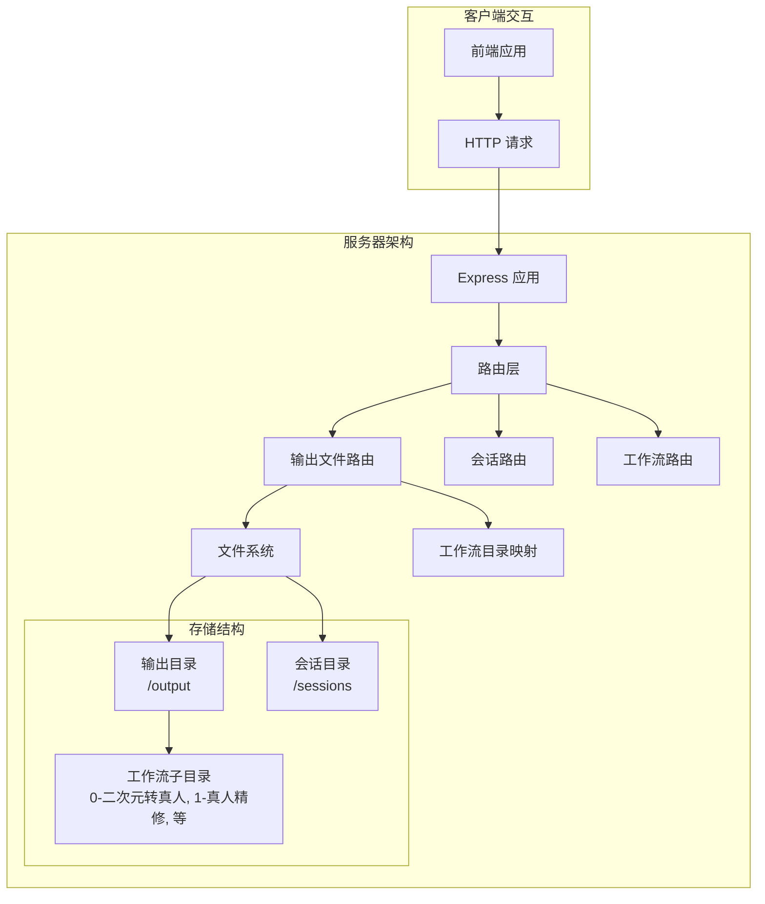

**图表来源**
- [server/src/index.ts:54-60](file://server/src/index.ts#L54-L60)
- [server/src/routes/output.ts:9](file://server/src/routes/output.ts#L9)

**章节来源**
- [server/src/index.ts:15-35](file://server/src/index.ts#L15-L35)
- [server/src/routes/output.ts:13-20](file://server/src/routes/output.ts#L13-L20)

## 核心组件

输出文件路由模块包含三个主要路由处理器：

### 1. 文件列表路由
- **路径**: `/api/output/:workflowId`
- **方法**: GET
- **功能**: 列出指定工作流类型的所有输出文件
- **返回**: 文件信息数组（包含文件名、大小、创建时间、下载链接）

### 2. 单文件下载路由  
- **路径**: `/api/output/:workflowId/:filename`
- **方法**: GET
- **功能**: 下载指定的工作流文件
- **返回**: 文件二进制数据

### 3. 文件打开路由
- **路径**: `/api/output/open-file`
- **方法**: POST
- **功能**: 使用操作系统默认应用程序打开文件
- **参数**: 包含文件 URL 的 JSON 对象

**章节来源**
- [server/src/routes/output.ts:22-73](file://server/src/routes/output.ts#L22-L73)
- [server/src/routes/output.ts:75-131](file://server/src/routes/output.ts#L75-L131)

## 架构概览

输出文件路由模块采用分层架构设计，与会话管理系统和工作流适配器紧密集成：

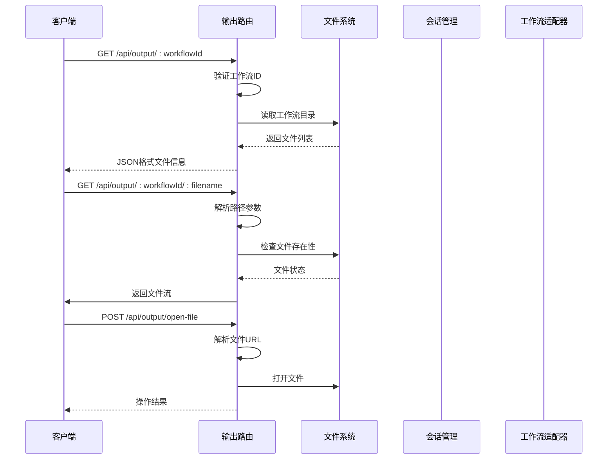

**图表来源**
- [server/src/routes/output.ts:23-73](file://server/src/routes/output.ts#L23-L73)
- [server/src/index.ts:112-129](file://server/src/index.ts#L112-L129)

## 详细组件分析

### 路由处理器实现

#### 文件列表处理器
该处理器负责返回指定工作流类型的所有输出文件信息：

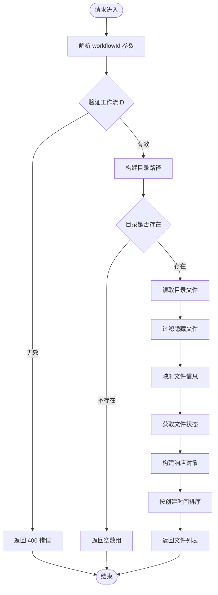

**图表来源**
- [server/src/routes/output.ts:23-53](file://server/src/routes/output.ts#L23-L53)

#### 单文件下载处理器
该处理器提供文件下载功能，包含完整的安全检查：

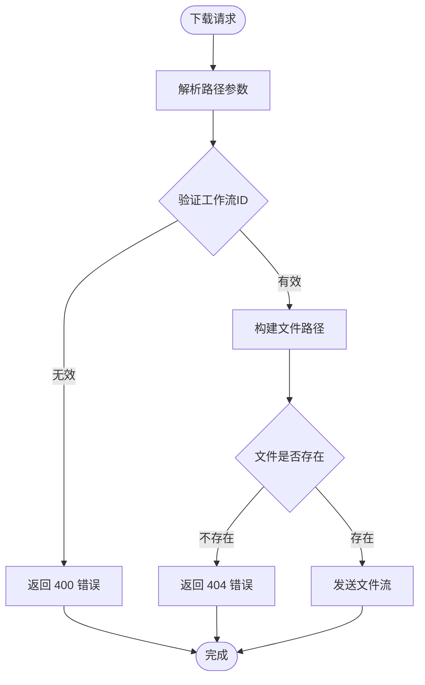

**图表来源**
- [server/src/routes/output.ts:56-73](file://server/src/routes/output.ts#L56-L73)

#### 文件打开处理器
该处理器支持跨平台文件打开操作：

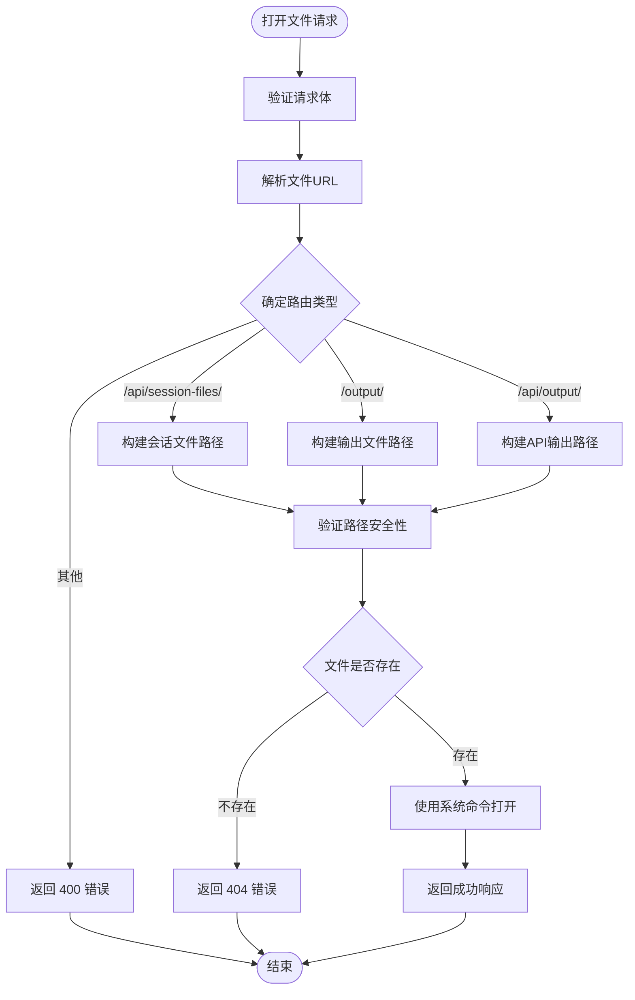

**图表来源**
- [server/src/routes/output.ts:76-131](file://server/src/routes/output.ts#L76-L131)

### 存储结构和命名规则

#### 目录结构
系统采用层次化的文件存储结构：

```
output/
├── 0-二次元转真人/
├── 1-真人精修/
├── 2-精修放大/
├── 3-快速生成视频/
├── 4-视频放大/
├── 5-解除装备/
├── 6-真人转二次元/
├── 7-快速出图/
├── 8-黑兽换脸/
└── 9-ZIT快出/
```

每个工作流类型都有独立的输出目录，便于文件管理和访问控制。

#### 文件命名规则
- 文件名保持原始生成时的名称
- 支持所有常见的图像和视频格式
- 特殊字符在 URL 中进行适当的编码处理

**章节来源**
- [server/src/index.ts:18-35](file://server/src/index.ts#L18-L35)
- [server/src/routes/output.ts:13-20](file://server/src/routes/output.ts#L13-L20)

### 访问权限控制机制

#### 工作流ID验证
所有文件访问都必须通过有效的 `workflowId` 参数验证，防止越权访问：

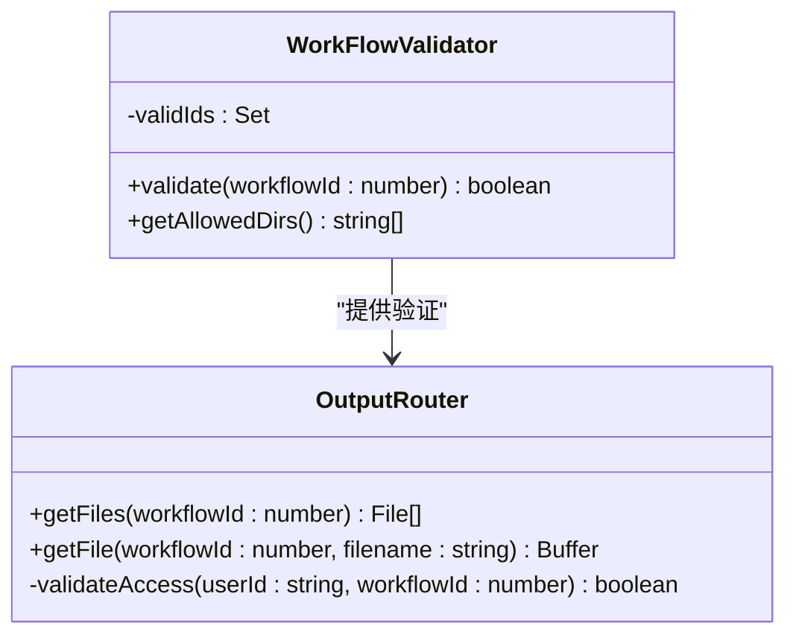

**图表来源**
- [server/src/routes/output.ts:23-30](file://server/src/routes/output.ts#L23-L30)

#### 路径安全检查
系统实施多层路径安全检查：

1. **参数验证**: 确保 `workflowId` 在允许范围内
2. **路径构建**: 使用安全的路径拼接方法
3. **文件存在性检查**: 验证目标文件确实存在
4. **目录遍历防护**: 防止使用相对路径绕过目录限制

**章节来源**
- [server/src/routes/output.ts:56-73](file://server/src/routes/output.ts#L56-L73)

### MIME类型处理

系统采用智能的 MIME 类型检测机制：

#### 自动类型识别
- 基于文件扩展名自动识别内容类型
- 支持常见图像格式：PNG、JPG、JPEG、GIF、WEBP
- 支持视频格式：MP4、MOV、AVI
- 其他格式：PDF、TXT 等

#### 客户端类型协商
浏览器通过 Accept 头部指定期望的文件类型，服务器根据文件实际类型提供相应的 MIME 类型。

**章节来源**
- [server/src/routes/output.ts:72](file://server/src/routes/output.ts#L72)

### 文件流传输优化

#### 流式传输
系统使用 Express.js 的 `sendFile` 方法进行高效的文件流传输：

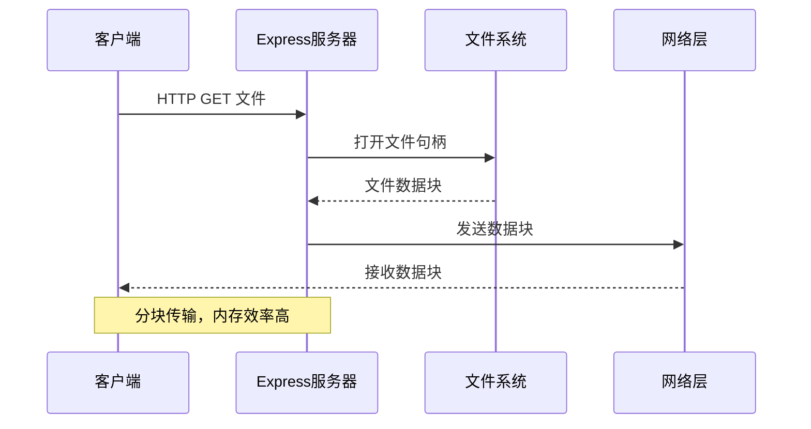

**图表来源**
- [server/src/routes/output.ts:72](file://server/src/routes/output.ts#L72)

#### 大文件处理策略
对于大型文件，系统采用以下优化策略：

1. **分块传输**: 将大文件分割成多个数据块传输
2. **内存管理**: 避免将整个文件加载到内存中
3. **超时处理**: 设置合理的传输超时时间
4. **进度反馈**: 为长文件传输提供进度指示

### 缓存机制

#### 内置缓存策略
Express.js 提供了内置的静态文件缓存机制：

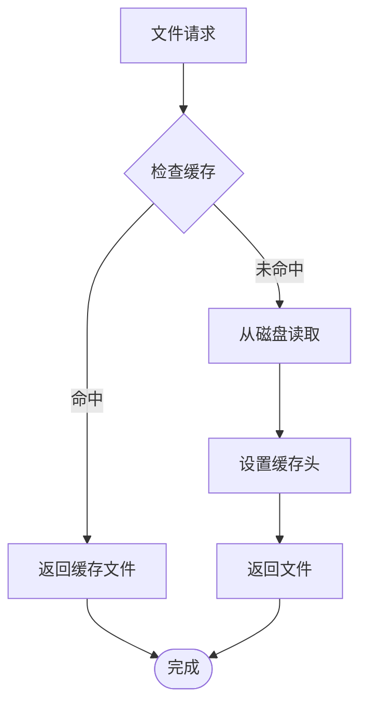

#### 缓存头配置
系统自动设置合适的缓存头信息：
- Content-Type: 基于文件扩展名自动设置
- Cache-Control: 配置适当的缓存策略
- Last-Modified: 提供文件最后修改时间

**章节来源**
- [server/src/index.ts:58-60](file://server/src/index.ts#L58-L60)

### 文件清理策略

#### 自动清理机制
系统提供了多种文件清理策略：

1. **会话清理**: 当会话被删除时，关联的输出文件也会被清理
2. **工作流清理**: 不同工作流类型的文件独立管理
3. **手动清理**: 支持用户手动删除不需要的文件

#### 存储空间管理
系统通过以下方式管理存储空间：

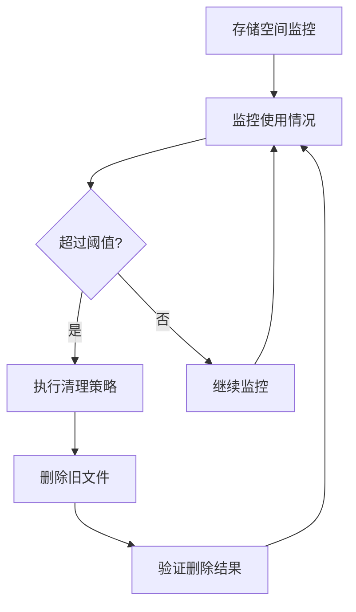

**章节来源**
- [server/src/services/sessionManager.ts:150-163](file://server/src/services/sessionManager.ts#L150-L163)

### 安全访问控制

#### 跨域资源共享(CORS)
系统配置了严格的 CORS 策略：

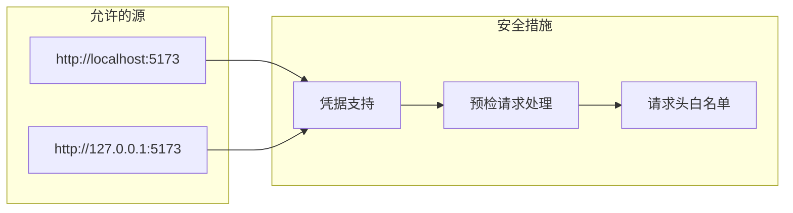

**图表来源**
- [server/src/index.ts:46-49](file://server/src/index.ts#L46-L49)

#### 身份验证和授权
虽然当前版本主要面向本地使用，但系统已为未来的身份验证扩展预留了接口：

1. **会话绑定**: 文件访问与用户会话绑定
2. **工作流隔离**: 不同工作流类型之间文件隔离
3. **访问日志**: 记录所有文件访问操作

**章节来源**
- [server/src/index.ts:71](file://server/src/index.ts#L71)

## 依赖关系分析

输出文件路由模块与其他系统组件的依赖关系如下：

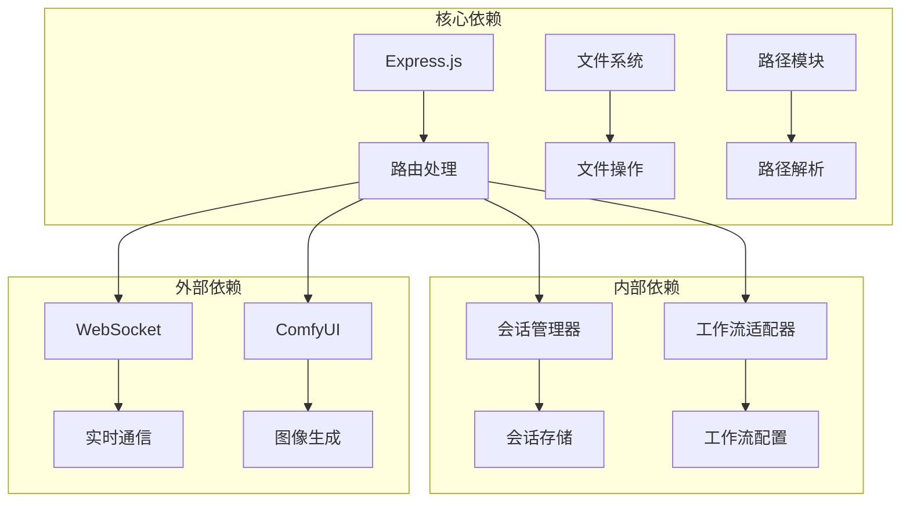

**图表来源**
- [server/src/index.ts:8-12](file://server/src/index.ts#L8-L12)
- [server/src/routes/output.ts:1-8](file://server/src/routes/output.ts#L1-L8)

**章节来源**
- [server/src/index.ts:8-12](file://server/src/index.ts#L8-L12)
- [server/src/routes/output.ts:1-8](file://server/src/routes/output.ts#L1-L8)

## 性能考虑

### 传输性能优化

#### 并发处理
- 支持多个并发文件下载请求
- 使用非阻塞文件系统操作
- 合理的连接池配置

#### 内存使用优化
- 流式文件传输避免内存峰值
- 及时释放文件句柄
- 控制响应缓冲区大小

### 缓存策略

#### 多级缓存
1. **浏览器缓存**: 利用 HTTP 缓存头
2. **服务器缓存**: Express.js 内置缓存
3. **CDN 缓存**: 可选的 CDN 集成

#### 缓存失效策略
- 基于文件修改时间的缓存失效
- 手动触发的缓存清理
- 定期自动清理过期缓存

## 故障排除指南

### 常见问题及解决方案

#### 文件无法下载
**症状**: 返回 404 错误
**可能原因**:
1. 文件已被删除或移动
2. 工作流ID不正确
3. 文件名包含特殊字符未正确编码

**解决步骤**:
1. 验证工作流ID是否在允许范围内
2. 检查文件是否存在于对应目录
3. 确认文件名URL编码正确

#### 权限错误
**症状**: 返回 403 错误
**可能原因**:
1. 文件权限设置不当
2. 目录访问权限不足
3. 跨域请求被阻止

**解决步骤**:
1. 检查文件和目录权限
2. 验证 CORS 配置
3. 确认用户身份验证

#### 性能问题
**症状**: 下载速度慢或内存占用高
**可能原因**:
1. 大文件传输影响
2. 缓存配置不当
3. 网络带宽限制

**解决步骤**:
1. 实施分块传输
2. 优化缓存策略
3. 调整网络配置

**章节来源**
- [server/src/routes/output.ts:67-70](file://server/src/routes/output.ts#L67-L70)
- [server/src/routes/output.ts:96-98](file://server/src/routes/output.ts#L96-L98)

## 结论

输出文件路由模块为 CorineKit Pix2Real 项目提供了完整、安全、高效的文件服务解决方案。通过精心设计的架构和多重安全机制，该模块能够可靠地处理各种规模的文件下载请求，同时确保系统的安全性和稳定性。

模块的主要优势包括：

1. **安全性**: 多层验证和访问控制机制
2. **可扩展性**: 支持新增工作流类型和文件格式
3. **性能**: 流式传输和智能缓存策略
4. **易用性**: 简洁的 API 设计和完善的错误处理

未来可以考虑的改进方向：
- 实现更细粒度的权限控制
- 添加文件上传功能
- 集成 CDN 加速
- 增强监控和日志功能