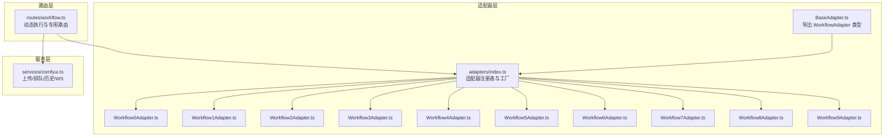
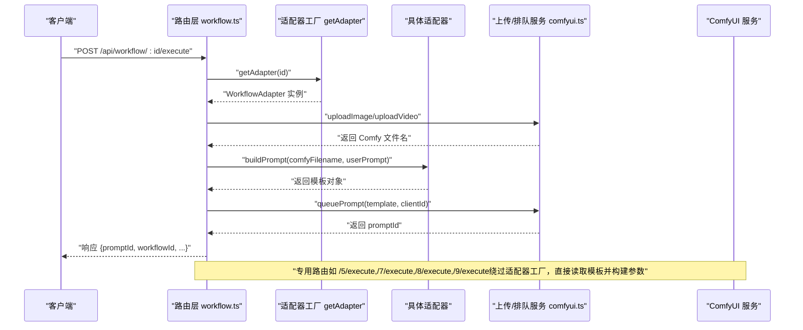
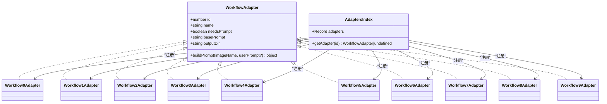
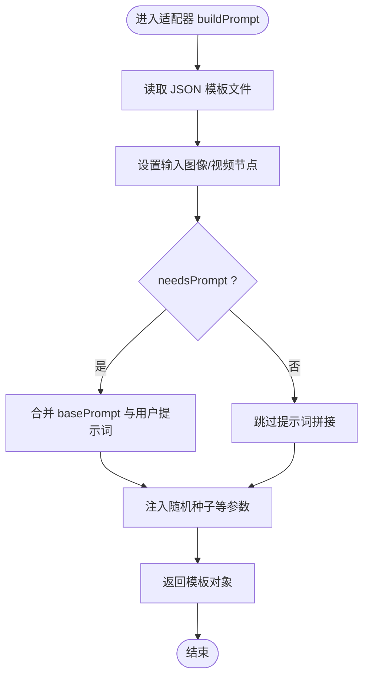
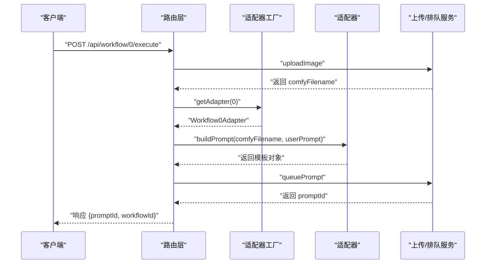
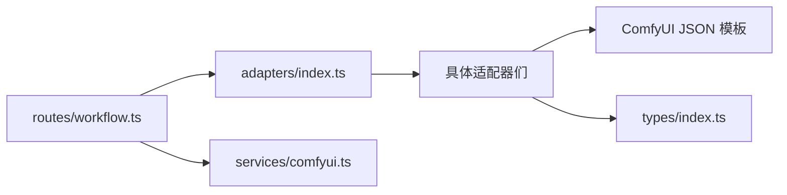

# 适配器模式实现

<cite>
**本文档引用的文件**
- [BaseAdapter.ts](file://server/src/adapters/BaseAdapter.ts)
- [index.ts](file://server/src/adapters/index.ts)
- [Workflow0Adapter.ts](file://server/src/adapters/Workflow0Adapter.ts)
- [Workflow1Adapter.ts](file://server/src/adapters/Workflow1Adapter.ts)
- [Workflow2Adapter.ts](file://server/src/adapters/Workflow2Adapter.ts)
- [Workflow3Adapter.ts](file://server/src/adapters/Workflow3Adapter.ts)
- [Workflow4Adapter.ts](file://server/src/adapters/Workflow4Adapter.ts)
- [Workflow5Adapter.ts](file://server/src/adapters/Workflow5Adapter.ts)
- [Workflow6Adapter.ts](file://server/src/adapters/Workflow6Adapter.ts)
- [Workflow7Adapter.ts](file://server/src/adapters/Workflow7Adapter.ts)
- [Workflow8Adapter.ts](file://server/src/adapters/Workflow8Adapter.ts)
- [Workflow9Adapter.ts](file://server/src/adapters/Workflow9Adapter.ts)
- [index.ts](file://server/src/types/index.ts)
- [workflow.ts](file://server/src/routes/workflow.ts)
- [comfyui.ts](file://server/src/services/comfyui.ts)
</cite>

## 目录
1. [简介](#简介)
2. [项目结构](#项目结构)
3. [核心组件](#核心组件)
4. [架构总览](#架构总览)
5. [详细组件分析](#详细组件分析)
6. [依赖关系分析](#依赖关系分析)
7. [性能考虑](#性能考虑)
8. [故障排除指南](#故障排除指南)
9. [结论](#结论)
10. [附录：适配器开发指南与最佳实践](#附录适配器开发指南与最佳实践)

## 简介
本文件面向 CorineKit Pix2Real 项目的“适配器模式”实现，系统性阐述 BaseAdapter 基类设计、工作流适配器的通用接口规范、差异化实现策略、参数替换机制与模板加载策略；同时说明适配器注册与工厂模式的应用、动态适配器选择流程、错误处理机制，并提供可扩展的适配器开发指南与最佳实践，帮助开发者快速理解并扩展该可插拔的工作流处理架构。

## 项目结构
- 服务端采用模块化组织：适配器层位于 server/src/adapters，路由层位于 server/src/routes，类型定义位于 server/src/types，与 ComfyUI 的交互封装在 server/src/services。
- 适配器层通过统一接口 WorkflowAdapter 规范各工作流的行为，路由层通过工厂函数 getAdapter 动态选择适配器，实现“按 ID 选择工作流”的工厂模式。

图表来源
- [BaseAdapter.ts:1-4](file://server/src/adapters/BaseAdapter.ts#L1-L4)
- [index.ts:1-31](file://server/src/adapters/index.ts#L1-L31)
- [Workflow0Adapter.ts:1-35](file://server/src/adapters/Workflow0Adapter.ts#L1-L35)
- [Workflow1Adapter.ts:1-36](file://server/src/adapters/Workflow1Adapter.ts#L1-L36)
- [Workflow2Adapter.ts:1-28](file://server/src/adapters/Workflow2Adapter.ts#L1-L28)
- [Workflow3Adapter.ts:1-33](file://server/src/adapters/Workflow3Adapter.ts#L1-L33)
- [Workflow4Adapter.ts:1-28](file://server/src/adapters/Workflow4Adapter.ts#L1-L28)
- [Workflow5Adapter.ts:1-15](file://server/src/adapters/Workflow5Adapter.ts#L1-L15)
- [Workflow6Adapter.ts:1-36](file://server/src/adapters/Workflow6Adapter.ts#L1-L36)
- [Workflow7Adapter.ts:1-14](file://server/src/adapters/Workflow7Adapter.ts#L1-L14)
- [Workflow8Adapter.ts:1-14](file://server/src/adapters/Workflow8Adapter.ts#L1-L14)
- [Workflow9Adapter.ts:1-14](file://server/src/adapters/Workflow9Adapter.ts#L1-L14)
- [workflow.ts:1-862](file://server/src/routes/workflow.ts#L1-L862)
- [comfyui.ts:1-285](file://server/src/services/comfyui.ts#L1-L285)

章节来源
- [index.ts:1-31](file://server/src/adapters/index.ts#L1-L31)
- [workflow.ts:1-862](file://server/src/routes/workflow.ts#L1-L862)

## 核心组件
- WorkflowAdapter 接口：定义了工作流适配器的统一契约，包括 id、name、needsPrompt、basePrompt、outputDir 以及 buildPrompt 方法签名。
- BaseAdapter.ts：当前仅导出 WorkflowAdapter 类型，作为适配器层的类型基础。
- 适配器注册表与工厂：adapters/index.ts 维护一个数字到适配器实例的映射，并提供 getAdapter 工厂方法，用于按 workflowId 动态获取适配器。
- 路由层：routes/workflow.ts 通过 getAdapter 实现通用执行流程；对部分特殊工作流（如 5/7/8/9）提供专用路由，绕过通用适配器直接构建模板。

章节来源
- [index.ts:1-31](file://server/src/adapters/index.ts#L1-L31)
- [BaseAdapter.ts:1-4](file://server/src/adapters/BaseAdapter.ts#L1-L4)
- [index.ts:1-31](file://server/src/adapters/index.ts#L1-L31)
- [workflow.ts:1-862](file://server/src/routes/workflow.ts#L1-L862)

## 架构总览
下图展示了“请求—适配器—模板—ComfyUI 队列”的典型调用链路，以及专用路由的例外路径。

图表来源
- [workflow.ts:407-455](file://server/src/routes/workflow.ts#L407-L455)
- [workflow.ts:41-92](file://server/src/routes/workflow.ts#L41-L92)
- [workflow.ts:94-149](file://server/src/routes/workflow.ts#L94-L149)
- [workflow.ts:263-310](file://server/src/routes/workflow.ts#L263-L310)
- [workflow.ts:181-261](file://server/src/routes/workflow.ts#L181-L261)
- [comfyui.ts:9-60](file://server/src/services/comfyui.ts#L9-L60)

## 详细组件分析

### BaseAdapter 基类与接口规范
- BaseAdapter.ts 当前仅导出 WorkflowAdapter 类型，作为适配器层的类型约束。
- WorkflowAdapter 接口定义了以下关键字段与方法：
  - id: 工作流编号
  - name: 工作流名称
  - needsPrompt: 是否需要用户提示词
  - basePrompt: 默认提示词
  - outputDir: 输出目录标识
  - buildPrompt(imageName, userPrompt?): 返回模板对象
- 该接口规范确保所有适配器具备一致的“模板构建”能力，便于路由层统一调度。

章节来源
- [BaseAdapter.ts:1-4](file://server/src/adapters/BaseAdapter.ts#L1-L4)
- [index.ts:1-8](file://server/src/types/index.ts#L1-L8)

### 适配器注册与工厂模式
- 注册表：adapters/index.ts 将 0~9 号工作流适配器集中注册到对象中，键为 workflowId，值为对应适配器实例。
- 工厂方法：getAdapter(id) 根据传入的 workflowId 返回对应的适配器；若不存在则返回 undefined。
- 路由层使用该工厂实现“动态适配器选择”，从而支持通用执行路径。

图表来源
- [index.ts:13-28](file://server/src/adapters/index.ts#L13-L28)
- [Workflow0Adapter.ts:9-34](file://server/src/adapters/Workflow0Adapter.ts#L9-L34)
- [Workflow1Adapter.ts:9-35](file://server/src/adapters/Workflow1Adapter.ts#L9-L35)
- [Workflow2Adapter.ts:9-27](file://server/src/adapters/Workflow2Adapter.ts#L9-L27)
- [Workflow3Adapter.ts:9-32](file://server/src/adapters/Workflow3Adapter.ts#L9-L32)
- [Workflow4Adapter.ts:9-27](file://server/src/adapters/Workflow4Adapter.ts#L9-L27)
- [Workflow5Adapter.ts:4-14](file://server/src/adapters/Workflow5Adapter.ts#L4-L14)
- [Workflow6Adapter.ts:9-35](file://server/src/adapters/Workflow6Adapter.ts#L9-L35)
- [Workflow7Adapter.ts:3-13](file://server/src/adapters/Workflow7Adapter.ts#L3-L13)
- [Workflow8Adapter.ts:3-13](file://server/src/adapters/Workflow8Adapter.ts#L3-L13)
- [Workflow9Adapter.ts:3-13](file://server/src/adapters/Workflow9Adapter.ts#L3-L13)

章节来源
- [index.ts:13-28](file://server/src/adapters/index.ts#L13-L28)
- [index.ts:26-28](file://server/src/adapters/index.ts#L26-L28)

### 通用工作流适配器的差异化实现
- 模板加载策略：每个适配器通过读取 ComfyUI JSON 模板文件，解析为对象后进行节点参数替换。
- 参数替换机制：
  - 通用适配器：根据 needsPrompt 决定是否拼接用户提示词；对 seed 等随机参数进行注入。
  - 特殊工作流：在专用路由中直接读取模板并替换节点参数，不依赖适配器工厂。
- 输出目录：每个适配器声明 outputDir，用于后续打开输出目录或会话管理。

图表来源
- [Workflow0Adapter.ts:16-33](file://server/src/adapters/Workflow0Adapter.ts#L16-L33)
- [Workflow1Adapter.ts:16-34](file://server/src/adapters/Workflow1Adapter.ts#L16-L34)
- [Workflow2Adapter.ts:16-26](file://server/src/adapters/Workflow2Adapter.ts#L16-L26)
- [Workflow3Adapter.ts:16-31](file://server/src/adapters/Workflow3Adapter.ts#L16-L31)
- [Workflow4Adapter.ts:16-26](file://server/src/adapters/Workflow4Adapter.ts#L16-L26)
- [Workflow6Adapter.ts:16-34](file://server/src/adapters/Workflow6Adapter.ts#L16-L34)

章节来源
- [Workflow0Adapter.ts:16-33](file://server/src/adapters/Workflow0Adapter.ts#L16-L33)
- [Workflow1Adapter.ts:16-34](file://server/src/adapters/Workflow1Adapter.ts#L16-L34)
- [Workflow2Adapter.ts:16-26](file://server/src/adapters/Workflow2Adapter.ts#L16-L26)
- [Workflow3Adapter.ts:16-31](file://server/src/adapters/Workflow3Adapter.ts#L16-L31)
- [Workflow4Adapter.ts:16-26](file://server/src/adapters/Workflow4Adapter.ts#L16-L26)
- [Workflow6Adapter.ts:16-34](file://server/src/adapters/Workflow6Adapter.ts#L16-L34)

### 专用工作流与动态适配器选择
- 专用路由场景：
  - Workflow 5：需要原图与蒙版双文件上传，模板参数包含布尔开关与可选提示词。
  - Workflow 7：文本生图专用，接收 JSON 请求体中的模型、尺寸、采样器等参数。
  - Workflow 8：人脸交换，需要目标图与人脸图双文件上传。
  - Workflow 9：UNet+LoRA 文本生图，支持链路重连与参数切换。
- 动态适配器选择：
  - 通用路径：/api/workflow/:id/execute 使用 getAdapter(id) 获取适配器，调用其 buildPrompt 并排队。
  - 通用批量路径：/api/workflow/:id/batch 支持多图批量执行，逐个构建模板并排队。

图表来源
- [workflow.ts:407-455](file://server/src/routes/workflow.ts#L407-L455)
- [workflow.ts:312-355](file://server/src/routes/workflow.ts#L312-L355)
- [workflow.ts:40-92](file://server/src/routes/workflow.ts#L40-L92)
- [workflow.ts:94-149](file://server/src/routes/workflow.ts#L94-L149)
- [workflow.ts:263-310](file://server/src/routes/workflow.ts#L263-L310)
- [workflow.ts:181-261](file://server/src/routes/workflow.ts#L181-L261)

章节来源
- [workflow.ts:407-455](file://server/src/routes/workflow.ts#L407-L455)
- [workflow.ts:40-92](file://server/src/routes/workflow.ts#L40-L92)
- [workflow.ts:94-149](file://server/src/routes/workflow.ts#L94-L149)
- [workflow.ts:263-310](file://server/src/routes/workflow.ts#L263-L310)
- [workflow.ts:181-261](file://server/src/routes/workflow.ts#L181-L261)

### 错误处理机制
- 适配器层：
  - 对于不支持通用执行的工作流（如 5/7/8/9），适配器的 buildPrompt 抛出明确错误，提示使用专用路由。
- 路由层：
  - 未知 workflowId：返回 400 错误。
  - 缺少文件或参数：返回 400 错误。
  - 通用执行异常：捕获错误并返回 500。
  - 专用路由异常：分别捕获并返回相应错误信息。
- 服务层：
  - 上传失败、队列失败、历史查询失败等均抛出错误，供上层路由捕获处理。

章节来源
- [Workflow5Adapter.ts:11-13](file://server/src/adapters/Workflow5Adapter.ts#L11-L13)
- [Workflow7Adapter.ts:10-12](file://server/src/adapters/Workflow7Adapter.ts#L10-L12)
- [Workflow8Adapter.ts:10-12](file://server/src/adapters/Workflow8Adapter.ts#L10-L12)
- [Workflow9Adapter.ts:10-12](file://server/src/adapters/Workflow9Adapter.ts#L10-L12)
- [workflow.ts:413-416](file://server/src/routes/workflow.ts#L413-L416)
- [workflow.ts:418-421](file://server/src/routes/workflow.ts#L418-L421)
- [workflow.ts:451-454](file://server/src/routes/workflow.ts#L451-L454)
- [workflow.ts:88-91](file://server/src/routes/workflow.ts#L88-L91)
- [workflow.ts:145-148](file://server/src/routes/workflow.ts#L145-L148)
- [workflow.ts:306-310](file://server/src/routes/workflow.ts#L306-L310)
- [workflow.ts:257-261](file://server/src/routes/workflow.ts#L257-L261)
- [comfyui.ts:19-21](file://server/src/services/comfyui.ts#L19-L21)
- [comfyui.ts:54-57](file://server/src/services/comfyui.ts#L54-L57)
- [comfyui.ts:65-67](file://server/src/services/comfyui.ts#L65-L67)

## 依赖关系分析
- 低耦合高内聚：适配器仅关注模板构建，不关心上传与排队细节；路由层负责文件上传、参数解析与任务调度；服务层负责与 ComfyUI 通信。
- 关键依赖链：
  - 路由层依赖适配器工厂与服务层
  - 适配器依赖模板文件与通用类型
  - 服务层依赖外部 ComfyUI API

图表来源
- [workflow.ts:7-9](file://server/src/routes/workflow.ts#L7-L9)
- [index.ts:1-11](file://server/src/adapters/index.ts#L1-L11)
- [comfyui.ts:1-4](file://server/src/services/comfyui.ts#L1-L4)
- [index.ts:1-31](file://server/src/adapters/index.ts#L1-L31)

章节来源
- [workflow.ts:7-9](file://server/src/routes/workflow.ts#L7-L9)
- [index.ts:1-11](file://server/src/adapters/index.ts#L1-L11)
- [comfyui.ts:1-4](file://server/src/services/comfyui.ts#L1-L4)

## 性能考虑
- 模板读取：每次执行均从磁盘读取 JSON 模板，建议在高频场景下考虑缓存模板对象以减少 IO 开销。
- 批量执行：批量接口支持最多 50 张图片，注意控制并发与队列长度，避免 ComfyUI 资源瓶颈。
- 随机种子：适配器对 seed 进行随机化，有助于避免重复结果，但需注意与可复现实验的权衡。
- WebSocket 事件：服务层提供进度与完成事件监听，建议在前端侧合理处理事件风暴，避免频繁渲染。

## 故障排除指南
- “未知工作流”：检查 workflowId 是否在 0~9 范围内，确认适配器已注册。
- “缺少文件/参数”：确认上传文件、clientId、prompt 等参数是否齐全。
- “适配器 buildPrompt 抛错”：确认该工作流是否需要专用路由（如 5/7/8/9）。
- “ComfyUI 不可用”：检查服务层的网络连接与端口，查看系统状态接口。
- “提示词反推/提示词助理超时”：确认 ComfyUI 中相关节点配置与临时目录权限。

章节来源
- [workflow.ts:413-416](file://server/src/routes/workflow.ts#L413-L416)
- [workflow.ts:418-421](file://server/src/routes/workflow.ts#L418-L421)
- [workflow.ts:88-91](file://server/src/routes/workflow.ts#L88-L91)
- [workflow.ts:145-148](file://server/src/routes/workflow.ts#L145-L148)
- [workflow.ts:306-310](file://server/src/routes/workflow.ts#L306-L310)
- [workflow.ts:257-261](file://server/src/routes/workflow.ts#L257-L261)
- [comfyui.ts:106-125](file://server/src/services/comfyui.ts#L106-L125)
- [workflow.ts:720-723](file://server/src/routes/workflow.ts#L720-L723)
- [workflow.ts:786-789](file://server/src/routes/workflow.ts#L786-L789)

## 结论
本项目通过“适配器 + 工厂 + 路由层”的分层设计，实现了高度可扩展的工作流处理架构。适配器层以统一接口屏蔽模板差异，路由层以工厂模式实现动态选择，服务层抽象外部依赖，三者协同提供了清晰、稳定且易于扩展的执行链路。对于新增工作流，遵循接口规范与模板加载策略即可快速接入。

## 附录：适配器开发指南与最佳实践
- 新增适配器步骤
  - 在适配器目录新增文件，实现 WorkflowAdapter 接口，定义 id/name/needsPrompt/basePrompt/outputDir，并实现 buildPrompt。
  - 在注册表中添加映射，确保 getAdapter 可通过 id 获取到新适配器。
  - 如工作流需要专用路由或特殊参数，请在路由层新增对应路径与参数解析逻辑。
- 模板加载与参数替换
  - 使用文件系统读取 JSON 模板，解析为对象后，按节点 ID 设置输入图像/视频、提示词与随机种子等参数。
  - 对 needsPrompt=false 的工作流，避免拼接用户提示词，直接使用 basePrompt 或默认值。
- 错误处理与兼容性
  - 对不支持通用执行的工作流，在适配器中抛出明确错误，引导使用专用路由。
  - 在路由层对未知 id、缺失文件/参数等情况进行统一错误响应。
- 可扩展性建议
  - 将模板路径集中管理，必要时引入缓存机制。
  - 对批量执行与并发控制制定策略，避免资源争用。
  - 对提示词反推、提示词助理等辅助功能，提供统一的临时目录与清理策略。

章节来源
- [index.ts:13-28](file://server/src/adapters/index.ts#L13-L28)
- [index.ts:26-28](file://server/src/adapters/index.ts#L26-L28)
- [workflow.ts:407-455](file://server/src/routes/workflow.ts#L407-L455)
- [workflow.ts:40-92](file://server/src/routes/workflow.ts#L40-L92)
- [workflow.ts:94-149](file://server/src/routes/workflow.ts#L94-L149)
- [workflow.ts:263-310](file://server/src/routes/workflow.ts#L263-L310)
- [workflow.ts:181-261](file://server/src/routes/workflow.ts#L181-L261)