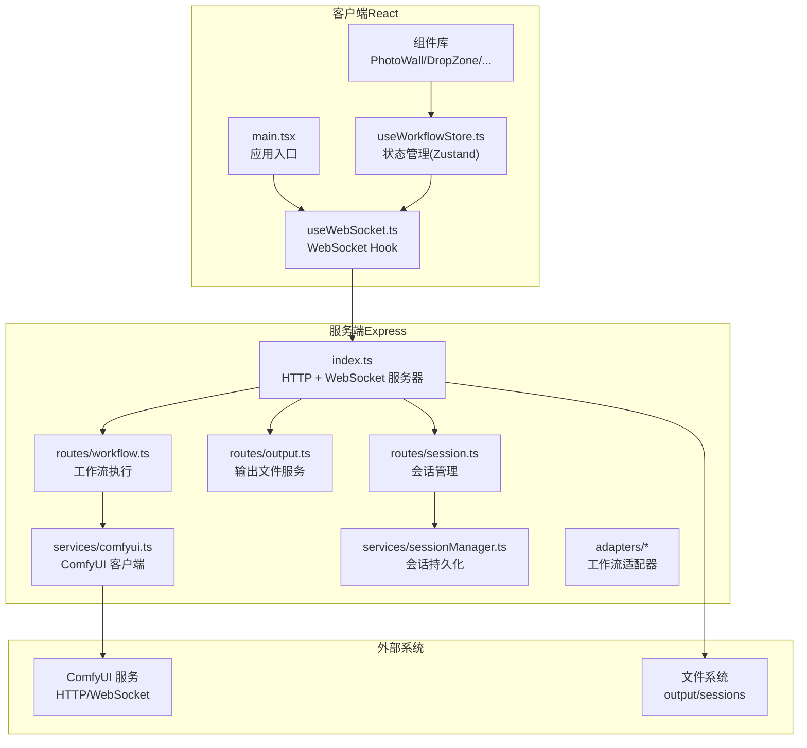
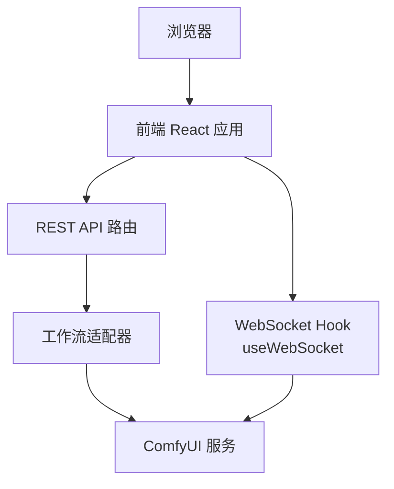
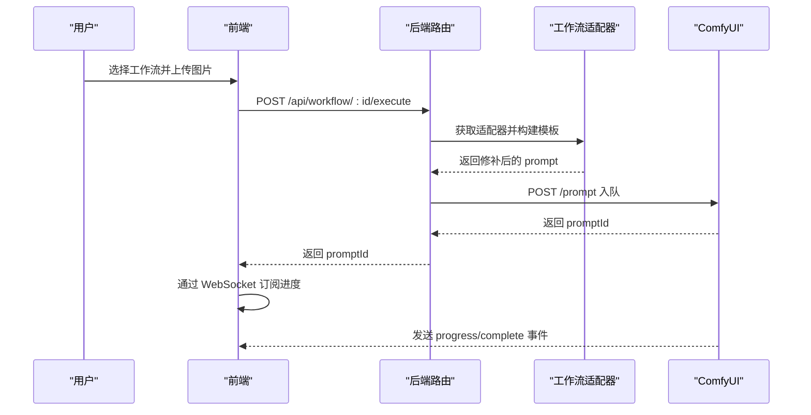
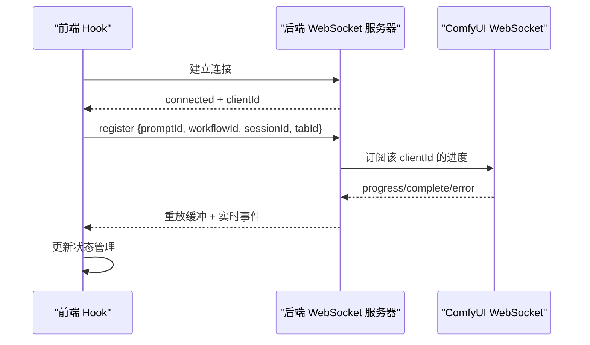
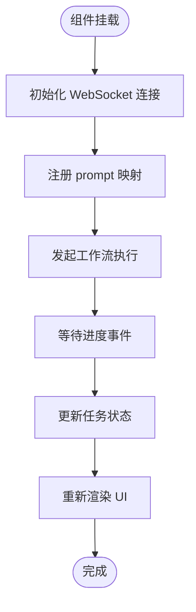
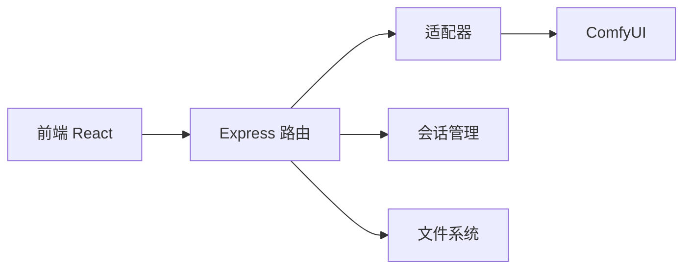

# 技术架构概览

<cite>
**本文档引用的文件**
- [README.md](file://README.md)
- [package.json](file://package.json)
- [server/src/index.ts](file://server/src/index.ts)
- [client/src/main.tsx](file://client/src/main.tsx)
- [server/src/services/comfyui.ts](file://server/src/services/comfyui.ts)
- [client/src/hooks/useWebSocket.ts](file://client/src/hooks/useWebSocket.ts)
- [server/src/adapters/index.ts](file://server/src/adapters/index.ts)
- [server/src/routes/workflow.ts](file://server/src/routes/workflow.ts)
- [server/src/routes/output.ts](file://server/src/routes/output.ts)
- [server/src/routes/session.ts](file://server/src/routes/session.ts)
- [server/src/types/index.ts](file://server/src/types/index.ts)
- [client/src/types/index.ts](file://client/src/types/index.ts)
- [client/src/hooks/useWorkflowStore.ts](file://client/src/hooks/useWorkflowStore.ts)
- [server/src/services/sessionManager.ts](file://server/src/services/sessionManager.ts)
</cite>

## 目录
1. [简介](#简介)
2. [项目结构](#项目结构)
3. [核心组件](#核心组件)
4. [架构总览](#架构总览)
5. [详细组件分析](#详细组件分析)
6. [依赖关系分析](#依赖关系分析)
7. [性能考虑](#性能考虑)
8. [故障排除指南](#故障排除指南)
9. [结论](#结论)

## 简介
本项目为本地 Web UI，通过 ComfyUI 批量处理图像/视频，支持实时进度更新与一键打开输出目录。系统采用前后端分离架构：前端使用 React + TypeScript + Vite 构建，后端使用 Node.js + Express + TypeScript 开发；通过适配器模式为不同工作流提供统一接口；通过 WebSocket 实现实时进度推送；通过会话管理实现多标签页隔离与持久化。

## 项目结构
项目采用“根级脚本 + 前后端分层”的组织方式：
- 根目录提供统一的开发与构建脚本，同时包含 ComfyUI 工作流模板与输出目录
- client 目录：React + TypeScript 前端应用，包含组件、Hooks、服务与类型定义
- server 目录：Express + TypeScript 后端，包含路由、适配器、服务与类型定义
- sessions 目录：按会话与标签页隔离的输入/掩码/输出存储

**图表来源**
- [client/src/main.tsx:1-11](file://client/src/main.tsx#L1-L11)
- [server/src/index.ts:1-228](file://server/src/index.ts#L1-L228)
- [server/src/routes/workflow.ts:1-862](file://server/src/routes/workflow.ts#L1-L862)
- [server/src/services/comfyui.ts:1-285](file://server/src/services/comfyui.ts#L1-L285)

**章节来源**
- [README.md:41-62](file://README.md#L41-L62)
- [package.json:1-15](file://package.json#L1-L15)

## 核心组件
- 前端应用入口与状态管理
  - 应用入口负责渲染根组件并挂载全局样式
  - 使用 Zustand 进行跨组件状态共享，包含任务状态、图片列表、提示词、会话信息等
- WebSocket 实时通信
  - 单例连接策略：模块级全局变量确保每个浏览器仅建立一个 WebSocket 连接
  - 前端监听进度、完成、错误事件，并同步到状态管理
- 适配器模式
  - 每个工作流对应一个适配器，负责加载模板并按需修补节点（如图像名、提示词、种子）
  - 统一的 WorkflowAdapter 接口屏蔽了不同工作流的差异
- 与 ComfyUI 集成
  - 后端作为 ComfyUI 的 HTTP/WebSocket 客户端，负责上传文件、入队、拉取历史与下载输出
  - WebSocket 事件在后端缓冲并重放，保证客户端断线重连不丢失进度
- 会话与文件管理
  - 会话按 sessionId/tabId 分目录存储输入/掩码/输出
  - 输出文件既可访问静态目录，也可通过会话文件服务访问

**章节来源**
- [client/src/main.tsx:1-11](file://client/src/main.tsx#L1-L11)
- [client/src/hooks/useWorkflowStore.ts:1-645](file://client/src/hooks/useWorkflowStore.ts#L1-L645)
- [client/src/hooks/useWebSocket.ts:1-99](file://client/src/hooks/useWebSocket.ts#L1-L99)
- [server/src/adapters/index.ts:1-31](file://server/src/adapters/index.ts#L1-L31)
- [server/src/services/comfyui.ts:1-285](file://server/src/services/comfyui.ts#L1-L285)
- [server/src/services/sessionManager.ts:1-164](file://server/src/services/sessionManager.ts#L1-L164)

## 架构总览
系统采用“前端单页应用 + 后端无头服务”的前后端分离架构：
- 前端负责用户交互与状态展示，通过 REST API 与 WebSocket 与后端通信
- 后端负责与 ComfyUI 对接，提供工作流执行、输出文件服务与会话管理
- 适配器模式解耦工作流差异，使新增工作流成本低
- WebSocket 在后端与 ComfyUI 之间建立长连接，向前端实时转发进度事件

**图表来源**
- [client/src/hooks/useWebSocket.ts:1-99](file://client/src/hooks/useWebSocket.ts#L1-L99)
- [server/src/routes/workflow.ts:1-862](file://server/src/routes/workflow.ts#L1-L862)
- [server/src/services/comfyui.ts:127-188](file://server/src/services/comfyui.ts#L127-L188)

## 详细组件分析

### 适配器模式与工作流执行
- 设计要点
  - 通过适配器封装工作流模板与参数修补逻辑，统一对外接口
  - 支持单图与批量执行，自动区分图像/视频输入
  - 内置多个工作流（如二次元转真人、精修放大、解除装备、换脸、ZIT快出等）
- 关键流程
  - 前端选择工作流与参数，调用后端执行接口
  - 后端根据工作流 ID 获取适配器，加载模板并修补节点
  - 上传文件至 ComfyUI，提交队列请求，返回 promptId
  - 前端通过 WebSocket 订阅进度与完成事件

**图表来源**
- [server/src/routes/workflow.ts:407-455](file://server/src/routes/workflow.ts#L407-L455)
- [server/src/services/comfyui.ts:47-60](file://server/src/services/comfyui.ts#L47-L60)
- [client/src/hooks/useWebSocket.ts:26-51](file://client/src/hooks/useWebSocket.ts#L26-L51)

**章节来源**
- [server/src/adapters/index.ts:1-31](file://server/src/adapters/index.ts#L1-L31)
- [server/src/routes/workflow.ts:407-455](file://server/src/routes/workflow.ts#L407-L455)

### WebSocket 实时通信
- 连接生命周期
  - 前端 Hook 在首次挂载时创建全局 WebSocket 连接，断线自动重连
  - 后端为每个浏览器客户端分配唯一 clientId，并与 ComfyUI 建立 WS 连接
  - 后端对每个 promptId 维护事件缓冲，客户端注册时可重放历史事件
- 事件类型
  - connected：告知前端分配的 clientId
  - execution_start：开始执行
  - progress：百分比进度
  - complete：执行完成，附带输出文件列表
  - error：执行错误

**图表来源**
- [server/src/index.ts:73-219](file://server/src/index.ts#L73-L219)
- [client/src/hooks/useWebSocket.ts:10-73](file://client/src/hooks/useWebSocket.ts#L10-L73)

**章节来源**
- [server/src/index.ts:73-219](file://server/src/index.ts#L73-L219)
- [client/src/hooks/useWebSocket.ts:1-99](file://client/src/hooks/useWebSocket.ts#L1-L99)

### 状态管理与组件通信
- 状态模型
  - 使用 Zustand 管理工作流、标签页、图片、任务、提示词、会话等
  - 任务状态包含 promptId、进度、输出文件、错误信息
  - 多标签页隔离，每页维护独立的图片与任务集合
- 组件间通信
  - 通过状态管理读写任务状态与 UI 行为
  - WebSocket 事件驱动状态更新，实现跨组件的实时同步

**图表来源**
- [client/src/hooks/useWorkflowStore.ts:377-499](file://client/src/hooks/useWorkflowStore.ts#L377-L499)
- [client/src/hooks/useWebSocket.ts:26-51](file://client/src/hooks/useWebSocket.ts#L26-L51)

**章节来源**
- [client/src/hooks/useWorkflowStore.ts:1-645](file://client/src/hooks/useWorkflowStore.ts#L1-L645)
- [client/src/types/index.ts:1-58](file://client/src/types/index.ts#L1-L58)

### 与 ComfyUI 的集成方式
- HTTP 接口
  - 文件上传：/upload/image
  - 入队：/prompt
  - 历史查询：/history/:prompt_id
  - 输出预览：/view
  - 队列管理：/queue
  - 系统统计：/system_stats
- WebSocket 接口
  - 进度事件：progress/executing
  - 完成事件：execution_success
  - 错误事件：execution_error
- 后端职责
  - 统一封装 ComfyUI HTTP/WebSocket 客户端
  - 将输出文件下载到本地会话目录，供前端访问

**章节来源**
- [server/src/services/comfyui.ts:1-285](file://server/src/services/comfyui.ts#L1-L285)
- [server/src/index.ts:112-175](file://server/src/index.ts#L112-L175)

### 数据流向与处理机制
- 输入处理
  - 前端上传文件，后端根据工作流类型区分图像/视频并上传至 ComfyUI
  - 适配器修补模板参数（如提示词、种子、模型），然后入队
- 进度与完成
  - 后端 WebSocket 监听 ComfyUI 事件，计算百分比并转发给前端
  - 完成后从 ComfyUI 下载输出文件，保存到会话目录并返回可访问 URL
- 输出访问
  - 输出文件可通过静态目录或会话文件服务访问
  - 支持一键打开操作系统文件夹或默认应用

**章节来源**
- [server/src/routes/workflow.ts:432-444](file://server/src/routes/workflow.ts#L432-L444)
- [server/src/index.ts:112-175](file://server/src/index.ts#L112-L175)
- [server/src/routes/output.ts:1-134](file://server/src/routes/output.ts#L1-L134)

## 依赖关系分析
- 技术栈选择与职责分工
  - 前端：React + TypeScript + Vite（构建与热更新）、Zustand（状态管理）
  - 后端：Express + TypeScript（Web 服务）、ws（WebSocket）、multer/form-data（文件上传）
- 组件耦合
  - 前端通过 Hook 与路由解耦，状态集中于 Zustand
  - 后端通过适配器与 ComfyUI 解耦，路由层只负责协议与调度
- 外部依赖
  - ComfyUI：作为图像/视频处理引擎
  - 文件系统：用于输出与会话持久化

**图表来源**
- [server/src/routes/workflow.ts:1-862](file://server/src/routes/workflow.ts#L1-L862)
- [server/src/services/sessionManager.ts:1-164](file://server/src/services/sessionManager.ts#L1-L164)

**章节来源**
- [client/package.json:1-25](file://client/package.json#L1-L25)
- [server/package.json:1-28](file://server/package.json#L1-L28)

## 性能考虑
- WebSocket 单例连接避免重复握手与资源浪费
- 事件缓冲与重放减少断线丢失进度的风险
- 批量执行时逐个入队，便于队列优先级调整与取消
- 输出文件下载与会话存储分离，避免阻塞主流程
- 前端状态集中管理，减少不必要的重渲染

## 故障排除指南
- ComfyUI 不可用
  - 现象：系统统计、队列查询返回 502
  - 处理：确认 ComfyUI 服务运行在默认端口，网络可达
- WebSocket 断开重连
  - 现象：进度停止或短暂中断
  - 处理：前端自动重连；若长时间无响应，检查后端日志与网络
- 队列异常或卡住
  - 现象：任务长时间处于排队或执行中
  - 处理：尝试取消队列项或提升优先级；必要时释放内存
- 输出文件缺失
  - 现象：完成后无法找到输出文件
  - 处理：确认会话目录存在且有写权限；检查 ComfyUI 输出类型是否为 output

**章节来源**
- [server/src/routes/workflow.ts:522-539](file://server/src/routes/workflow.ts#L522-L539)
- [server/src/services/comfyui.ts:90-99](file://server/src/services/comfyui.ts#L90-L99)
- [server/src/index.ts:112-175](file://server/src/index.ts#L112-L175)

## 结论
本项目以适配器模式为核心，结合前后端分离与 WebSocket 实时通信，实现了与 ComfyUI 的高效集成。前端通过状态管理与 Hook 实现流畅的用户体验，后端通过路由与服务层解耦外部系统，具备良好的扩展性与可维护性。开发者可基于现有适配器快速扩展新的工作流，或在前端增加新的 UI 组件与交互逻辑。