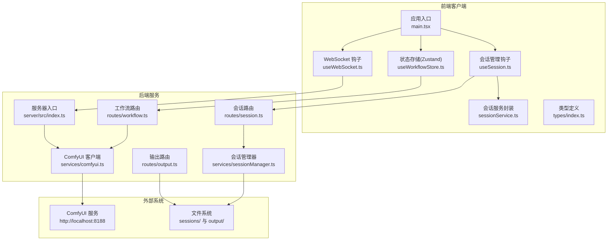
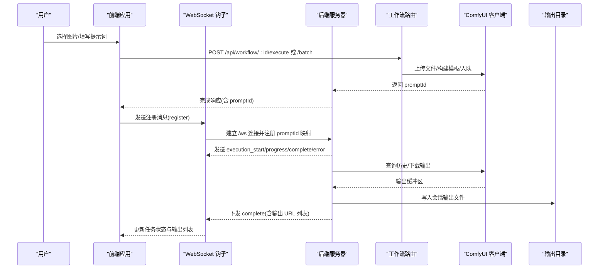
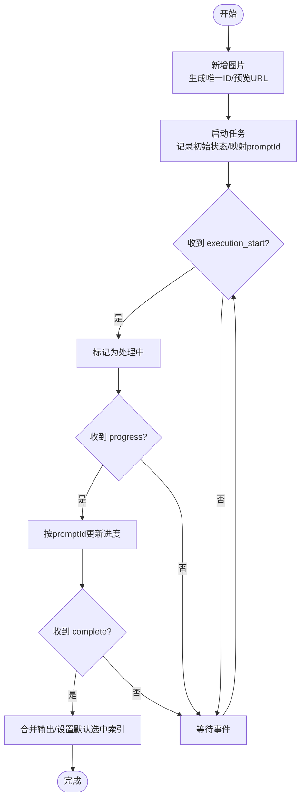
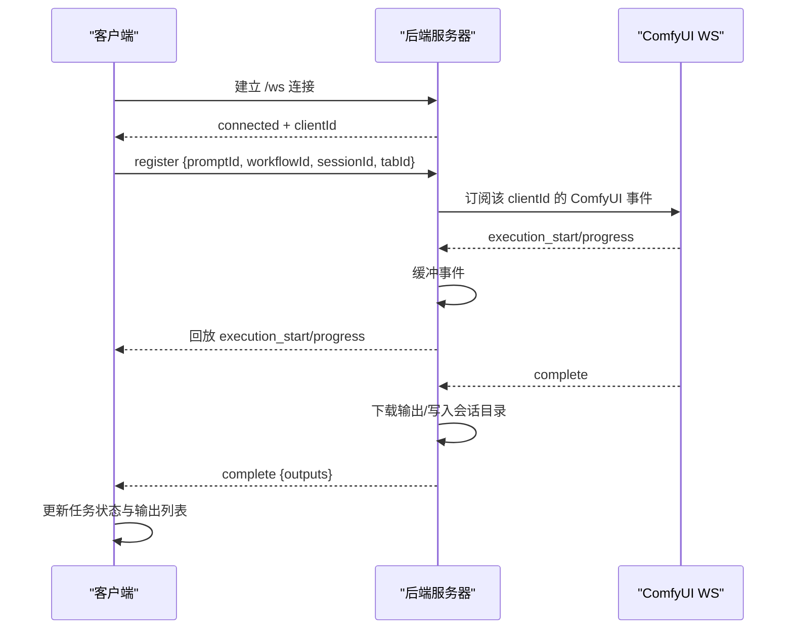
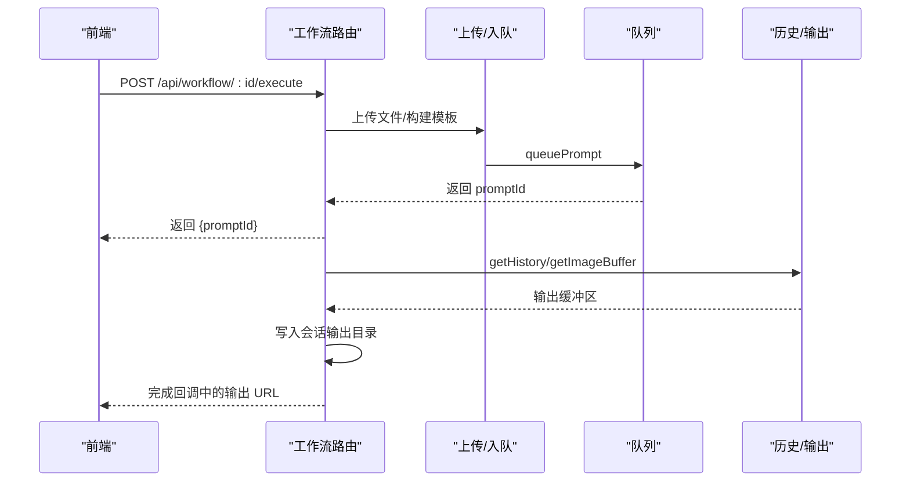
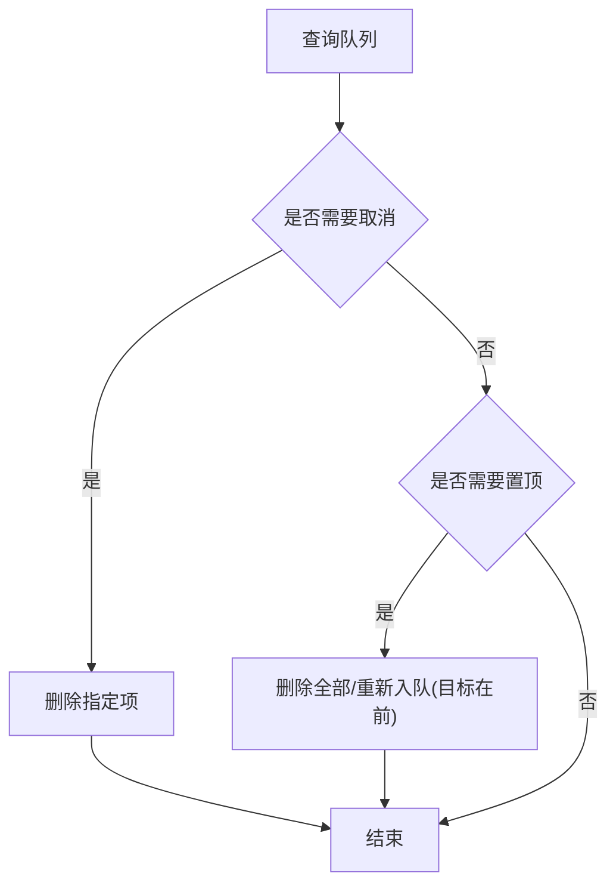
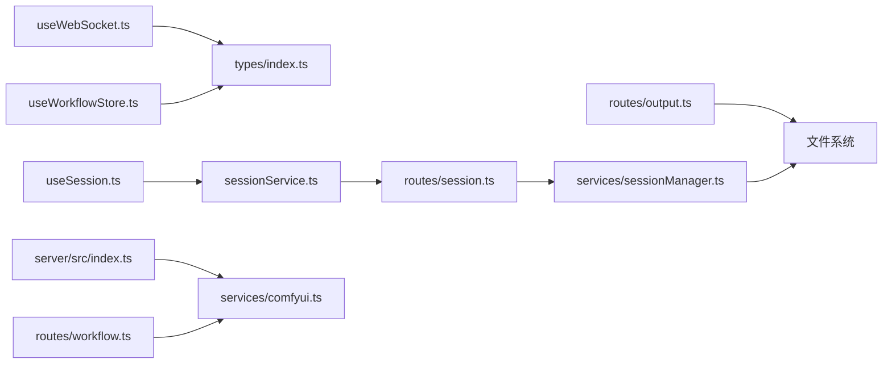

# 数据流设计

<cite>
**本文引用的文件**
- [README.md](file://README.md)
- [main.tsx](file://client/src/main.tsx)
- [useWebSocket.ts](file://client/src/hooks/useWebSocket.ts)
- [useWorkflowStore.ts](file://client/src/hooks/useWorkflowStore.ts)
- [useSession.ts](file://client/src/hooks/useSession.ts)
- [sessionService.ts](file://client/src/services/sessionService.ts)
- [index.ts](file://server/src/index.ts)
- [comfyui.ts](file://server/src/services/comfyui.ts)
- [sessionManager.ts](file://server/src/services/sessionManager.ts)
- [workflow.ts](file://server/src/routes/workflow.ts)
- [output.ts](file://server/src/routes/output.ts)
- [session.ts](file://server/src/routes/session.ts)
- [index.ts（类型）](file://client/src/types/index.ts)
</cite>

## 目录
1. [引言](#引言)
2. [项目结构](#项目结构)
3. [核心组件](#核心组件)
4. [架构总览](#架构总览)
5. [详细组件分析](#详细组件分析)
6. [依赖关系分析](#依赖关系分析)
7. [性能考量](#性能考量)
8. [故障排查指南](#故障排查指南)
9. [结论](#结论)
10. [附录](#附录)

## 引言
本文件面向 CorineKit Pix2Real 项目的开发者与维护者，系统性梳理从“用户上传”到“最终输出”的完整数据流设计。重点覆盖以下方面：
- 前端状态管理的数据流向与一致性保障
- WebSocket 实时通信的数据传输与事件回放机制
- 后端工作流处理与 ComfyUI 集成的数据处理链路
- 文件上传/下载机制、会话状态持久化、任务队列管理
- 数据模型定义、状态同步机制、错误恢复策略

目标是帮助读者在不深入源码的情况下，也能准确把握系统的关键数据处理路径与交互契约。

## 项目结构
项目采用前后端分离架构：前端使用 Vite + React + TypeScript，后端使用 Express + TypeScript，二者通过 REST API 与 WebSocket 协同；后端再与本地 ComfyUI 进行交互，实现图像/视频批处理与实时进度反馈。

图表来源
- [main.tsx:1-11](file://client/src/main.tsx#L1-L11)
- [useWebSocket.ts:1-99](file://client/src/hooks/useWebSocket.ts#L1-L99)
- [useWorkflowStore.ts:1-645](file://client/src/hooks/useWorkflowStore.ts#L1-L645)
- [useSession.ts:1-422](file://client/src/hooks/useSession.ts#L1-L422)
- [sessionService.ts:1-134](file://client/src/services/sessionService.ts#L1-L134)
- [index.ts:1-228](file://server/src/index.ts#L1-L228)
- [workflow.ts:1-862](file://server/src/routes/workflow.ts#L1-L862)
- [output.ts:1-134](file://server/src/routes/output.ts#L1-L134)
- [session.ts:1-95](file://server/src/routes/session.ts#L1-L95)
- [comfyui.ts:1-285](file://server/src/services/comfyui.ts#L1-L285)
- [sessionManager.ts:1-164](file://server/src/services/sessionManager.ts#L1-L164)

章节来源
- [README.md:41-79](file://README.md#L41-L79)
- [main.tsx:1-11](file://client/src/main.tsx#L1-L11)
- [index.ts:1-228](file://server/src/index.ts#L1-L228)

## 核心组件
- 前端应用入口与渲染：负责挂载根组件，启动全局样式。
- WebSocket 钩子：单例连接，统一接收进度、完成、错误等事件，并驱动状态更新。
- 状态存储（Zustand）：集中管理当前标签页、图片列表、提示词、任务状态、选择态等。
- 会话管理钩子：负责会话 ID 生成与持久化、自动保存、增量上传、恢复逻辑。
- 会话服务封装：对后端会话接口进行类型化封装，提供上传输入图、上传蒙版、保存/加载会话等能力。
- 后端服务器：Express + WebSocket，作为 ComfyUI 的代理与桥接层，转发进度事件、拉取输出、持久化会话。
- 工作流路由：适配多套工作流模板，支持单图/批量执行、取消队列、优先级调整、系统统计、打开输出目录等。
- 输出路由：列出与提供历史输出文件，支持跨域访问与打开默认应用。
- 会话路由：提供会话的增删查改、状态保存与清理。
- ComfyUI 客户端：封装上传、入队、历史查询、输出下载、队列操作、系统信息等。
- 会话管理器：负责会话目录结构、输入/输出/蒙版文件的读写与会话 JSON 的序列化/反序列化。

章节来源
- [useWebSocket.ts:1-99](file://client/src/hooks/useWebSocket.ts#L1-L99)
- [useWorkflowStore.ts:1-645](file://client/src/hooks/useWorkflowStore.ts#L1-L645)
- [useSession.ts:1-422](file://client/src/hooks/useSession.ts#L1-L422)
- [sessionService.ts:1-134](file://client/src/services/sessionService.ts#L1-L134)
- [index.ts:1-228](file://server/src/index.ts#L1-L228)
- [workflow.ts:1-862](file://server/src/routes/workflow.ts#L1-L862)
- [output.ts:1-134](file://server/src/routes/output.ts#L1-L134)
- [session.ts:1-95](file://server/src/routes/session.ts#L1-L95)
- [comfyui.ts:1-285](file://server/src/services/comfyui.ts#L1-L285)
- [sessionManager.ts:1-164](file://server/src/services/sessionManager.ts#L1-L164)

## 架构总览
系统以“前端状态驱动 + 后端工作流编排 + ComfyUI 执行 + 实时事件回放”的模式运行。前端通过 REST API 触发工作流，通过 WebSocket 接收进度与完成事件；后端负责将 ComfyUI 的输出下载到会话目录，并提供静态文件服务供前端访问。

图表来源
- [useWebSocket.ts:75-99](file://client/src/hooks/useWebSocket.ts#L75-L99)
- [index.ts:73-219](file://server/src/index.ts#L73-L219)
- [workflow.ts:408-520](file://server/src/routes/workflow.ts#L408-L520)
- [comfyui.ts:47-83](file://server/src/services/comfyui.ts#L47-L83)
- [sessionManager.ts:34-57](file://server/src/services/sessionManager.ts#L34-L57)

## 详细组件分析

### 组件一：前端状态管理与数据流
- 状态模型
  - 图片项：包含 id、File、预览 URL、原始名称、可选的会话持久化 URL。
  - 任务信息：包含 promptId、状态（空闲/上传中/排队/处理中/完成/错误）、进度百分比、输出文件列表、错误信息。
  - WebSocket 消息：连接确认、执行开始、进度、完成、错误。
- 关键流程
  - 新增图片：生成唯一 id，创建预览 URL，写入当前标签页。
  - 任务启动：记录任务初始状态，建立 imageId 与 promptId 的映射。
  - 进度更新：按 promptId 在全标签范围内查找并更新进度。
  - 完成处理：合并新输出，设置默认选中索引（视频工作流有特殊策略）。
  - 错误处理：标记任务为错误状态，保留错误信息。
  - 多选与切换：维护选中集合，切换标签时清空选中。
- 并发与一致性
  - 全局单例 WebSocket 连接，避免重复连接与资源浪费。
  - 通过 promptId 映射实现跨标签的状态同步与事件回放。

图表来源
- [useWorkflowStore.ts:377-499](file://client/src/hooks/useWorkflowStore.ts#L377-L499)
- [useWebSocket.ts:26-51](file://client/src/hooks/useWebSocket.ts#L26-L51)

章节来源
- [useWorkflowStore.ts:1-645](file://client/src/hooks/useWorkflowStore.ts#L1-L645)
- [index.ts（类型）:1-58](file://client/src/types/index.ts#L1-L58)
- [useWebSocket.ts:1-99](file://client/src/hooks/useWebSocket.ts#L1-L99)

### 组件二：WebSocket 实时通信与事件回放
- 连接生命周期
  - 单例连接：模块级变量确保全局仅有一个 WebSocket 实例。
  - 自动重连：断开后延迟重连，仅当存在订阅者时重连。
  - 注册映射：客户端发送注册消息，后端维护 promptId -> workflow/session/tab 的映射。
- 事件回放
  - 后端为每个 promptId 维护事件缓冲，客户端注册后可回放已发生的 execution_start/progress。
- 事件分发
  - connected：下发 clientId，前端存入 store。
  - execution_start：标记对应 promptId 的任务为处理中。
  - progress：更新进度百分比。
  - complete：下载输出并写入会话目录，下发输出 URL 列表。
  - error：上报错误并清理映射。

图表来源
- [index.ts:73-219](file://server/src/index.ts#L73-L219)
- [useWebSocket.ts:75-99](file://client/src/hooks/useWebSocket.ts#L75-L99)

章节来源
- [index.ts:65-219](file://server/src/index.ts#L65-L219)
- [useWebSocket.ts:1-99](file://client/src/hooks/useWebSocket.ts#L1-L99)

### 组件三：后端工作流处理与 ComfyUI 集成
- 路由职责
  - 列举工作流、执行单图/批量、取消队列、优先级调整、系统统计、释放内存、打开输出目录、导出混合图、反推提示词、提示词助理等。
- 文件上传与入队
  - 单图/批量执行：根据工作流类型上传图片或视频，构建模板，调用 queuePrompt 获取 promptId。
  - 专用工作流：如解除装备、换脸、快速出图、ZIT快出等，分别上传所需文件并按模板参数注入。
- ComfyUI 交互
  - 上传：支持图片与视频两种类型。
  - 历史与输出：通过 getHistory 与 getImageBuffer 下载输出到会话目录。
  - 队列操作：删除、优先级调整、查询。
- 输出服务
  - 提供历史输出文件列表与下载，支持打开默认应用。
- 会话持久化
  - 输入图、蒙版、状态 JSON 保存至 sessions 目录，提供 REST 接口。

图表来源
- [workflow.ts:408-520](file://server/src/routes/workflow.ts#L408-L520)
- [comfyui.ts:9-83](file://server/src/services/comfyui.ts#L9-L83)
- [sessionManager.ts:34-57](file://server/src/services/sessionManager.ts#L34-L57)

章节来源
- [workflow.ts:1-862](file://server/src/routes/workflow.ts#L1-L862)
- [comfyui.ts:1-285](file://server/src/services/comfyui.ts#L1-L285)
- [sessionManager.ts:1-164](file://server/src/services/sessionManager.ts#L1-L164)

### 组件四：文件上传/下载机制与会话状态持久化
- 上传机制
  - 前端通过 sessionService 将图片与蒙版上传至后端会话目录，返回持久化 URL。
  - 后端使用 multer 内存存储，确保高并发下的稳定性。
- 下载与访问
  - 输出路由提供历史输出文件列表与下载；会话文件通过静态服务暴露。
- 会话状态
  - 序列化 store 中的可持久化字段（不含 File 对象），定期保存并在页面卸载前通过 Beacon 强制提交。
  - 支持会话列表、删除、清理旧会话等管理功能。

```mermaid
flowchart TD
A["前端发起上传"] --> B["multipart/form-data<br/>image/mask/tabId/imageId/maskKey"]
B --> C["后端路由处理"]
C --> D["写入 sessions/<sessionId>/tab-<tabId>/<input|masks|output>"]
D --> E["返回持久化 URL"]
E --> F["前端更新 store 中的 sessionUrl/缓存"]
```

图表来源
- [session.ts:18-49](file://server/src/routes/session.ts#L18-L49)
- [sessionManager.ts:20-57](file://server/src/services/sessionManager.ts#L20-L57)
- [sessionService.ts:71-100](file://client/src/services/sessionService.ts#L71-L100)

章节来源
- [useSession.ts:137-265](file://client/src/hooks/useSession.ts#L137-L265)
- [session.ts:1-95](file://server/src/routes/session.ts#L1-L95)
- [sessionManager.ts:1-164](file://server/src/services/sessionManager.ts#L1-L164)
- [sessionService.ts:1-134](file://client/src/services/sessionService.ts#L1-L134)

### 组件五：任务队列管理与优先级调整
- 队列查询：获取正在运行与待处理的任务列表。
- 取消队列：删除指定 promptId 的待处理项。
- 优先级调整：将目标项置顶，重新入队其余项，返回 promptId 映射用于前端重映射。

图表来源
- [workflow.ts:522-579](file://server/src/routes/workflow.ts#L522-L579)
- [comfyui.ts:202-284](file://server/src/services/comfyui.ts#L202-L284)

章节来源
- [workflow.ts:522-579](file://server/src/routes/workflow.ts#L522-L579)
- [comfyui.ts:202-284](file://server/src/services/comfyui.ts#L202-L284)

## 依赖关系分析
- 前端依赖
  - Zustand：集中式状态管理，避免深层 props 传递。
  - WebSocket 钩子：单例连接，减少资源占用与连接抖动。
  - 类型定义：统一前后端消息契约，降低耦合。
- 后端依赖
  - Express：REST API 与静态文件服务。
  - ws：WebSocket 服务端，桥接 ComfyUI 事件。
  - node-fetch：HTTP 客户端，调用 ComfyUI 与文件系统。
  - multer：文件上传中间件，支持内存存储。
- 外部依赖
  - ComfyUI：执行图像/视频处理工作流，提供队列、历史、系统统计等接口。

图表来源
- [useWebSocket.ts:1-99](file://client/src/hooks/useWebSocket.ts#L1-L99)
- [useWorkflowStore.ts:1-645](file://client/src/hooks/useWorkflowStore.ts#L1-L645)
- [useSession.ts:1-422](file://client/src/hooks/useSession.ts#L1-L422)
- [sessionService.ts:1-134](file://client/src/services/sessionService.ts#L1-L134)
- [index.ts:1-228](file://server/src/index.ts#L1-L228)
- [workflow.ts:1-862](file://server/src/routes/workflow.ts#L1-L862)
- [output.ts:1-134](file://server/src/routes/output.ts#L1-L134)
- [session.ts:1-95](file://server/src/routes/session.ts#L1-L95)
- [comfyui.ts:1-285](file://server/src/services/comfyui.ts#L1-L285)
- [sessionManager.ts:1-164](file://server/src/services/sessionManager.ts#L1-L164)

章节来源
- [README.md:41-79](file://README.md#L41-L79)
- [index.ts:1-228](file://server/src/index.ts#L1-L228)

## 性能考量
- WebSocket 单例：避免重复连接与带宽浪费，降低延迟。
- 事件缓冲与回放：解决客户端注册时机晚于执行开始的问题，保证首包事件不丢失。
- 内存上传：后端使用 multer 内存存储，适合中小规模并发；若需更高吞吐，建议引入临时磁盘或 CDN。
- 输出下载：完成后异步下载并写入会话目录，避免阻塞 WebSocket 主通道。
- 队列优先级：通过一次性删除与重入队，减少多次网络往返。
- 前端去重：会话上传与蒙版保存使用集合去重，避免重复 IO。

## 故障排查指南
- WebSocket 连接失败
  - 检查后端 WebSocket 服务是否启动，确认 /ws 路径可用。
  - 查看浏览器控制台与后端日志，确认连接与注册消息是否正常。
- 任务无进度或卡住
  - 确认 ComfyUI 服务可达且队列正常。
  - 检查后端是否正确回放 execution_start/progress 事件。
- 输出缺失
  - 确认 ComfyUI 历史中存在输出节点，检查输出类型（output vs temp/preview）。
  - 校验会话输出目录权限与路径。
- 会话恢复异常
  - 检查 sessions 目录结构与 session.json 是否完整。
  - 确认前端 fetchAsFile 与 fetchMaskEntry 的 URL 正确。
- 队列操作无效
  - 确认 promptId 存在于待处理队列中，检查优先级调整返回的映射是否被前端应用。

章节来源
- [index.ts:73-219](file://server/src/index.ts#L73-L219)
- [workflow.ts:522-579](file://server/src/routes/workflow.ts#L522-L579)
- [useSession.ts:315-384](file://client/src/hooks/useSession.ts#L315-L384)

## 结论
本系统通过“前端状态驱动 + 后端桥接 + ComfyUI 执行 + 实时事件回放”的架构，实现了从用户上传到最终输出的闭环数据流。其关键优势包括：
- 清晰的前后端职责划分与类型化契约
- 稳健的 WebSocket 事件回放与状态同步
- 完整的会话持久化与文件管理
- 可扩展的工作流路由与队列管理

建议在后续迭代中关注高并发场景下的上传与队列优化，并完善错误分级与可观测性指标，以进一步提升用户体验与系统稳定性。

## 附录
- 关键数据模型
  - ImageItem：图片元数据与会话 URL
  - TaskInfo：任务状态、进度、输出与错误
  - WSMessage：WebSocket 消息类型集合
- 端口与路径
  - 前端开发端口：5173（通过代理访问后端）
  - 后端服务端口：3000（/ws、/api/*）
  - ComfyUI 默认端口：8188
- 输出目录
  - 会话输出：sessions/<sessionId>/tab-<tabId>/output
  - 历史输出：output/<workflowDir>

章节来源
- [index.ts:14-60](file://server/src/index.ts#L14-L60)
- [sessionManager.ts:6-57](file://server/src/services/sessionManager.ts#L6-L57)
- [output.ts:13-20](file://server/src/routes/output.ts#L13-L20)