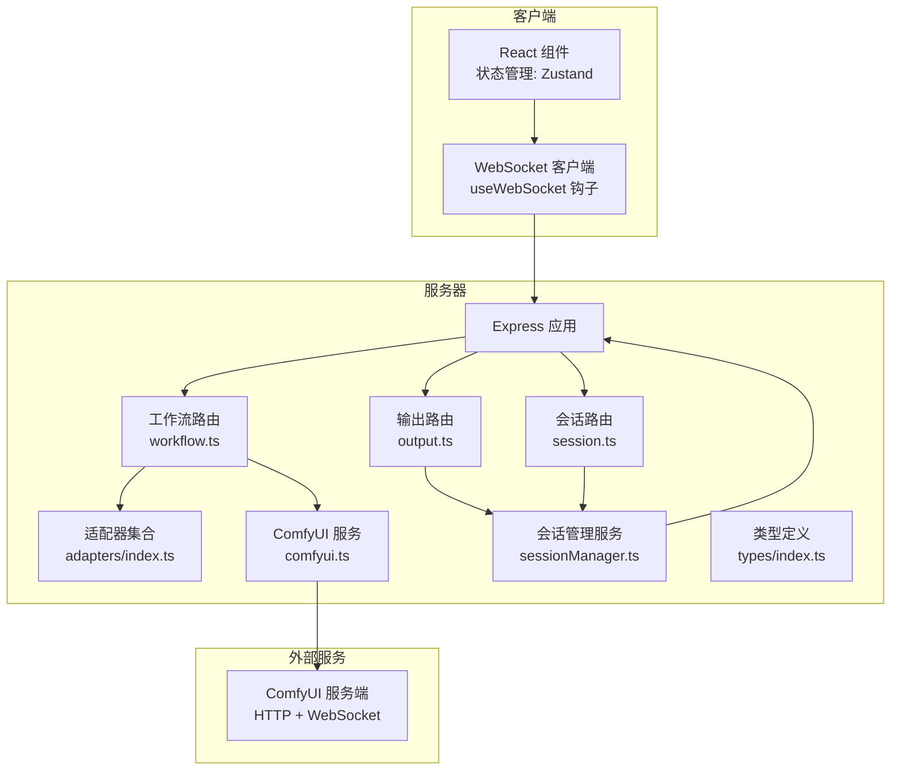
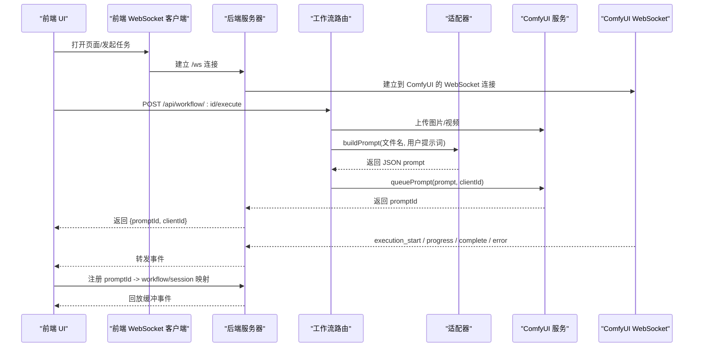
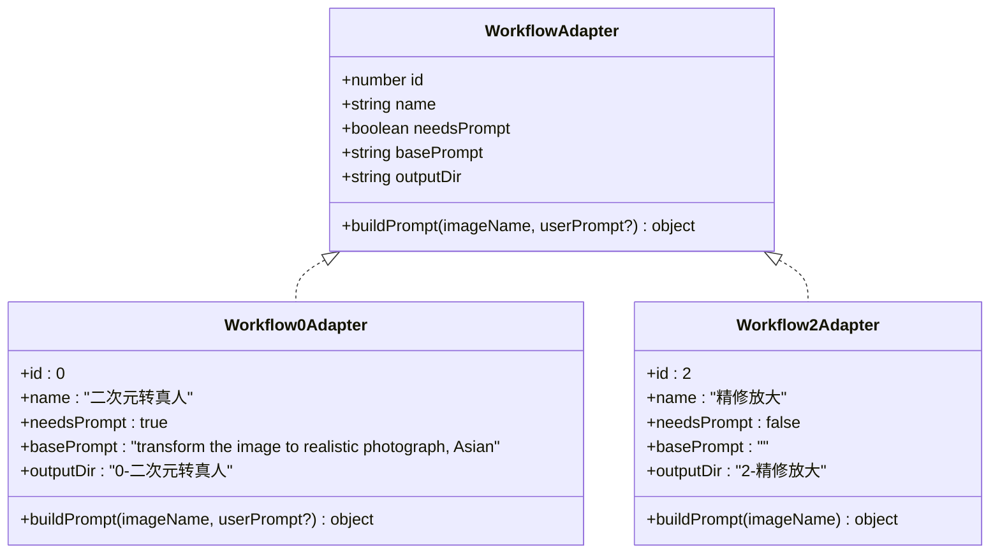
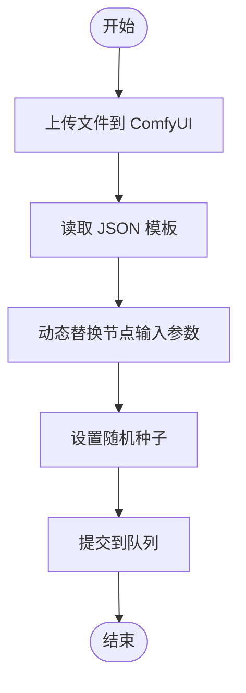
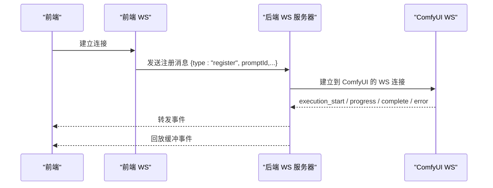
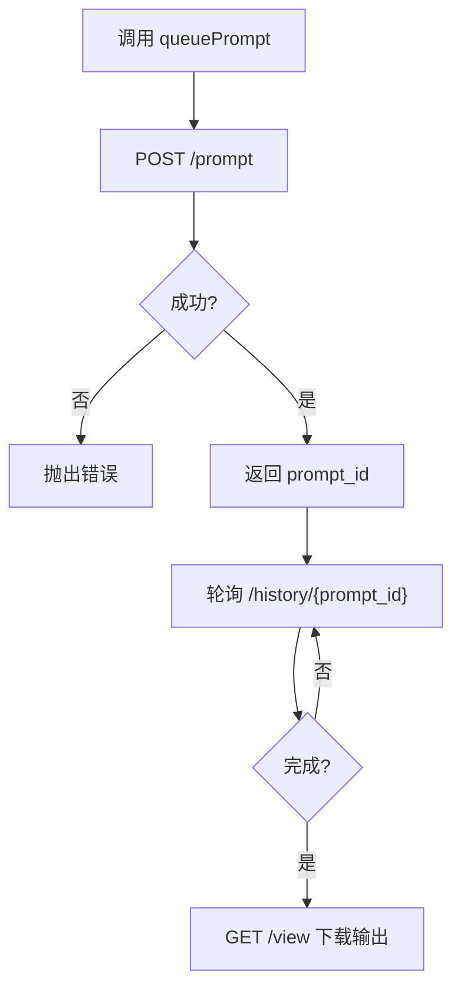
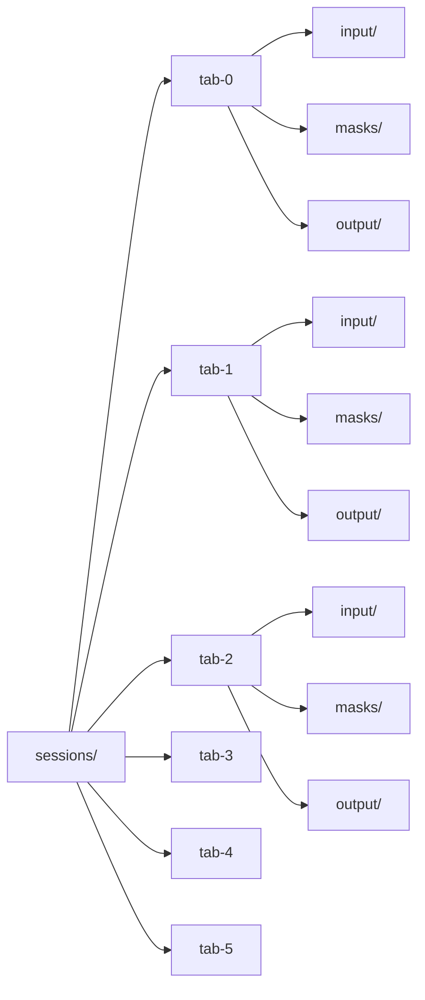
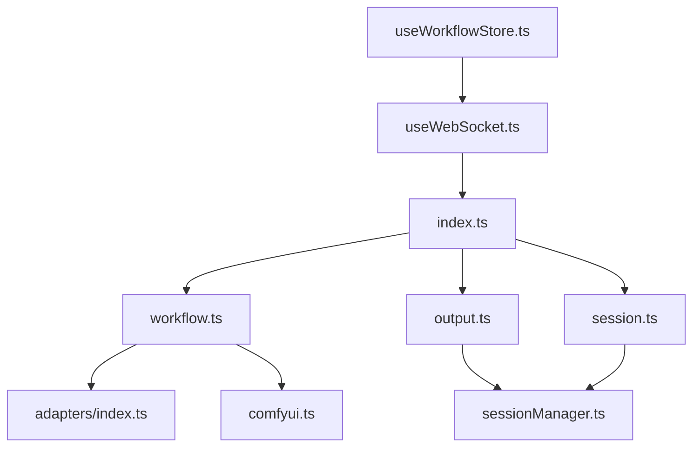

# 第三方集成架构

<cite>
**本文档引用的文件**
- [server/src/index.ts](file://server/src/index.ts)
- [server/src/adapters/BaseAdapter.ts](file://server/src/adapters/BaseAdapter.ts)
- [server/src/adapters/index.ts](file://server/src/adapters/index.ts)
- [server/src/adapters/Workflow0Adapter.ts](file://server/src/adapters/Workflow0Adapter.ts)
- [server/src/adapters/Workflow2Adapter.ts](file://server/src/adapters/Workflow2Adapter.ts)
- [server/src/services/comfyui.ts](file://server/src/services/comfyui.ts)
- [server/src/routes/workflow.ts](file://server/src/routes/workflow.ts)
- [server/src/routes/output.ts](file://server/src/routes/output.ts)
- [server/src/routes/session.ts](file://server/src/routes/session.ts)
- [server/src/services/sessionManager.ts](file://server/src/services/sessionManager.ts)
- [server/src/types/index.ts](file://server/src/types/index.ts)
- [client/src/hooks/useWebSocket.ts](file://client/src/hooks/useWebSocket.ts)
- [client/src/hooks/useWorkflowStore.ts](file://client/src/hooks/useWorkflowStore.ts)
- [ComfyUI_API/0-Pix2Real-二次元转真人.json](file://ComfyUI_API/0-Pix2Real-二次元转真人.json)
</cite>

## 目录
1. [简介](#简介)
2. [项目结构](#项目结构)
3. [核心组件](#核心组件)
4. [架构总览](#架构总览)
5. [详细组件分析](#详细组件分析)
6. [依赖关系分析](#依赖关系分析)
7. [性能考虑](#性能考虑)
8. [故障排除指南](#故障排除指南)
9. [结论](#结论)
10. [附录](#附录)

## 简介
本文件面向 CorineKit Pix2Real 项目，系统性阐述与 ComfyUI 的第三方集成架构与实现细节。重点包括：
- 工作流模板管理：基于适配器模式的统一工作流抽象与模板动态替换
- 参数动态替换：在运行时根据用户输入与业务逻辑修改工作流节点参数
- 节点连接处理：通过 JSON 模板中的连接关系实现节点间数据流转
- WebSocket 实时通信：从 ComfyUI 到前端的进度与完成事件推送
- HTTP API 封装：对 ComfyUI 原生 API 的封装与增强（上传、队列、历史查询等）
- 文件处理机制：本地输出目录与会话级文件存储策略
- 扩展指南：如何通过适配器模式新增工作流与接入新 AI 模型

## 项目结构
后端采用 Node.js + Express 架构，按职责划分为路由层、服务层与类型定义层；前端使用 React + Zustand 状态管理，通过 WebSocket 与后端交互。

图表来源
- [server/src/index.ts:42-61](file://server/src/index.ts#L42-L61)
- [server/src/routes/workflow.ts:1-22](file://server/src/routes/workflow.ts#L1-L22)
- [server/src/routes/output.ts:1-12](file://server/src/routes/output.ts#L1-L12)
- [server/src/routes/session.ts:1-16](file://server/src/routes/session.ts#L1-L16)
- [server/src/services/comfyui.ts:1-10](file://server/src/services/comfyui.ts#L1-L10)
- [server/src/services/sessionManager.ts:1-6](file://server/src/services/sessionManager.ts#L1-L6)

章节来源
- [server/src/index.ts:42-61](file://server/src/index.ts#L42-L61)
- [server/src/routes/workflow.ts:1-22](file://server/src/routes/workflow.ts#L1-L22)
- [server/src/routes/output.ts:1-12](file://server/src/routes/output.ts#L1-L12)
- [server/src/routes/session.ts:1-16](file://server/src/routes/session.ts#L1-L16)

## 核心组件
- 适配器接口与实现：统一工作流构建流程，负责将上传文件名与用户参数注入到 JSON 模板中，形成可提交的 prompt 对象
- ComfyUI 服务：封装上传、入队、历史查询、系统状态、队列优先级等 API，并建立 WebSocket 连接以接收进度与完成事件
- 路由层：提供工作流执行、批量执行、队列管理、系统统计、提示词反推、提示词助手等功能的 HTTP 接口
- 会话管理：负责会话目录、输入/掩码/输出文件的持久化与读取
- 前端 WebSocket 客户端：与后端 WebSocket 服务器建立连接，接收进度、完成、错误事件，并驱动 UI 更新

章节来源
- [server/src/adapters/BaseAdapter.ts:1-4](file://server/src/adapters/BaseAdapter.ts#L1-L4)
- [server/src/adapters/index.ts:1-31](file://server/src/adapters/index.ts#L1-L31)
- [server/src/services/comfyui.ts:1-285](file://server/src/services/comfyui.ts#L1-L285)
- [server/src/routes/workflow.ts:1-862](file://server/src/routes/workflow.ts#L1-L862)
- [server/src/services/sessionManager.ts:1-164](file://server/src/services/sessionManager.ts#L1-L164)
- [client/src/hooks/useWebSocket.ts:1-99](file://client/src/hooks/useWebSocket.ts#L1-L99)

## 架构总览
下图展示了从前端到后端再到 ComfyUI 的完整调用链路与事件流：

图表来源
- [server/src/index.ts:73-219](file://server/src/index.ts#L73-L219)
- [server/src/routes/workflow.ts:408-455](file://server/src/routes/workflow.ts#L408-L455)
- [server/src/services/comfyui.ts:47-60](file://server/src/services/comfyui.ts#L47-L60)
- [client/src/hooks/useWebSocket.ts:10-73](file://client/src/hooks/useWebSocket.ts#L10-L73)

## 详细组件分析

### 适配器模式与工作流模板管理
- 设计要点
  - 通过统一的 WorkflowAdapter 接口抽象工作流构建过程，每个工作流对应一个适配器实现
  - 适配器读取 ComfyUI JSON 模板，动态设置节点输入参数（如图像文件名、提示词、采样器、随机种子等）
  - 支持多工作流共存与扩展，新增工作流只需实现适配器并注册到 adapters 映射表

图表来源
- [server/src/types/index.ts:1-8](file://server/src/types/index.ts#L1-L8)
- [server/src/adapters/Workflow0Adapter.ts:9-34](file://server/src/adapters/Workflow0Adapter.ts#L9-L34)
- [server/src/adapters/Workflow2Adapter.ts:9-27](file://server/src/adapters/Workflow2Adapter.ts#L9-L27)

章节来源
- [server/src/adapters/BaseAdapter.ts:1-4](file://server/src/adapters/BaseAdapter.ts#L1-L4)
- [server/src/adapters/index.ts:1-31](file://server/src/adapters/index.ts#L1-L31)
- [server/src/adapters/Workflow0Adapter.ts:1-35](file://server/src/adapters/Workflow0Adapter.ts#L1-L35)
- [server/src/adapters/Workflow2Adapter.ts:1-28](file://server/src/adapters/Workflow2Adapter.ts#L1-L28)

### 参数动态替换与节点连接处理
- 动态替换
  - 上传文件后获得 ComfyUI 内部文件名，注入到 LoadImage 等节点
  - 用户提示词与默认提示词拼接，写入对应的文本编码节点
  - 随机种子在 KSampler 等节点上随机化，避免重复结果
- 节点连接
  - JSON 模板中的 inputs 字段包含连接关系（如 ["节点ID", 输出索引]），适配器不直接修改连接，而是通过模板预设的连接关系实现数据流

图表来源
- [server/src/routes/workflow.ts:408-455](file://server/src/routes/workflow.ts#L408-L455)
- [server/src/adapters/Workflow0Adapter.ts:16-33](file://server/src/adapters/Workflow0Adapter.ts#L16-L33)
- [ComfyUI_API/0-Pix2Real-二次元转真人.json:1-200](file://ComfyUI_API/0-Pix2Real-二次元转真人.json#L1-L200)

章节来源
- [server/src/routes/workflow.ts:408-455](file://server/src/routes/workflow.ts#L408-L455)
- [server/src/adapters/Workflow0Adapter.ts:16-33](file://server/src/adapters/Workflow0Adapter.ts#L16-L33)
- [ComfyUI_API/0-Pix2Real-二次元转真人.json:1-200](file://ComfyUI_API/0-Pix2Real-二次元转真人.json#L1-L200)

### WebSocket 实时通信集成
- 后端 WebSocket
  - 服务器作为代理，与 ComfyUI 建立 WebSocket 连接，转发进度、完成、错误事件
  - 维护 promptId -> workflow/session 映射，支持客户端断线重连后的事件回放
- 前端 WebSocket
  - 单例连接，自动重连；根据消息类型更新任务状态、进度与输出列表

图表来源
- [server/src/index.ts:73-219](file://server/src/index.ts#L73-L219)
- [client/src/hooks/useWebSocket.ts:10-73](file://client/src/hooks/useWebSocket.ts#L10-L73)

章节来源
- [server/src/index.ts:73-219](file://server/src/index.ts#L73-L219)
- [client/src/hooks/useWebSocket.ts:1-99](file://client/src/hooks/useWebSocket.ts#L1-L99)

### HTTP API 调用封装
- 上传与入队
  - 封装 /upload/image、/prompt 等 ComfyUI 原生接口，提供统一的错误处理与响应格式
- 历史与视图
  - 查询历史记录与下载输出文件，支持图片与 GIF 视频输出
- 队列管理
  - 获取队列、删除队列项、提升优先级（重新排队）

图表来源
- [server/src/services/comfyui.ts:47-83](file://server/src/services/comfyui.ts#L47-L83)
- [server/src/routes/workflow.ts:522-579](file://server/src/routes/workflow.ts#L522-L579)

章节来源
- [server/src/services/comfyui.ts:1-285](file://server/src/services/comfyui.ts#L1-L285)
- [server/src/routes/workflow.ts:522-579](file://server/src/routes/workflow.ts#L522-L579)

### 文件处理机制
- 本地输出目录
  - 按工作流分类的输出目录，提供静态文件服务与打开文件功能
- 会话级文件存储
  - 输入图像、掩码、输出文件分别保存在 sessions/<sessionId>/tab-<tabId>/{input,masks,output}
  - 支持跨平台打开文件夹与默认应用打开文件

图表来源
- [server/src/services/sessionManager.ts:10-16](file://server/src/services/sessionManager.ts#L10-L16)
- [server/src/routes/output.ts:13-20](file://server/src/routes/output.ts#L13-L20)

章节来源
- [server/src/services/sessionManager.ts:1-164](file://server/src/services/sessionManager.ts#L1-L164)
- [server/src/routes/output.ts:1-134](file://server/src/routes/output.ts#L1-L134)

## 依赖关系分析
- 路由层依赖适配器与 ComfyUI 服务；适配器依赖 JSON 模板文件；会话路由依赖会话管理服务
- 前端通过 WebSocket 与后端交互，后端再与 ComfyUI 交互

图表来源
- [server/src/routes/workflow.ts:7-10](file://server/src/routes/workflow.ts#L7-L10)
- [server/src/adapters/index.ts:1-31](file://server/src/adapters/index.ts#L1-L31)
- [server/src/services/comfyui.ts:1-10](file://server/src/services/comfyui.ts#L1-L10)
- [server/src/routes/output.ts:1-12](file://server/src/routes/output.ts#L1-L12)
- [server/src/routes/session.ts:1-16](file://server/src/routes/session.ts#L1-L16)
- [server/src/index.ts:8-12](file://server/src/index.ts#L8-L12)
- [client/src/hooks/useWebSocket.ts:1-99](file://client/src/hooks/useWebSocket.ts#L1-L99)
- [client/src/hooks/useWorkflowStore.ts:1-645](file://client/src/hooks/useWorkflowStore.ts#L1-L645)

章节来源
- [server/src/routes/workflow.ts:7-10](file://server/src/routes/workflow.ts#L7-L10)
- [server/src/adapters/index.ts:1-31](file://server/src/adapters/index.ts#L1-L31)
- [server/src/index.ts:8-12](file://server/src/index.ts#L8-L12)

## 性能考虑
- 队列优先级：通过重新排队的方式将目标任务置顶，减少等待时间
- 内存释放：提供“释放内存”工作流，降低显存占用
- 批量执行：支持一次提交多个文件，提高吞吐量
- 事件回放：客户端断线重连后可回放缓冲事件，避免状态丢失

章节来源
- [server/src/routes/workflow.ts:542-579](file://server/src/routes/workflow.ts#L542-L579)
- [server/src/services/comfyui.ts:255-284](file://server/src/services/comfyui.ts#L255-L284)

## 故障排除指南
- ComfyUI 不可用
  - 现象：系统统计、队列查询返回 502
  - 处理：检查 ComfyUI 服务是否启动，端口是否正确
- 上传失败
  - 现象：上传图片/视频返回错误
  - 处理：确认 /upload/image 接口可达，文件大小限制与覆盖策略
- 队列项无法取消或优先级调整失败
  - 现象：删除队列项或提升优先级报错
  - 处理：确认 promptId 存在且处于可操作状态
- WebSocket 断开重连
  - 现象：前端显示断开并自动重连
  - 处理：确保后端 WebSocket 服务器正常运行，客户端注册了 promptId 映射

章节来源
- [server/src/routes/workflow.ts:532-540](file://server/src/routes/workflow.ts#L532-L540)
- [server/src/services/comfyui.ts:90-99](file://server/src/services/comfyui.ts#L90-L99)
- [server/src/routes/workflow.ts:522-530](file://server/src/routes/workflow.ts#L522-L530)
- [client/src/hooks/useWebSocket.ts:53-65](file://client/src/hooks/useWebSocket.ts#L53-L65)

## 结论
本项目通过适配器模式实现了对多种工作流的统一管理，结合 ComfyUI 的 JSON 模板与 WebSocket 实时事件，提供了稳定、可扩展的第三方集成方案。前端通过单例 WebSocket 客户端与后端协作，实现了流畅的任务进度与结果展示。通过会话管理与文件持久化，用户可以长期保存与复用工作成果。

## 附录

### 扩展新工作流的步骤
- 新建适配器
  - 在 server/src/adapters 下创建适配器文件，实现 WorkflowAdapter 接口
  - 在 server/src/adapters/index.ts 中注册新适配器
- 准备模板
  - 在 ComfyUI_API 目录准备 JSON 模板文件，确保包含必要的节点与连接
- 路由扩展
  - 在 server/src/routes/workflow.ts 中添加新的执行路由，调用适配器构建 prompt 并提交队列
- 前端集成
  - 在前端 store 中添加工作流配置，确保 needsPrompt、名称等信息正确
  - 如需特殊 UI，可在相应侧边栏组件中增加配置面板

章节来源
- [server/src/adapters/Workflow0Adapter.ts:1-35](file://server/src/adapters/Workflow0Adapter.ts#L1-L35)
- [server/src/adapters/index.ts:1-31](file://server/src/adapters/index.ts#L1-L31)
- [server/src/routes/workflow.ts:408-455](file://server/src/routes/workflow.ts#L408-L455)
- [client/src/hooks/useWorkflowStore.ts:6-17](file://client/src/hooks/useWorkflowStore.ts#L6-L17)