# 架构概览

<cite>
**本文档引用的文件**
- [README.md](file://README.md)
- [package.json](file://package.json)
- [client/package.json](file://client/package.json)
- [server/package.json](file://server/package.json)
- [server/src/index.ts](file://server/src/index.ts)
- [client/src/main.tsx](file://client/src/main.tsx)
- [server/src/adapters/index.ts](file://server/src/adapters/index.ts)
- [server/src/services/comfyui.ts](file://server/src/services/comfyui.ts)
- [client/src/hooks/useWebSocket.ts](file://client/src/hooks/useWebSocket.ts)
- [server/src/routes/workflow.ts](file://server/src/routes/workflow.ts)
- [client/src/components/App.tsx](file://client/src/components/App.tsx)
- [server/src/config/paths.ts](file://server/src/config/paths.ts)
- [server/src/types/index.ts](file://server/src/types/index.ts)
- [client/src/types/index.ts](file://client/src/types/index.ts)
- [server/src/services/sessionManager.ts](file://server/src/services/sessionManager.ts)
- [server/src/routes/output.ts](file://server/src/routes/output.ts)
</cite>

## 目录
1. [简介](#简介)
2. [项目结构](#项目结构)
3. [核心组件](#核心组件)
4. [架构概览](#架构概览)
5. [详细组件分析](#详细组件分析)
6. [依赖关系分析](#依赖关系分析)
7. [性能考虑](#性能考虑)
8. [故障排除指南](#故障排除指南)
9. [结论](#结论)

## 简介

CorineKit Pix2Real 是一个基于 Electron 的本地 Web 应用程序，专门用于通过 ComfyUI 进行批量图像/视频处理。该应用程序采用前后端分离架构，结合 Electron 应用、适配器模式和 WebSocket 实时通信技术，为用户提供了一个功能丰富的本地 AI 图像处理解决方案。

### 主要特性
- **5种内置工作流**：二次元转真人、人物精修、图像放大、图像转视频、视频放大
- **批量处理**：支持拖拽多个文件并一次性执行
- **实时进度监控**：通过 WebSocket 从 ComfyUI 实时转发进度更新
- **会话管理**：支持工作流标签页隔离和会话持久化
- **一键输出**：点击即可打开工作流输出目录

## 项目结构

该项目采用典型的前后端分离架构，具有清晰的模块化组织：

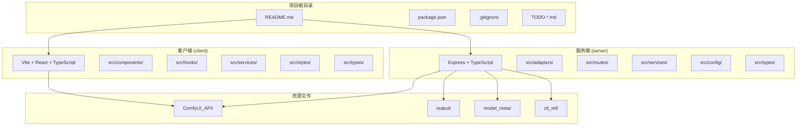

**图表来源**
- [README.md:41-62](file://README.md#L41-L62)
- [package.json:1-15](file://package.json#L1-L15)

### 目录结构说明

**客户端 (client/)**
- `src/components/`：React 组件库，包含应用界面、工具栏、侧边栏等
- `src/hooks/`：自定义 Hook，如 WebSocket 连接、状态管理等
- `src/services/`：API 服务和桌面通知服务
- `src/types/`：TypeScript 类型定义

**服务端 (server/)**
- `src/adapters/`：工作流适配器，实现适配器模式
- `src/routes/`：Express 路由处理器
- `src/services/`：业务服务，包括 ComfyUI 集成、会话管理等
- `src/config/`：配置管理，路径解析等

**共享资源**
- `ComfyUI_API/`：工作流 JSON 模板文件
- `output/`：生成文件输出目录
- `model_meta/`：模型元数据存储

**章节来源**
- [README.md:41-62](file://README.md#L41-L62)
- [package.json:1-15](file://package.json#L1-L15)

## 核心组件

### 前端 React 应用 (Electron 容器)

前端采用 Vite + React + TypeScript 技术栈，通过 Electron 容器运行本地 Web 应用：

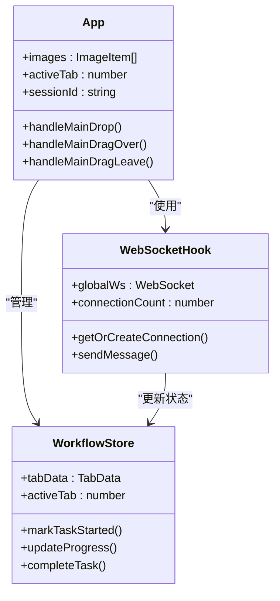

**图表来源**
- [client/src/components/App.tsx:61-422](file://client/src/components/App.tsx#L61-L422)
- [client/src/hooks/useWebSocket.ts:29-278](file://client/src/hooks/useWebSocket.ts#L29-L278)

### Express 后端服务

后端基于 Express 框架，提供 RESTful API 和 WebSocket 服务：

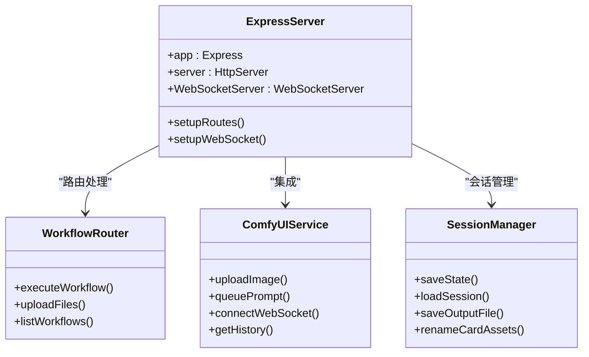

**图表来源**
- [server/src/index.ts:118-516](file://server/src/index.ts#L118-L516)
- [server/src/routes/workflow.ts:152-800](file://server/src/routes/workflow.ts#L152-L800)

### ComfyUI 集成层

实现适配器模式，为不同工作流提供统一接口：

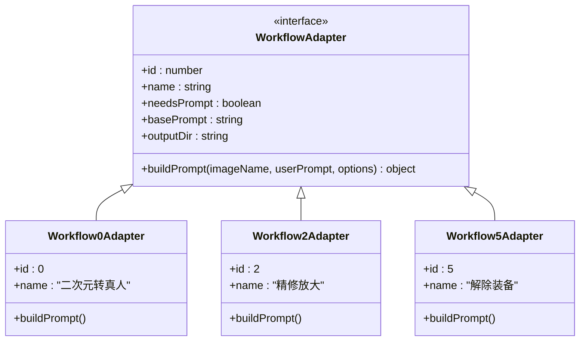

**图表来源**
- [server/src/types/index.ts:1-8](file://server/src/types/index.ts#L1-L8)
- [server/src/adapters/index.ts:14-33](file://server/src/adapters/index.ts#L14-L33)

**章节来源**
- [client/src/main.tsx:1-11](file://client/src/main.tsx#L1-L11)
- [server/src/index.ts:118-516](file://server/src/index.ts#L118-L516)

## 架构概览

### 整体架构模式

系统采用混合架构模式，结合了前后端分离、Electron 应用、适配器模式和 WebSocket 实时通信：

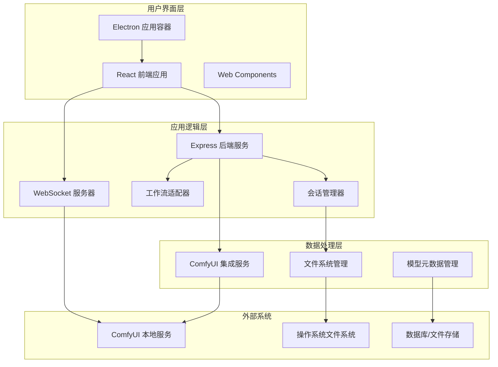

**图表来源**
- [README.md:74-79](file://README.md#L74-L79)
- [server/src/index.ts:157-494](file://server/src/index.ts#L157-L494)

### 数据流向和控制流程

系统的核心数据流遵循以下模式：

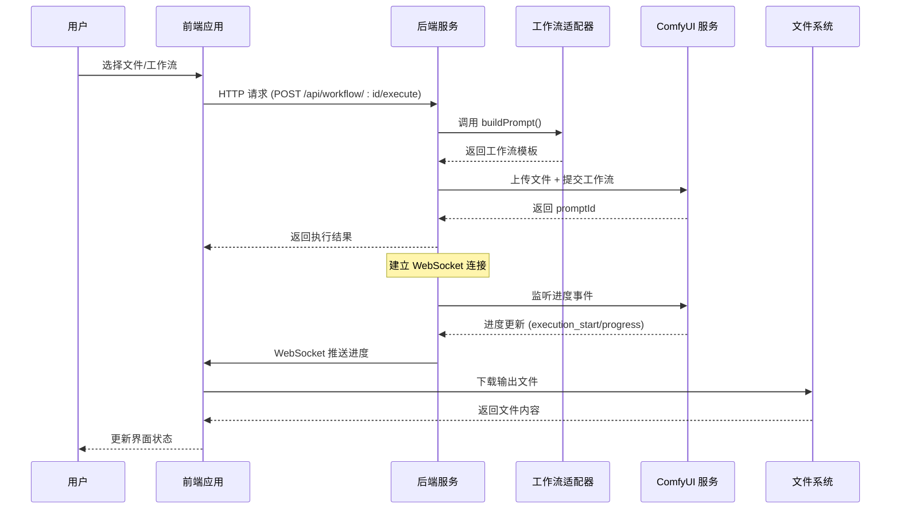

**图表来源**
- [server/src/routes/workflow.ts:750-799](file://server/src/routes/workflow.ts#L750-L799)
- [client/src/hooks/useWebSocket.ts:45-162](file://client/src/hooks/useWebSocket.ts#L45-L162)

### 系统边界图

```mermaid
graph TB
subgraph "外部边界"
A[用户]
B[操作系统]
C[网络/防火墙]
end
subgraph "应用边界"
D[Electron 容器]
E[前端应用 (React)]
F[后端服务 (Express)]
G[WebSocket 服务器]
end
subgraph "数据边界"
H[ComfyUI 本地服务]
I[文件系统]
J[会话存储]
K[模型元数据]
end
subgraph "内部边界"
L[工作流适配器]
M[ComfyUI 集成服务]
N[会话管理器]
O[路径配置管理]
end
A --> D
B --> D
C --> D
D --> E
D --> F
D --> G
E --> F
F --> H
F --> I
F --> J
F --> K
F --> L
F --> M
F --> N
F --> O
G --> H
I --> J
K --> L
```

**图表来源**
- [server/src/config/paths.ts:18-156](file://server/src/config/paths.ts#L18-L156)
- [server/src/services/sessionManager.ts:11-18](file://server/src/services/sessionManager.ts#L11-L18)

## 详细组件分析

### 前端组件架构

前端采用模块化设计，主要组件包括：

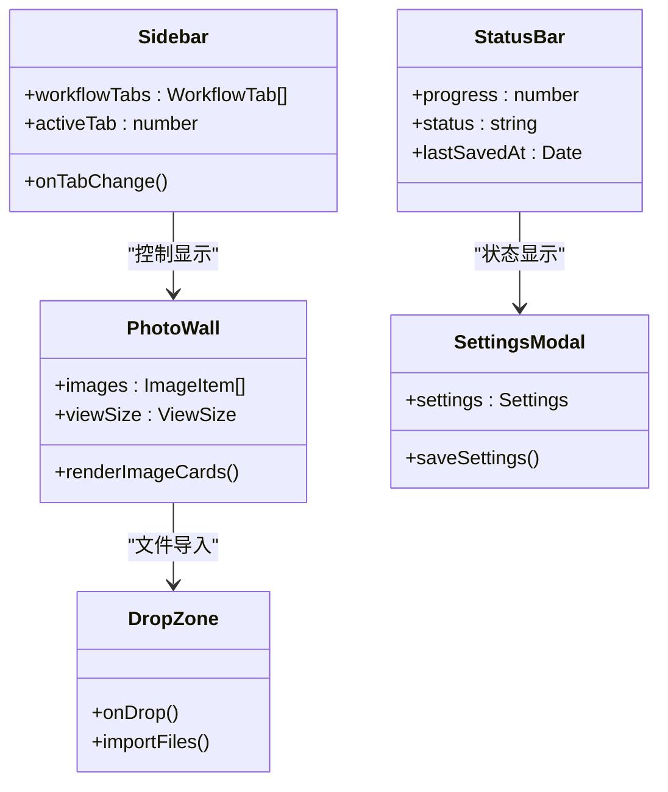

**图表来源**
- [client/src/components/App.tsx:1-422](file://client/src/components/App.tsx#L1-L422)

### WebSocket 实时通信机制

系统实现了高效的实时通信机制：

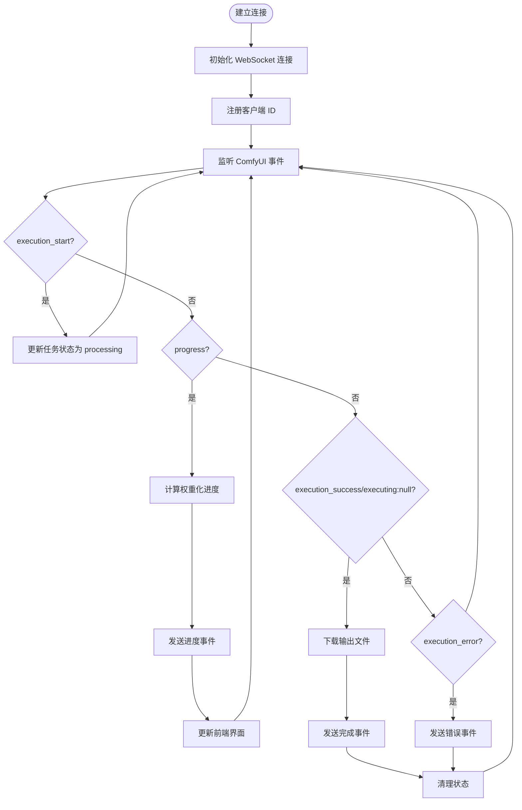

**图表来源**
- [client/src/hooks/useWebSocket.ts:45-230](file://client/src/hooks/useWebSocket.ts#L45-L230)
- [server/src/index.ts:272-464](file://server/src/index.ts#L272-L464)

### 适配器模式实现

工作流适配器提供了统一的接口抽象：

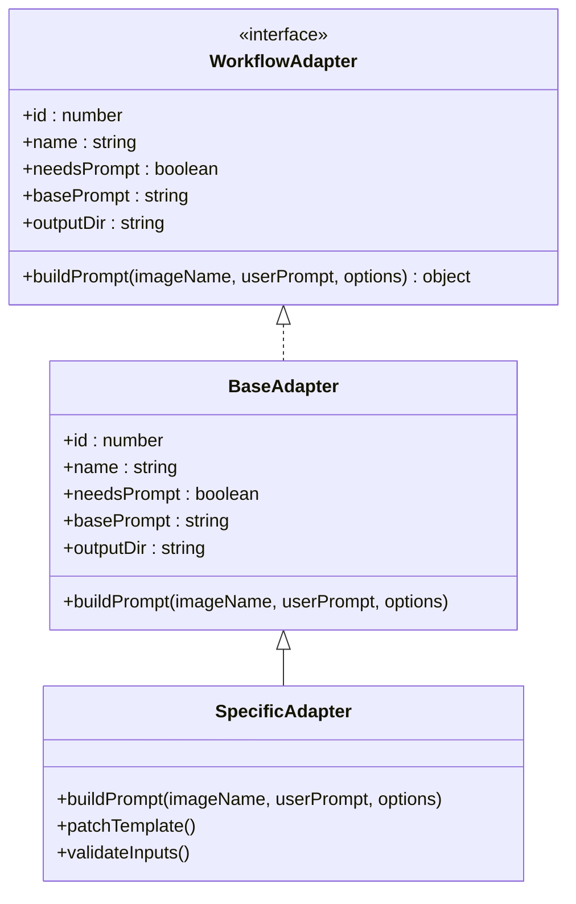

**图表来源**
- [server/src/types/index.ts:1-8](file://server/src/types/index.ts#L1-L8)
- [server/src/adapters/BaseAdapter.ts:1-4](file://server/src/adapters/BaseAdapter.ts#L1-L4)

### 文件系统管理层

实现了复杂的文件管理和会话持久化机制：

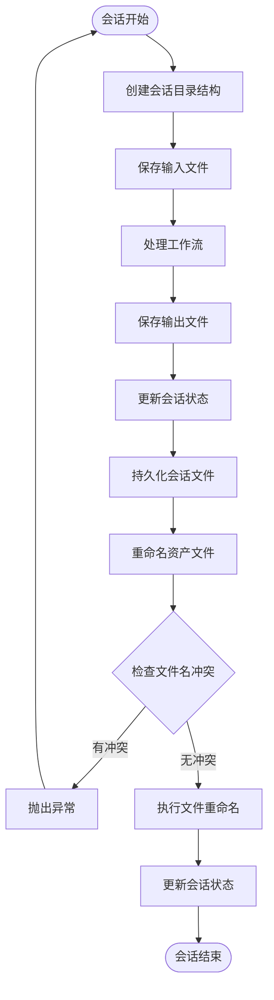

**图表来源**
- [server/src/services/sessionManager.ts:102-133](file://server/src/services/sessionManager.ts#L102-L133)
- [server/src/services/sessionManager.ts:256-360](file://server/src/services/sessionManager.ts#L256-L360)

**章节来源**
- [client/src/components/App.tsx:1-422](file://client/src/components/App.tsx#L1-L422)
- [client/src/hooks/useWebSocket.ts:29-278](file://client/src/hooks/useWebSocket.ts#L29-L278)
- [server/src/adapters/index.ts:14-33](file://server/src/adapters/index.ts#L14-L33)

## 依赖关系分析

### 技术栈依赖

```mermaid
graph TB
subgraph "前端依赖"
A[React 19.0.0]
B[TypeScript 5.7.0]
C[Vite 6.0.0]
D[Zustand 5.0.0]
E[Lucide React 0.468.0]
end
subgraph "后端依赖"
F[Express 4.21.0]
G[TypeScript 5.7.0]
H[ws 8.18.0]
I[node-fetch 3.3.2]
J[multer 1.4.5-lts.1]
K[cors 2.8.5]
end
subgraph "开发工具"
L[concurrently 9.1.0]
M[tsx 4.19.0]
N[@vitejs/plugin-react 4.3.0]
end
A --> D
F --> H
F --> I
F --> J
F --> K
```

**图表来源**
- [client/package.json:11-26](file://client/package.json#L11-L26)
- [server/package.json:11-28](file://server/package.json#L11-L28)
- [package.json:11-14](file://package.json#L11-L14)

### 关键依赖关系

系统的关键依赖关系包括：

1. **前端到后端**：React 应用通过 HTTP 和 WebSocket 与 Express 服务通信
2. **后端到 ComfyUI**：Express 服务通过 HTTP 和 WebSocket 与 ComfyUI 通信
3. **会话管理**：文件系统持久化与内存状态管理
4. **适配器模式**：工作流模板与具体实现的解耦

**章节来源**
- [client/package.json:11-26](file://client/package.json#L11-L26)
- [server/package.json:11-28](file://server/package.json#L11-L28)

## 性能考虑

### WebSocket 连接优化

系统采用了多项优化策略来提升 WebSocket 性能：

1. **单例连接管理**：使用模块级全局变量确保每个进程只有一个 WebSocket 连接
2. **事件缓冲**：为新连接提供事件缓冲，避免错过早期进度事件
3. **权重化进度计算**：基于节点权重的精确进度计算，避免 UI 卡顿

### 文件处理优化

1. **内存文件上传**：使用 multer 的内存存储处理文件上传，减少磁盘 I/O
2. **批量操作**：支持批量文件处理和会话管理
3. **异步文件操作**：使用异步 API 避免阻塞主线程

### 内存管理

1. **会话隔离**：每个工作流标签页维护独立的状态
2. **及时清理**：任务完成后及时清理内存和文件句柄
3. **路径缓存**：配置路径的动态解析和缓存

## 故障排除指南

### 常见问题诊断

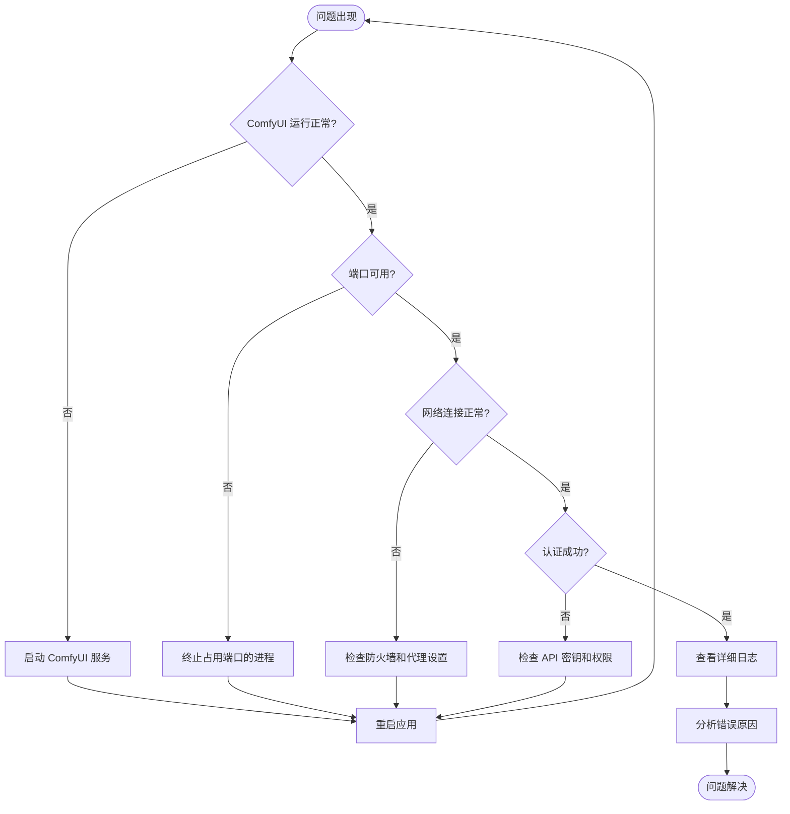

### 错误处理策略

系统实现了多层次的错误处理机制：

1. **前端错误处理**：用户友好的错误提示和恢复选项
2. **后端错误处理**：详细的错误日志和降级策略
3. **WebSocket 错误处理**：自动重连和状态恢复
4. **文件系统错误处理**：文件名冲突检测和异常恢复

**章节来源**
- [server/src/routes/workflow.ts:126-150](file://server/src/routes/workflow.ts#L126-L150)
- [client/src/hooks/useWebSocket.ts:232-248](file://client/src/hooks/useWebSocket.ts#L232-L248)

## 结论

CorineKit Pix2Real 展示了一个成熟的本地 AI 图像处理应用架构，通过以下关键技术实现了高效、可靠的系统：

### 架构优势

1. **模块化设计**：清晰的前后端分离和组件化架构
2. **适配器模式**：灵活的工作流扩展机制
3. **实时通信**：高效的 WebSocket 实时进度监控
4. **会话管理**：完整的状态持久化和恢复机制
5. **文件系统集成**：完善的文件管理和存储策略

### 技术决策分析

1. **Electron + React**：提供了跨平台桌面应用的最佳实践
2. **Express + TypeScript**：后端开发的稳定选择，类型安全
3. **WebSocket 实时通信**：相比轮询方案的显著性能优势
4. **适配器模式**：工作流扩展的优雅解决方案
5. **会话持久化**：用户体验和数据安全的平衡

### 未来改进方向

1. **微服务架构**：考虑将大型服务拆分为更小的独立服务
2. **容器化部署**：支持 Docker 部署和 Kubernetes 编排
3. **云同步功能**：添加云端会话同步和备份功能
4. **AI 助手集成**：增强智能提示和自动化建议功能
5. **性能监控**：添加应用性能指标和用户行为分析

该架构为类似的应用开发提供了优秀的参考模板，展示了如何在桌面应用环境中有效集成现代 Web 技术和 AI 工作流服务。