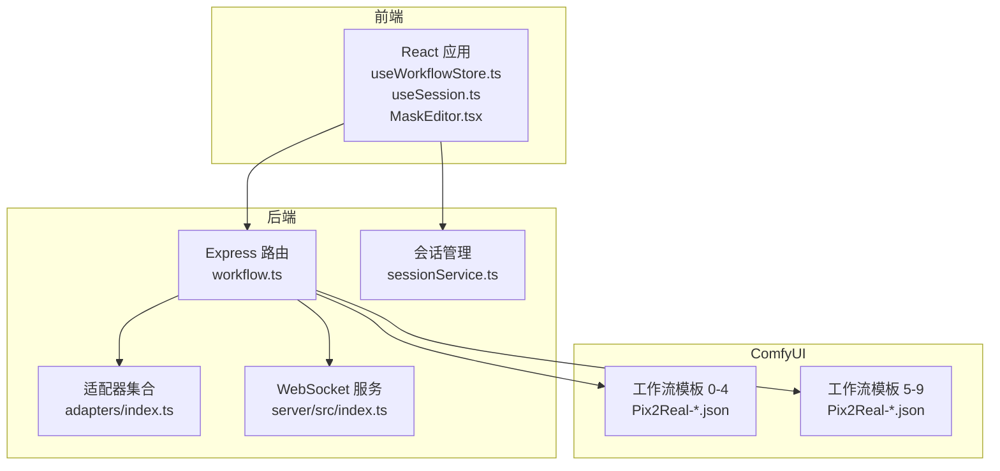
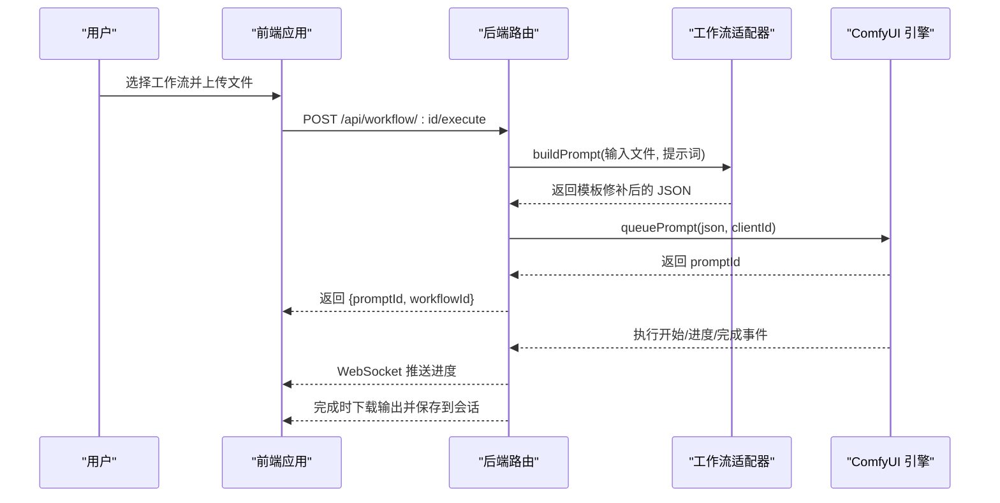
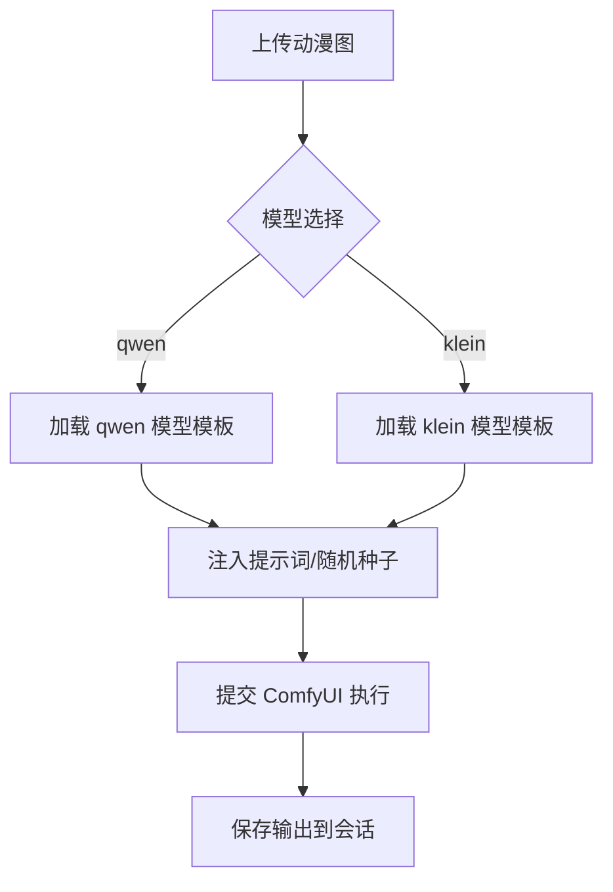
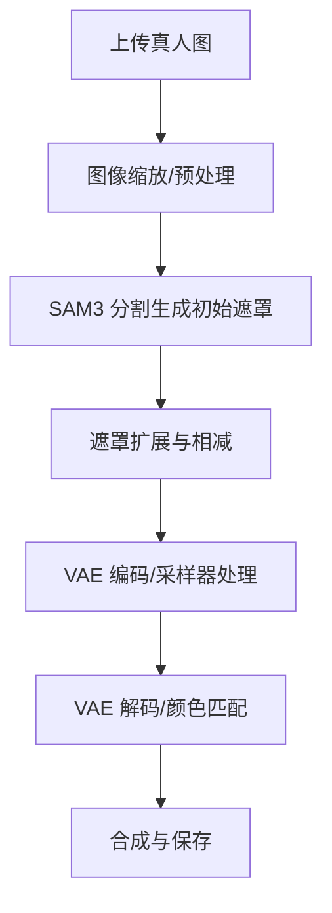
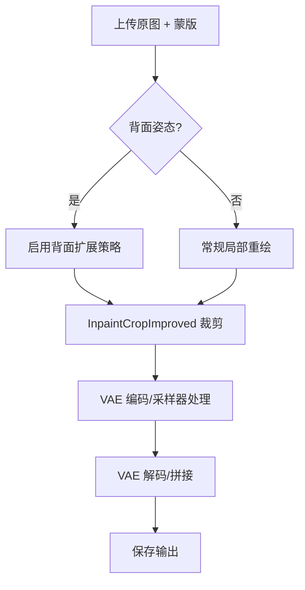
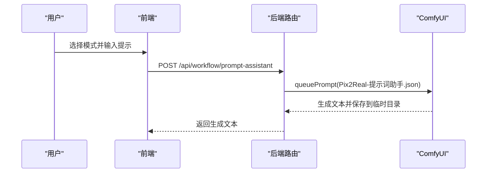
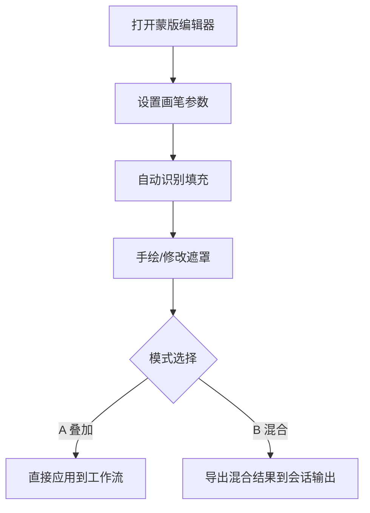
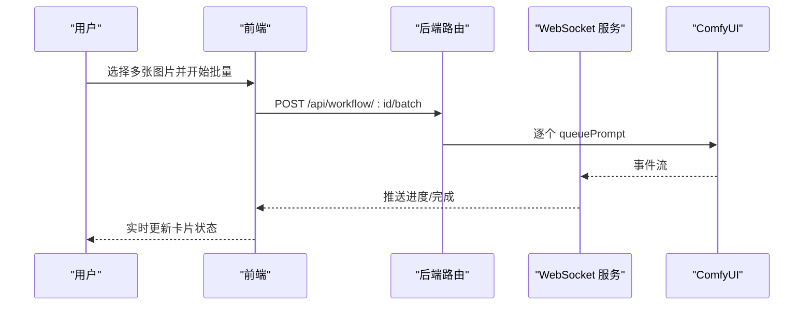
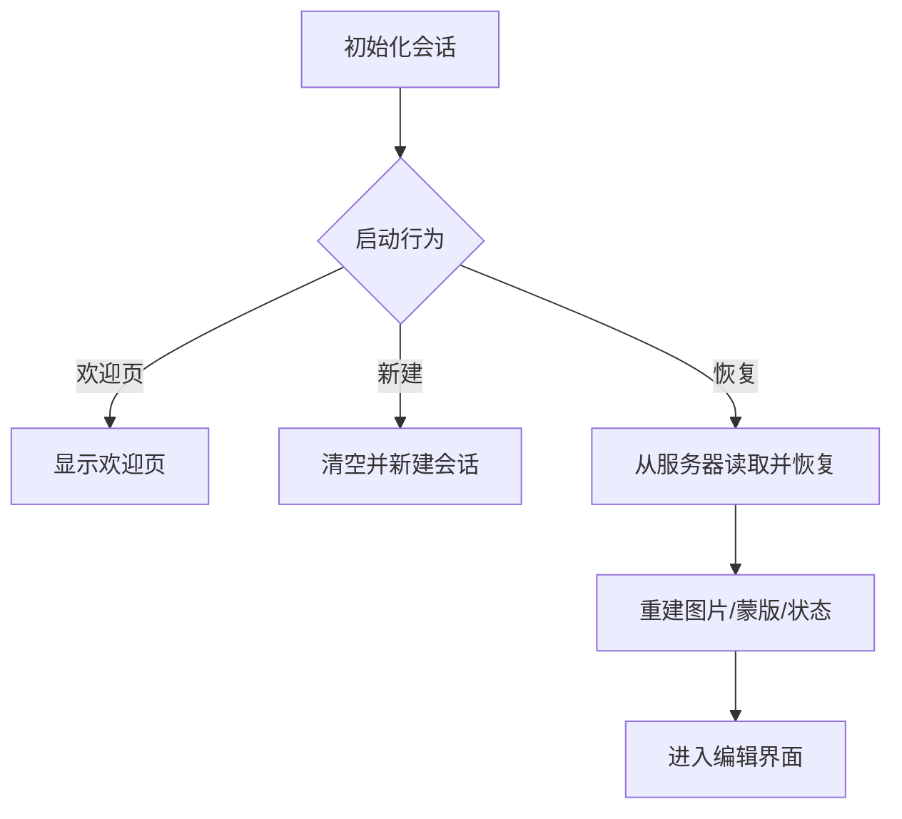
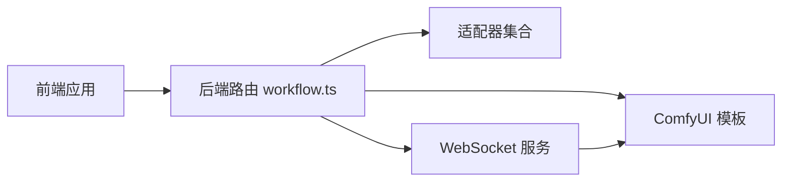

# 核心功能特性

<cite>
**本文档引用的文件**
- [README.md](file://README.md)
- [server/src/index.ts](file://server/src/index.ts)
- [server/src/routes/workflow.ts](file://server/src/routes/workflow.ts)
- [server/src/adapters/index.ts](file://server/src/adapters/index.ts)
- [client/src/hooks/useWorkflowStore.ts](file://client/src/hooks/useWorkflowStore.ts)
- [client/src/hooks/useSession.ts](file://client/src/hooks/useSession.ts)
- [client/src/services/sessionService.ts](file://client/src/services/sessionService.ts)
- [client/src/components/MaskEditor.tsx](file://client/src/components/MaskEditor.tsx)
- [client/src/components/prompt-assistant/systemPrompts.ts](file://client/src/components/prompt-assistant/systemPrompts.ts)
- [docs/SystemPrompt.txt](file://docs/SystemPrompt.txt)
- [ComfyUI_API/Pix2Real-二次元生成.json](file://ComfyUI_API/Pix2Real-二次元生成.json)
- [ComfyUI_API/Pix2Real-真人精修.json](file://ComfyUI_API/Pix2Real-真人精修.json)
- [ComfyUI_API/Pix2Real-解除装备.json](file://ComfyUI_API/Pix2Real-解除装备.json)
- [ComfyUI_API/Pix2Real-真人转二次元.json](file://ComfyUI_API/Pix2Real-真人转二次元.json)
- [ComfyUI_API/Pix2Real-提示词助手.json](file://ComfyUI_API/Pix2Real-提示词助手.json)
</cite>

## 目录
1. [简介](#简介)
2. [项目结构](#项目结构)
3. [核心组件](#核心组件)
4. [架构总览](#架构总览)
5. [详细组件分析](#详细组件分析)
6. [依赖关系分析](#依赖关系分析)
7. [性能考虑](#性能考虑)
8. [故障排除指南](#故障排除指南)
9. [结论](#结论)

## 简介
本项目为本地化的 Web 图像/视频批处理系统，基于 ComfyUI 构建，提供五大核心工作流与五项专业功能，并支持批量处理、实时进度监控与会话持久化。通过直观的前端界面，用户可直接上传图片或视频，选择对应工作流，即可获得高质量的处理结果。

## 项目结构
项目采用前后端分离架构：
- 前端（React + TypeScript）：负责用户交互、状态管理、会话持久化、蒙版编辑、提示词助手等。
- 后端（Express + WebSocket）：负责路由、适配器、与 ComfyUI 的通信、输出下载、VRAM 释放等。
- ComfyUI 工作流模板：以 JSON 形式定义各工作流的节点连接与参数，后端按需注入输入与提示词。

图表来源
- [server/src/routes/workflow.ts:29-38](file://server/src/routes/workflow.ts#L29-L38)
- [server/src/adapters/index.ts:13-24](file://server/src/adapters/index.ts#L13-L24)
- [server/src/index.ts:62-63](file://server/src/index.ts#L62-L63)

章节来源
- [README.md:41-62](file://README.md#L41-L62)

## 核心组件
- 工作流适配器：每个工作流一个适配器，负责加载模板并注入输入与提示词，实现“按需修补”而非全量复制。
- WebSocket 进度通道：后端与 ComfyUI 建立连接，将执行开始、进度、完成事件转发给前端，确保实时反馈。
- 会话持久化：前端状态与蒙版数据持久化到后端目录，支持新建、恢复、删除与自动保存。
- 蒙版编辑器：提供智能笔刷、自动识别填充、历史记录、导出混合结果等功能，支持多种叠加模式。
- 专业功能：提示词助手、蒙版编辑、快速出图、黑兽换脸、ZIT 快出等专用工作流。

章节来源
- [README.md:5-14](file://README.md#L5-L14)
- [server/src/index.ts:73-189](file://server/src/index.ts#L73-L189)
- [client/src/hooks/useWorkflowStore.ts:6-17](file://client/src/hooks/useWorkflowStore.ts#L6-L17)

## 架构总览
系统通过适配器模式将前端请求映射到 ComfyUI 工作流模板，后端统一调度与进度回传，前端通过 WebSocket 实时渲染进度与结果。

图表来源
- [server/src/routes/workflow.ts:408-455](file://server/src/routes/workflow.ts#L408-L455)
- [server/src/index.ts:94-175](file://server/src/index.ts#L94-L175)

## 详细组件分析

### 五大核心工作流详解

#### 1) 二次元转真人
- 功能概述：将动漫风格图像转换为写实风格，支持 qwen（默认）与 klein 两种模型路径。
- 输入输出：单图输入，输出写实风格图像；可选自定义提示词追加到基础提示词。
- 典型场景：角色设计写实化、漫画封面真人化、表情包人物写实化。
- 效果对比：二次元风格 → 写实皮肤质感、真实光影、细节增强。

图表来源
- [server/src/routes/workflow.ts:312-355](file://server/src/routes/workflow.ts#L312-L355)
- [ComfyUI_API/Pix2Real-二次元生成.json:1-145](file://ComfyUI_API/Pix2Real-二次元生成.json#L1-L145)

章节来源
- [server/src/routes/workflow.ts:312-355](file://server/src/routes/workflow.ts#L312-L355)
- [ComfyUI_API/Pix2Real-二次元生成.json:1-145](file://ComfyUI_API/Pix2Real-二次元生成.json#L1-L145)

#### 2) 真人精修
- 功能概述：对写实人像进行细节优化与修复，包含颜色匹配、遮罩扩展、局部重绘等步骤。
- 输入输出：单图输入，输出高质量修复图像；支持自动/手动遮罩。
- 典型场景：人像瑕疵修复、肤色调整、背景优化。
- 效果对比：粗糙细节 → 清晰皮肤纹理、自然光影过渡。

图表来源
- [ComfyUI_API/Pix2Real-真人精修.json:1-369](file://ComfyUI_API/Pix2Real-真人精修.json#L1-L369)

章节来源
- [ComfyUI_API/Pix2Real-真人精修.json:1-369](file://ComfyUI_API/Pix2Real-真人精修.json#L1-L369)

#### 3) 精修放大
- 功能概述：在真人精修基础上进行高清放大，支持 seedvr2（默认）、klein、SD 三种模型路径。
- 输入输出：单图输入，输出高分辨率图像。
- 典型场景：头像高清化、海报素材放大、细节强化。
- 效果对比：低分辨率 → 高清细节、锐利边缘。

章节来源
- [server/src/routes/workflow.ts:357-405](file://server/src/routes/workflow.ts#L357-L405)

#### 4) 解除装备
- 功能概述：基于用户提供的蒙版，自动移除图像中的服装或配饰，支持正面/背面姿态切换。
- 输入输出：图像 + 蒙版，输出无装备图像。
- 典型场景：角色立绘换装、装备替换、背景简化。
- 效果对比：穿戴装备 → 裸露区域自然融合。

图表来源
- [server/src/routes/workflow.ts:40-92](file://server/src/routes/workflow.ts#L40-L92)
- [ComfyUI_API/Pix2Real-解除装备.json:1-372](file://ComfyUI_API/Pix2Real-解除装备.json#L1-L372)

章节来源
- [server/src/routes/workflow.ts:40-92](file://server/src/routes/workflow.ts#L40-L92)
- [ComfyUI_API/Pix2Real-解除装备.json:1-372](file://ComfyUI_API/Pix2Real-解除装备.json#L1-L372)

#### 5) 真人转二次元
- 功能概述：将写实图像转换为动漫风格，包含提示词反推与二次采样。
- 输入输出：单图输入，输出动漫风格图像；可选自定义提示词。
- 典型场景：照片转动漫头像、角色立绘二次元化。
- 效果对比：写实 → 动漫风格、柔和轮廓、风格化渲染。

章节来源
- [ComfyUI_API/Pix2Real-真人转二次元.json:1-323](file://ComfyUI_API/Pix2Real-真人转二次元.json#L1-L323)

### 五项专业功能详解

#### 1) 提示词助手
- 功能概述：内置多阶段系统提示，支持自然语言→标签、标签→自然语言、变体生成、扩写、后续场景、剧本生成等。
- 使用方式：调用提示词助手工作流，传入系统提示与用户提示，返回生成文本。
- 典型场景：快速生成高质量提示词、批量生成变体、故事板脚本创作。

图表来源
- [server/src/routes/workflow.ts:746-800](file://server/src/routes/workflow.ts#L746-L800)
- [docs/SystemPrompt.txt:1-146](file://docs/SystemPrompt.txt#L1-L146)
- [client/src/components/prompt-assistant/systemPrompts.ts:1-145](file://client/src/components/prompt-assistant/systemPrompts.ts#L1-L145)
- [ComfyUI_API/Pix2Real-提示词助手.json:1-106](file://ComfyUI_API/Pix2Real-提示词助手.json#L1-L106)

章节来源
- [server/src/routes/workflow.ts:746-800](file://server/src/routes/workflow.ts#L746-L800)
- [docs/SystemPrompt.txt:1-146](file://docs/SystemPrompt.txt#L1-L146)
- [client/src/components/prompt-assistant/systemPrompts.ts:1-145](file://client/src/components/prompt-assistant/systemPrompts.ts#L1-L145)
- [ComfyUI_API/Pix2Real-提示词助手.json:1-106](file://ComfyUI_API/Pix2Real-提示词助手.json#L1-L106)

#### 2) 蒙版编辑
- 功能概述：提供画笔大小/硬度/不透明度调节、撤销/重做、自动识别填充、遮罩叠加显示、导出混合结果等。
- 使用方式：在蒙版编辑器中绘制/导入遮罩，支持 Mode A 叠加与 Mode B 混合导出。
- 典型场景：精细局部修复、复杂背景分离、多阶段蒙版合成。

图表来源
- [client/src/components/MaskEditor.tsx:1-375](file://client/src/components/MaskEditor.tsx#L1-L375)

章节来源
- [client/src/components/MaskEditor.tsx:1-375](file://client/src/components/MaskEditor.tsx#L1-L375)

#### 3) 快速出图
- 功能概述：纯文本生图工作流，支持指定模型、尺寸、采样步数、CFG、采样器与调度器。
- 使用方式：POST /api/workflow/7/execute，传入 clientId 与配置参数。
- 典型场景：快速生成测试图、批量生成风格化图像。

章节来源
- [server/src/routes/workflow.ts:94-149](file://server/src/routes/workflow.ts#L94-L149)

#### 4) 黑兽换脸
- 功能概述：将目标图像的人脸替换为另一张人脸图像，用于角色换脸或创意合成。
- 使用方式：POST /api/workflow/8/execute，上传 targetImage 与 faceImage。
- 典型场景：角色换脸、表情包制作、二次元角色拟真化。

章节来源
- [server/src/routes/workflow.ts:263-310](file://server/src/routes/workflow.ts#L263-L310)

#### 5) ZIT 快出
- 功能概述：基于 UNet + LoRA 的文本生图，支持可选的 Shift（AuraFlow）机制，灵活组合模型链路。
- 使用方式：POST /api/workflow/9/execute，传入 clientId、模型与采样参数。
- 典型场景：高精度风格化生成、LoRA 特效叠加、Shift 调整风格强度。

章节来源
- [server/src/routes/workflow.ts:181-261](file://server/src/routes/workflow.ts#L181-L261)

### 批量处理与实时进度监控
- 批量处理：支持一次上传多张图片，后端逐个排队执行，返回每个任务的 promptId。
- 实时进度：后端通过 WebSocket 将 execution_start、progress、complete 事件推送到前端，前端更新任务状态。
- 会话持久化：前端状态与蒙版数据自动保存到后端目录，支持恢复与删除。

图表来源
- [server/src/routes/workflow.ts:457-520](file://server/src/routes/workflow.ts#L457-L520)
- [server/src/index.ts:94-175](file://server/src/index.ts#L94-L175)

章节来源
- [server/src/routes/workflow.ts:457-520](file://server/src/routes/workflow.ts#L457-L520)
- [server/src/index.ts:94-175](file://server/src/index.ts#L94-L175)

### 会话持久化与恢复
- 数据结构：会话包含活动标签页、每页的图片列表、提示词、任务状态、输出索引、文本生成配置、ZIT 配置、换脸区域标记等。
- 存储策略：图片与蒙版以文件形式上传到会话目录；状态以 JSON 序列化保存；支持自动保存与手动恢复。
- 恢复流程：启动时根据设置决定欢迎页、新建或恢复；恢复时重建图片与蒙版并还原状态。

图表来源
- [client/src/hooks/useSession.ts:290-387](file://client/src/hooks/useSession.ts#L290-L387)
- [client/src/services/sessionService.ts:50-67](file://client/src/services/sessionService.ts#L50-L67)

章节来源
- [client/src/hooks/useSession.ts:1-422](file://client/src/hooks/useSession.ts#L1-L422)
- [client/src/services/sessionService.ts:1-134](file://client/src/services/sessionService.ts#L1-L134)

## 依赖关系分析
- 组件耦合：前端通过适配器与后端路由交互，后端通过适配器与 ComfyUI 模板交互；WebSocket 单例连接保证全局唯一性。
- 外部依赖：ComfyUI（模型、节点）、multer（文件上传）、ws（WebSocket）、Express（HTTP 路由）。
- 潜在风险：模板路径变更、节点 ID 不一致可能导致适配失败；WebSocket 断连需要重连与事件缓冲。

图表来源
- [server/src/adapters/index.ts:13-24](file://server/src/adapters/index.ts#L13-L24)
- [server/src/routes/workflow.ts:29-38](file://server/src/routes/workflow.ts#L29-L38)
- [server/src/index.ts:62-63](file://server/src/index.ts#L62-L63)

章节来源
- [server/src/adapters/index.ts:13-24](file://server/src/adapters/index.ts#L13-L24)
- [server/src/routes/workflow.ts:29-38](file://server/src/routes/workflow.ts#L29-L38)
- [server/src/index.ts:62-63](file://server/src/index.ts#L62-L63)

## 性能考虑
- 显存管理：提供 VRAM 释放工作流，适合长时间运行或显存不足时清理。
- 批处理策略：合理控制并发数量，避免 ComfyUI 队列拥堵；必要时使用队列优先级提升。
- 输出存储：批量完成后统一下载并保存到会话目录，减少重复 IO。
- 前端优化：蒙版编辑器使用 OffscreenCanvas 与分块 Base64，降低主线程压力。

## 故障排除指南
- WebSocket 连接失败：检查后端 WebSocket 端口与防火墙；确认客户端已接收 clientId 并注册 prompt 映射。
- 任务无进度：确认 ComfyUI 正常运行且队列可访问；查看后端日志中的事件缓冲与重放逻辑。
- 会话恢复失败：检查会话目录权限与文件完整性；确认序列化格式与字段一致。
- 提示词反推/提示词助手超时：适当增加等待时间或更换更高效的模型；检查 rp_temp/pa_temp 目录写入权限。

章节来源
- [server/src/index.ts:73-91](file://server/src/index.ts#L73-L91)
- [server/src/routes/workflow.ts:710-744](file://server/src/routes/workflow.ts#L710-L744)

## 结论
本项目通过模块化的适配器与工作流模板、稳定的 WebSocket 进度通道、完善的会话持久化机制，实现了从简单到复杂的全流程图像/视频处理能力。结合专业功能如提示词助手、蒙版编辑、快速出图、黑兽换脸与 ZIT 快出，能够覆盖从创意构思到成品输出的完整工作流，适合个人创作者与小型团队高效迭代。