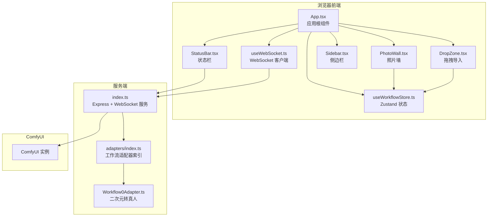
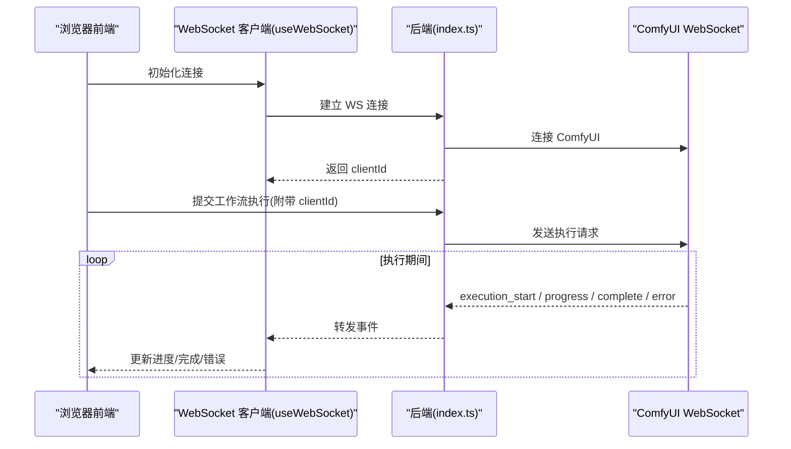
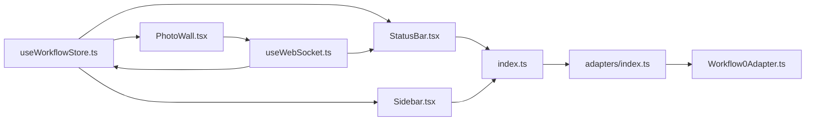

# 核心特性

<cite>
**本文引用的文件**
- [README.md](file://README.md)
- [App.tsx](file://client/src/components/App.tsx)
- [PhotoWall.tsx](file://client/src/components/PhotoWall.tsx)
- [DropZone.tsx](file://client/src/components/DropZone.tsx)
- [StatusBar.tsx](file://client/src/components/StatusBar.tsx)
- [ThemeToggle.tsx](file://client/src/components/ThemeToggle.tsx)
- [Sidebar.tsx](file://client/src/components/Sidebar.tsx)
- [useWorkflowStore.ts](file://client/src/hooks/useWorkflowStore.ts)
- [useWebSocket.ts](file://client/src/hooks/useWebSocket.ts)
- [sessionService.ts](file://client/src/services/sessionService.ts)
- [index.ts](file://server/src/index.ts)
- [adapters/index.ts](file://server/src/adapters/index.ts)
- [Workflow0Adapter.ts](file://server/src/adapters/Workflow0Adapter.ts)
</cite>

## 目录
1. [简介](#简介)
2. [项目结构](#项目结构)
3. [核心组件](#核心组件)
4. [架构总览](#架构总览)
5. [详细组件分析](#详细组件分析)
6. [依赖关系分析](#依赖关系分析)
7. [性能考量](#性能考量)
8. [故障排查指南](#故障排查指南)
9. [结论](#结论)

## 简介
本文件面向使用者与开发者，系统化梳理 CorineKit Pix2Real 的核心特性与实现要点，覆盖五大内置工作流、批量处理、实时进度、每标签页图像隔离、视图大小切换、输出文件夹一键访问、VRAM 内存释放、深色/浅色主题等。文档以“功能描述—使用场景—用户体验价值—操作流程”为主线，并辅以架构与组件级图示，帮助快速理解与高效使用。

## 项目结构
- 前端（React + Zustand + WebSocket）负责界面交互、状态管理、实时进度展示与系统资源监控。
- 后端（Express + WebSocket）负责工作流编排、ComfyUI 连接、进度事件转发、输出下载与会话持久化。
- ComfyUI 工作流模板位于 ComfyUI_API 目录，按工作流 ID 组织，前端通过适配器注入参数后提交执行。

图表来源
- [App.tsx:1-422](file://client/src/components/App.tsx#L1-L422)
- [PhotoWall.tsx:1-781](file://client/src/components/PhotoWall.tsx#L1-L781)
- [DropZone.tsx:1-181](file://client/src/components/DropZone.tsx#L1-L181)
- [StatusBar.tsx:1-243](file://client/src/components/StatusBar.tsx#L1-L243)
- [Sidebar.tsx:1-434](file://client/src/components/Sidebar.tsx#L1-L434)
- [useWorkflowStore.ts:1-923](file://client/src/hooks/useWorkflowStore.ts#L1-L923)
- [useWebSocket.ts:1-278](file://client/src/hooks/useWebSocket.ts#L1-L278)
- [index.ts:1-516](file://server/src/index.ts#L1-L516)
- [adapters/index.ts:1-33](file://server/src/adapters/index.ts#L1-L33)
- [Workflow0Adapter.ts:1-35](file://server/src/adapters/Workflow0Adapter.ts#L1-L35)

章节来源
- [README.md:41-79](file://README.md#L41-L79)
- [index.ts:118-146](file://server/src/index.ts#L118-L146)

## 核心组件
- 应用根组件（App.tsx）：承载页面布局、主题与右侧面板宽度记忆、欢迎页与引导、拖拽导入、视图尺寸切换、状态栏集成。
- 照片墙（PhotoWall.tsx）：网格化展示图像卡片，支持多选、批量执行、批量重命名、批量替换提示词、拖拽删除、懒加载与滚动锚定。
- 拖拽导入（DropZone.tsx）：支持图片/视频拖拽与文件夹递归读取，按标签页类型过滤。
- 状态栏（StatusBar.tsx）：显示自动保存状态、输出目录一键打开、视图大小切换、显存/内存监控、释放缓存。
- 主题切换（ThemeToggle.tsx）：深色/浅色主题切换与本地存储。
- 侧边栏（Sidebar.tsx）：工作流分组导航、队列面板、跨标签页拖拽导入、活动指示器动画。
- 状态管理（useWorkflowStore.ts）：每标签页图像列表、任务状态、提示词、输出索引、选择集、会话与客户端 ID 等。
- WebSocket（useWebSocket.ts）：单例连接、进度/完成/错误事件分发、任务完成通知、代理执行进度同步。
- 会话服务（sessionService.ts）：上传输入/蒙版、保存/加载会话、批量重命名等。

章节来源
- [App.tsx:61-136](file://client/src/components/App.tsx#L61-L136)
- [PhotoWall.tsx:103-152](file://client/src/components/PhotoWall.tsx#L103-L152)
- [DropZone.tsx:40-101](file://client/src/components/DropZone.tsx#L40-L101)
- [StatusBar.tsx:44-133](file://client/src/components/StatusBar.tsx#L44-L133)
- [ThemeToggle.tsx:4-38](file://client/src/components/ThemeToggle.tsx#L4-L38)
- [Sidebar.tsx:26-117](file://client/src/components/Sidebar.tsx#L26-L117)
- [useWorkflowStore.ts:191-215](file://client/src/hooks/useWorkflowStore.ts#L191-L215)
- [useWebSocket.ts:29-52](file://client/src/hooks/useWebSocket.ts#L29-L52)
- [sessionService.ts:88-132](file://client/src/services/sessionService.ts#L88-L132)

## 架构总览
- 前端通过 WebSocket 与后端建立长连接，后端再与 ComfyUI 建立 WS 连接，将执行事件（execution_start/progress/complete/error）原样转发至前端。
- 每个浏览器客户端拥有唯一 clientId，后端据此维护事件缓冲与进度聚合。
- 前端使用 Zustand 管理每标签页的状态，确保“每标签页图像隔离”。

图表来源
- [useWebSocket.ts:29-52](file://client/src/hooks/useWebSocket.ts#L29-L52)
- [index.ts:168-494](file://server/src/index.ts#L168-L494)

章节来源
- [README.md:74-79](file://README.md#L74-L79)
- [index.ts:168-277](file://server/src/index.ts#L168-L277)

## 详细组件分析

### 特性一：五大内置工作流
- 二次元转真人（ID 0）：基于模板注入输入图像与提示词，随机种子，输出至指定目录。
- 真人精修（ID 1）：针对真实人像的精细化处理。
- 精修放大（ID 2）：在精修基础上进行放大。
- 快速生成视频（ID 3）：以图像为输入生成视频序列。
- 视频放大（ID 4）：对视频进行超分辨率放大。

使用场景
- 二次元转真人：动漫风格转写实照片，适合角色设计与立绘转高质量照片。
- 真人精修：提升人像细节与质感，适合商业摄影后期。
- 精修放大：在保留细节前提下提升分辨率。
- 快速生成视频：从静态图像生成短视频，适合短视频内容生产。
- 视频放大：提升视频清晰度，改善低分辨率视频观感。

用户体验价值
- 一键执行，无需手动拼装节点。
- 模板化参数注入，降低使用门槛。
- 输出目录固定，便于归档与复用。

操作流程（以二次元转真人为例）
1) 在“二次元转真人”标签页拖入图片或点击导入。
2) 在右侧设置提示词（可选），点击“执行”。
3) 查看状态栏进度，完成后在输出目录查看结果。

章节来源
- [README.md:64-72](file://README.md#L64-L72)
- [adapters/index.ts:14-26](file://server/src/adapters/index.ts#L14-L26)
- [Workflow0Adapter.ts:9-34](file://server/src/adapters/Workflow0Adapter.ts#L9-L34)

### 特性二：批量处理能力
- 照片墙支持多选与批量执行，自动拦截其他标签页循环运行，避免冲突。
- 支持批量替换提示词、批量重命名（事务化，任一失败全部回滚）。

使用场景
- 大规模图像/视频统一处理。
- 多图提示词一致性调整。
- 成批资产规范化命名与组织。

用户体验价值
- 减少重复操作，显著提升效率。
- 事务化重命名保障数据一致性。

操作流程（批量执行）
1) 在照片墙启用多选（长按或勾选）。
2) 点击“执行 N 个”，系统按顺序提交至后端。
3) 实时查看进度，完成后批量产出。

章节来源
- [PhotoWall.tsx:201-295](file://client/src/components/PhotoWall.tsx#L201-L295)
- [PhotoWall.tsx:313-365](file://client/src/components/PhotoWall.tsx#L313-L365)
- [useWorkflowStore.ts:200-200](file://client/src/hooks/useWorkflowStore.ts#L200-L200)

### 特性三：实时进度更新
- 前端单例 WebSocket 连接，接收 execution_start/progress/complete/error。
- 后端按 promptId 缓冲事件，支持客户端注册前的事件回放。
- 进度聚合采用“节点权重化 + 多轮计数”策略，保证连续与稳定。

使用场景
- 长时间任务的可视化反馈。
- 并行多任务的进度对比与管理。

用户体验价值
- 任务开始即可见进度，减少等待焦虑。
- 完成后自动下载输出并更新 UI。

操作流程
1) 提交任务后，状态栏显示“执行中”。
2) 进度条随节点推进而增长。
3) 完成后自动弹出通知（可配置）。

章节来源
- [useWebSocket.ts:45-159](file://client/src/hooks/useWebSocket.ts#L45-L159)
- [index.ts:178-271](file://server/src/index.ts#L178-L271)

### 特性四：每标签页图像隔离
- Zustand store 为每个标签页维护独立的 images/prompts/tasks 等数据。
- 切换标签页时，图像与任务状态互不干扰。

使用场景
- 同时进行多种类型处理（如一边做“二次元转真人”，一边做“真人精修”）。
- 避免交叉污染与误操作。

用户体验价值
- 多任务并行更安全、更可控。
- 不同工作流的参数与历史相互独立。

操作流程
1) 在不同标签页分别导入图片。
2) 各自设置提示词与执行，互不影响。

章节来源
- [useWorkflowStore.ts:85-99](file://client/src/hooks/useWorkflowStore.ts#L85-L99)
- [useWorkflowStore.ts:194-206](file://client/src/hooks/useWorkflowStore.ts#L194-L206)

### 特性五：视图大小切换
- 支持小/中/大三种网格密度，自动记忆用户偏好。
- 懒加载卡片与滚动锚定，保证长列表流畅体验。

使用场景
- 大量素材浏览与筛选。
- 紧凑/中等/全览三种视图需求。

用户体验价值
- 高效浏览与选择。
- 无白块间隙，视觉统一。

操作流程
1) 在状态栏点击“视图大小”按钮循环切换。
2) 切换后自动保存到本地存储。

章节来源
- [App.tsx:68-80](file://client/src/components/App.tsx#L68-L80)
- [PhotoWall.tsx:15-19](file://client/src/components/PhotoWall.tsx#L15-L19)
- [PhotoWall.tsx:685-710](file://client/src/components/PhotoWall.tsx#L685-L710)

### 特性六：输出文件夹一键访问
- 状态栏提供“打开输出目录”按钮，调用后端接口触发系统文件管理器定位。
- 目录结构按会话与标签页划分，便于归档。

使用场景
- 快速定位与整理生成结果。
- 导出到外部工具或平台。

用户体验价值
- 一步直达，无需手动寻找路径。

操作流程
1) 在状态栏点击“打开输出目录”。
2) 系统文件管理器打开对应目录。

章节来源
- [StatusBar.tsx:123-133](file://client/src/components/StatusBar.tsx#L123-L133)
- [index.ts:134-145](file://server/src/index.ts#L134-L145)

### 特性七：VRAM 内存释放
- 状态栏提供“释放缓存”按钮，调用后端接口触发 ComfyUI 显存回收。
- 仅在无任务执行时可用，避免并发冲突。

使用场景
- 显存不足时清理缓存。
- 长时间运行后释放资源。

用户体验价值
- 主动控制资源占用，避免卡顿。
- 释放过程有状态反馈。

操作流程
1) 确认无任务执行。
2) 点击“释放缓存”，等待释放完成。

章节来源
- [StatusBar.tsx:110-121](file://client/src/components/StatusBar.tsx#L110-L121)
- [index.ts:147-155](file://server/src/index.ts#L147-L155)

### 特性八：深色/浅色主题
- 主题切换按钮，支持本地存储记忆。
- 切换时自动设置/移除 data-theme 属性。

使用场景
- 夜间使用或护眼模式。
- 个人偏好设置。

用户体验价值
- 舒适的视觉体验。
- 个性化界面风格。

操作流程
1) 点击右上角太阳/月亮图标。
2) 主题即时切换并保存。

章节来源
- [ThemeToggle.tsx:4-38](file://client/src/components/ThemeToggle.tsx#L4-L38)
- [App.tsx:131-136](file://client/src/components/App.tsx#L131-L136)

### 特性九：批量导入与类型过滤
- 支持拖拽图片/视频与文件夹递归读取。
- 根据标签页类型自动过滤（如视频补帧仅接受视频，图生视频仅接受图片）。

使用场景
- 从本地目录批量导入素材。
- 避免错误类型导致的执行失败。

用户体验价值
- 一次拖拽，多文件导入。
- 类型过滤减少无效尝试。

操作流程
1) 在目标标签页拖入图片/视频或文件夹。
2) 系统自动过滤并导入。

章节来源
- [DropZone.tsx:40-82](file://client/src/components/DropZone.tsx#L40-L82)
- [App.tsx:188-197](file://client/src/components/App.tsx#L188-L197)

### 特性十：跨标签页拖拽导入
- 可将某标签页的图片或输出拖拽到其他标签页，自动转换为该标签页可接受的文件类型。
- 支持多选与批量导入。

使用场景
- 将某张图片在多个工作流间复用。
- 快速流转中间产物。

用户体验价值
- 避免重复上传。
- 流程更顺畅。

操作流程
1) 在源标签页长按卡片进入多选。
2) 拖拽到目标标签页，自动导入。

章节来源
- [Sidebar.tsx:120-218](file://client/src/components/Sidebar.tsx#L120-L218)

## 依赖关系分析

图表来源
- [useWorkflowStore.ts:1-183](file://client/src/hooks/useWorkflowStore.ts#L1-L183)
- [PhotoWall.tsx:1-126](file://client/src/components/PhotoWall.tsx#L1-L126)
- [StatusBar.tsx:44-133](file://client/src/components/StatusBar.tsx#L44-L133)
- [Sidebar.tsx:26-117](file://client/src/components/Sidebar.tsx#L26-L117)
- [useWebSocket.ts:29-52](file://client/src/hooks/useWebSocket.ts#L29-L52)
- [index.ts:1-50](file://server/src/index.ts#L1-L50)
- [adapters/index.ts:1-33](file://server/src/adapters/index.ts#L1-L33)
- [Workflow0Adapter.ts:1-35](file://server/src/adapters/Workflow0Adapter.ts#L1-L35)

章节来源
- [adapters/index.ts:14-30](file://server/src/adapters/index.ts#L14-L30)

## 性能考量
- 前端照片墙采用懒加载与滚动锚定，长列表滚动更顺滑。
- WebSocket 单例连接，避免重复握手与资源浪费。
- 后端按 promptId 缓冲事件，支持客户端注册前的事件回放，减少丢失。
- 进度计算采用节点权重化与多轮计数，避免 UI 回退与抖动。
- 状态栏定时轮询系统资源，使用 requestAnimationFrame 平滑过渡显示。

[本节为通用指导，不直接分析具体文件]

## 故障排查指南
- 无法连接 ComfyUI
  - 现象：状态栏显示“未保存”或进度不更新。
  - 排查：确认 ComfyUI 在 http://localhost:8188 运行；后端自动启动 ComfyUI 失败时需手动启动。
  - 参考：[index.ts:500-506](file://server/src/index.ts#L500-L506)
- 释放缓存不可用
  - 现象：点击“释放缓存”无反应。
  - 排查：检查是否有任务正在执行；释放过程中按钮会禁用。
  - 参考：[StatusBar.tsx:197-209](file://client/src/components/StatusBar.tsx#L197-L209)
- 批量重命名失败
  - 现象：提示“批量重命名失败”。
  - 排查：确认会话已就绪；检查所选卡片是否存在进行中的任务；查看后端返回的具体错误信息。
  - 参考：[PhotoWall.tsx:313-365](file://client/src/components/PhotoWall.tsx#L313-L365)，[sessionService.ts:211-231](file://client/src/services/sessionService.ts#L211-L231)
- 进度不前进或回退
  - 现象：进度条停滞或倒退。
  - 排查：后端采用“棘轮保护”机制，避免 UI 回退；若长时间无响应，检查 ComfyUI 日志与硬件资源。
  - 参考：[index.ts:258-260](file://server/src/index.ts#L258-L260)

章节来源
- [index.ts:500-506](file://server/src/index.ts#L500-L506)
- [StatusBar.tsx:197-209](file://client/src/components/StatusBar.tsx#L197-L209)
- [PhotoWall.tsx:313-365](file://client/src/components/PhotoWall.tsx#L313-L365)
- [sessionService.ts:211-231](file://client/src/services/sessionService.ts#L211-L231)
- [index.ts:258-260](file://server/src/index.ts#L258-L260)

## 结论
Pix2Real 通过“模板化工作流 + 实时进度 + 每标签页隔离 + 批量处理 + 资源可视化”的组合，为用户提供从素材导入到结果导出的一体化体验。其架构以前端 Zustand 状态管理与后端单例 WebSocket 为核心，配合 ComfyUI 的强大算力，既保证易用性也兼顾可扩展性。建议在实际使用中结合批量导入、跨标签页拖拽与一键释放缓存等特性，最大化提升生产效率。