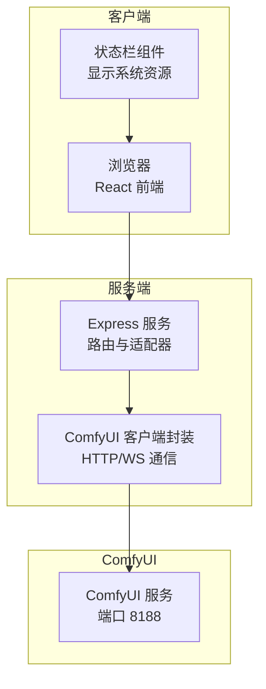
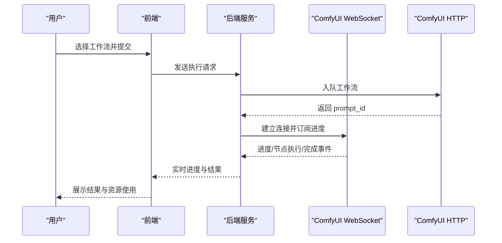
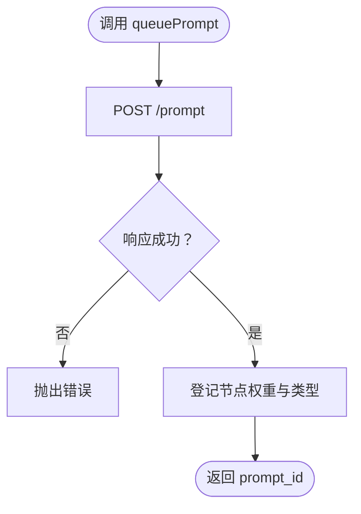
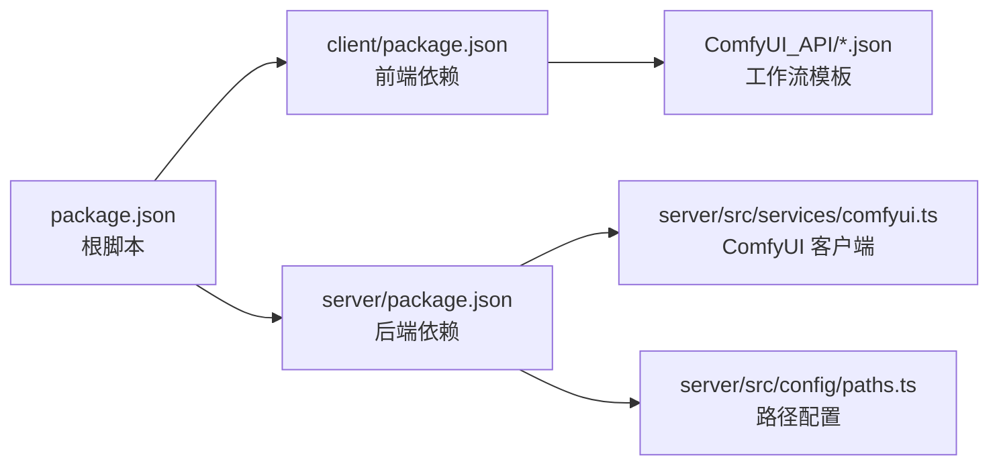

# 系统要求

<cite>
**本文引用的文件**
- [README.md](file://README.md)
- [package.json](file://package.json)
- [client/package.json](file://client/package.json)
- [server/package.json](file://server/package.json)
- [server/src/services/comfyui.ts](file://server/src/services/comfyui.ts)
- [server/src/config/paths.ts](file://server/src/config/paths.ts)
- [start.bat](file://start.bat)
- [stop.bat](file://stop.bat)
- [debug.bat](file://debug.bat)
- [ComfyUI_API/0-Pix2Real-二次元转真人.json](file://ComfyUI_API/0-Pix2Real-二次元转真人.json)
- [client/src/components/StatusBar.tsx](file://client/src/components/StatusBar.tsx)
</cite>

## 目录
1. [简介](#简介)
2. [项目结构](#项目结构)
3. [核心组件](#核心组件)
4. [架构总览](#架构总览)
5. [详细组件分析](#详细组件分析)
6. [依赖关系分析](#依赖关系分析)
7. [性能考虑](#性能考虑)
8. [故障排查指南](#故障排查指南)
9. [结论](#结论)
10. [附录](#附录)

## 简介
本文件面向部署与运维人员，提供 CorineKit Pix2Real 的系统要求与环境配置说明。内容涵盖：
- 运行所需的硬件最低配置（显存、内存、CPU）
- 软件依赖（Node.js、ComfyUI 端口）
- 操作系统兼容性（Windows 特定说明）
- 网络配置要求
- ComfyUI 安装与配置步骤（端口、模型、配置）
- 常见环境问题排查与解决方案
- 开发环境与生产环境差异说明

## 项目结构
该项目采用前后端分离架构：
- 前端：Vite + React + TypeScript，负责用户界面与实时状态展示
- 后端：Express + TypeScript，负责与 ComfyUI 通信、队列与进度转发
- 工作流模板：ComfyUI_API 下的 JSON 模板，定义具体处理流程
- 输出目录：output 目录存放生成结果（受版本控制忽略）

图表来源
- [server/src/services/comfyui.ts:6-7](file://server/src/services/comfyui.ts#L6-L7)
- [client/src/components/StatusBar.tsx:69-85](file://client/src/components/StatusBar.tsx#L69-L85)

章节来源
- [README.md:41-62](file://README.md#L41-L62)
- [package.json:4-9](file://package.json#L4-L9)

## 核心组件
- ComfyUI 客户端封装：负责上传图像/视频、入队、历史查询、系统统计、WebSocket 进度事件中继
- 路径配置模块：集中管理 sessions、输出、模型元数据等目录，支持运行时覆盖
- 启动与停止脚本：Windows 批处理脚本，负责端口检查、服务启动与浏览器打开

章节来源
- [server/src/services/comfyui.ts:6-7](file://server/src/services/comfyui.ts#L6-L7)
- [server/src/config/paths.ts:18-20](file://server/src/config/paths.ts#L18-L20)
- [start.bat:10-57](file://start.bat#L10-L57)

## 架构总览
系统以本地 Web UI 形式运行，通过 HTTP 与 WebSocket 与 ComfyUI 交互。前端实时展示系统资源使用情况，并将用户操作转化为 ComfyUI 工作流执行。

图表来源
- [server/src/services/comfyui.ts:168-196](file://server/src/services/comfyui.ts#L168-L196)
- [server/src/services/comfyui.ts:265-375](file://server/src/services/comfyui.ts#L265-L375)
- [client/src/components/StatusBar.tsx:69-85](file://client/src/components/StatusBar.tsx#L69-L85)

## 详细组件分析

### ComfyUI 客户端封装（后端）
- 默认访问地址：本地 127.0.0.1:8188（HTTP 与 WS）
- 关键功能：
  - 图像/视频上传
  - 工作流入队与历史查询
  - 系统统计（显存/内存使用率）
  - WebSocket 事件中继（进度、节点执行、完成、错误）
- 进度权重估算：根据节点类型与采样步数估算总权重，用于阶段化进度展示

图表来源
- [server/src/services/comfyui.ts:168-196](file://server/src/services/comfyui.ts#L168-L196)

章节来源
- [server/src/services/comfyui.ts:6-7](file://server/src/services/comfyui.ts#L6-L7)
- [server/src/services/comfyui.ts:131-144](file://server/src/services/comfyui.ts#L131-L144)
- [server/src/services/comfyui.ts:244-263](file://server/src/services/comfyui.ts#L244-L263)

### 路径配置模块
- 支持通过环境变量覆盖数据根目录（Electron 场景）
- sessions 目录可运行时切换并持久化至 config.json
- 输出、模型元数据、收藏等目录统一由该模块管理

章节来源
- [server/src/config/paths.ts:18-20](file://server/src/config/paths.ts#L18-L20)
- [server/src/config/paths.ts:84-100](file://server/src/config/paths.ts#L84-L100)
- [server/src/config/paths.ts:141-147](file://server/src/config/paths.ts#L141-L147)

### 启动与停止脚本（Windows）
- 自动检测并释放 3000、5173、8188 端口占用
- 启动后自动打开浏览器访问前端地址
- 提供调试模式（保留命令窗口以便查看日志）

章节来源
- [start.bat:10-57](file://start.bat#L10-L57)
- [stop.bat:12-36](file://stop.bat#L12-L36)
- [debug.bat:10-57](file://debug.bat#L10-L57)

## 依赖关系分析

图表来源
- [package.json:4-9](file://package.json#L4-L9)
- [client/package.json:11-17](file://client/package.json#L11-L17)
- [server/package.json:11-17](file://server/package.json#L11-L17)
- [server/src/services/comfyui.ts:1-4](file://server/src/services/comfyui.ts#L1-L4)
- [server/src/config/paths.ts:1-7](file://server/src/config/paths.ts#L1-L7)
- [ComfyUI_API/0-Pix2Real-二次元转真人.json:1-200](file://ComfyUI_API/0-Pix2Real-二次元转真人.json#L1-L200)

章节来源
- [package.json:4-9](file://package.json#L4-L9)
- [client/package.json:11-24](file://client/package.json#L11-L24)
- [server/package.json:11-26](file://server/package.json#L11-L26)

## 性能考虑
- 显存与内存使用：前端通过轮询接口展示 ComfyUI 的系统统计，可用于监控资源占用
- 进度权重估算：后端根据节点类型与采样步数估算权重，提升进度展示的准确性
- 端口占用：启动脚本会尝试释放常用端口，避免冲突导致的启动失败

章节来源
- [client/src/components/StatusBar.tsx:69-85](file://client/src/components/StatusBar.tsx#L69-L85)
- [server/src/services/comfyui.ts:131-144](file://server/src/services/comfyui.ts#L131-L144)
- [start.bat:10-32](file://start.bat#L10-L32)

## 故障排查指南
- 端口占用
  - 现象：启动失败或端口被占用
  - 处理：使用停止脚本释放端口，或手动结束占用进程
  - 参考：[stop.bat:12-36](file://stop.bat#L12-L36)
- ComfyUI 未运行或端口不正确
  - 现象：前端无法获取系统统计或 WebSocket 连接失败
  - 处理：确认 ComfyUI 在本地 8188 端口运行；检查防火墙与代理
  - 参考：[server/src/services/comfyui.ts:6-7](file://server/src/services/comfyui.ts#L6-L7)
- 模型缺失或路径错误
  - 现象：工作流执行报错或找不到模型
  - 处理：在 ComfyUI 中正确放置模型文件，确保路径与模板一致
  - 参考：[ComfyUI_API/0-Pix2Real-二次元转真人.json:20-21](file://ComfyUI_API/0-Pix2Real-二次元转真人.json#L20-L21)
- 资源不足
  - 现象：显存/内存使用过高导致卡顿或失败
  - 处理：释放显存/内存，降低分辨率或采样步数，或关闭其他应用
  - 参考：[client/src/components/StatusBar.tsx:216-239](file://client/src/components/StatusBar.tsx#L216-L239)

## 结论
本项目对硬件的要求主要取决于所选工作流与输入分辨率。建议优先满足显存与内存的最低阈值，结合实际任务规模进行弹性调整。软件层面需确保 ComfyUI 在本地 8188 端口可用，且模型已就绪。Windows 用户可借助提供的批处理脚本快速启动与停止服务。

## 附录

### 系统要求清单
- 操作系统
  - Windows（提供专用批处理脚本，适用于 Windows 环境）
- 软件依赖
  - Node.js 18 或更高版本
  - ComfyUI 运行于本地 127.0.0.1:8188（HTTP 与 WebSocket）
- 硬件建议
  - 显存：至少 6 GB（根据工作流复杂度与分辨率动态变化）
  - 内存：至少 16 GB（建议 32 GB 以上以获得更稳定体验）
  - CPU：多核处理器（建议 6 核以上，主频 3 GHz+）

章节来源
- [README.md:16-19](file://README.md#L16-L19)
- [server/src/services/comfyui.ts:6-7](file://server/src/services/comfyui.ts#L6-L7)

### ComfyUI 安装与配置步骤
- 安装 ComfyUI 并确保其在本地 8188 端口运行
- 下载并放置工作流所需的模型文件，确保路径与模板一致
- 如需自定义数据根目录，可在运行时通过路径配置模块进行覆盖

章节来源
- [README.md:16-19](file://README.md#L16-L19)
- [server/src/config/paths.ts:18-20](file://server/src/config/paths.ts#L18-L20)
- [ComfyUI_API/0-Pix2Real-二次元转真人.json:20-21](file://ComfyUI_API/0-Pix2Real-二次元转真人.json#L20-L21)

### 开发环境与生产环境差异
- 开发环境
  - 使用 npm 脚本同时启动前端与后端服务
  - 启动脚本会自动释放端口并打开浏览器
- 生产环境
  - 建议独立部署 ComfyUI 与本项目服务
  - 通过路径配置模块指定稳定的输出与会话目录
  - 配置反向代理与安全策略（如 HTTPS、跨域）

章节来源
- [package.json:4-9](file://package.json#L4-L9)
- [start.bat:10-57](file://start.bat#L10-L57)
- [server/src/config/paths.ts:84-100](file://server/src/config/paths.ts#L84-L100)