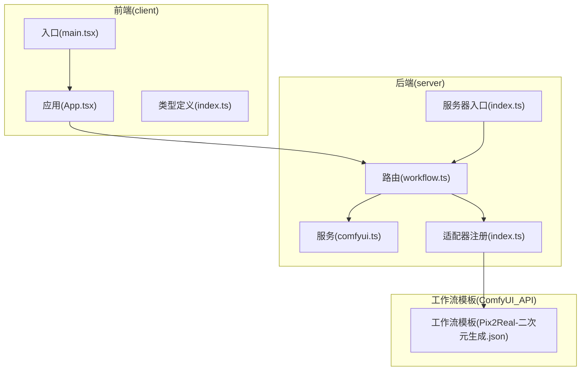
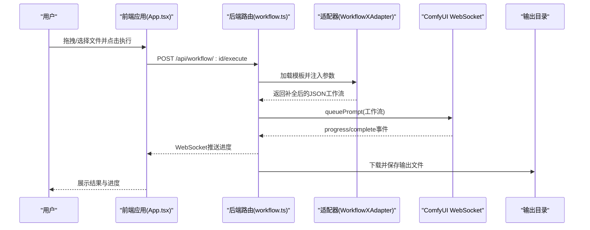
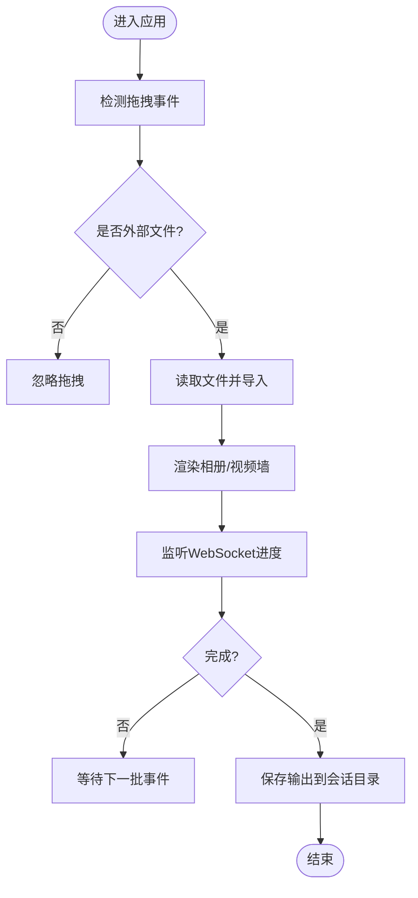
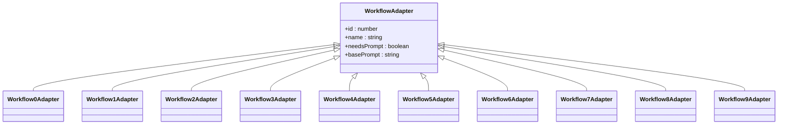
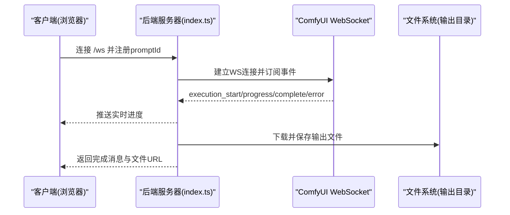
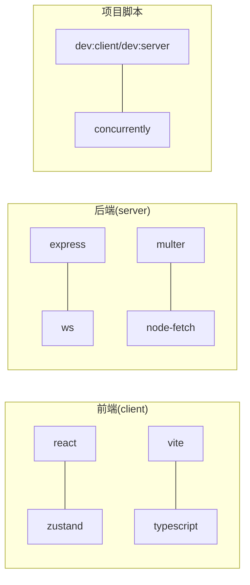

# 项目介绍

<cite>
**本文引用的文件**
- [README.md](file://README.md)
- [CLAUDE.md](file://CLAUDE.md)
- [package.json](file://package.json)
- [client/package.json](file://client/package.json)
- [server/package.json](file://server/package.json)
- [client/src/main.tsx](file://client/src/main.tsx)
- [client/src/components/App.tsx](file://client/src/components/App.tsx)
- [server/src/index.ts](file://server/src/index.ts)
- [server/src/routers/workflow.ts](file://server/src/routes/workflow.ts)
- [server/src/services/comfyui.ts](file://server/src/services/comfyui.ts)
- [server/src/adapters/index.ts](file://server/src/adapters/index.ts)
- [client/src/types/index.ts](file://client/src/types/index.ts)
- [ComfyUI_API/Pix2Real-二次元生成.json](file://ComfyUI_API/Pix2Real-二次元生成.json)
- [docs/SystemPrompt.txt](file://docs/SystemPrompt.txt)
</cite>

## 目录
1. [引言](#引言)
2. [项目结构](#项目结构)
3. [核心组件](#核心组件)
4. [架构总览](#架构总览)
5. [详细组件分析](#详细组件分析)
6. [依赖关系分析](#依赖关系分析)
7. [性能考量](#性能考量)
8. [故障排查指南](#故障排查指南)
9. [结论](#结论)
10. [附录](#附录)

## 引言
CorineKit Pix2Real 是一个面向本地的 Web 图像/视频批量处理工具，通过浏览器界面直接对接 ComfyUI 工作流引擎，实现从“拖拽上传”到“实时进度反馈”的完整体验。它专注于解决本地图像/视频处理的易用性与效率问题，尤其适合需要稳定、可控且可复现的 AI 处理流程的用户。

与传统云端或离线工具相比，Pix2Real 的优势在于：
- 本地运行，隐私与数据安全可控
- 浏览器即 UI，无需额外客户端安装
- 实时进度与输出管理，支持一键打开输出目录
- 批量处理与会话持久化，便于多场景协作
- 丰富的内置工作流，覆盖从“二次元转真人”到“视频放大”的多种需求

目标用户群体包括：
- 个人创作者：希望以低门槛方式生成高质量图像/视频
- 内容生产者：需要批量处理素材并保持一致风格
- 设计师与插画师：对提示词工程、精细修饰与放大有较高要求
- 影视/动画团队：需要稳定的本地化工作流与版本控制

## 项目结构
项目采用前后端分离的单仓（monorepo）结构，包含前端 React 应用、后端 Express 服务以及 ComfyUI 工作流模板目录。

图表来源
- [client/src/main.tsx:1-11](file://client/src/main.tsx#L1-L11)
- [client/src/components/App.tsx:1-335](file://client/src/components/App.tsx#L1-L335)
- [server/src/index.ts:1-228](file://server/src/index.ts#L1-L228)
- [server/src/routes/workflow.ts:1-200](file://server/src/routes/workflow.ts#L1-L200)
- [server/src/services/comfyui.ts:1-200](file://server/src/services/comfyui.ts#L1-L200)
- [server/src/adapters/index.ts:1-31](file://server/src/adapters/index.ts#L1-L31)
- [ComfyUI_API/Pix2Real-二次元生成.json:1-145](file://ComfyUI_API/Pix2Real-二次元生成.json#L1-L145)

章节来源
- [README.md:41-62](file://README.md#L41-L62)
- [CLAUDE.md:3-15](file://CLAUDE.md#L3-L15)

## 核心组件
- 前端应用（React + TypeScript）
  - 入口与根组件负责页面布局、主题切换、会话管理与状态栏展示
  - 支持拖拽上传、批量导入、视图尺寸切换、遮罩编辑与提示词助手
- 后端服务（Express + WebSocket）
  - 提供工作流执行、输出下载、系统资源查询与内存释放
  - 维护与 ComfyUI 的 WebSocket 连接，转发进度事件至前端
- 适配器层
  - 将工作流模板与输入参数进行拼装，仅变更必要节点，保证可维护性与一致性
- 工作流模板
  - 以 JSON 形式定义 ComfyUI 节点连接与参数，便于版本化与复用

章节来源
- [client/src/main.tsx:1-11](file://client/src/main.tsx#L1-L11)
- [client/src/components/App.tsx:54-335](file://client/src/components/App.tsx#L54-L335)
- [server/src/index.ts:62-228](file://server/src/index.ts#L62-L228)
- [server/src/adapters/index.ts:13-31](file://server/src/adapters/index.ts#L13-L31)
- [CLAUDE.md:17-23](file://CLAUDE.md#L17-L23)

## 架构总览
Pix2Real 的核心是“前端 UI + 后端适配器 + ComfyUI 引擎”的三层协作模式。后端作为适配器与中继，将前端请求映射为 ComfyUI 可执行的工作流，并通过 WebSocket 将进度与结果回传给前端。

图表来源
- [client/src/components/App.tsx:54-335](file://client/src/components/App.tsx#L54-L335)
- [server/src/routes/workflow.ts:29-149](file://server/src/routes/workflow.ts#L29-L149)
- [server/src/services/comfyui.ts:47-83](file://server/src/services/comfyui.ts#L47-L83)
- [server/src/index.ts:73-219](file://server/src/index.ts#L73-L219)

## 详细组件分析

### 前端应用（App.tsx）
- 职责
  - 页面布局与主题管理
  - 文件拖拽与批量导入
  - 任务队列与进度展示
  - 会话与设置面板集成
- 关键交互
  - 主区域拖拽：仅外部文件有效，避免误触发卡片拖拽
  - 视图尺寸循环切换：小/中/大网格，无空白间隙
  - 欢迎页与会话引导：首次使用流程化引导
- 数据模型
  - 图片项、任务状态、WebSocket 消息类型等统一定义于类型模块

图表来源
- [client/src/components/App.tsx:25-134](file://client/src/components/App.tsx#L25-L134)
- [client/src/types/index.ts:1-58](file://client/src/types/index.ts#L1-L58)

章节来源
- [client/src/components/App.tsx:54-335](file://client/src/components/App.tsx#L54-L335)
- [client/src/types/index.ts:1-58](file://client/src/types/index.ts#L1-L58)

### 后端路由与适配器（workflow.ts 与 adapters/index.ts）
- 路由职责
  - 列举可用工作流
  - 特殊工作流执行（如“解除装备”需要图像+遮罩；“快速出图”纯 JSON）
  - 模型列表查询（Checkpoint/UNET/LoRA）
  - 释放内存与打开输出目录
- 适配器模式
  - 每个工作流对应一个适配器，加载模板并只修改必要节点（如图像名、提示词、种子）
  - 注册集中管理，便于扩展新工作流

图表来源
- [server/src/adapters/index.ts:1-31](file://server/src/adapters/index.ts#L1-L31)

章节来源
- [server/src/routes/workflow.ts:29-149](file://server/src/routes/workflow.ts#L29-L149)
- [server/src/adapters/index.ts:13-31](file://server/src/adapters/index.ts#L13-L31)

### ComfyUI 通信与进度回传（comfyui.ts 与 server/index.ts）
- HTTP 通信
  - 上传图像/视频、入队工作流、查询历史与系统统计
- WebSocket 中继
  - 为每个客户端建立唯一连接，缓冲并重放早期事件
  - 将进度、开始、完成、错误事件转发至前端
- 输出落盘
  - 完成后从 ComfyUI 拉取输出并保存到会话目录

图表来源
- [server/src/index.ts:73-219](file://server/src/index.ts#L73-L219)
- [server/src/services/comfyui.ts:127-188](file://server/src/services/comfyui.ts#L127-L188)

章节来源
- [server/src/index.ts:1-228](file://server/src/index.ts#L1-L228)
- [server/src/services/comfyui.ts:1-200](file://server/src/services/comfyui.ts#L1-L200)

### 工作流模板（ComfyUI_API）
- 模板结构
  - 以节点 ID 为键，定义输入参数与连接关系
  - 通过适配器替换关键节点（如图像名、提示词、种子），实现参数化
- 示例
  - “二次元生成”模板展示了提示词拼接、VAE 解码与保存节点的典型组合

章节来源
- [ComfyUI_API/Pix2Real-二次元生成.json:1-145](file://ComfyUI_API/Pix2Real-二次元生成.json#L1-L145)

### 提示词工程与系统提示（docs/SystemPrompt.txt）
- 角色与规则
  - 将自然语言严格映射为英文视觉标签，遵循优先级排序
  - 将标签还原为中文可视化描述，保持空间结构与细节一致性
- 应用场景
  - 为工作流提供高质量、可复现的提示词输入
  - 支持变体生成与按需扩写，提升创意效率

章节来源
- [docs/SystemPrompt.txt:1-146](file://docs/SystemPrompt.txt#L1-L146)

## 依赖关系分析
- 前端依赖
  - React、Zustand（状态管理）、lucide-react（图标）、Vite（构建）
- 后端依赖
  - Express（Web 服务）、ws（WebSocket）、multer（文件上传）、node-fetch（HTTP）
- 项目脚本
  - 一键启动前后端、构建与安装

图表来源
- [client/package.json:11-23](file://client/package.json#L11-L23)
- [server/package.json:11-26](file://server/package.json#L11-L26)
- [package.json:4-14](file://package.json#L4-L14)

章节来源
- [client/package.json:1-25](file://client/package.json#L1-L25)
- [server/package.json:1-28](file://server/package.json#L1-L28)
- [package.json:1-15](file://package.json#L1-L15)

## 性能考量
- 本地处理优势
  - 无需网络传输，隐私与延迟更可控
  - 批量处理减少重复初始化开销
- 进度与内存
  - WebSocket 实时反馈，避免轮询
  - 提供“释放内存”工作流，缓解显存压力
- 前端优化
  - 卡片网格视图按需渲染，避免空白间隙
  - 会话持久化减少重复上传成本

章节来源
- [README.md:5-14](file://README.md#L5-L14)
- [server/src/routes/workflow.ts:13-20](file://server/src/routes/workflow.ts#L13-L20)
- [client/src/components/App.tsx:66-73](file://client/src/components/App.tsx#L66-L73)

## 故障排查指南
- 无法连接 ComfyUI
  - 确认 ComfyUI 在默认端口运行，后端通过固定地址访问
- 上传失败或进度异常
  - 检查文件类型与大小限制，确认 WebSocket 连接状态
- 输出未出现
  - 使用“打开输出目录”按钮检查会话输出路径
- 内存不足
  - 执行“释放内存”工作流，或调整批量规模

章节来源
- [server/src/services/comfyui.ts:6-8](file://server/src/services/comfyui.ts#L6-L8)
- [server/src/index.ts:221-228](file://server/src/index.ts#L221-L228)
- [server/src/routes/workflow.ts:13-20](file://server/src/routes/workflow.ts#L13-L20)

## 结论
Pix2Real 以“本地化 + 可视化 + 批量化”的方式，将复杂的 AI 图像/视频处理流程变得简单易用。通过清晰的架构分层、完善的进度与输出管理，以及可扩展的工作流适配器，它既能满足个人创作者的即时创作需求，也能支撑团队的批量生产与版本管理。未来可进一步完善提示词助手、遮罩编辑与设置面板等功能，持续提升用户体验与生产力。

## 附录
- 开发与构建
  - 一键安装与启动脚本，分别启动前端与后端服务
- 工作流清单
  - 包含二次元转真人、真人精修、精修放大、快速生成视频、视频放大等内置工作流

章节来源
- [CLAUDE.md:7-15](file://CLAUDE.md#L7-L15)
- [README.md:64-72](file://README.md#L64-L72)