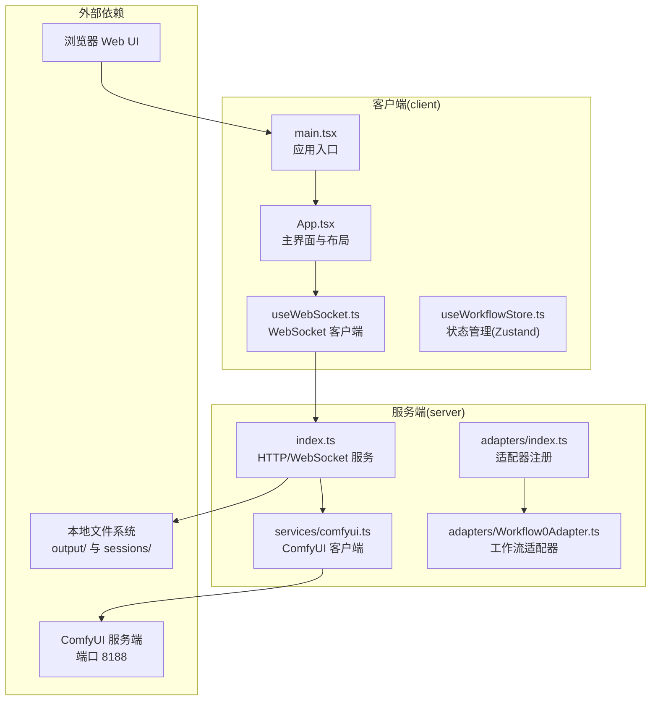
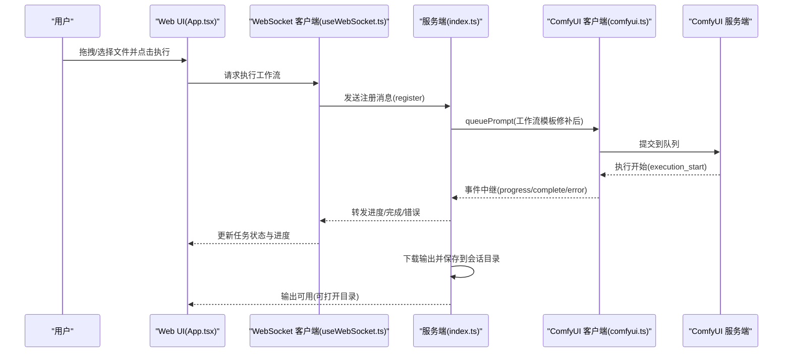
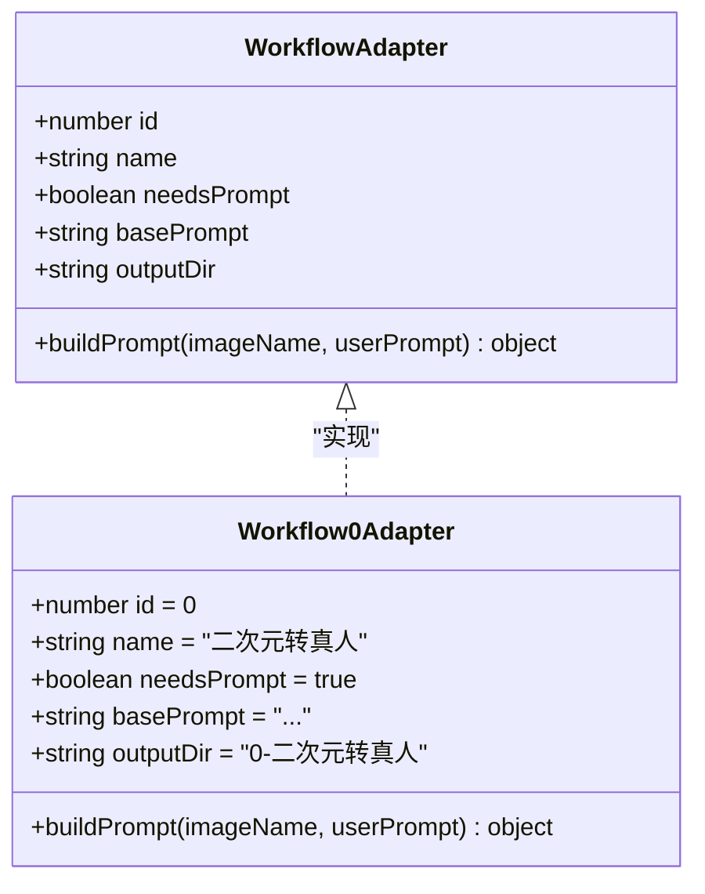
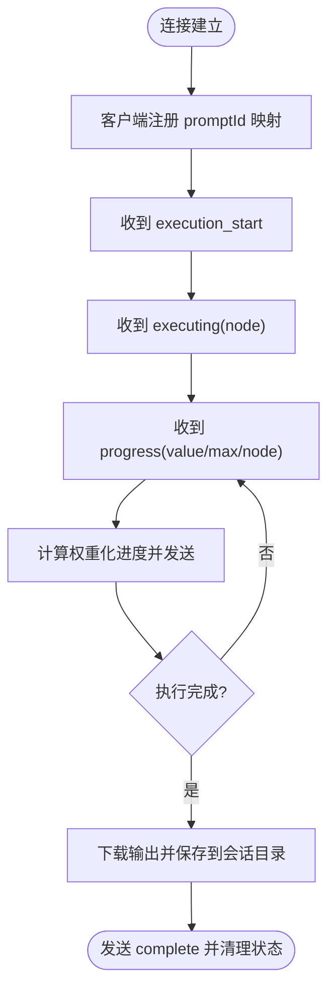
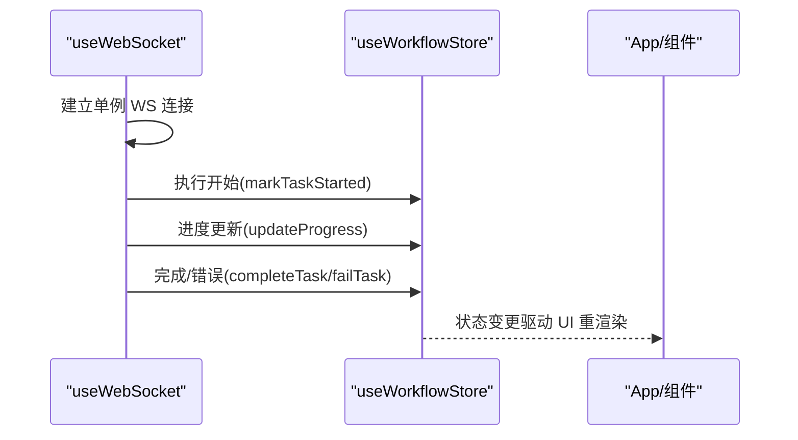
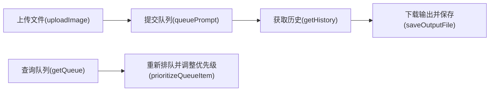
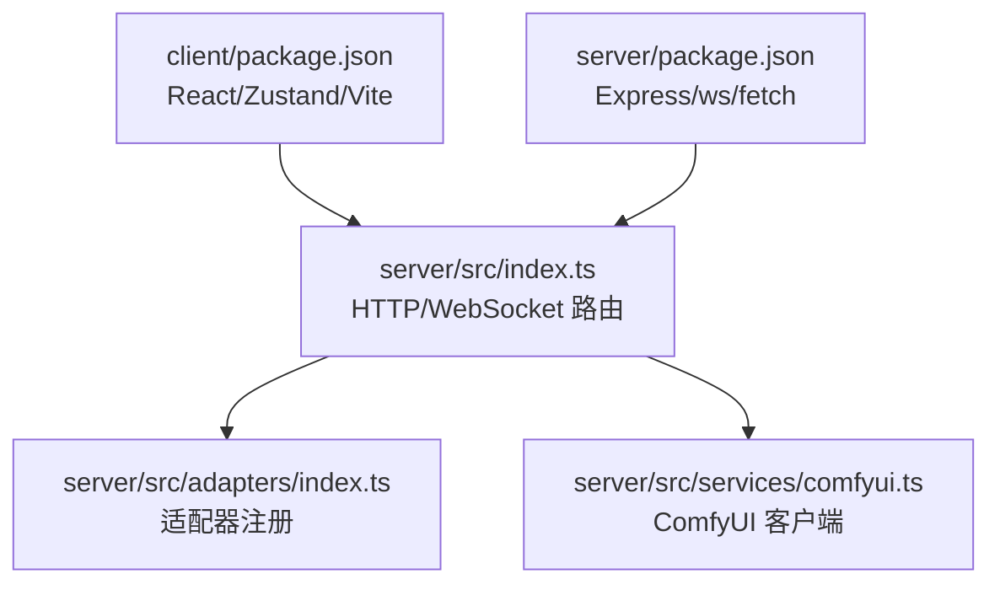

# 项目介绍

<cite>
**本文档引用的文件**
- [README.md](file://README.md)
- [CLAUDE.md](file://CLAUDE.md)
- [package.json](file://package.json)
- [client/package.json](file://client/package.json)
- [server/package.json](file://server/package.json)
- [client/src/main.tsx](file://client/src/main.tsx)
- [client/src/components/App.tsx](file://client/src/components/App.tsx)
- [client/src/hooks/useWorkflowStore.ts](file://client/src/hooks/useWorkflowStore.ts)
- [client/src/hooks/useWebSocket.ts](file://client/src/hooks/useWebSocket.ts)
- [server/src/index.ts](file://server/src/index.ts)
- [server/src/services/comfyui.ts](file://server/src/services/comfyui.ts)
- [server/src/adapters/index.ts](file://server/src/adapters/index.ts)
- [server/src/adapters/Workflow0Adapter.ts](file://server/src/adapters/Workflow0Adapter.ts)
</cite>

## 目录
1. [引言](#引言)
2. [项目结构](#项目结构)
3. [核心组件](#核心组件)
4. [架构总览](#架构总览)
5. [详细组件分析](#详细组件分析)
6. [依赖关系分析](#依赖关系分析)
7. [性能考量](#性能考量)
8. [故障排除指南](#故障排除指南)
9. [结论](#结论)
10. [附录](#附录)

## 引言
CorineKit Pix2Real 是一款面向本地的 Web 用户界面，通过 ComfyUI 实现批处理图像与视频的 AI 转换与增强。项目以“所见即所得”的本地 Web UI 替代传统桌面应用，结合 ComfyUI 的强大工作流引擎，提供从二次元转真人、人物精修、高清放大、图生视频到视频补帧等五大内置工作流，并支持批量处理、实时进度反馈、输出目录一键打开、VRAM 释放与深浅主题等实用特性。

项目的核心价值主张：
- 本地 Web UI：无需安装额外桌面框架，直接在浏览器运行，跨平台兼容，部署简单。
- 与 ComfyUI 深度集成：通过适配器模式加载 JSON 工作流模板并动态修补节点参数，复用 ComfyUI 的成熟生态与高性能推理。
- 批处理与实时反馈：支持拖拽批量导入，WebSocket 实时转发进度事件，任务完成后自动下载并归档到会话输出目录。
- 易于扩展：新增工作流只需新增适配器与模板，遵循统一的接口规范，降低维护成本。

目标用户群体与使用场景：
- AI 艺术创作者：批量生成与风格转换，如将二次元角色转为写实照片。
- 内容制作者：人物精修与高清放大，提升素材质量与一致性。
- 设计师与动画团队：图生视频、视频补帧与换脸等特效制作。
- 初学者友好：通过直观的拖拽界面与一键操作，快速上手复杂 AI 工作流。

## 项目结构
项目采用前后端分离的双包管理结构，客户端使用 Vite + React + TypeScript，服务端使用 Express + TypeScript，二者通过 WebSocket 与 ComfyUI 进行实时通信。

**图表来源**
- [client/src/main.tsx:1-11](file://client/src/main.tsx#L1-L11)
- [client/src/components/App.tsx:1-422](file://client/src/components/App.tsx#L1-L422)
- [client/src/hooks/useWebSocket.ts:1-278](file://client/src/hooks/useWebSocket.ts#L1-L278)
- [server/src/index.ts:1-516](file://server/src/index.ts#L1-L516)
- [server/src/services/comfyui.ts:1-472](file://server/src/services/comfyui.ts#L1-L472)
- [server/src/adapters/index.ts:1-33](file://server/src/adapters/index.ts#L1-L33)
- [server/src/adapters/Workflow0Adapter.ts:1-35](file://server/src/adapters/Workflow0Adapter.ts#L1-L35)

**章节来源**
- [README.md:41-79](file://README.md#L41-L79)
- [CLAUDE.md:3-24](file://CLAUDE.md#L3-L24)
- [package.json:1-15](file://package.json#L1-L15)
- [client/package.json:1-26](file://client/package.json#L1-L26)
- [server/package.json:1-28](file://server/package.json#L1-L28)

## 核心组件
- 本地 Web UI（React + Zustand）
  - 应用入口与路由：负责渲染主界面、侧边栏、画廊、遮罩编辑器、设置面板等模块。
  - 状态管理：集中管理图像列表、任务进度、提示词、选中输出索引、会话信息等。
  - WebSocket 客户端：单例连接，接收进度、完成与错误事件，驱动 UI 实时更新。
- 服务端（Express + WebSocket）
  - HTTP 服务：提供工作流执行、输出访问、会话管理、模型元数据、收藏、设置等接口。
  - WebSocket 服务：为每个浏览器客户端建立到 ComfyUI 的 WS 连接，中继进度事件；支持事件缓冲与重放，保证首次渲染不丢失进度。
  - ComfyUI 客户端：封装上传、排队、历史查询、系统状态、队列优先级调整等能力。
  - 适配器层：按工作流 ID 注册适配器，加载 JSON 模板并修补节点参数（如图像名、提示词、种子）。
- ComfyUI 集成
  - 通过 HTTP API 上传输入文件，提交工作流至 ComfyUI 队列。
  - 通过 WebSocket 获取阶段化进度与最终输出，自动下载并保存到会话输出目录。

**章节来源**
- [client/src/components/App.tsx:61-422](file://client/src/components/App.tsx#L61-L422)
- [client/src/hooks/useWorkflowStore.ts:101-183](file://client/src/hooks/useWorkflowStore.ts#L101-L183)
- [client/src/hooks/useWebSocket.ts:29-278](file://client/src/hooks/useWebSocket.ts#L29-L278)
- [server/src/index.ts:157-494](file://server/src/index.ts#L157-L494)
- [server/src/services/comfyui.ts:168-196](file://server/src/services/comfyui.ts#L168-L196)
- [server/src/adapters/index.ts:14-33](file://server/src/adapters/index.ts#L14-L33)

## 架构总览
下图展示了从用户操作到 ComfyUI 执行再到结果返回的端到端流程，强调了 WebSocket 的中继作用与适配器的模板修补机制。

**图表来源**
- [client/src/components/App.tsx:157-197](file://client/src/components/App.tsx#L157-L197)
- [client/src/hooks/useWebSocket.ts:45-159](file://client/src/hooks/useWebSocket.ts#L45-L159)
- [server/src/index.ts:466-494](file://server/src/index.ts#L466-L494)
- [server/src/services/comfyui.ts:168-196](file://server/src/services/comfyui.ts#L168-L196)

## 详细组件分析

### 组件 A：工作流适配器（Workflow0Adapter）
工作流适配器负责加载 JSON 模板并修补关键节点参数，如输入图像名、提示词与随机种子，从而实现“所见即所得”的参数化执行。

**图表来源**
- [server/src/adapters/Workflow0Adapter.ts:9-34](file://server/src/adapters/Workflow0Adapter.ts#L9-L34)

**章节来源**
- [server/src/adapters/Workflow0Adapter.ts:1-35](file://server/src/adapters/Workflow0Adapter.ts#L1-L35)
- [server/src/adapters/index.ts:14-33](file://server/src/adapters/index.ts#L14-L33)

### 组件 B：WebSocket 进度中继与事件缓冲
服务端为每个浏览器客户端建立到 ComfyUI 的 WebSocket 连接，中继执行开始、进度、完成与错误事件，并提供事件缓冲与重放能力，确保客户端在注册前也能收到历史事件。

**图表来源**
- [server/src/index.ts:168-494](file://server/src/index.ts#L168-L494)

**章节来源**
- [server/src/index.ts:187-333](file://server/src/index.ts#L187-L333)
- [server/src/index.ts:335-448](file://server/src/index.ts#L335-L448)

### 组件 C：前端状态与 WebSocket 集成
前端使用 Zustand 管理图像、任务、提示词与输出选择等状态，useWebSocket 提供单例 WebSocket 客户端，自动处理连接、消息解析与 UI 更新。

**图表来源**
- [client/src/hooks/useWebSocket.ts:29-278](file://client/src/hooks/useWebSocket.ts#L29-L278)
- [client/src/hooks/useWorkflowStore.ts:560-703](file://client/src/hooks/useWorkflowStore.ts#L560-L703)
- [client/src/components/App.tsx:61-422](file://client/src/components/App.tsx#L61-L422)

**章节来源**
- [client/src/hooks/useWebSocket.ts:1-278](file://client/src/hooks/useWebSocket.ts#L1-L278)
- [client/src/hooks/useWorkflowStore.ts:1-923](file://client/src/hooks/useWorkflowStore.ts#L1-L923)

### 组件 D：ComfyUI 客户端与队列优先级
ComfyUI 客户端封装上传、排队、历史查询、系统状态与队列优先级调整等能力，支持根据提示词 ID 重排队列顺序，减少等待时间。

**图表来源**
- [server/src/services/comfyui.ts:9-472](file://server/src/services/comfyui.ts#L9-L472)

**章节来源**
- [server/src/services/comfyui.ts:168-196](file://server/src/services/comfyui.ts#L168-L196)
- [server/src/services/comfyui.ts:389-471](file://server/src/services/comfyui.ts#L389-L471)

## 依赖关系分析
- 前端依赖
  - React 19、Zustand 状态管理、lucide-react 图标库、Vite 构建工具链。
  - 通过 useWebSocket 与服务端建立 WebSocket 连接，实时接收进度与结果。
- 后端依赖
  - Express 提供 HTTP 服务，ws 提供 WebSocket 服务，node-fetch 与 multer 用于与 ComfyUI 交互与文件上传。
  - 适配器注册集中于 adapters/index.ts，按工作流 ID 分发到具体适配器。
- 外部依赖
  - ComfyUI 服务端默认监听 127.0.0.1:8188，需本地运行；服务端自动尝试启动 ComfyUI（若配置允许）。

**图表来源**
- [client/package.json:1-26](file://client/package.json#L1-L26)
- [server/package.json:1-28](file://server/package.json#L1-L28)
- [server/src/index.ts:1-516](file://server/src/index.ts#L1-L516)
- [server/src/adapters/index.ts:1-33](file://server/src/adapters/index.ts#L1-L33)
- [server/src/services/comfyui.ts:1-472](file://server/src/services/comfyui.ts#L1-L472)

**章节来源**
- [client/package.json:1-26](file://client/package.json#L1-L26)
- [server/package.json:1-28](file://server/package.json#L1-L28)
- [package.json:1-15](file://package.json#L1-L15)

## 性能考量
- 事件缓冲与重放：服务端为每个 promptId 维护事件缓冲，确保客户端在注册前也能收到进度事件，避免首卡“空转”体验。
- 权重化进度：基于节点类型与步骤数估算权重，结合当前节点内部进度计算全局百分比，避免“假死”感。
- 多轮节点处理：对 tiled 采样器等多轮节点采用 tick 计数与预期 tick 数，稳定进度曲线。
- 输出下载策略：仅在存在会话时下载输出，节省带宽；对历史未就绪进行重试，确保“完成即可见”。

[本节为通用性能讨论，不直接分析具体文件]

## 故障排除指南
- ComfyUI 未运行
  - 现象：服务端启动时提示自动启动失败或无法连接。
  - 处理：手动启动 ComfyUI 至默认端口 8188，或检查防火墙与端口占用。
- WebSocket 连接异常
  - 现象：进度不更新或 UI 卡住。
  - 处理：确认浏览器与服务端在同一网络；检查代理与 HTTPS/WS 协议匹配；查看控制台日志。
- 输出为空或延迟
  - 现象：任务显示完成但输出列表为空。
  - 处理：等待 ComfyUI 历史写入完成（服务端已内置重试）；检查输出目录权限与磁盘空间。
- VRAM 泄漏
  - 处理：在 UI 中触发 VRAM 释放按钮，或重启 ComfyUI 服务端。

**章节来源**
- [server/src/index.ts:498-516](file://server/src/index.ts#L498-L516)
- [server/src/index.ts:335-448](file://server/src/index.ts#L335-L448)

## 结论
CorineKit Pix2Real 通过本地 Web UI 与 ComfyUI 的深度集成，将复杂的 AI 工作流以简洁直观的方式呈现给用户。其适配器模式与 WebSocket 中继机制，既保证了易用性，又保留了扩展性与性能稳定性。对于 AI 艺术创作者、内容制作者与设计师而言，这是一个即开即用、可快速迭代的高效工具集。

[本节为总结性内容，不直接分析具体文件]

## 附录
- 快速开始
  - 安装依赖：运行安装脚本安装前后端依赖。
  - 启动服务：运行开发脚本同时启动前端与后端。
  - 访问 UI：在浏览器打开本地地址，拖拽图片或视频即可开始。
- 关键文件定位
  - 应用入口：客户端入口文件。
  - 主界面：应用主组件，包含侧边栏、画廊与遮罩编辑器。
  - 状态管理：Zustand store，集中管理图像、任务与提示词。
  - WebSocket：单例连接，负责进度与结果的实时推送。
  - 服务端入口：HTTP 与 WebSocket 服务，适配器注册与 ComfyUI 客户端。
  - 工作流适配器：以模板为基础修补节点参数，实现不同工作流。

**章节来源**
- [client/src/main.tsx:1-11](file://client/src/main.tsx#L1-L11)
- [client/src/components/App.tsx:61-422](file://client/src/components/App.tsx#L61-L422)
- [client/src/hooks/useWorkflowStore.ts:101-183](file://client/src/hooks/useWorkflowStore.ts#L101-L183)
- [client/src/hooks/useWebSocket.ts:29-278](file://client/src/hooks/useWebSocket.ts#L29-L278)
- [server/src/index.ts:1-516](file://server/src/index.ts#L1-L516)
- [server/src/adapters/Workflow0Adapter.ts:1-35](file://server/src/adapters/Workflow0Adapter.ts#L1-L35)