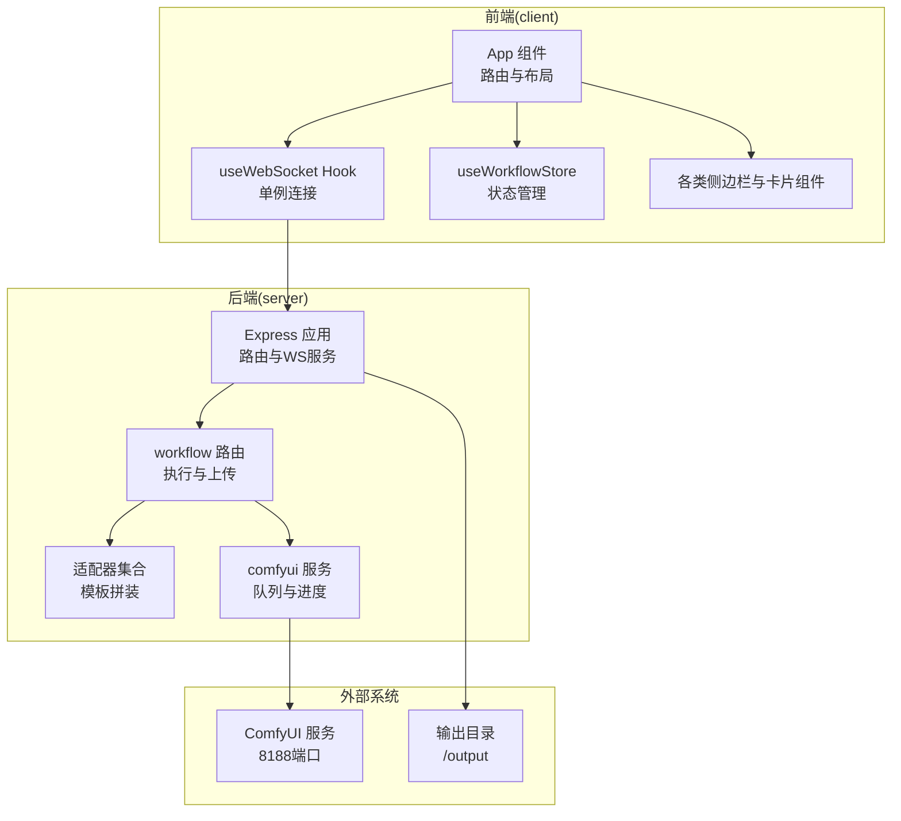
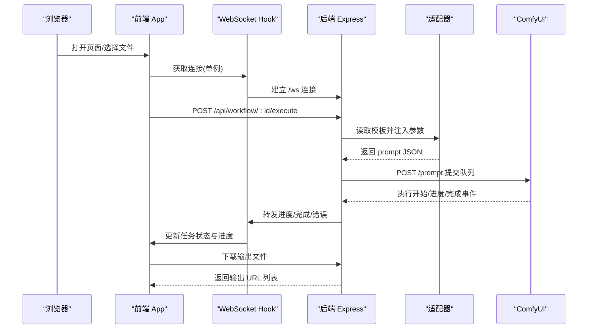
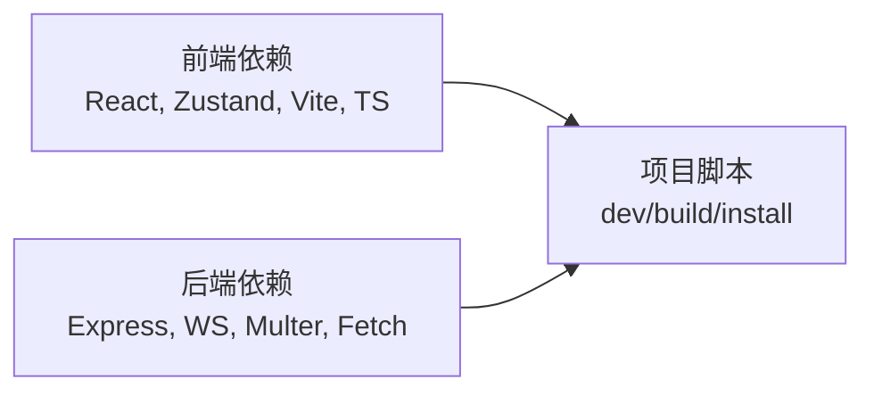

# 项目概述

<cite>
**本文档引用的文件**
- [README.md](file://README.md)
- [package.json](file://package.json)
- [client/package.json](file://client/package.json)
- [server/package.json](file://server/package.json)
- [client/src/main.tsx](file://client/src/main.tsx)
- [server/src/index.ts](file://server/src/index.ts)
- [client/src/components/App.tsx](file://client/src/components/App.tsx)
- [client/src/hooks/useWebSocket.ts](file://client/src/hooks/useWebSocket.ts)
- [server/src/adapters/index.ts](file://server/src/adapters/index.ts)
- [server/src/services/comfyui.ts](file://server/src/services/comfyui.ts)
- [client/src/types/index.ts](file://client/src/types/index.ts)
- [server/src/adapters/BaseAdapter.ts](file://server/src/adapters/BaseAdapter.ts)
- [server/src/adapters/Workflow0Adapter.ts](file://server/src/adapters/Workflow0Adapter.ts)
- [server/src/routes/workflow.ts](file://server/src/routes/workflow.ts)
- [client/src/hooks/useWorkflowStore.ts](file://client/src/hooks/useWorkflowStore.ts)
</cite>

## 目录
1. [引言](#引言)
2. [项目结构](#项目结构)
3. [核心组件](#核心组件)
4. [架构总览](#架构总览)
5. [详细组件分析](#详细组件分析)
6. [依赖关系分析](#依赖关系分析)
7. [性能考量](#性能考量)
8. [故障排查指南](#故障排查指南)
9. [结论](#结论)
10. [附录](#附录)

## 引言
CorineKit Pix2Real 是一款面向本地的 Web 图像/视频处理界面，通过与 ComfyUI 的深度集成，提供批处理与实时进度反馈能力。项目以“所见即所得”的本地 Web UI 为核心，结合 Electron 应用的跨平台部署潜力，为用户提供从图像到视频的一体化工作流体验。

- 本地 Web UI 设计理念：以浏览器作为统一入口，避免额外客户端安装成本；通过 WebSocket 实时同步 ComfyUI 执行进度，保证交互流畅。
- 与 ComfyUI 的集成方式：后端作为中间层，负责模板适配、参数注入、队列调度与结果下载，并将 ComfyUI 的进度事件中继至前端。
- 批处理与实时进度：支持多文件批量导入与执行，前端通过单例 WebSocket 连接接收进度事件，实现每张图的独立进度与最终输出下载。
- 每标签页隔离：前端使用状态管理将不同工作流标签页的图像、任务与配置完全隔离，避免跨标签干扰。

## 项目结构
项目采用前后端分离架构，前端使用 Vite + React + TypeScript，后端使用 Express + TypeScript，二者通过 REST API 与 WebSocket 协同工作。ComfyUI 的工作流模板位于 ComfyUI_API 目录，后端适配器负责将模板与输入数据拼装为 ComfyUI 可执行的 prompt。

图表来源
- [client/src/components/App.tsx](file://client/src/components/App.tsx)
- [client/src/hooks/useWebSocket.ts](file://client/src/hooks/useWebSocket.ts)
- [client/src/hooks/useWorkflowStore.ts](file://client/src/hooks/useWorkflowStore.ts)
- [server/src/index.ts](file://server/src/index.ts)
- [server/src/routes/workflow.ts](file://server/src/routes/workflow.ts)
- [server/src/adapters/index.ts](file://server/src/adapters/index.ts)
- [server/src/services/comfyui.ts](file://server/src/services/comfyui.ts)

章节来源
- [README.md:41-62](file://README.md#L41-L62)
- [package.json:1-15](file://package.json#L1-L15)
- [client/package.json:1-26](file://client/package.json#L1-L26)
- [server/package.json:1-28](file://server/package.json#L1-L28)

## 核心组件
- 前端应用入口与布局
  - 入口文件负责渲染根组件与全局样式，根组件承载导航、侧边栏、主内容区与状态栏等。
  - 关键职责：拖拽导入、视图大小切换、主题切换、欢迎页与会话管理。
- WebSocket 单例连接
  - 使用模块级全局变量确保单实例连接，自动重连与消息分发，支持任务完成/错误通知与代理执行进度同步。
- 工作流状态管理
  - 基于状态库维护每个标签页的图像列表、任务状态、提示词、配置与选择集，支持跨标签页隔离与批量操作。
- 后端 Express 服务
  - 提供 REST 路由与 WebSocket 服务，负责模板适配、参数注入、队列提交与输出下载，同时暴露 ComfyUI 状态查询接口。
- 适配器模式
  - 每个工作流一个适配器，读取模板 JSON 并仅修改需要变更的节点（如图像名、提示词、种子等），降低耦合与维护成本。
- ComfyUI 服务层
  - 负责上传媒体、提交队列、监听进度、获取历史与输出、优先级调整与系统状态查询，屏蔽底层差异。

章节来源
- [client/src/main.tsx:1-11](file://client/src/main.tsx#L1-L11)
- [client/src/components/App.tsx:61-422](file://client/src/components/App.tsx#L61-L422)
- [client/src/hooks/useWebSocket.ts:29-278](file://client/src/hooks/useWebSocket.ts#L29-L278)
- [client/src/hooks/useWorkflowStore.ts:191-800](file://client/src/hooks/useWorkflowStore.ts#L191-L800)
- [server/src/index.ts:118-516](file://server/src/index.ts#L118-L516)
- [server/src/adapters/index.ts:14-33](file://server/src/adapters/index.ts#L14-L33)
- [server/src/services/comfyui.ts:168-472](file://server/src/services/comfyui.ts#L168-L472)

## 架构总览
Pix2Real 的整体架构围绕“前端 Web UI + 后端中间层 + ComfyUI”展开。前端通过 REST API 触发执行，通过 WebSocket 实时接收进度与完成事件；后端适配模板、注入参数、提交队列，并在完成后将输出下载到本地会话目录，供前端浏览与导出。

图表来源
- [client/src/components/App.tsx](file://client/src/components/App.tsx)
- [client/src/hooks/useWebSocket.ts](file://client/src/hooks/useWebSocket.ts)
- [server/src/routes/workflow.ts](file://server/src/routes/workflow.ts)
- [server/src/services/comfyui.ts](file://server/src/services/comfyui.ts)

## 详细组件分析

### 前端应用与布局（App）
- 职责
  - 管理头部、侧边栏、主内容区与状态栏，支持拖拽导入、视图大小切换、主题切换与欢迎页。
  - 根据当前标签页显示不同的右侧侧边栏与专用组件（如文本生图、ZIT快出、视频生成、帧插值等）。
- 关键流程
  - 拖拽进入主区域时进行类型过滤（图像/视频），按标签页限制接受类型。
  - 通过导入钩子将文件转换为内部 ImageItem 并异步生成视频缩略图。
- 交互特性
  - 右侧侧边栏宽度可拖拽调整并持久化。
  - 支持重复文件名导入确认对话框。

章节来源
- [client/src/components/App.tsx:61-422](file://client/src/components/App.tsx#L61-L422)

### WebSocket 单例连接（useWebSocket）
- 设计要点
  - 使用模块级全局变量与连接计数，确保挂载多个组件时仅建立一次连接。
  - 自动重连策略：断开后延迟重连，仅在仍有订阅者时尝试。
  - 消息分发：根据消息类型更新任务状态、进度、完成与错误；支持代理执行进度同步。
- 通知与日志
  - 完成/错误时触发桌面通知；对特定标签页（文本生图/ZIT）自动记录生成日志。
- 代理执行
  - 支持批量代理生成的进度聚合与最终一次性通知。

章节来源
- [client/src/hooks/useWebSocket.ts:29-278](file://client/src/hooks/useWebSocket.ts#L29-L278)

### 工作流状态管理（useWorkflowStore）
- 数据隔离
  - 每个标签页维护独立的图像列表、任务、提示词、配置与选择集，避免跨标签干扰。
- 任务生命周期
  - 从“排队”到“处理中”，再到“完成/错误”，支持进度百分比、阶段名称与步骤索引。
- 批量与多源
  - 支持批量生成与来源标记（手动/骰子/代理聊天），便于后续偏好画像与筛选。
- 会话恢复
  - 提供序列化数据恢复接口，支持恢复标签页数据与图像列表。

章节来源
- [client/src/hooks/useWorkflowStore.ts:191-800](file://client/src/hooks/useWorkflowStore.ts#L191-L800)

### 后端 Express 与路由（workflow 路由）
- 路由职责
  - 提供工作流清单、模型列表查询、执行接口与参考图上传管理。
  - 支持多种工作流变体（如二次元转真人、精修放大、文本生图、ZIT快出、换脸、解除装备等）。
- 参数注入与模板拼装
  - 通过适配器读取模板 JSON，注入图像名、提示词、种子与可选参数。
  - 对 LoRA 进行链式连接与动态重连，支持启用/禁用与强度控制。
- 错误友好化
  - 将 ComfyUI 的错误映射为用户可理解的提示，提升可用性。

章节来源
- [server/src/routes/workflow.ts:152-800](file://server/src/routes/workflow.ts#L152-L800)

### 适配器模式（适配器集合与基类）
- 结构
  - 每个工作流一个适配器，集中定义模板路径、工作流名称、是否需要提示词与基础提示词。
  - 基类导出 WorkflowAdapter 类型，便于统一约束。
- 典型实现
  - 二次元转真人适配器：读取模板，设置输入图像名、提示词与随机种子，返回可执行 prompt。

章节来源
- [server/src/adapters/index.ts:14-33](file://server/src/adapters/index.ts#L14-L33)
- [server/src/adapters/BaseAdapter.ts:1-4](file://server/src/adapters/BaseAdapter.ts#L1-L4)
- [server/src/adapters/Workflow0Adapter.ts:1-35](file://server/src/adapters/Workflow0Adapter.ts#L1-L35)

### ComfyUI 服务层（队列、进度与系统状态）
- 队列与进度
  - 提交队列、监听 progress/executing 等事件，计算阶段化进度与全局百分比。
  - 处理缓存命中节点、多轮采样器与 tiled 采样器的特殊进度逻辑，避免回退。
- 输出下载
  - 完成后拉取 ComfyUI 输出，保存到会话目录并返回 URL 列表。
- 系统状态
  - 查询 VRAM/内存使用情况，辅助用户监控资源占用。

章节来源
- [server/src/services/comfyui.ts:168-472](file://server/src/services/comfyui.ts#L168-L472)

### WebSocket 中继与进度计算（后端）
- 连接与映射
  - 为每个浏览器客户端创建唯一 WS 连接，转发 ComfyUI 的执行开始、进度、完成与错误事件。
  - 维护 promptId → 工作流/会话/标签页映射，确保输出下载与 UI 更新正确关联。
- 事件缓冲与重放
  - 对早期事件进行缓冲，客户端注册后再重放，避免错过首张卡的进度。
- 完成保障
  - 通过历史查询与重试机制，确保输出文件已落盘后再发送完成事件，避免“完成但空输出”。

章节来源
- [server/src/index.ts:157-494](file://server/src/index.ts#L157-L494)

## 依赖关系分析
- 前端依赖
  - React 生态、Zustand 状态管理、Lucide 图标库、类型定义与构建工具。
- 后端依赖
  - Express、WebSocket、Multer、node-fetch、CORS 等，支撑 REST 与 WS 服务。
- 项目脚本
  - 一键启动前后端开发环境，构建产物分别输出至 client 与 server 子目录。

图表来源
- [client/package.json:11-26](file://client/package.json#L11-L26)
- [server/package.json:11-28](file://server/package.json#L11-L28)
- [package.json:4-10](file://package.json#L4-L10)

章节来源
- [client/package.json:1-26](file://client/package.json#L1-L26)
- [server/package.json:1-28](file://server/package.json#L1-L28)
- [package.json:1-15](file://package.json#L1-L15)

## 性能考量
- 进度计算的权重化与阶段化
  - 基于节点类型与输入参数估算权重，采样器节点按步数加权，Tiled 采样器按估计 tile 数加权，避免 UI 进度抖动。
- 事件缓冲与重放
  - 客户端注册前的事件缓冲，减少首卡漏看进度的概率。
- 输出下载的延迟与重试
  - 完成事件后等待 ComfyUI 历史落盘，必要时重试获取，确保输出文件可用。
- 资源监控
  - 提供 VRAM/内存使用查询，帮助用户在资源紧张时调整工作流或暂停其他任务。

## 故障排查指南
- ComfyUI 未运行或端口异常
  - 后端启动时尝试自动启动 ComfyUI，若失败需手动启动；可通过状态接口确认运行状态。
- 上传/执行失败
  - 后端将常见错误映射为用户可理解的提示（如模型/LoRA 未找到、工作流提交失败），优先检查模型安装与路径。
- 进度不更新或卡住
  - 检查 WebSocket 连接状态与网络；若为首次卡住，可能是 ComfyUI 历史尚未落盘，稍后重试。
- 输出为空或缺失
  - 后端在完成事件后进行历史查询与重试，若仍为空，检查 ComfyUI 输出目录权限与磁盘空间。

章节来源
- [server/src/index.ts:498-516](file://server/src/index.ts#L498-L516)
- [server/src/routes/workflow.ts:126-150](file://server/src/routes/workflow.ts#L126-L150)
- [server/src/services/comfyui.ts:350-408](file://server/src/services/comfyui.ts#L350-L408)

## 结论
Pix2Real 通过简洁而强大的架构，将 ComfyUI 的强大能力以本地 Web UI 的形式呈现，既满足初学者的易用性，又为高级用户提供灵活的工作流定制与批处理能力。其单例 WebSocket 连接、阶段化进度计算与输出下载保障，构成了稳定可靠的用户体验基石。

## 附录
- 主要特性概览
  - 5 种内置工作流：二次元转真人、真人精修、精修放大、图生视频、视频放大
  - 批处理：拖拽多文件并行执行
  - 实时进度：WebSocket 中继进度事件
  - 每标签页隔离：图像、任务与配置完全隔离
  - 输出目录一键打开：点击即可在系统资源管理器中定位输出
  - VRAM 释放：触发 ComfyUI 内存清理
  - 深色/浅色主题：可切换的主题模式

章节来源
- [README.md:5-15](file://README.md#L5-L15)
- [README.md:64-73](file://README.md#L64-L73)