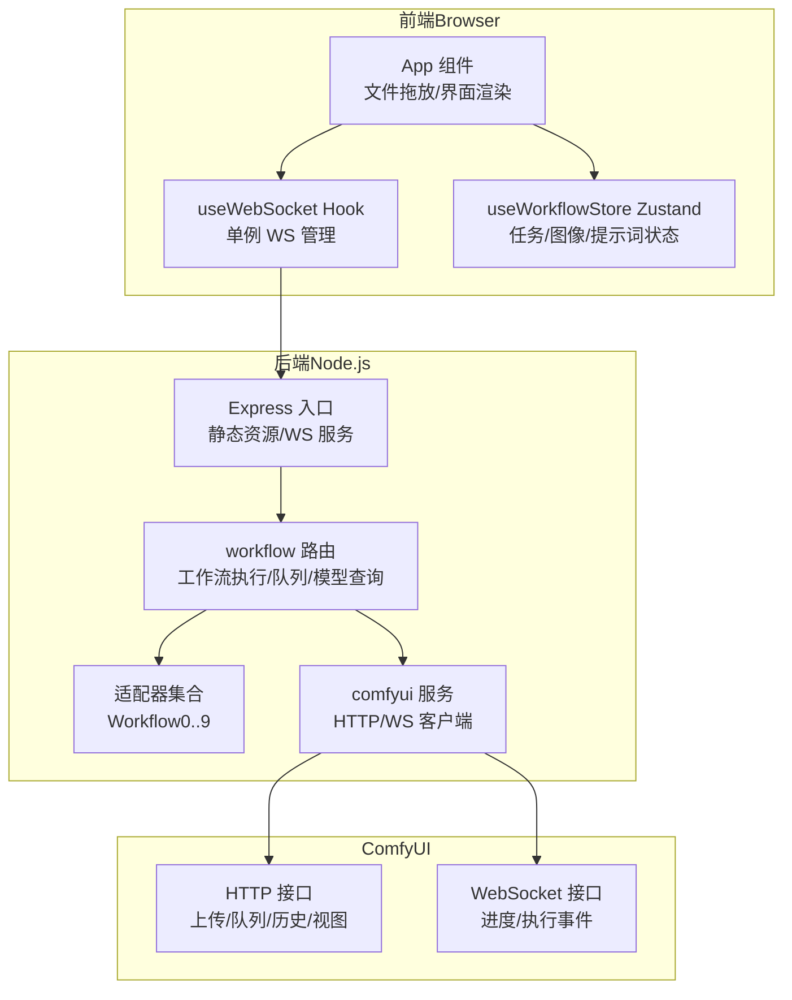
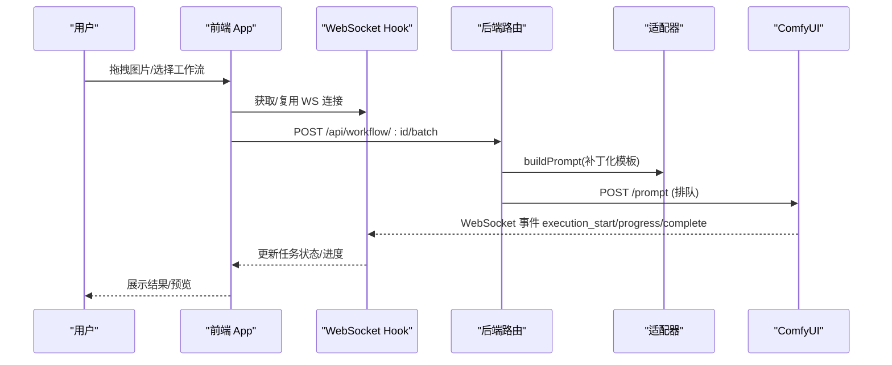
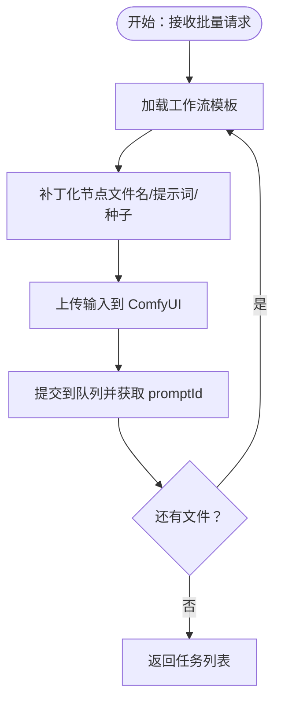
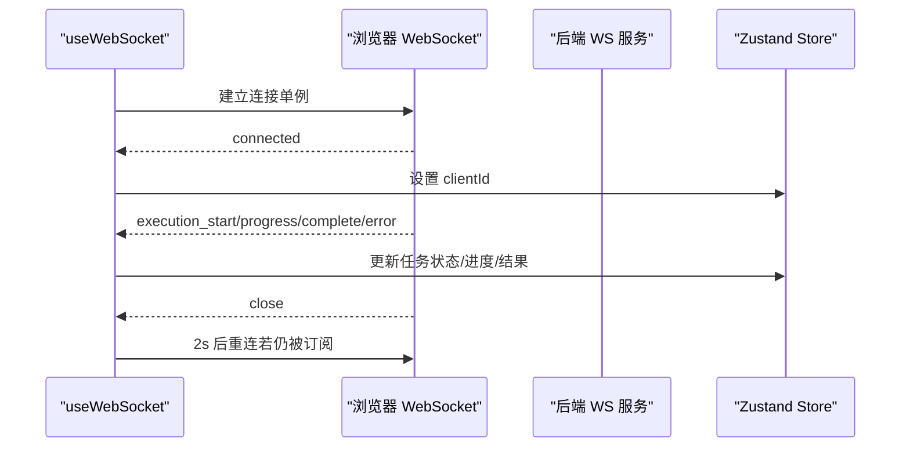
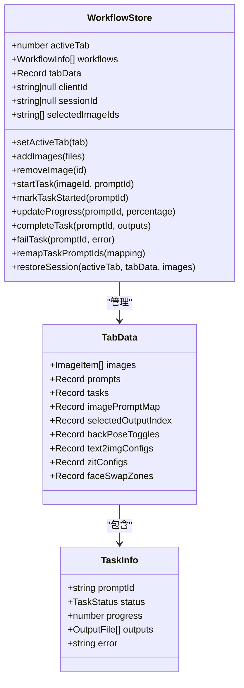
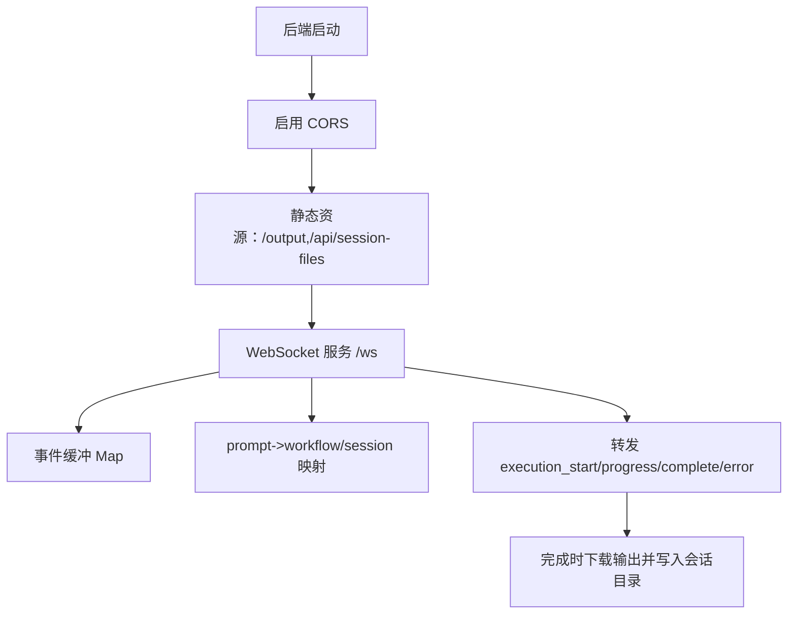
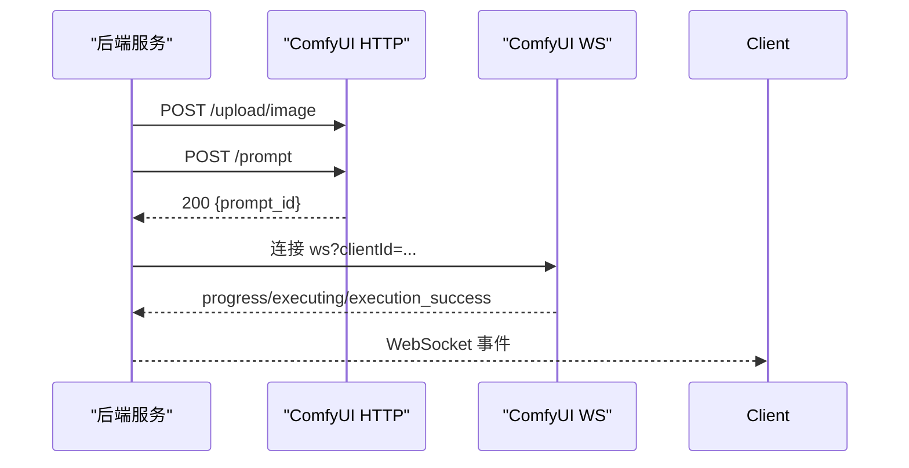
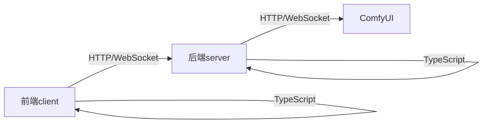

# 项目概述

<cite>
**本文引用的文件**
- [README.md](file://README.md)
- [package.json](file://package.json)
- [server/src/index.ts](file://server/src/index.ts)
- [server/src/routers/workflow.ts](file://server/src/routes/workflow.ts)
- [server/src/services/comfyui.ts](file://server/src/services/comfyui.ts)
- [server/src/adapters/index.ts](file://server/src/adapters/index.ts)
- [client/src/main.tsx](file://client/src/main.tsx)
- [client/src/components/App.tsx](file://client/src/components/App.tsx)
- [client/src/hooks/useWebSocket.ts](file://client/src/hooks/useWebSocket.ts)
- [client/src/hooks/useWorkflowStore.ts](file://client/src/hooks/useWorkflowStore.ts)
- [client/src/types/index.ts](file://client/src/types/index.ts)
- [server/package.json](file://server/package.json)
</cite>

## 目录
1. [引言](#引言)
2. [项目结构](#项目结构)
3. [核心组件](#核心组件)
4. [架构总览](#架构总览)
5. [详细组件分析](#详细组件分析)
6. [依赖关系分析](#依赖关系分析)
7. [性能考虑](#性能考虑)
8. [故障排查指南](#故障排查指南)
9. [结论](#结论)
10. [附录](#附录)

## 引言
CorineKit Pix2Real 是一个基于本地 Web 的图像/视频批处理工具，通过 ComfyUI 实现“所见即所得”的工作流执行体验。用户可直接在浏览器中拖拽图片或视频，选择工作流，即可由 ComfyUI 在后台完成高质量生成与处理，并通过 WebSocket 实时反馈进度与结果。项目提供五种内置工作流（二次元转真人、真人精修、精修放大、快速生成视频、视频放大），支持批量处理、实时进度监控、每标签页隔离的图像列表、一键打开输出目录、VRAM 释放等实用功能。

## 项目结构
项目采用前后端分离架构：
- 前端（client）：Vite + React + TypeScript，负责用户界面、状态管理、WebSocket 连接与交互。
- 后端（server）：Express + TypeScript，负责路由、适配器模式的工作流编排、与 ComfyUI 的 HTTP/WebSocket 通信、会话与输出管理。
- 工作流模板（ComfyUI_API）：以 JSON 模板形式存放各工作流节点配置，后端按需加载并补丁化（patch）关键节点参数（如输入文件名、提示词、种子等）。
- 输出目录（output）：存放各工作流的生成结果，按工作流 ID 分类。
- 会话目录（sessions）：持久化保存当前会话的输入、蒙版与输出，便于恢复与导出。

图表来源
- [server/src/index.ts:42-63](file://server/src/index.ts#L42-L63)
- [server/src/routes/workflow.ts:1-22](file://server/src/routes/workflow.ts#L1-L22)
- [server/src/services/comfyui.ts:6,127](file://server/src/services/comfyui.ts#L6,L127)
- [client/src/components/App.tsx:54-74](file://client/src/components/App.tsx#L54-L74)
- [client/src/hooks/useWebSocket.ts:10-73](file://client/src/hooks/useWebSocket.ts#L10-L73)

章节来源
- [README.md:41-62](file://README.md#L41-L62)
- [package.json:4-10](file://package.json#L4-L10)

## 核心组件
- 适配器模式（Workflow Adapters）
  - 每个工作流对应一个适配器，负责加载 JSON 模板并仅补丁化需要变更的节点（如输入文件名、提示词、随机种子等），实现“模板复用 + 参数化”的解耦设计。
  - 适配器集合集中导出，路由层按 ID 获取对应适配器执行构建与排队。
- WebSocket 实时通信
  - 后端为每个浏览器客户端建立一个 ComfyUI WS 连接，转发执行开始、进度、完成与错误事件；同时在客户端使用单例 Hook 确保全局唯一连接，避免重复连接与资源浪费。
- 批量处理与队列
  - 支持单张与多张文件批量执行，后端逐个排队并返回每个任务的 promptId；前端通过 WebSocket 实时更新进度与结果。
- 会话与输出管理
  - 后端维护 sessions 目录，按会话 ID 与标签页组织输入、蒙版与输出；完成后将 ComfyUI 下载的二进制数据写入对应会话输出目录，供前端预览与下载。

章节来源
- [README.md:74-79](file://README.md#L74-L79)
- [server/src/adapters/index.ts:13-28](file://server/src/adapters/index.ts#L13-L28)
- [server/src/index.ts:73-219](file://server/src/index.ts#L73-L219)
- [client/src/hooks/useWebSocket.ts:10-73](file://client/src/hooks/useWebSocket.ts#L10-L73)

## 架构总览
Pix2Real 的整体架构围绕“前端状态驱动 + 后端适配器 + ComfyUI 工作流引擎”展开。前端负责交互与展示，后端负责工作流编排与与 ComfyUI 的桥接，二者通过 WebSocket 实时同步进度与结果。

图表来源
- [server/src/routes/workflow.ts:457-520](file://server/src/routes/workflow.ts#L457-L520)
- [server/src/services/comfyui.ts:47-60](file://server/src/services/comfyui.ts#L47-L60)
- [client/src/hooks/useWebSocket.ts:26-51](file://client/src/hooks/useWebSocket.ts#L26-L51)

## 详细组件分析

### 组件一：适配器模式与工作流编排
- 设计要点
  - 每个工作流拥有独立的 JSON 模板与适配器，仅对必要节点进行补丁化，降低耦合与维护成本。
  - 路由层根据工作流 ID 获取适配器，统一处理上传、补丁化与排队逻辑。
- 关键流程（批量执行）
  - 读取模板 → 补丁化输入文件名/提示词/种子 → 队列提交 → 返回每个任务的 promptId。
- 复杂度与性能
  - 补丁化操作为 O(N)（N 为模板节点数），批量执行按文件数量线性扩展；建议控制单次批量大小以平衡吞吐与延迟。

图表来源
- [server/src/routes/workflow.ts:457-520](file://server/src/routes/workflow.ts#L457-L520)

章节来源
- [server/src/adapters/index.ts:13-28](file://server/src/adapters/index.ts#L13-L28)
- [server/src/routes/workflow.ts:407-520](file://server/src/routes/workflow.ts#L407-L520)

### 组件二：WebSocket 实时通信（单例 Hook）
- 设计要点
  - 使用模块级全局变量确保单实例连接，避免重复连接；连接断开时按需重连。
  - 客户端监听多种消息类型（连接、执行开始、进度、完成、错误），并通过 Zustand store 更新 UI。
- 错误处理
  - 对非 JSON 消息与异常进行安全处理，保证稳定性；在关闭/错误回调中清理资源与定时器。

图表来源
- [client/src/hooks/useWebSocket.ts:10-73](file://client/src/hooks/useWebSocket.ts#L10-L73)
- [client/src/types/index.ts:27-57](file://client/src/types/index.ts#L27-L57)
- [server/src/index.ts:73-219](file://server/src/index.ts#L73-L219)

章节来源
- [client/src/hooks/useWebSocket.ts:1-99](file://client/src/hooks/useWebSocket.ts#L1-L99)
- [client/src/types/index.ts:1-58](file://client/src/types/index.ts#L1-L58)
- [server/src/index.ts:73-219](file://server/src/index.ts#L73-L219)

### 组件三：前端状态管理（Zustand）
- 设计要点
  - 使用 Zustand 管理每个标签页的图像列表、提示词、任务状态与输出索引；支持跨标签页搜索与更新进度。
  - 提供任务生命周期方法：开始、更新进度、完成、失败、重置；并支持会话恢复。
- 数据结构
  - TabData：包含 images、prompts、tasks、imagePromptMap、selectedOutputIndex、backPoseToggles、text2imgConfigs、zitConfigs、faceSwapZones 等字段。
  - TaskInfo：包含 promptId、status、progress、outputs、error 等字段。

图表来源
- [client/src/hooks/useWorkflowStore.ts:35-88](file://client/src/hooks/useWorkflowStore.ts#L35-L88)
- [client/src/types/index.ts:1-58](file://client/src/types/index.ts#L1-L58)

章节来源
- [client/src/hooks/useWorkflowStore.ts:1-645](file://client/src/hooks/useWorkflowStore.ts#L1-L645)
- [client/src/types/index.ts:1-58](file://client/src/types/index.ts#L1-L58)

### 组件四：后端入口与静态资源
- 设计要点
  - Express 应用启动 CORS、JSON 中间件与静态资源服务；WebSocket 服务器挂载在 /ws，负责与 ComfyUI 的 WS 事件桥接与回传。
  - 输出目录与 sessions 目录在启动时确保存在，保障运行期可用。
- 关键职责
  - 事件缓冲：对同一 promptId 的 execution_start/progress 事件进行缓冲，避免客户端注册前丢失。
  - 完成后处理：拉取 ComfyUI 输出（图片/视频），写入会话输出目录，并向客户端发送 complete 事件。

图表来源
- [server/src/index.ts:42-63](file://server/src/index.ts#L42-L63)
- [server/src/index.ts:73-219](file://server/src/index.ts#L73-L219)

章节来源
- [server/src/index.ts:1-228](file://server/src/index.ts#L1-L228)

### 组件五：与 ComfyUI 的集成
- HTTP 通信
  - 上传图片/视频、提交队列、查询系统统计、获取队列、删除队列项、获取历史与视图等。
- WebSocket 通信
  - 连接到 ComfyUI 的 WS，解析 progress/executing 等事件，转换为统一格式并回传给前端。
- 模型与参数
  - 提供列出 Checkpoint/UNET/LoRA 模型的接口，供前端动态选择与配置。

图表来源
- [server/src/services/comfyui.ts:9-83](file://server/src/services/comfyui.ts#L9-L83)
- [server/src/services/comfyui.ts:127-188](file://server/src/services/comfyui.ts#L127-L188)

章节来源
- [server/src/services/comfyui.ts:1-285](file://server/src/services/comfyui.ts#L1-L285)

## 依赖关系分析
- 前端依赖
  - React 生态（React、Zustand）、TypeScript 类型定义、样式与图标库。
- 后端依赖
  - Express、ws（WebSocket）、node-fetch（HTTP）、multer（文件上传）、cors（跨域）。
- 开发与构建
  - concurrently 并行启动前后端；Vite/TSX 编译与热更新。

图表来源
- [server/package.json:6-17](file://server/package.json#L6-L17)
- [package.json:4-10](file://package.json#L4-L10)

章节来源
- [server/package.json:1-28](file://server/package.json#L1-L28)
- [package.json:1-15](file://package.json#L1-L15)

## 性能考虑
- 批量大小控制：合理限制单次批量文件数量，避免队列拥堵与内存峰值过高。
- WebSocket 单例：减少连接数与上下文切换，提升事件分发效率。
- 事件缓冲：对早期事件进行缓冲，避免客户端注册前丢失进度。
- 输出下载：完成后异步下载并写入会话目录，避免阻塞主流程。
- 模型与参数：通过后端接口动态获取模型列表，避免硬编码带来的维护成本。

## 故障排查指南
- ComfyUI 不可用
  - 现象：系统统计、队列、历史等接口返回 502 或超时。
  - 排查：确认 ComfyUI 在 http://127.0.0.1:8188 正常运行；检查网络与防火墙。
- WebSocket 断开重连
  - 现象：长时间无活动后断开，随后自动重连。
  - 处理：保持页面常驻，或在重新挂载 Hook 时等待重连完成。
- 任务卡住或进度不更新
  - 现象：任务进入 processing 但进度停滞。
  - 排查：查看后端日志中的 execution_start/progress 事件是否到达；检查 ComfyUI 队列状态。
- 输出缺失
  - 现象：任务完成但未生成预期输出。
  - 排查：确认 ComfyUI 节点输出类型为 output；检查后端保存路径与权限。
- 内存不足
  - 现象：GPU/内存占用过高导致失败。
  - 处理：使用释放内存工作流触发 ComfyUI 清理；调整批量大小与分辨率。

章节来源
- [server/src/services/comfyui.ts:106-125](file://server/src/services/comfyui.ts#L106-L125)
- [server/src/routes/workflow.ts:542-559](file://server/src/routes/workflow.ts#L542-L559)
- [server/src/index.ts:109-175](file://server/src/index.ts#L109-L175)

## 结论
Pix2Real 通过“适配器模式 + WebSocket 实时通信 + 会话持久化”的组合，实现了从本地 Web 界面到 ComfyUI 的高效工作流编排。其清晰的前后端职责划分、稳定的事件驱动机制与灵活的批量处理能力，使其既能满足初学者的易用性需求，也能为高级用户提供可扩展的技术基础。建议在生产环境中结合硬件资源与业务负载，合理配置批量大小与内存策略，以获得最佳体验。

## 附录
- 实际使用场景示例
  - 批量二次元转真人：拖入多张动漫头像，选择“二次元转真人”，填写或保留默认提示词，点击批量执行，实时查看进度并导出结果。
  - 视频放大：选择“视频放大”工作流，拖入短视频，设置放大倍数与采样参数，提交队列后等待完成。
  - 精修放大：对单张高清图进行细节增强与分辨率提升，支持不同模型（如 seedvr2、sd、klein）切换。
  - 快速生成视频：以单张图片为引导，生成包含插帧的视频序列，适合快速预览与二次创作。
  - 解除装备：配合蒙版对人物装备进行局部替换或移除，支持背面姿态选项。
  - 文生图与 ZIT 快出：无需输入图像，直接通过提示词生成图片，支持 UNet/LoRA/Shift 组合。
  - 提示词反推与提示词助理：自动分析图像内容生成提示词，或基于系统提示词生成优化后的提示词文本。

章节来源
- [README.md:64-73](file://README.md#L64-L73)
- [server/src/routes/workflow.ts:407-520](file://server/src/routes/workflow.ts#L407-L520)
- [server/src/routes/workflow.ts:674-744](file://server/src/routes/workflow.ts#L674-L744)
- [server/src/routes/workflow.ts:94-149](file://server/src/routes/workflow.ts#L94-L149)
- [server/src/routes/workflow.ts:181-261](file://server/src/routes/workflow.ts#L181-L261)
- [server/src/routes/workflow.ts:263-310](file://server/src/routes/workflow.ts#L263-L310)
- [server/src/routes/workflow.ts:312-355](file://server/src/routes/workflow.ts#L312-L355)
- [server/src/routes/workflow.ts:357-405](file://server/src/routes/workflow.ts#L357-L405)