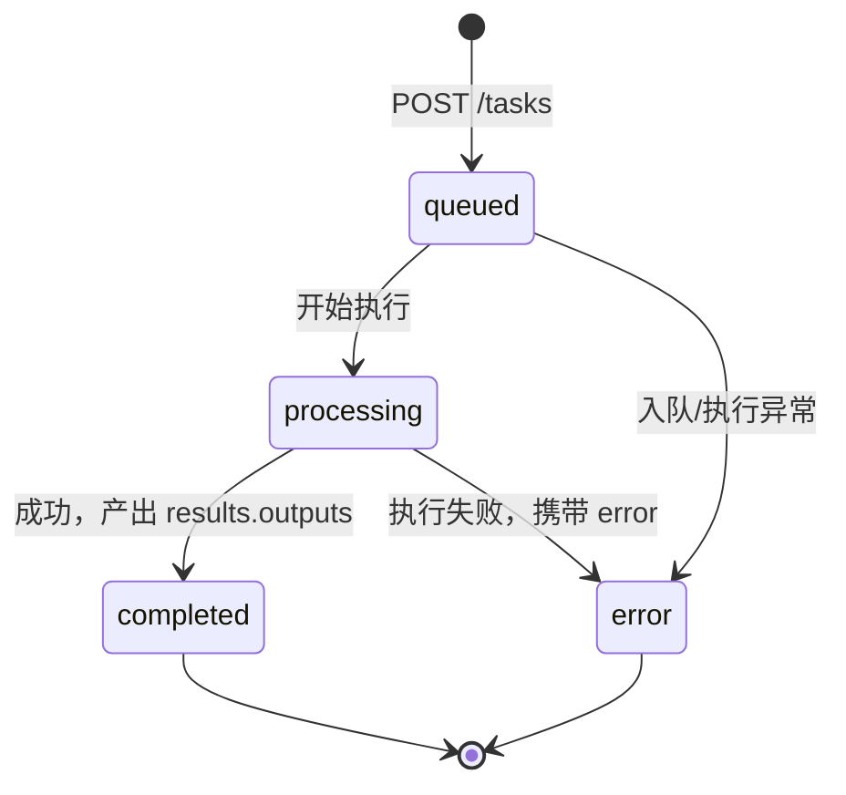

# CorineKit 对外 API · AI Agent 对接指南

> 本文面向**其他 app 项目的 AI agent 与开发者**，是一份"如何一步步调通"的简明集成指南。
> 若需完整字段级参考，另见同目录 [`EXTERNAL_API.md`](./EXTERNAL_API.md)；图形化调试可用 [`api-tester`](../api-tester/README.md)。
> 契约以本文与 `EXTERNAL_API.md` 一致为准；示例中的 API Key 一律为占位符 `YOUR_API_KEY`。

---

## 1. 概述

CorineKit 对外 API 是一层 **REST 接口**，把项目内的全部 **ComfyUI 工作流**（二次元转真人、精修放大、图生视频、快速出图、换脸等，共 11 个）以统一的 HTTP 契约对外开放。

- **能做什么**：提交一个图像/视频生成或编辑任务 → 异步执行 → 轮询进度 → 下载产物。
- **同机部署前提**：本 API 依赖本机运行的 ComfyUI 后端，设计上面向**同机外部程序**调用（API 服务与 ComfyUI 在同一台机器上）。
- **base URL**：`http://localhost:3000/api/v1`
  - 所有端点均以 `/api/v1` 为前缀。
  - 端口默认为 `3000`；如你的部署改了端口，请相应替换。

> 对 AI agent 的核心心智模型：**这是一个"提交—轮询—下载"的异步任务系统**，不是同步即时返回结果的接口。

---

## 2. 启用前提

对外 API **默认关闭**，必须显式开启后才能访问，否则一切请求返回 `403`。

### 2.1 开启方式（二选一或组合）

**方式 A：编辑项目根 `config.json`**

```json
{
  "externalApi": {
    "enabled": true,
    "apiKeys": ["YOUR_API_KEY", "another-key"],
    "corsOrigins": ["http://localhost:3000"]
  }
}
```

- `enabled`：必须为 `true` 才启用。
- `apiKeys`：允许的 API Key 数组。
- `corsOrigins`：允许的 CORS 来源（仅浏览器跨域访问时需要）。

**方式 B：环境变量**

- `EXTERNAL_API_KEY`：单个 API Key，若设置则**并入**允许列表。
- `EXTERNAL_ORIGINS`：逗号分隔的 CORS 来源，若设置则**并入**列表。

> 重要：环境变量只影响 **Key / 来源列表**；**是否启用**始终由 `config.json` 的 `externalApi.enabled` 决定。仅设环境变量而 `enabled` 仍为 `false`，接口依然返回 `403`。
> `config.json` 每次请求实时读取，运行中修改无需重启即可生效。

### 2.2 仅启动后端（headless）

对外 API 只依赖后端，无需前端界面。可用以下任一方式仅启动后端：

```bash
npm run dev:headless
```

或在 Windows 下双击 `start-headless.bat`。

启动后 base URL 即为 `http://localhost:3000/api/v1`。

---

## 3. 鉴权

所有 `/api/v1/*` 请求必须携带请求头：

```
x-api-key: YOUR_API_KEY
```

鉴权失败的精确响应（一字对齐）：

| 场景 | 状态码 | 响应体 |
| ---- | ------ | ------ |
| 对外 API 未启用 | `403` | `{"error":"External API disabled"}` |
| Key 缺失或不在允许列表 | `401` | `{"error":"Invalid API key"}` |
| 用他人的 Key 访问非本 Key 创建的任务 | `403` | `{"error":"Forbidden"}` |

> 任务归属校验：一个任务**只能被创建它的那把 Key** 查询 / 下载 / 取消。
> **下载结果时也必须带 `x-api-key` 头**，否则无法获取二进制产物。

---

## 4. 标准调用流程（面向 agent 的重点）

三步闭环：**提交任务 → 轮询状态 → 下载产物**。

1. **提交任务** `POST /tasks`，拿到 `taskId`，初始 `status` 为 `queued`。
2. **轮询状态** `GET /tasks/:taskId`：
   - 建议轮询间隔 **约 1.5s**。
   - 支持 **ETag / If-None-Match**：把上次响应的 `ETag` 放入下次请求的 `If-None-Match`，状态未变化时服务端返回 **`304`（空体）**，可省流量与解析。
   - 直到 `status` 变为 `completed` 或 `error` 停止。
3. **下载产物**：完成后遍历 `results.outputs`，逐个用 `GET /tasks/:taskId/result/:index` 下载（`index` 即 outputs 数组下标）。

### 状态机



- `queued`：已入队，尚未开始。
- `processing`：执行中，`progress.percentage` 递增，`progress.stage` 为阶段文字。
- `completed`：完成，`results.outputs` 可用。
- `error`：失败，`error` 字段为错误描述。

---

## 5. 端点完整参考

统一前缀 `/api/v1`，所有端点均需 `x-api-key` 头。

### 5.1 GET /workflows —— 动态发现能力

返回全部工作流 ID 的参数契约（第 6 节表格的机器可读版本）。**agent 应优先调用此端点动态发现能力**，而非硬编码。

- 请求：无 body。
- 响应：`200`，body 为 `{ "0": {description, inputFiles, parameters}, "1": {...}, ... }`。

### 5.2 POST /tasks —— 提交任务

- **Content-Type**：`multipart/form-data`（推荐统一用它，纯 JSON 工作流也可用 `application/json`）。
- **表单字段**：
  - `workflowId`：数字，**必填**（兼容旧字段 `workflowType`，请统一用 `workflowId`）。
  - `parameters`：**一个 JSON 字符串字段**，业务参数全部打包进该 JSON（如 `prompt`/`model`/`width` 等）。
  - 文件字段（按工作流所需，顶层）：`image` / `mask` / `video` / `targetImage` / `faceImage`。
- **成功响应** `200`：

  ```json
  {
    "taskId": "ext_1751990400000_a1b2c3d4",
    "workflowId": 0,
    "workflowName": "二次元转真人",
    "status": "queued"
  }
  ```

- **参数非法响应** `400`：`{"error":"<描述>"}`（如缺少必填参数、`workflowId` 非法、数值参数非法、缺少必需文件、`parameters` 非合法 JSON、文件超限等）。

> 纯 JSON 提交形态：`Content-Type: application/json`，body 为 `{ "workflowId": 7, "parameters": { ... } }`。

### 5.3 GET /tasks/:taskId —— 查询状态

- 请求头可选带 `If-None-Match: <上次的 ETag>`。
- **成功响应** `200`：

  ```json
  {
    "taskId": "ext_1751990400000_a1b2c3d4",
    "workflowId": 0,
    "workflowName": "二次元转真人",
    "status": "processing",
    "progress": { "percentage": 42, "stage": "采样中" },
    "createdAt": "2026-07-08T12:00:00.000Z",
    "completedAt": null
  }
  ```

  字段说明：

  | 字段 | 类型 | 说明 |
  | ---- | ---- | ---- |
  | `taskId` | string | 任务 ID |
  | `workflowId` | number | 工作流 ID |
  | `workflowName` | string | 工作流中文名 |
  | `status` | string | `queued` / `processing` / `completed` / `error` |
  | `progress.percentage` | number | 进度百分比（0-100） |
  | `progress.stage` | string? | 当前阶段文字（可能缺省） |
  | `createdAt` | string | ISO 时间戳 |
  | `completedAt` | string \| null | 完成/失败时间；未结束为 `null` |
  | `results` | object? | **仅 `completed` 时存在**，`{ "outputs": [{ "filename", "url" }] }` |
  | `error` | string? | **仅 `error` 时存在**，错误描述 |

- **完成响应示例**：

  ```json
  {
    "taskId": "ext_1751990400000_a1b2c3d4",
    "workflowId": 0,
    "workflowName": "二次元转真人",
    "status": "completed",
    "progress": { "percentage": 100 },
    "results": {
      "outputs": [
        { "filename": "result_0001.png", "url": "/api/v1/tasks/ext_1751990400000_a1b2c3d4/result/0" }
      ]
    },
    "createdAt": "2026-07-08T12:00:00.000Z",
    "completedAt": "2026-07-08T12:00:35.000Z"
  }
  ```

- **命中 ETag** `304`：空体（状态未变化）。
- **任务不存在** `404`：`{"error":"Task not found"}`。
- **越权** `403`：`{"error":"Forbidden"}`。

### 5.4 GET /tasks/:taskId/result/:index —— 下载产物

- 返回**二进制文件流**（图片/视频）。
- **必须带 `x-api-key` 头**。
- `index` 对应 `results.outputs` 的数组下标（从 0 开始）。
- 越界 / 文件缺失 / 任务未完成 → `404 {"error":"<描述>"}`（如 `Result index out of range` / `Result file not found` / `Task result not available`）。

### 5.5 POST /tasks/:taskId/cancel —— 取消任务

- **成功响应** `200`：`{"ok":true,"taskId":"<taskId>"}`。
- 任务不存在 → `404 {"error":"Task not found"}`；越权 → `403 {"error":"Forbidden"}`。

---

## 6. 工作流 schema 表（0-10）

> `*` = 必填；其余为可选。需文件的工作流用 `multipart/form-data` 上传对应文件字段；`7`/`9` 无文件。
> **agent 应优先在运行时 `GET /workflows` 动态发现能力**，本表为静态快照，仅供参考。

| ID | 名称 | 输入文件 | 参数（`*`=必填） |
| -- | ---- | -------- | ---------------- |
| 0  | 二次元转真人 | `image` | `prompt?`, `model?`（qwen/klein） |
| 1  | 真人精修 | `image` | `prompt?` |
| 2  | 精修放大 | `image` | `model?`（seedvr2/klein/kleinpro/sd/remacri） |
| 3  | 图生视频 | `image` | `prompt?`, `seconds?`, `fps?`, `megapixels?` |
| 4  | 视频补帧 | `video` | `multiplier?`, `sourceFps?` |
| 5  | 解除装备 | `image` + `mask` | `prompt?`, `backPose?` |
| 6  | 真人转二次元 | `image` | `prompt?` |
| 7  | 快速出图 | 无文件 | `model*`, `prompt*`, `width*`, `height*`, `steps*`, `cfg*`, `sampler*`, `scheduler*`, `loras?`, `negativePrompt?`, `seed?` |
| 8  | 换脸 | `targetImage` + `faceImage` | （无参数） |
| 9  | ZIT快出 | 无文件 | `unetModel*`, `prompt*`, `width*`, `height*`, `steps*`, `cfg*`, `sampler*`, `scheduler*`, `loras?`, `shift?` |
| 10 | 区域编辑 | `image` + `mask` | `prompt?`, `backPose?` |

> `loras` 为数组，每项形如 `{ "model": "detail.safetensors", "enabled": true, "strength": 0.8 }`。
> `backPose` 为布尔；`sampler` 常用 `dpmpp_2m`，`scheduler` 常用 `karras`。

---

## 7. 完整可照抄示例

以下覆盖两类典型场景：
- **工作流 0（二次元转真人）**：需上传文件（`image`）。
- **工作流 7（快速出图）**：纯 JSON 参数，无文件。

请求前请将 `YOUR_API_KEY` 替换为你的真实 Key（**切勿把真实 Key 写入文档或代码库**）。

### 7.1 工作流 0（需上传文件）

#### PowerShell

```powershell
$BASE = "http://localhost:3000/api/v1"
$KEY  = "YOUR_API_KEY"

# 1) 提交任务（文件字段 image 在顶层，业务参数打包进 parameters JSON 字符串）
$params = @{ prompt = "photorealistic portrait"; model = "qwen" } | ConvertTo-Json -Compress
$form = @{
  workflowId = "0"
  parameters = $params
  image      = Get-Item "./input.png"
}
$submit = Invoke-RestMethod -Uri "$BASE/tasks" -Method Post `
  -Headers @{ "x-api-key" = $KEY } -Form $form
$taskId = $submit.taskId
$submit

# 2) 轮询（约 1.5s 间隔），直到 completed / error
do {
  Start-Sleep -Milliseconds 1500
  $task = Invoke-RestMethod -Uri "$BASE/tasks/$taskId" -Headers @{ "x-api-key" = $KEY }
  "$($task.status) $($task.progress.percentage)%"
} while ($task.status -ne "completed" -and $task.status -ne "error")

# 3) 完成后下载全部产物（下载务必带 x-api-key）
if ($task.status -eq "completed") {
  for ($i = 0; $i -lt $task.results.outputs.Count; $i++) {
    Invoke-WebRequest -Uri "$BASE/tasks/$taskId/result/$i" `
      -Headers @{ "x-api-key" = $KEY } -OutFile "out_$i.png"
  }
}
```

#### bash / curl

```bash
BASE="http://localhost:3000/api/v1"
KEY="YOUR_API_KEY"

# 1) 提交任务
SUBMIT=$(curl -s -X POST "$BASE/tasks" \
  -H "x-api-key: $KEY" \
  -F "workflowId=0" \
  -F "image=@./input.png" \
  -F 'parameters={"prompt":"photorealistic portrait","model":"qwen"}')
echo "$SUBMIT"
TASK_ID=$(echo "$SUBMIT" | grep -o '"taskId":"[^"]*"' | cut -d'"' -f4)

# 2) 轮询（约 1.5s 间隔）
while true; do
  sleep 1.5
  TASK=$(curl -s "$BASE/tasks/$TASK_ID" -H "x-api-key: $KEY")
  echo "$TASK"
  case "$TASK" in
    *'"status":"completed"'*) break ;;
    *'"status":"error"'*)     echo "任务失败"; exit 1 ;;
  esac
done

# 3) 下载第 0 个产物（务必带 x-api-key）
curl -s -o out_0.png "$BASE/tasks/$TASK_ID/result/0" -H "x-api-key: $KEY"
```

### 7.2 工作流 7（纯 JSON）

#### PowerShell

```powershell
$BASE = "http://localhost:3000/api/v1"
$KEY  = "YOUR_API_KEY"

# 1) 提交任务（纯 JSON，parameters 为对象）
$body = @{
  workflowId = 7
  parameters = @{
    model     = "sd_xl_base.safetensors"
    prompt    = "a scenic mountain, masterpiece"
    width     = 1024
    height    = 1024
    steps     = 30
    cfg       = 7
    sampler   = "dpmpp_2m"
    scheduler = "karras"
    negativePrompt = "lowres, blurry"
    seed      = 12345
  }
} | ConvertTo-Json -Depth 6
$submit = Invoke-RestMethod -Uri "$BASE/tasks" -Method Post `
  -Headers @{ "x-api-key" = $KEY; "Content-Type" = "application/json" } -Body $body
$taskId = $submit.taskId

# 2) 轮询
do {
  Start-Sleep -Milliseconds 1500
  $task = Invoke-RestMethod -Uri "$BASE/tasks/$taskId" -Headers @{ "x-api-key" = $KEY }
  "$($task.status) $($task.progress.percentage)%"
} while ($task.status -ne "completed" -and $task.status -ne "error")

# 3) 下载
if ($task.status -eq "completed") {
  for ($i = 0; $i -lt $task.results.outputs.Count; $i++) {
    Invoke-WebRequest -Uri "$BASE/tasks/$taskId/result/$i" `
      -Headers @{ "x-api-key" = $KEY } -OutFile "gen_$i.png"
  }
}
```

#### bash / curl

```bash
BASE="http://localhost:3000/api/v1"
KEY="YOUR_API_KEY"

# 1) 提交任务（纯 JSON）
SUBMIT=$(curl -s -X POST "$BASE/tasks" \
  -H "x-api-key: $KEY" \
  -H "Content-Type: application/json" \
  -d '{
    "workflowId": 7,
    "parameters": {
      "model": "sd_xl_base.safetensors",
      "prompt": "a scenic mountain, masterpiece",
      "width": 1024,
      "height": 1024,
      "steps": 30,
      "cfg": 7,
      "sampler": "dpmpp_2m",
      "scheduler": "karras",
      "negativePrompt": "lowres, blurry",
      "seed": 12345
    }
  }')
TASK_ID=$(echo "$SUBMIT" | grep -o '"taskId":"[^"]*"' | cut -d'"' -f4)

# 2) 轮询
while true; do
  sleep 1.5
  TASK=$(curl -s "$BASE/tasks/$TASK_ID" -H "x-api-key: $KEY")
  case "$TASK" in
    *'"status":"completed"'*) break ;;
    *'"status":"error"'*)     echo "任务失败"; exit 1 ;;
  esac
done

# 3) 下载第 0 个产物
curl -s -o gen_0.png "$BASE/tasks/$TASK_ID/result/0" -H "x-api-key: $KEY"
```

### 7.3 带 ETag 的轮询（可选优化）

```bash
ETAG=""
while true; do
  sleep 1.5
  RESP=$(curl -s -D - "$BASE/tasks/$TASK_ID" \
    -H "x-api-key: $KEY" \
    ${ETAG:+-H "If-None-Match: $ETAG"})
  # 304 表示状态未变化，跳过解析；否则提取新的 ETag 与 body
  # （实际实现请根据语言的 HTTP 库读取响应头 ETag 与状态码）
done
```

> ETag 用法要点：读取每次 `200` 响应头里的 `ETag`，下次请求用 `If-None-Match` 带回；收到 `304` 即"无变化"，无需重新解析 body。

---

## 8. 错误与边界

### 8.1 错误码表

| 状态码 | 含义 | 典型响应体 |
| ------ | ---- | ---------- |
| `400` | 请求参数错误（缺必填参数/文件、`workflowId` 非法、数值非法、`parameters` 非 JSON、文件超限） | `{"error":"<描述>"}` |
| `401` | API Key 无效或缺失 | `{"error":"Invalid API key"}` |
| `403` | 对外 API 未启用 / 越权访问他人任务 | `{"error":"External API disabled"}` 或 `{"error":"Forbidden"}` |
| `404` | 任务不存在 / 结果下标越界 / 产物文件缺失 / 任务未完成 | `{"error":"Task not found"}` 等 |
| `500` | 服务端内部错误（含 ComfyUI 执行失败） | `{"error":"<描述>"}` |

错误响应统一为 `{ "error": "<描述>" }`。

### 8.2 文件大小限制

- 图片类字段（`image` / `mask` / `targetImage` / `faceImage`）：**≤ 20MB**。
- 视频字段（`video`）：**≤ 200MB**。
- 超限返回 `400 {"error":"文件 <字段> 超过大小上限"}`。

### 8.3 产物存储

- 完成后的产物落盘到 `output/_external/<taskId>/`，与前端会话产物目录（`sessions/`）互不干扰。
- 通过 `GET /tasks/:taskId/result/:index` 下载，无需直接访问文件系统。

### 8.4 任务生命周期（内存态 + TTL）

- 任务状态为**内存态**（进程内 Map 维护），**后端重启会丢失所有任务记录**。
- 任务在 `completed` / `error` 后约 **1 小时（TTL）** 被清理（清理周期约每 10 分钟一次）。
- 因此：**完成后请尽快下载产物**，不要长期依赖 `taskId` 可查询。

### 8.5 并发与限流

- 当前**无并发限流**：提交多个任务会依次排入 ComfyUI 队列执行。
- 但 ComfyUI 本身串行执行，过量提交只会延长排队时间；agent 应自行控制提交节奏。

---

## 9. 给 AI agent 的对接建议

1. **先 `GET /workflows` 动态发现能力**：不要硬编码工作流参数；用返回的 `inputFiles` 与 `parameters`（含 `required`）构造请求并做本地校验。
2. **轮询而非假设即时完成**：提交后必然是异步的，务必轮询 `GET /tasks/:taskId`（约 1.5s 间隔，可用 ETag/If-None-Match 命中 `304` 降本），直到 `completed` 或 `error`。
3. **严格区分 `processing` 与 `completed`**：只有 `completed` 时才有 `results.outputs`；`processing` 阶段读取 `results` 会得到空值，切勿据此下载。
4. **下载结果务必带 `x-api-key` 头**：`GET .../result/:index` 同样需要鉴权，且 `index` 必须落在 `outputs` 下标范围内。
5. **及时下载、妥善保存 `taskId`**：任务内存态且 ~1 小时 TTL；完成后尽快取回产物，后端重启会丢失记录。
6. **用同一把 Key 贯穿任务全生命周期**：提交、查询、下载、取消必须用创建任务的同一把 Key，否则 `403 Forbidden`。
7. **参数打包规则**：`multipart` 下业务参数统一放进名为 `parameters` 的 **JSON 字符串**字段，文件字段单独放顶层；纯 JSON 下 `parameters` 为对象。
8. **失败可读性**：`error` 字段常已被后端转换为友好描述，可直接展示或据此重试。
